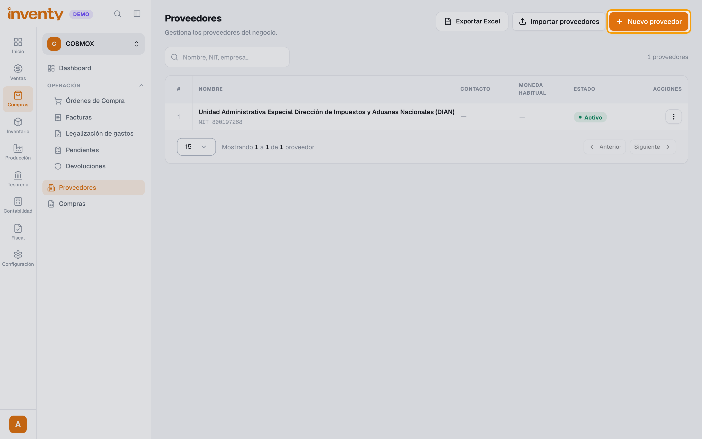
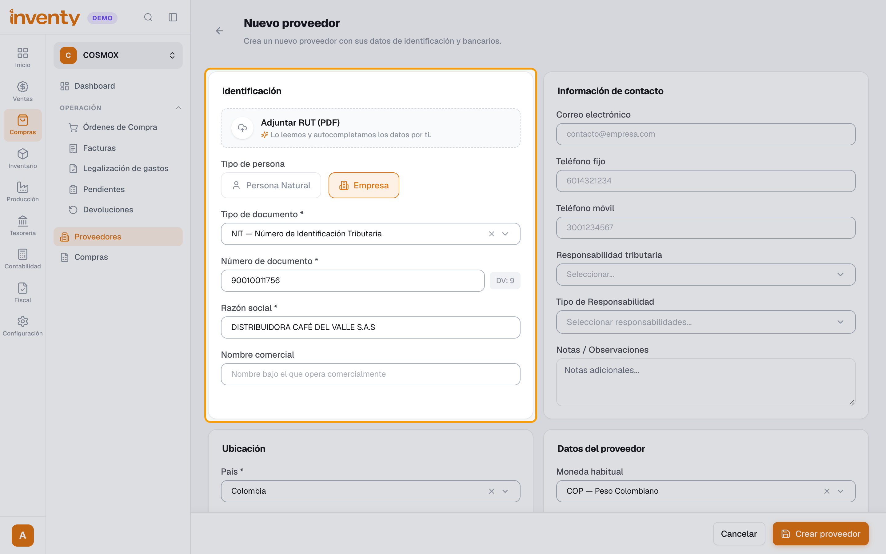
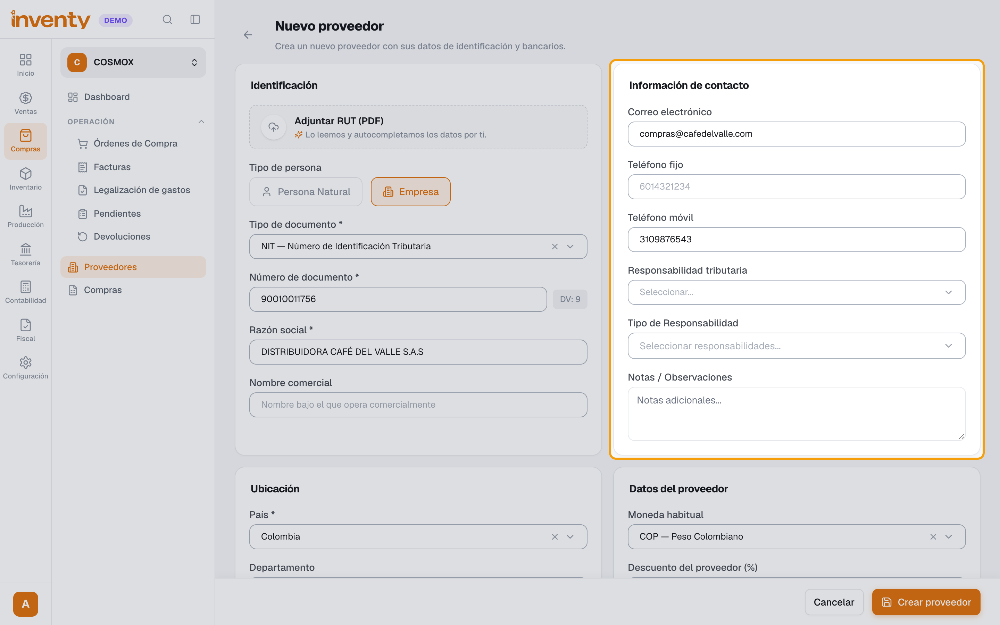
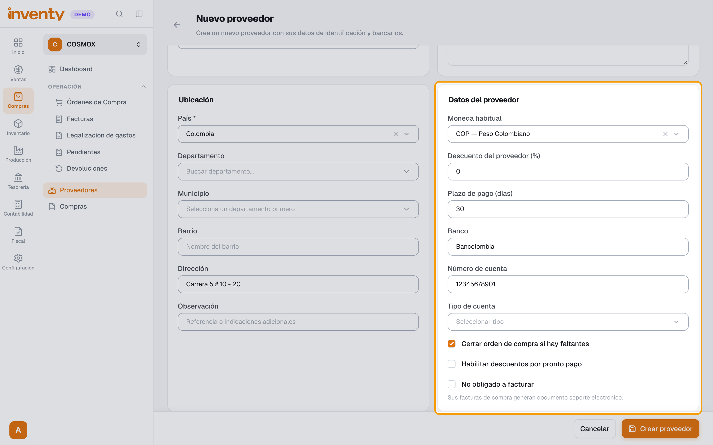
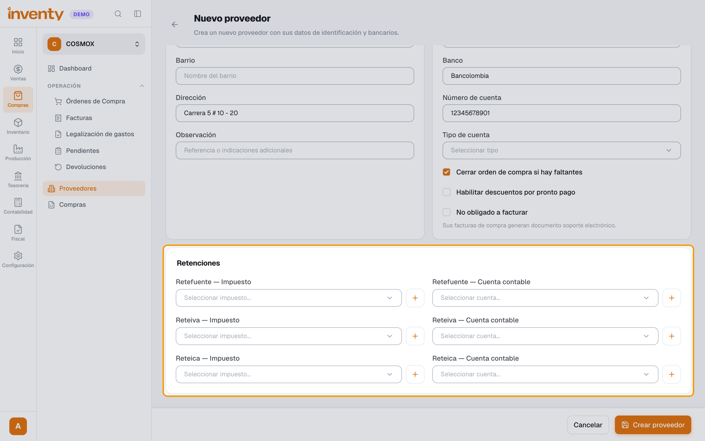
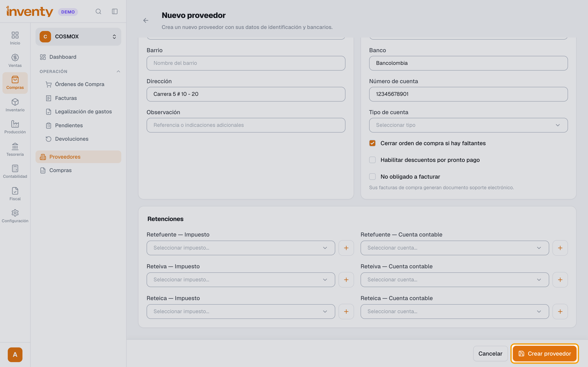

# ¿Cómo creo un proveedor?

También se busca como: crear proveedor, nuevo proveedor, registrar proveedor, NIT del proveedor, datos bancarios del proveedor, no obligado a facturar, plazo de pago proveedor.

**Antes de empezar:** ten el RUT del proveedor en PDF o sus datos.

## Pasos

**Paso 1.** Ingresa a Compras › Proveedores y haz clic en **Nuevo proveedor**.

**Paso 2.** (Recomendado) Adjunta el **RUT (PDF)**: Inventy completa los datos solo. Si no, elige **Tipo de persona** (**Persona Natural** o **Empresa**), el **Tipo de documento**, el **Número de documento** y la **Razón social** (o nombre y apellido).

**Paso 3.** En **Información de contacto**, escribe correo y teléfonos; en **Ubicación**, país, departamento, municipio y dirección.

**Paso 4.** En **Datos del proveedor**, escribe el **Plazo de pago (días)** (calcula el vencimiento de sus facturas), el **Descuento del proveedor (%)** y sus datos de **Banco**. Marca **No obligado a facturar** si no expide factura electrónica.

**Paso 5.** (Opcional) En **Retenciones**, elige Retefuente, Reteiva y Reteica que le practicas.

**Paso 6.** Haz clic en **Crear proveedor**.

✅ **Listo:** el proveedor ya se puede elegir en órdenes y facturas de compra.

## Si algo falla

| Problema | Solución |
|---|---|
| Es extranjero con NIT | Elige el tipo **NIT-E**: acepta letras, números y guion (hasta 20 caracteres). |
| *Este número de documento ya está registrado para este tipo de identificación.* | El proveedor ya existe: búscalo en la lista. |
| Sus compras deben generar documento soporte | Marca **No obligado a facturar** ([guía](../facturacion-electronica/documento-soporte.md)). |
| La factura de compra no calcula el vencimiento | Revisa el **Plazo de pago (días)** del proveedor. |

## Relacionados

- [¿Cómo registro una factura de compra?](registrar-factura-compra.md)
- [¿Cómo se aplican las retenciones?](../impuestos/retenciones.md)
