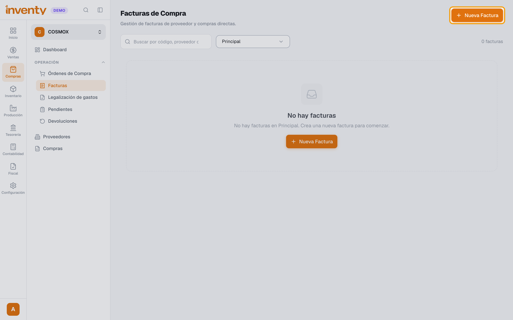
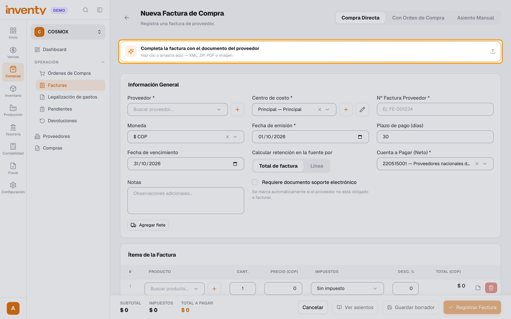
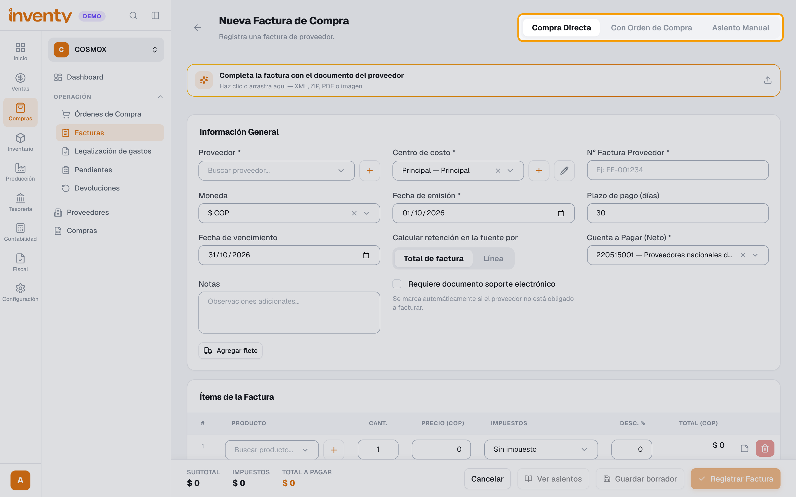
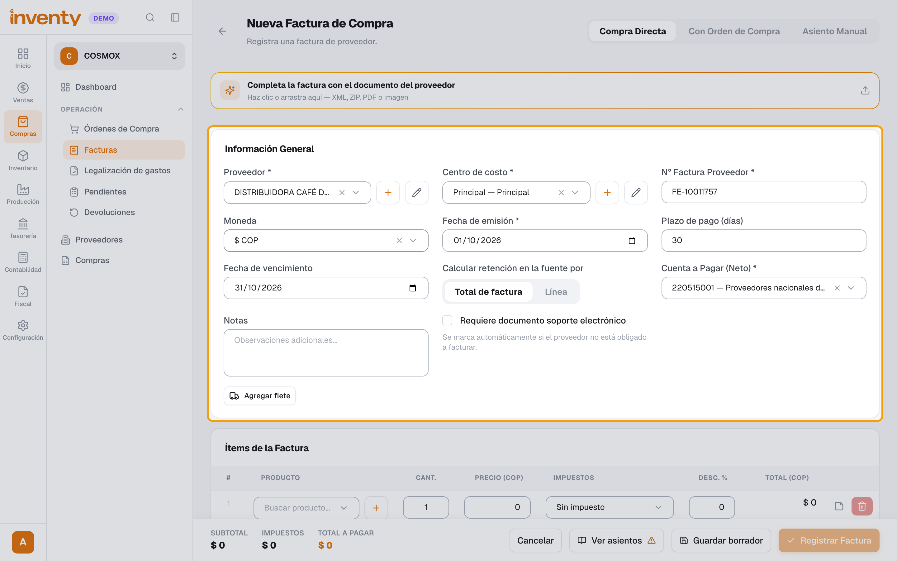
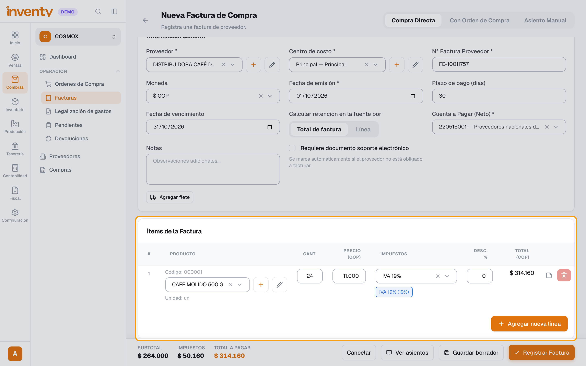
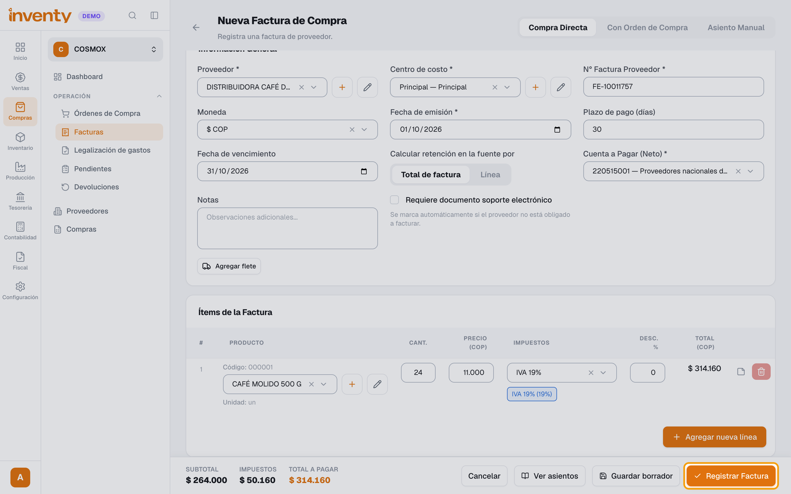

# ¿Cómo registro una factura de compra?

También se busca como: registrar compra, ingresar mercancía, entrada de mercancía, factura de proveedor, cargar compra, registrar gasto con factura.

**Antes de empezar:** el módulo Compras debe estar activo. Ten el XML o ZIP de la factura del proveedor.

## Pasos

**Paso 1.** Ingresa a Compras › Facturas y haz clic en **Nueva Factura**.

**Paso 2.** (Recomendado) Sube el **XML o ZIP** de la factura en **Completa la factura con el documento del proveedor**. Revisa los datos que leyó la IA.

**Paso 3.** Elige el modo: **Compra Directa** o **Con Orden de Compra**.

**Paso 4.** Completa **Proveedor**, **Centro de costo**, **N° Factura Proveedor**, **Fecha de emisión** y **Cuenta a Pagar (Neto)**.

**Paso 5.** En **Ítems de la Factura**, elige el producto en **Buscar producto...** y escribe la **Cant.**. El **Precio** se llena con el costo del producto (cámbialo si la factura dice otro) y el IVA sale de su catálogo. Usa **Agregar nueva línea** para más productos.

**Paso 6.** Revisa el **Total a pagar** (abajo) y haz clic en **Registrar Factura**. En **¿Validar factura?** haz clic en **Validar factura**: se genera una **recepción automática de mercancía**.

✅ **Listo:** la factura queda validada, el inventario sube y queda la deuda con el proveedor.

## Si algo falla

| Problema | Solución |
|---|---|
| *El número de factura ya existe para este proveedor.* | Ya se registró: búscala en la lista. |
| *No hay cuentas configuradas. Configura las cuentas en Contabilidad → Configuración.* (en Cuenta a Pagar) | Agrega la cuenta de proveedores en [Contabilidad › Configuración](../contabilidad/configuracion-contable.md). |
| *No encontramos este proveedor* | Usa **Crear proveedor** o elige uno existente. |
| *No se pudo leer el documento.* | Usa el XML o ZIP original, o registra a mano. |
| *El precio debe ser mayor a 0.* | Todos los ítems deben tener precio. |
| *El asiento contable no está balanceado* | Falta una cuenta contable: pide a tu contador revisar productos, impuestos o la cuenta a pagar. |
| El proveedor no está obligado a facturar | Ver [documento soporte](../facturacion-electronica/documento-soporte.md). |

## Relacionados

- [¿Cómo registro un pago a un proveedor?](../finanzas/registrar-egreso.md)
- [¿Cómo emito un documento soporte electrónico?](../facturacion-electronica/documento-soporte.md)
