# ¿Cómo funciona la contabilidad en Inventy?

También se busca como: contabilidad automática, asientos automáticos, cómo contabiliza, de dónde salen las cuentas, integración contable, PUC, causación, contador.

**En una frase:** la contabilidad de Inventy es **automática**. Cada documento que se valida (venta, compra, pago, traslado…) crea su **asiento contable** en ese momento. Nadie tiene que registrar asientos a mano en el día a día.

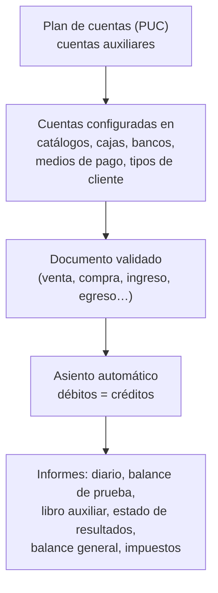

## 1. El plan de cuentas

- Inventy usa el **PUC colombiano** en 5 niveles: **Clase › Grupo › Cuenta › Subcuenta › Auxiliar**.
- El **Catálogo PUC** trae el plan oficial completo. Cada empresa **activa** las cuentas que va a usar.
- Los movimientos se registran **siempre en cuentas auxiliares** (subcuenta + 3 dígitos, ej. `110505001`). Los demás niveles solo suman.
- **Cargar auxiliares por defecto** crea de una vez las auxiliares básicas y las deja asignadas. Ver [cuentas auxiliares](cuentas-auxiliares.md).

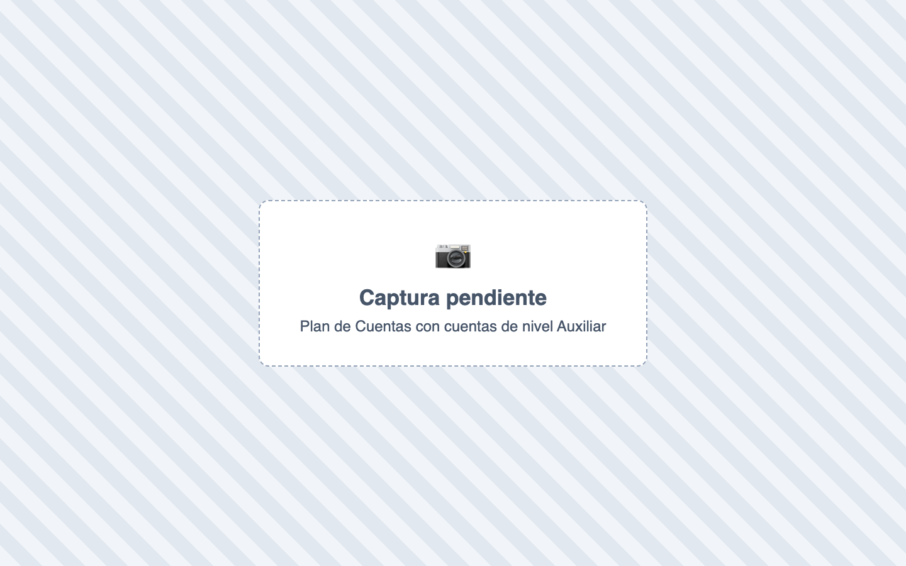

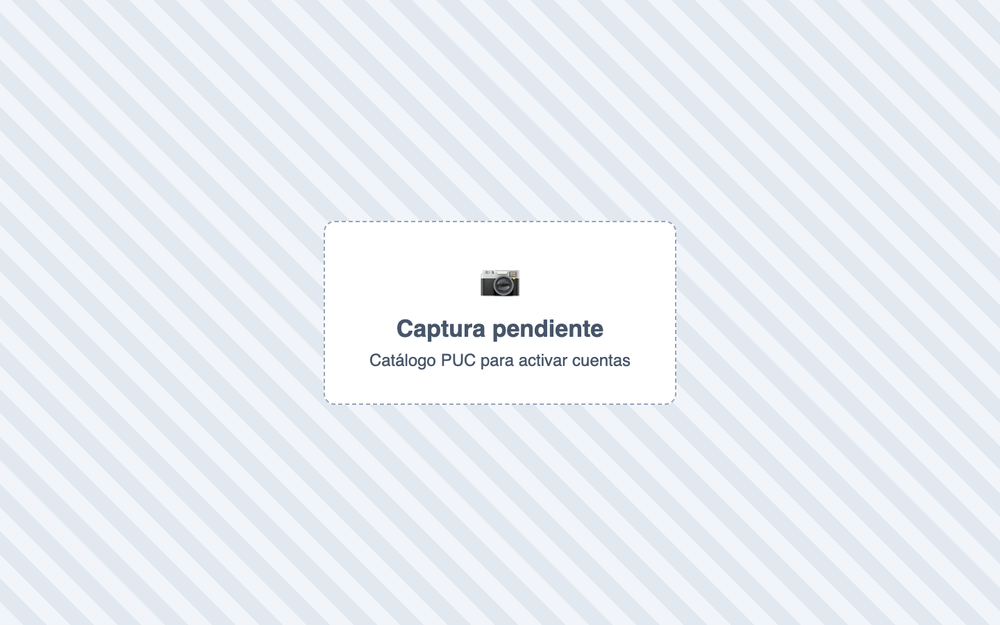

## 2. De dónde saca Inventy las cuentas

Ninguna cuenta está fija: cada asiento usa las cuentas que la empresa configuró en estos lugares.

| Qué se registra | Dónde se configura la cuenta |
|---|---|
| Ingresos por ventas, IVA y retenciones por línea | **Catálogo de impuestos** del producto (cada impuesto tiene su cuenta) |
| Costo de ventas e inventario | **Catálogo de impuestos**: *Cuenta Costo de Inventario* y *Cuenta Valor de Inventario* |
| Efectivo | La **caja** (campo **Cuenta contable**) |
| Tarjeta y transferencia | El **medio de pago** (una cuenta bancaria por sede) |
| Cuentas por cobrar (ventas a crédito) | El **tipo de cliente** |
| Cuentas por pagar (compras) | Se elige en cada factura de compra, de la lista de Contabilidad › Configuración |
| Retefuente, ReteIVA y ReteICA del tercero | Ficha del **cliente** o **proveedor** (sección **Retenciones**) |
| Anticipos, ajuste al peso | Contabilidad › Configuración |
| Domicilios, propinas, GMF (4x1000) | Configuración › Módulos (Restaurante, Bancos) |

!!! tip "Cuenta propia por producto"
    Un producto puede tener su propia cuenta de ingreso o de compra. Si la tiene, **manda sobre** la del catálogo de impuestos.

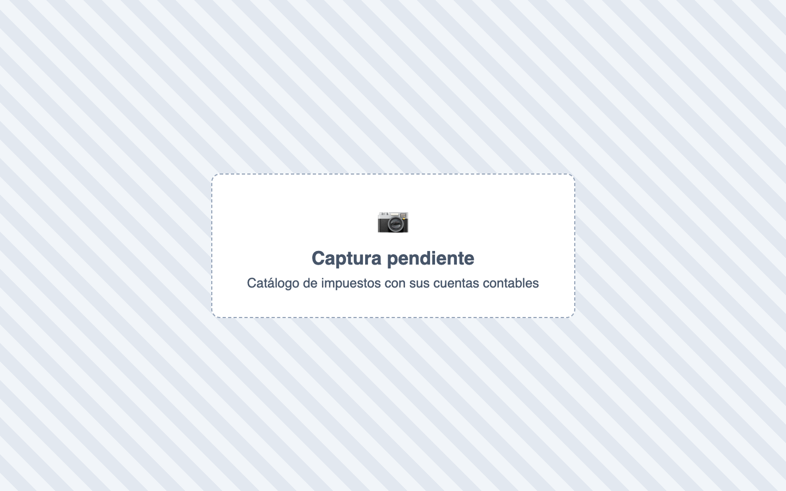

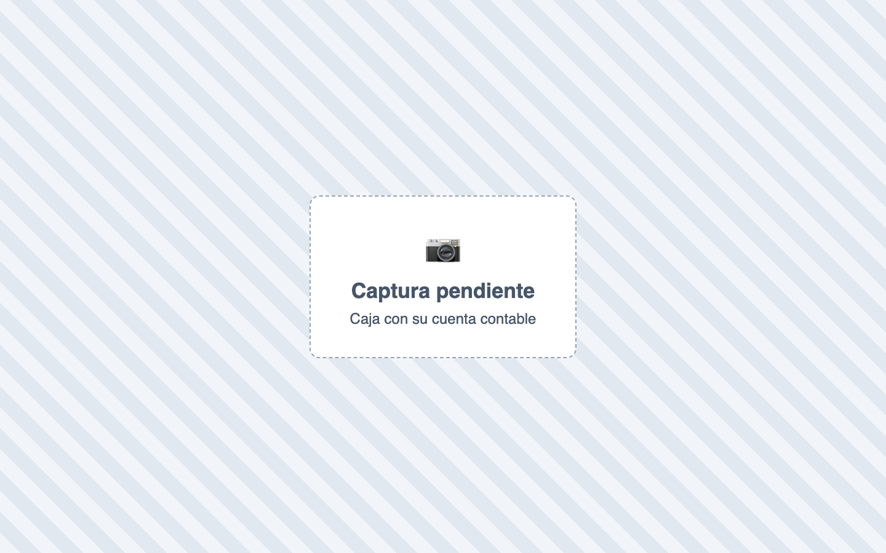

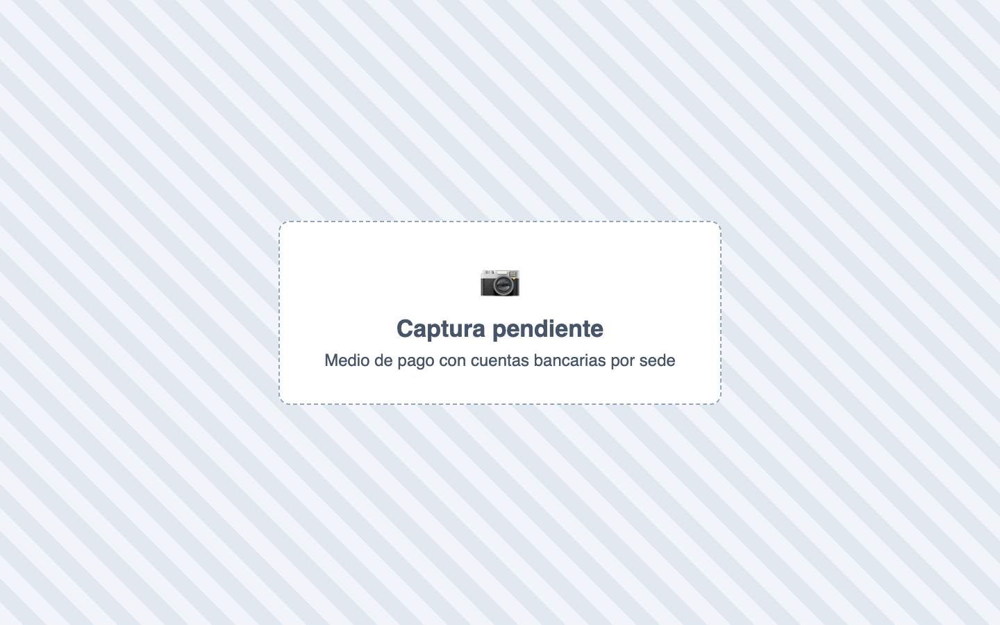

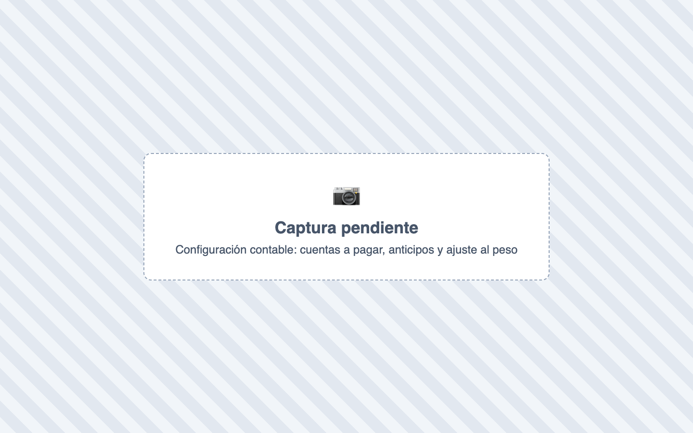

## 3. Cómo nace un asiento: ejemplo de una venta

Al **validar** una factura de venta (o cobrar en el POS), Inventy arma el asiento.

**Ejemplo:** venta de contado en efectivo por **$119.000** ($100.000 + IVA 19 %), con un costo de mercancía de **$60.000**. Las cuentas son de ejemplo: salen de tu configuración.

| Cuenta | Débito | Crédito |
|---|---:|---:|
| Caja (cuenta de la caja) | 119.000 | |
| Ingresos por ventas (catálogo del producto) | | 100.000 |
| IVA por pagar (catálogo del producto) | | 19.000 |
| Costo de ventas (catálogo del producto) | 60.000 | |
| Inventario (catálogo del producto) | | 60.000 |
| **Totales** | **179.000** | **179.000** |

Variaciones:

- **Venta a crédito:** el débito va a **Cuentas por cobrar** (la cuenta del tipo de cliente).
- **Pago mixto:** una línea de débito por cada medio de pago.
- **Retención por línea:** una línea de débito adicional.
- **Un peso de diferencia por redondeo:** va a la cuenta de **Ajuste al peso**.

Cada línea guarda además el **tercero** (nombre y documento), el **centro de costo** y la **base** del impuesto. Por eso existen el libro auxiliar por tercero y el reporte de impuestos.

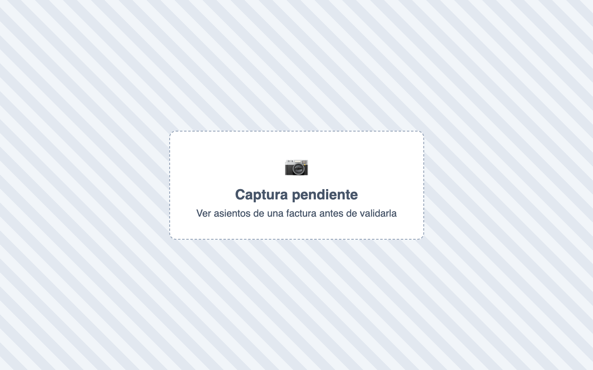

## 4. Reglas importantes

| Regla | Qué significa para el usuario |
|---|---|
| **Si el asiento no cuadra, el documento no se valida** | Aparece *“El asiento contable no está balanceado”*. Casi siempre falta una cuenta en la configuración. |
| **Ver asientos** | Antes de validar, muestra el asiento y avisa qué cuenta falta (facturas, compras, ingresos, egresos…). |
| **Un documento = un asiento** | Nunca se duplica. |
| **Sin el módulo Contabilidad** | Los documentos funcionan igual, pero no se generan asientos. |
| **Numeración** | Año + consecutivo, por ejemplo `2026-00042`. |
| **Anulaciones** | Al anular una compra se elimina su asiento. Ingresos, egresos, traslados, consignaciones, anticipos y liquidaciones crean un **asiento de anulación**. |

## 5. Documentos que generan asientos

Venta y devolución de venta · compra y devolución de compra · ingresos (recaudos) · egresos (pagos) · anticipos de clientes y proveedores · traslados de dinero · consignaciones · compensación de cuentas · GMF (4x1000) · domicilios (pago y liquidación) · propinas · nómina (pago, provisión, liquidación).

Además: **asientos manuales**, **saldos iniciales** e **importación de asientos** desde Excel en Contabilidad › Asientos Contables.

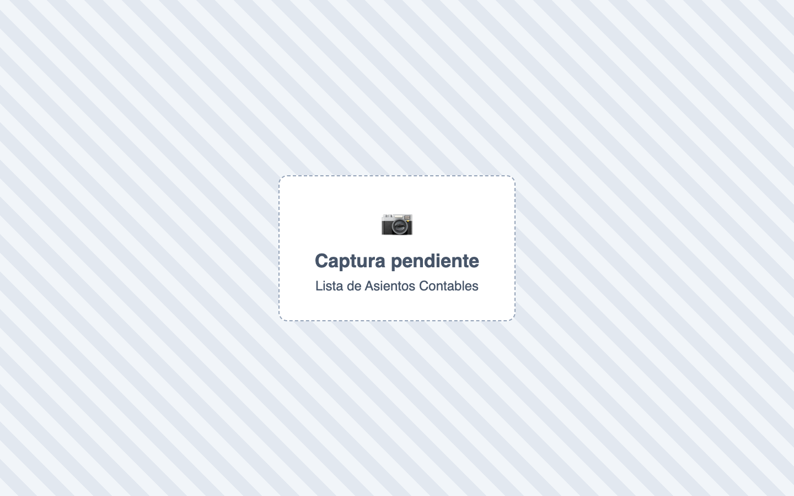

## 6. Los informes

Todos se calculan a partir de las líneas de los asientos:

| Informe | Para qué sirve |
|---|---|
| **Reporte de Asientos** | El libro diario: todos los asientos de un período. |
| **Balance de Prueba** | Saldos de todas las cuentas; débitos y créditos deben cuadrar. |
| **Libro Auxiliar** | Movimientos de una cuenta, con su tercero. |
| **Estado de Resultados** | Utilidad o pérdida del período (ver abajo). |
| **Balance General** | Activos, pasivos y patrimonio. |
| **Reporte de Impuestos** | Impuestos y retenciones con su base. |

El **Estado de Resultados** agrupa por el inicio del código de cuenta: **41** ingresos operacionales · **42** ingresos no operacionales · **51** gastos de administración · **52** gastos de ventas · **53** gastos no operacionales · **54** impuesto de renta · **6** y **7** costo de ventas.

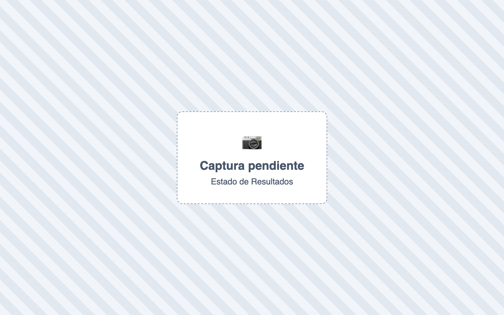

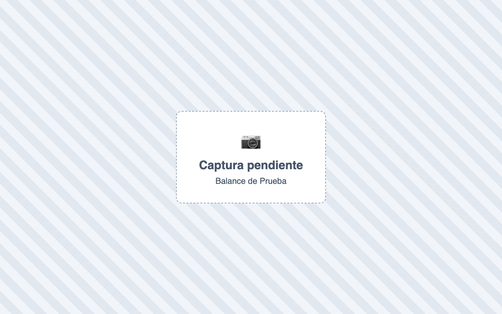

!!! info "¿Por qué la utilidad del Inicio no coincide con el Estado de Resultados?"
    El **Inicio** calcula la utilidad directo desde las facturas (ventas − costo − gastos de servicios). El **Estado de Resultados** la calcula desde los **asientos contables**, que incluyen todo lo contabilizado (nómina, GMF, ajustes, asientos manuales…). Ver [¿Por qué la utilidad me sale en cero?](../preguntas-frecuentes.md#utilidad-y-reportes).

## Si algo falla

| Problema | Solución |
|---|---|
| *El asiento contable no está balanceado* | Usa **Ver asientos** para ver qué línea no tiene cuenta y configúrala (catálogo, caja, medio de pago, tipo de cliente). |
| Un documento no generó asiento | Revisa que el módulo **Contabilidad** esté activo y que el producto tenga **catálogo de impuestos** con cuentas. |
| El Estado de Resultados muestra *Otros (sin clasificar)* | Hay movimientos en cuentas fuera de 41, 42, 51–54, 6 y 7. Revisa con tu contador. |

## Relacionados

- [¿Cómo se implementan las cuentas auxiliares?](cuentas-auxiliares.md)
- [¿Qué es y cómo creo un catálogo de impuestos?](../impuestos/catalogo-impuestos.md)
- [¿Cómo se aplican las retenciones?](../impuestos/retenciones.md)
