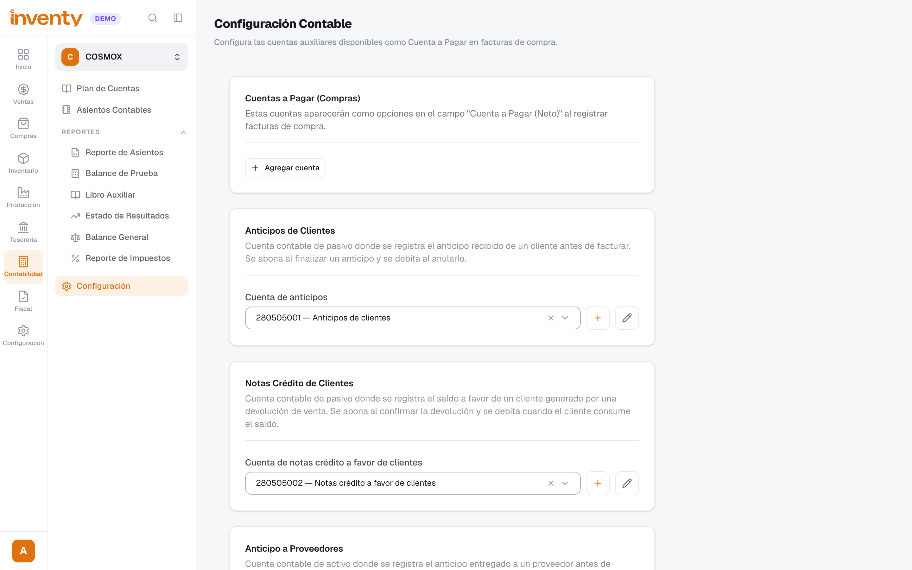
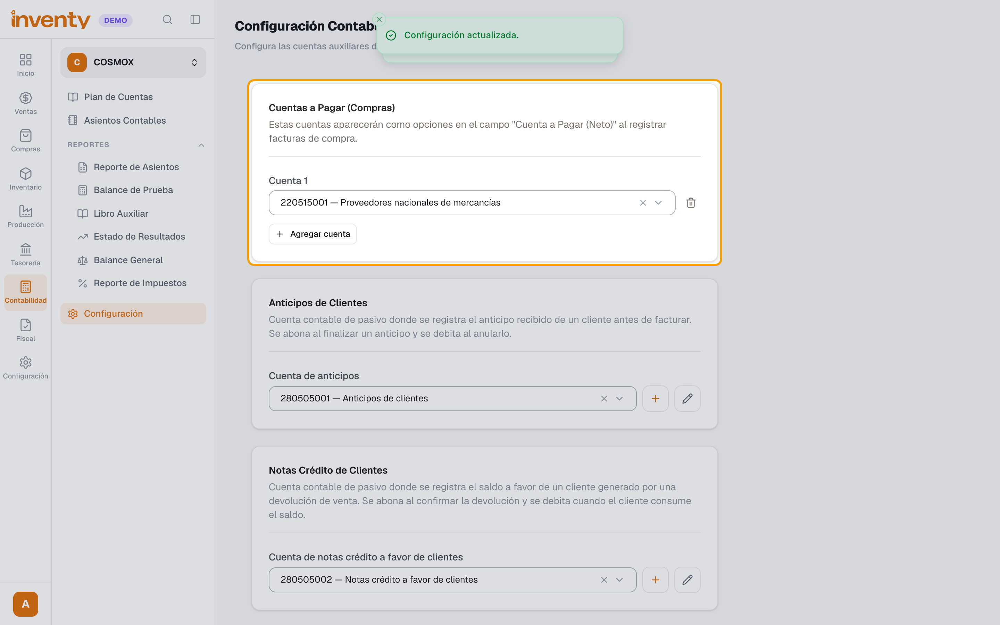
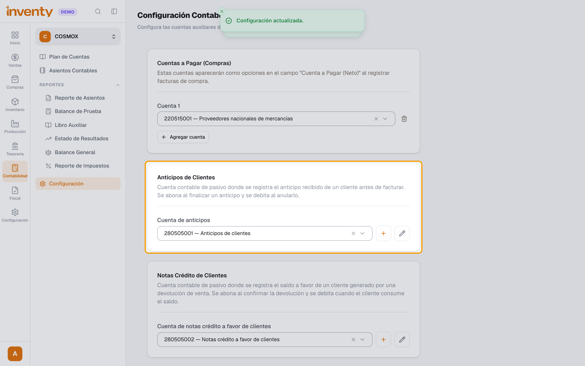
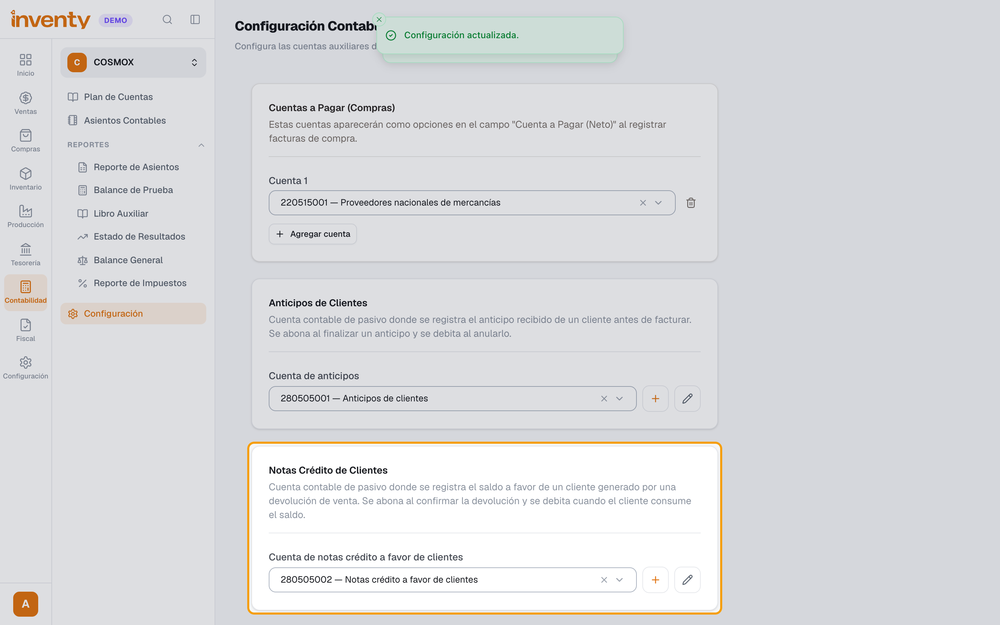
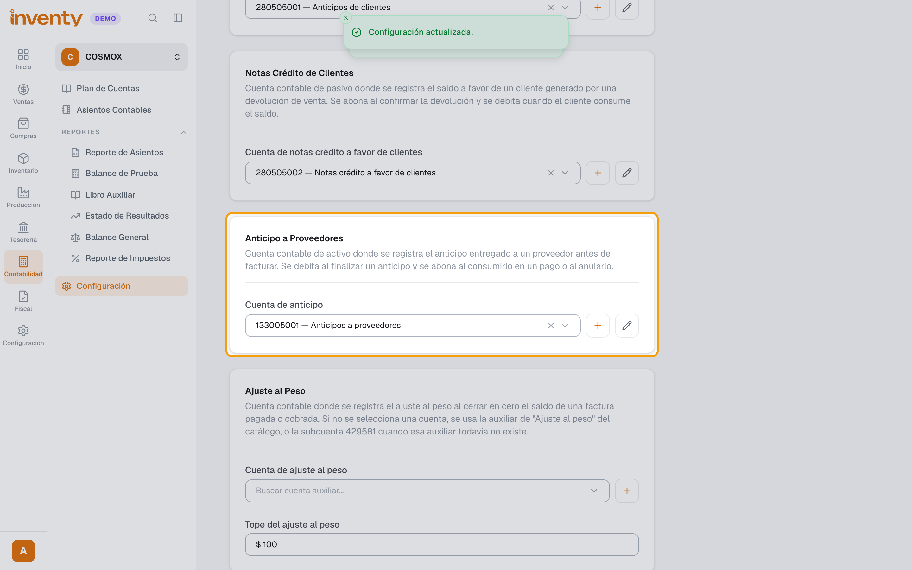
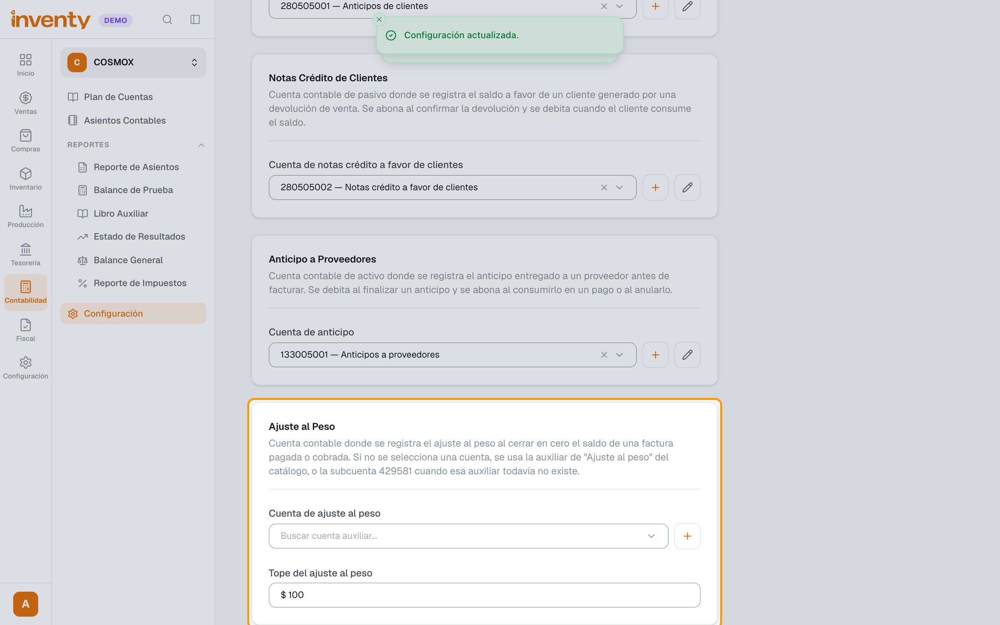

# ¿Cómo hago la configuración contable inicial?

También se busca como: configuración contable, cuentas a pagar, cuenta de proveedores, no hay cuentas configuradas, cuenta de anticipos, ajuste al peso, parametrizar contabilidad.

**Antes de empezar:** carga primero las [cuentas auxiliares por defecto](cuentas-auxiliares.md): asignan casi todo solo.

## Pasos

**Paso 1.** Ingresa a Contabilidad › Configuración.

**Paso 2.** En **Cuentas a Pagar (Compras)**, haz clic en **Agregar cuenta** y elige la cuenta de proveedores (ej. *Proveedores nacionales*). Puedes agregar varias: aparecerán en cada factura de compra.

**Paso 3.** En **Anticipos de Clientes**, revisa la **Cuenta de anticipos** (pasivo donde queda el dinero que el cliente paga por adelantado).

**Paso 4.** En **Notas Crédito de Clientes**, revisa la cuenta del saldo a favor que generan las devoluciones.

**Paso 5.** En **Anticipo a Proveedores**, revisa la **Cuenta de anticipo** (activo).

**Paso 6.** En **Ajuste al Peso**, elige la cuenta y el **Tope del ajuste al peso** para cerrar en cero saldos de centavos al pagar o cobrar.

✅ **Listo:** los cambios se guardan solos (verás *Configuración actualizada.*). Ya puedes registrar compras, anticipos y devoluciones con contabilidad.

## Si algo falla

| Problema | Solución |
|---|---|
| Al registrar una compra: *No hay cuentas configuradas. Configura las cuentas en Contabilidad → Configuración.* | Agrega al menos una cuenta en **Cuentas a Pagar (Compras)** (paso 2). |
| No aparecen cuentas para elegir | Carga las [cuentas auxiliares por defecto](cuentas-auxiliares.md) o crea la que necesites. |
| No veo el menú Configuración en Contabilidad | Tu rol necesita el permiso de configuración contable. |

## Relacionados

- [¿Cómo se implementan las cuentas auxiliares?](cuentas-auxiliares.md)
- [¿Cómo funciona la contabilidad en Inventy?](como-funciona.md)
- [¿Cómo registro una factura de compra?](../compras/registrar-factura-compra.md)
