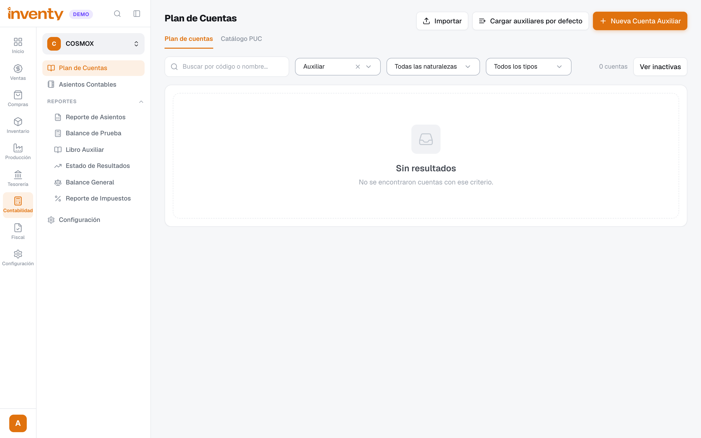
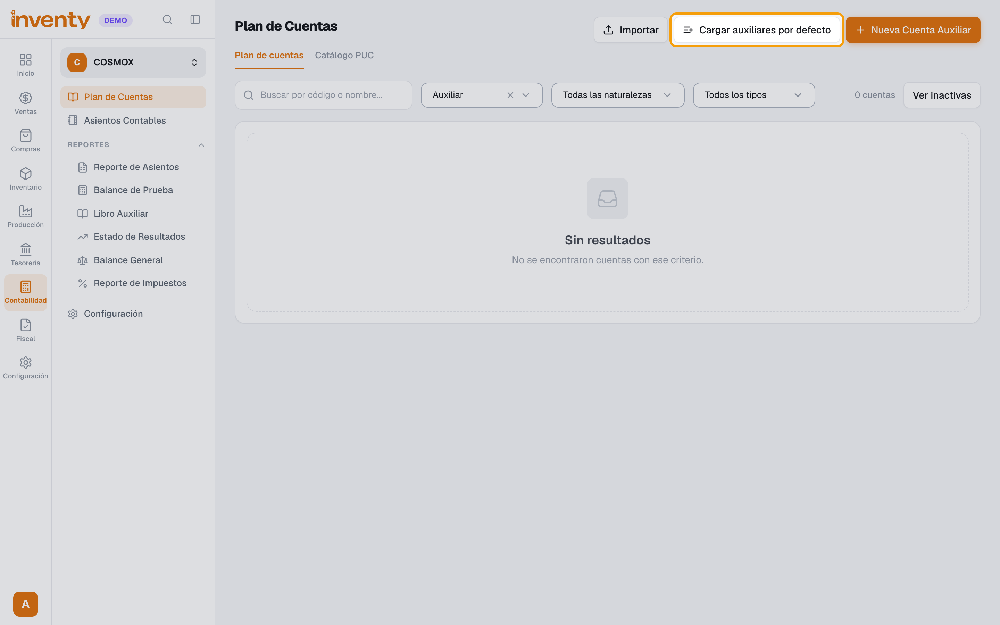
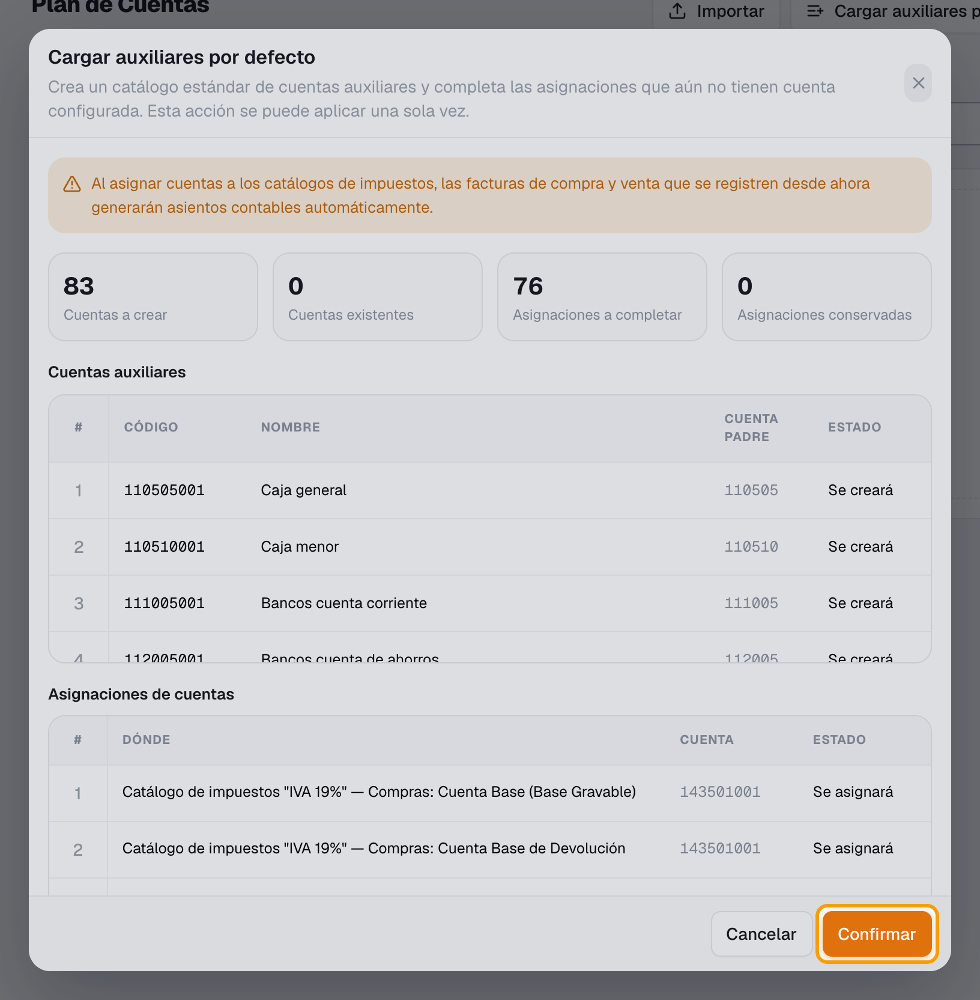
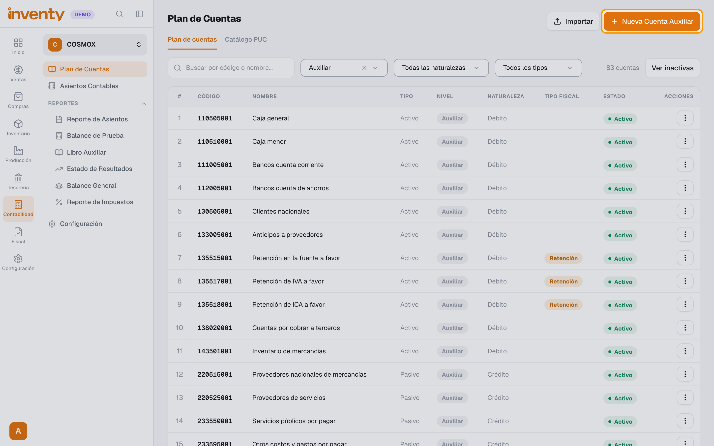
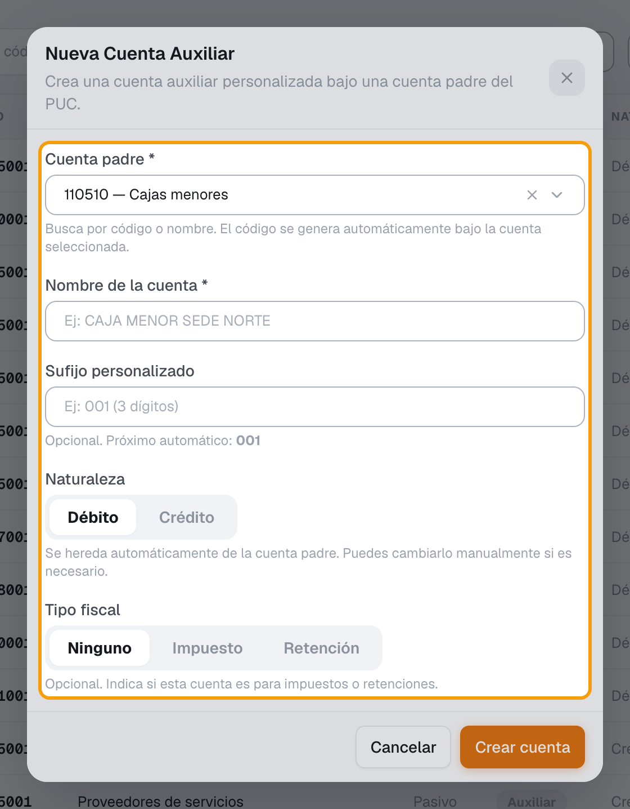
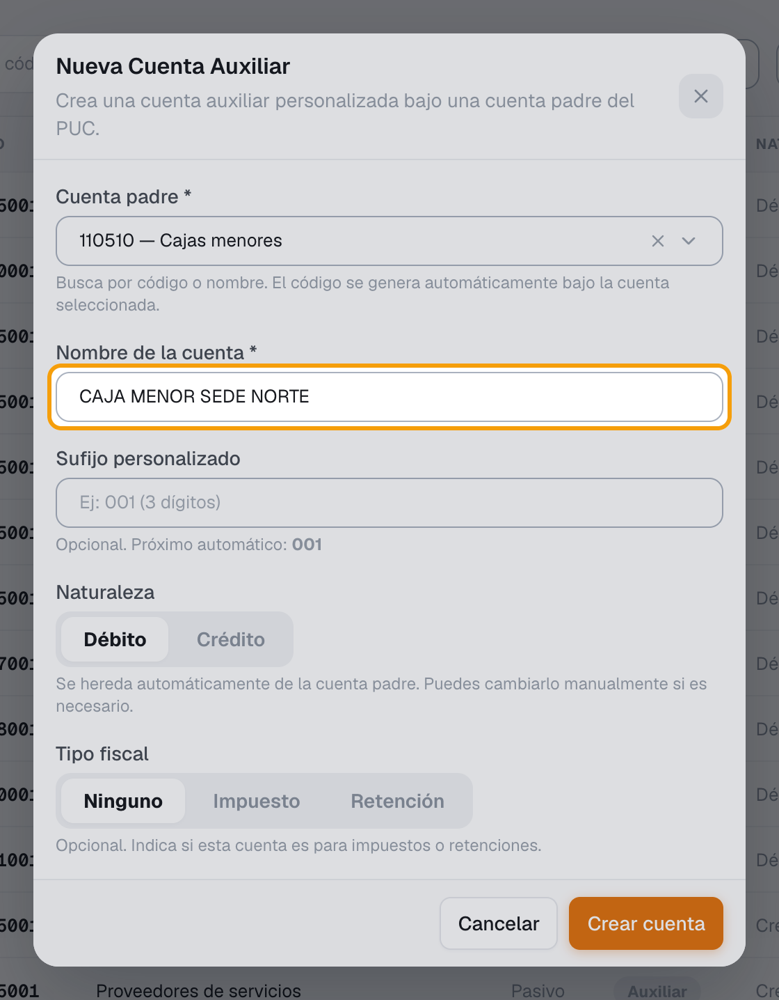
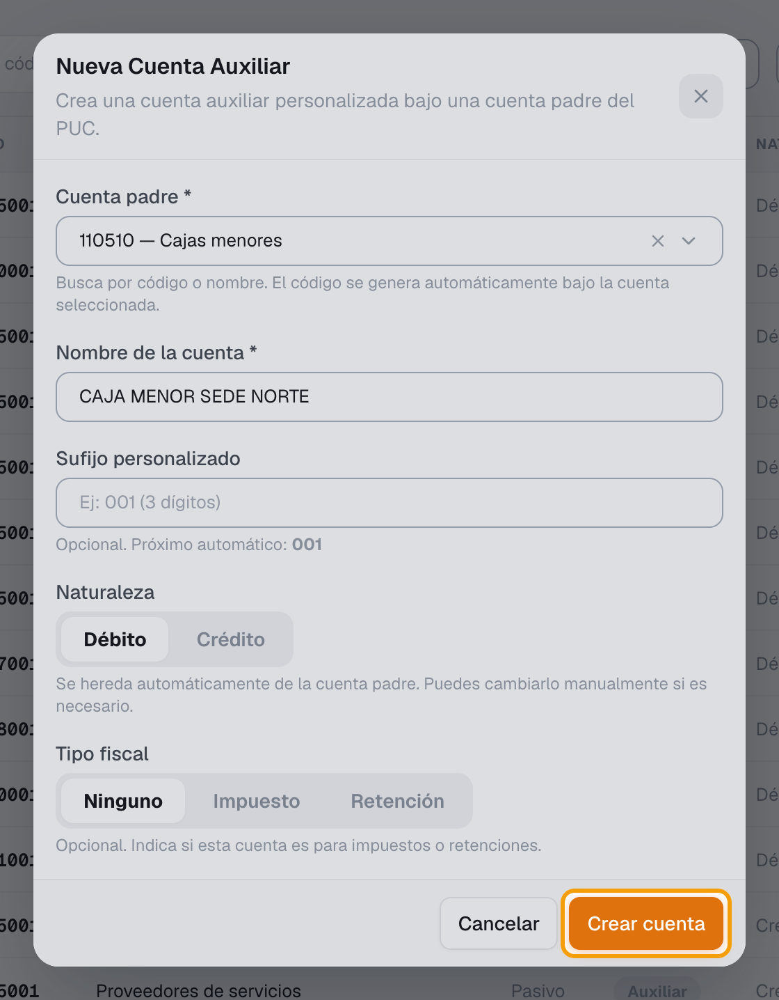

# ¿Cómo se implementan las cuentas auxiliares?

También se busca como: cuenta auxiliar, auxiliares, crear cuenta contable, PUC, plan de cuentas, subcuenta, código contable, caja menor, cuentas por defecto.

**Qué es:** el último nivel del plan de cuentas (PUC). Es la cuenta donde Inventy registra los movimientos; las de nivel superior solo agrupan.

**Antes de empezar:** el módulo **Contabilidad** debe estar activo.

## Pasos

**Paso 1.** Ingresa a Contabilidad › Plan de Cuentas.

**Paso 2.** *(Solo la primera vez)* Haz clic en **Cargar auxiliares por defecto**.

**Paso 3.** Revisa la vista previa (**Cuentas a crear**, **Asignaciones a completar**), haz clic en **Confirmar** y luego en **Sí, aplicar**. Esto se hace una sola vez.

**Paso 4.** Para crear una cuenta propia, haz clic en **Nueva Cuenta Auxiliar**.

**Paso 5.** En **Cuenta padre**, busca la **Subcuenta** del PUC donde va la cuenta (ej. *110505 Caja general*).

**Paso 6.** Escribe el **Nombre de la cuenta** (ej. *CAJA MENOR SEDE NORTE*). El código se genera solo; si quieres, escribe un **Sufijo personalizado** de 3 dígitos. Revisa **Naturaleza** y **Tipo fiscal**.

**Paso 7.** Haz clic en **Crear cuenta**.

✅ **Listo:** la cuenta aparece en el plan de cuentas con nivel **Auxiliar** y ya se puede elegir en todos los campos **Buscar cuenta auxiliar...** (cajas, bancos, catálogos de impuestos, medios de pago, nómina…).

!!! info "Cómo se forma el código"
    Clase (1 dígito) › Grupo (2) › Cuenta (4) › Subcuenta (6) › **Auxiliar** = subcuenta + 3 dígitos.
    Ejemplo: subcuenta `110505` → auxiliares `110505001`, `110505002`… Los movimientos se registran siempre en cuentas **auxiliares**.

## Si algo falla

| Problema | Solución |
|---|---|
| *Solo se pueden crear cuentas auxiliares bajo una Subcuenta.* | Elige como cuenta padre una **Subcuenta** (6 dígitos), no una Clase, Grupo o Cuenta. |
| *El código de cuenta … ya existe. Intenta con un sufijo diferente.* | Cambia el **Sufijo personalizado** o déjalo vacío para que se genere solo. |
| *El catálogo por defecto ya fue aplicado.* | Ya se cargó antes. Crea las cuentas que falten con **Nueva Cuenta Auxiliar**. |
| No encuentro una subcuenta del PUC | Actívala en **Catálogo PUC** (en la misma pantalla) y vuelve a intentar. |
| No veo el botón **Nueva Cuenta Auxiliar** | Tu rol necesita el permiso **Crear plan de cuentas**. |
| *El asiento contable no está balanceado* al facturar | Falta asignar una cuenta auxiliar en la configuración. **Cargar auxiliares por defecto** completa las que faltan. |
| ¿Tengo muchas cuentas? | Usa la importación de cuentas desde Excel del plan de cuentas. |

## Relacionados

- [Contabilidad](index.md)
- [¿Qué es y cómo creo un catálogo de impuestos?](../impuestos/catalogo-impuestos.md)
