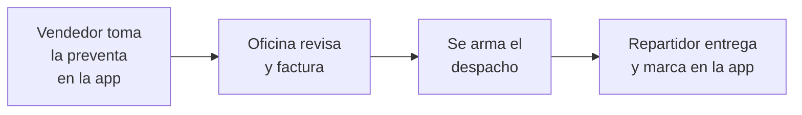

# Distribución

También se busca como: preventa, pedidos de vendedores, ruta, despacho, repartidor, entregas, app de vendedores, TAT.

El módulo **Distribución** es para empresas que venden con **vendedores en ruta** y entregan con **repartidores**. Requiere el módulo Inventario.

## ¿Cómo funciona?

## ¿Qué hay en el menú Distribución?

| Grupo | Opción | Para qué sirve |
|---|---|---|
| Operación | **Preventas** | Pedidos tomados por los vendedores. La oficina los revisa, edita o convierte en factura. |
| | **Despachos** | Agrupa facturas para entregar en un vehículo con un repartidor. |
| | **Rutas de venta** | Clientes que visita cada vendedor. |
| Reportes | **Clientes venta cero** | Clientes de la ruta que no compraron. |
| Configuración | **Vehículos** | Vehículos de reparto. |

## La app móvil

Los **vendedores** toman preventas y agregan clientes a su ruta desde la app móvil de Inventy. Los **repartidores** ven su despacho activo y marcan las entregas.

!!! warning "Requisitos para usar la app"
    - El vendedor debe estar registrado como **vendedor activo** y asociado a su usuario.
    - El repartidor debe estar asignado a un despacho **en ruta**.
    - Sus roles deben tener los permisos de campo (pide a soporte la lista recomendada).

## Guías planificadas

| Guía | Estado |
|---|---|
| Configurar rutas de venta y vehículos | Por redactar |
| Revisar y facturar preventas | Por redactar |
| Crear y cerrar un despacho | Por redactar |
| App móvil: tomar una preventa | Por redactar (requiere acceso a la app) |
| App móvil: marcar entregas | Por redactar (requiere acceso a la app) |
| Problemas de sincronización | [PENDIENTE DE VALIDACIÓN FUNCIONAL: comportamiento sin conexión de la app] |
