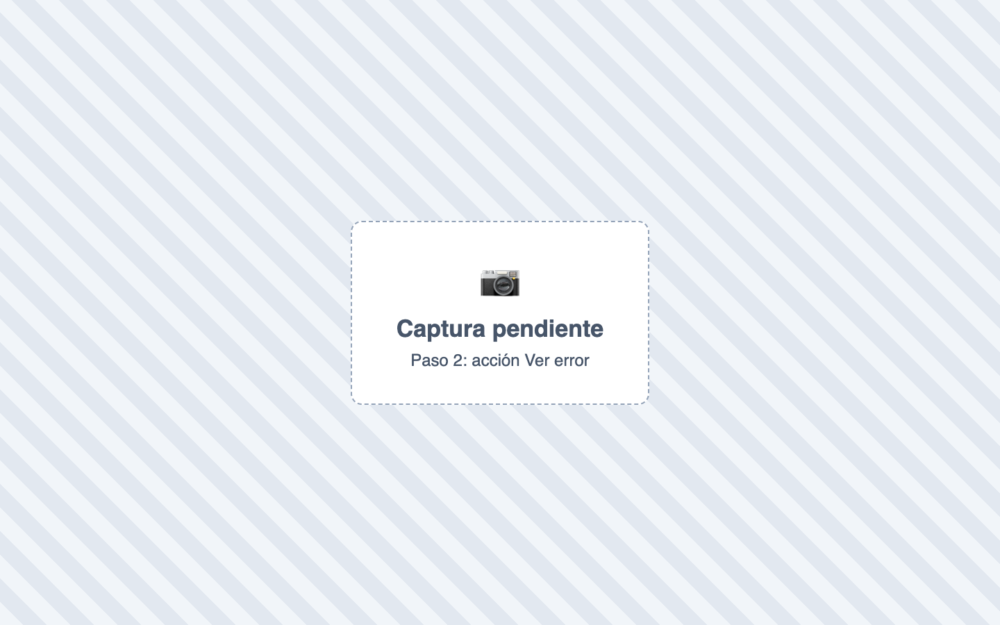
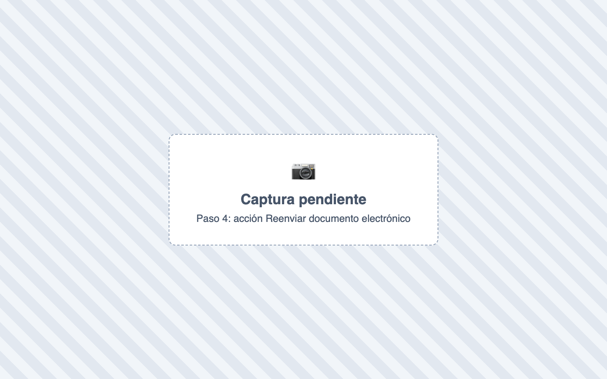

# ¿Qué hago si un documento electrónico es rechazado?

También se busca como: factura rechazada, rechazo DIAN, no fue aceptada, error DIAN, reenviar factura, falló prevalidación, sin conexión con la DIAN, estado desconocido.

## Pasos

**Paso 1.** Ingresa a Fiscal › Documentos y busca el documento por número o CUFE.

**Paso 2.** Abre las acciones del documento y haz clic en **Ver error**.

**Paso 3.** Corrige la causa: datos del cliente (Ventas › Clientes), resolución (Fiscal › Resoluciones) o impuestos (Fiscal › Catálogo de Impuestos).

**Paso 4.** Vuelve al documento y haz clic en **Reenviar documento electrónico**. Confirma.

✅ **Listo:** aparece *“Documento … reenviado exitosamente. Estado: …”*. Si dice **Aceptado**, terminaste.

## Si algo falla

| Problema | Solución |
|---|---|
| Quedó **Pendiente** o **Desconocido** (sin conexión) | **No crees la factura de nuevo.** Espera unos minutos y reenvía. |
| *Solo se pueden reenviar documentos con estado pendiente, desconocido, rechazado o fallido.* | Ya fue aceptado: no necesita reenvío. |
| **Aceptado con observaciones** | Es válido. Revisa **Ver observaciones** para próximas facturas. |
| El error persiste | [Contacta a soporte](../soporte.md) con número, CUFE y captura de **Ver error**. |

## Relacionados

- [¿Qué significa cada estado?](estados-documento.md)
- [¿Cómo registro una resolución de la DIAN?](resoluciones.md)
