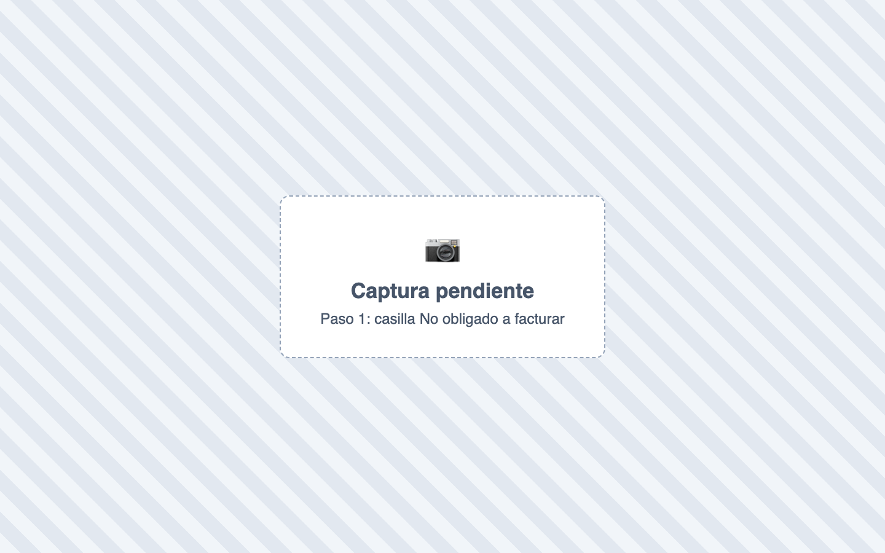
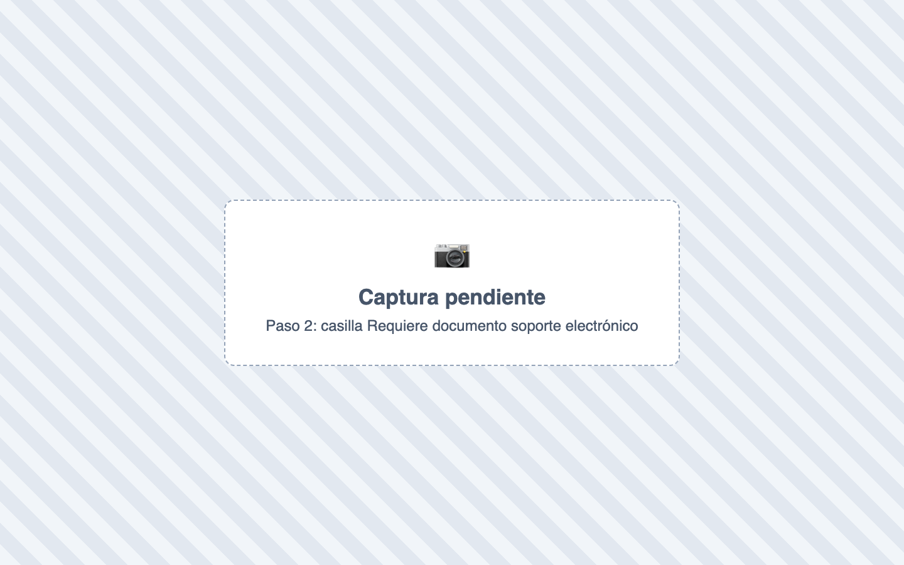
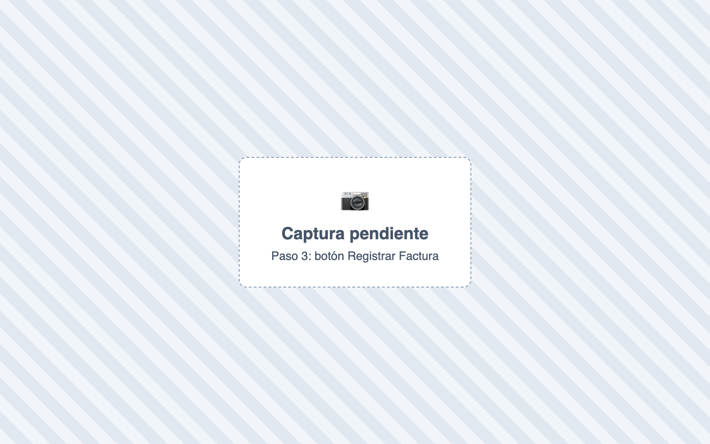
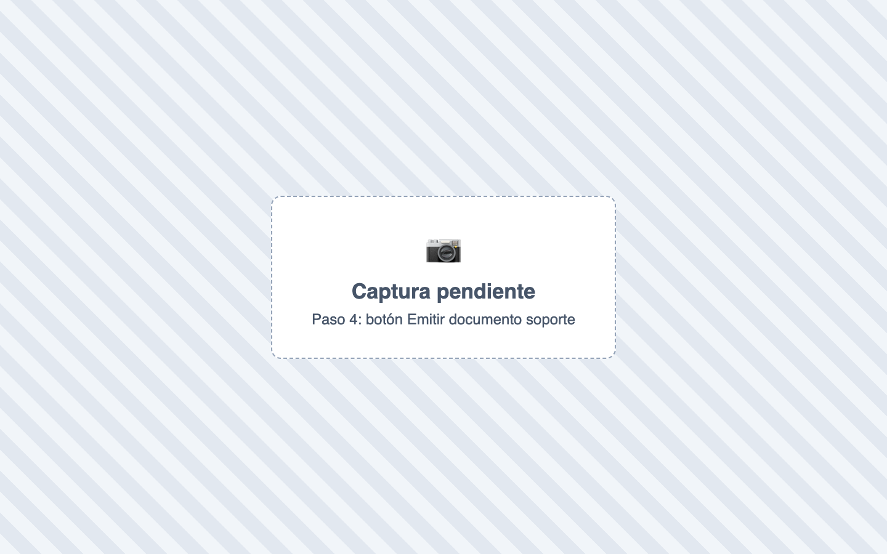

# ¿Cómo emito un documento soporte electrónico?

También se busca como: documento soporte, generar documento soporte, emitir documento soporte, DS, compra a persona natural, proveedor no obligado a facturar.

**Antes de empezar:** debe existir una resolución activa de **Documento soporte electrónico**.

## Pasos

**Paso 1.** En Compras › Proveedores, edita el proveedor y activa **No obligado a facturar** (solo una vez).

**Paso 2.** Registra su factura en Compras › Facturas › **Nueva Factura**. La casilla **Requiere documento soporte electrónico** se marca sola.

**Paso 3.** Haz clic en **Registrar Factura** y confirma.

**Paso 4.** Si no se envió solo, abre la factura y haz clic en **Emitir documento soporte**. Confirma.

✅ **Listo:** el documento aparece en Fiscal › Documentos. Si está **Aceptado**, terminaste.

## Si algo falla

| Problema | Solución |
|---|---|
| No aparece **Emitir documento soporte** | La factura debe estar validada, marcada como *Requiere documento soporte*, sin documento previo y sin devoluciones. |
| *La factura no requiere documento soporte electrónico: el proveedor está obligado a facturar.* | Marca al proveedor como **No obligado a facturar** si corresponde. |
| *La factura ya tiene un documento soporte electrónico activo.* | Ya se emitió: búscalo en **Fiscal › Documentos**. |
| *No hay una resolución activa disponible para este tipo de documento.* | [Registra la resolución](resoluciones.md) de documento soporte. |

## Relacionados

- [¿Cómo registro una factura de compra?](../compras/registrar-factura-compra.md)
