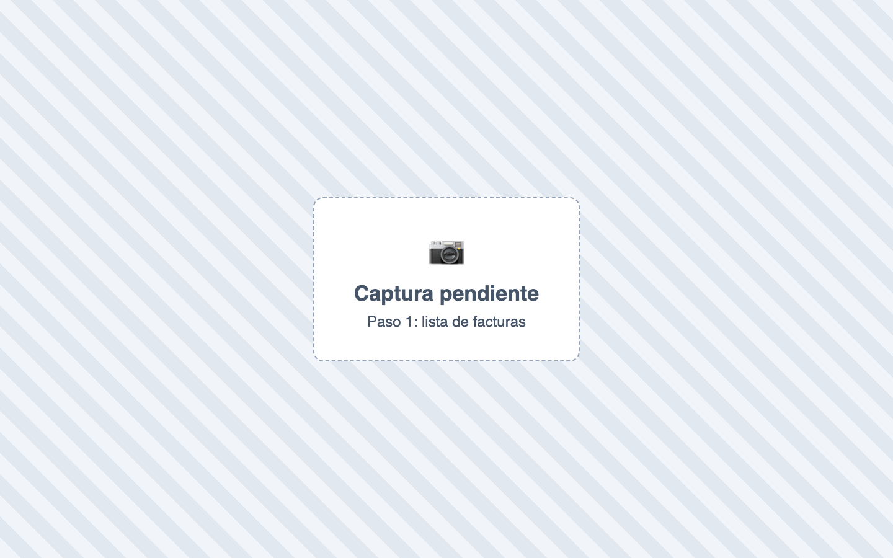
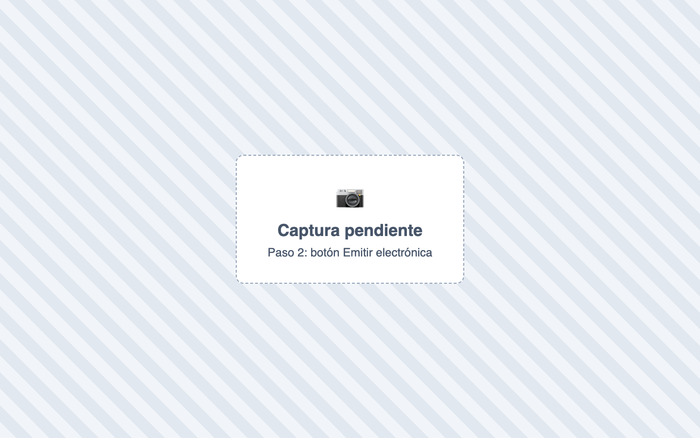
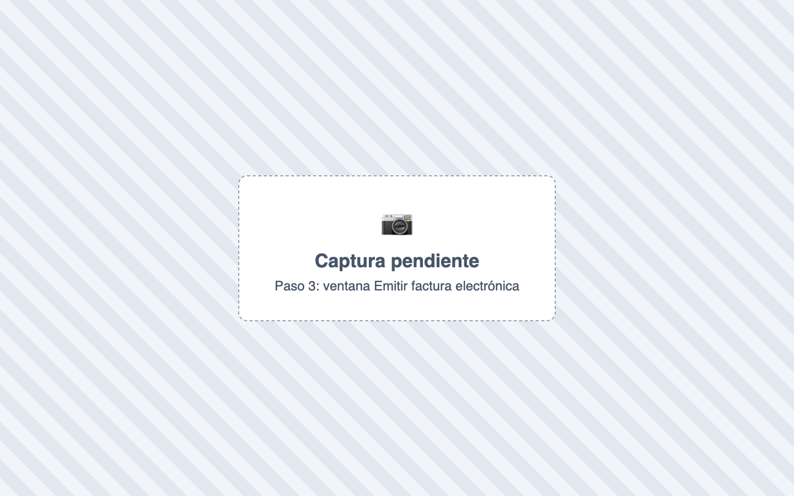
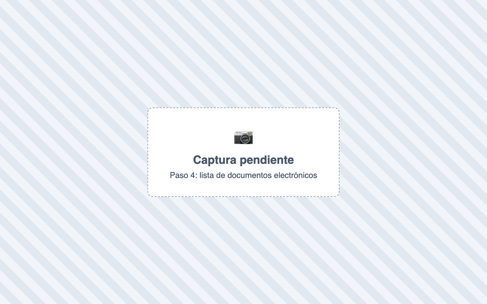

# ¿Cómo emito una factura electrónica?

También se busca como: facturar electrónicamente, enviar a la DIAN, emitir factura, factura DIAN, generar CUFE.

**Antes de empezar:** tu empresa debe estar habilitada y tener una [resolución activa](resoluciones.md).

## Pasos

**Paso 1.** Ingresa a Ventas › Facturas y abre la factura **Validada**.

**Paso 2.** Haz clic en **Emitir electrónica**.

**Paso 3.** En **¿Emitir factura electrónica?**, elige el **Tipo de documento electrónico** y confirma.

**Paso 4.** Revisa el estado en Fiscal › Documentos.

✅ **Listo:** el documento queda **Aceptado** y el cliente lo recibe en su correo.

!!! info "Otras formas de emitir"
    - **Automática:** activa **Emitir documento electrónico automáticamente** en Configuración › Módulos › Fiscal y cada factura se envía al validarla.
    - **Desde el POS:** deja marcada **Generar factura electrónica** al cobrar.

## Si algo falla

| Problema | Solución |
|---|---|
| *No hay una resolución activa disponible para este tipo de documento.* | Revisa Fiscal › Resoluciones. |
| *La resolución no tiene consecutivos disponibles.* | Registra una resolución nueva. |
| No aparece **Emitir electrónica** | Quizá ya se emitió sola (emisión automática). Mira el campo **Documento electrónico**. |
| Quedó rechazado | Ver [documento rechazado](documento-rechazado.md). |

## Relacionados

- [¿Qué significa cada estado?](estados-documento.md)
- [¿Qué hago si un documento es rechazado?](documento-rechazado.md)
