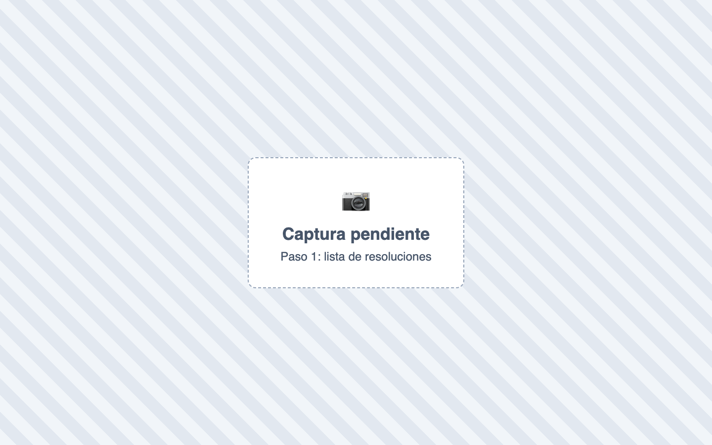
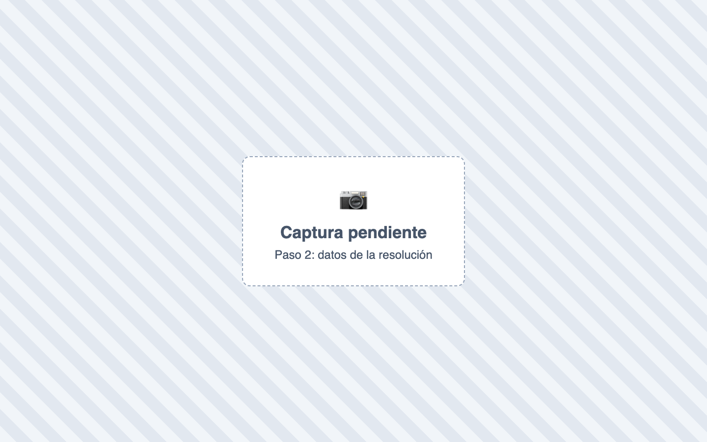
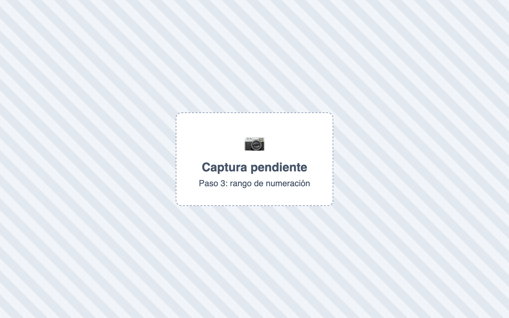
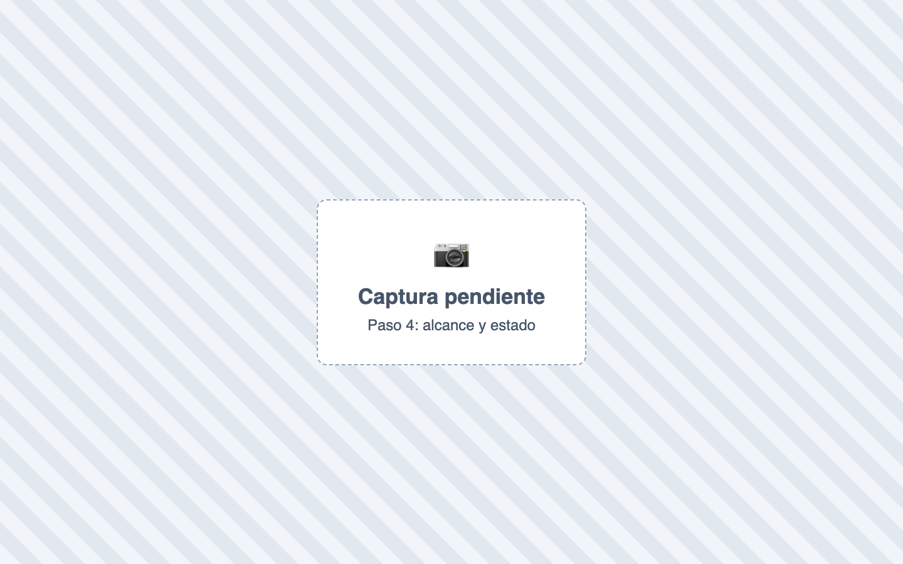
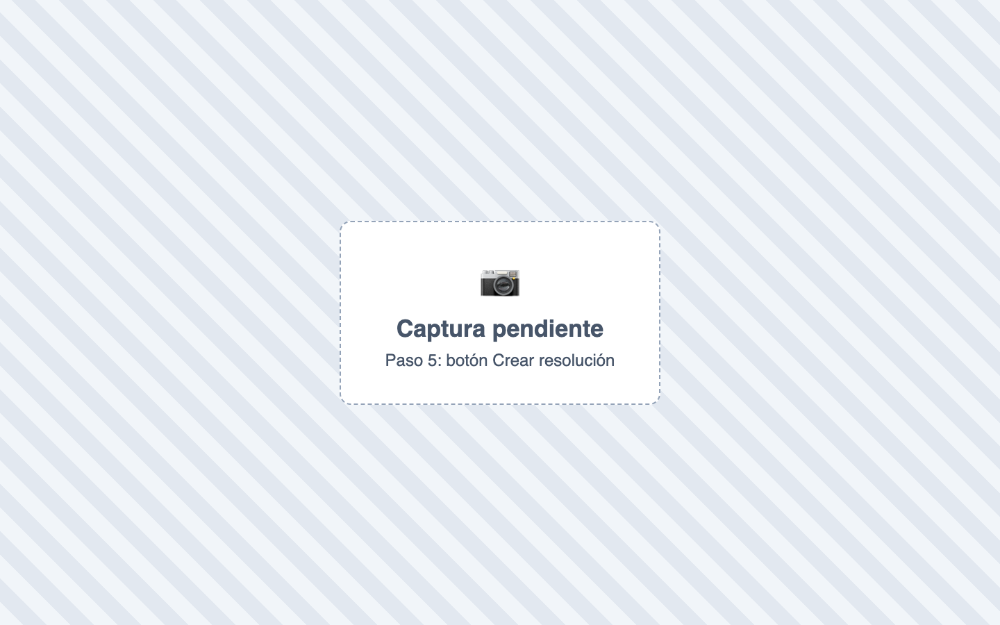

# ¿Cómo registro una resolución de la DIAN?

También se busca como: resolución de facturación, numeración, prefijo, rango de facturas, consecutivo, clave técnica, renovar resolución.

**Antes de empezar:** ten la resolución de la DIAN: número, prefijo, rango, vigencia y clave técnica.

## Pasos

**Paso 1.** Ingresa a Fiscal › Resoluciones y crea una **Nueva resolución**.

**Paso 2.** En **Datos de la resolución**, elige el **Tipo de documento** y escribe **Prefijo** y **Número de resolución**.

**Paso 3.** En **Rango de numeración**, escribe **Rango desde**, **Rango hasta**, **Fecha de inicio** y **Fecha de vencimiento**.

**Paso 4.** En **Alcance y estado**, elige las sedes, el **Estado** y escribe la **Clave técnica**.

**Paso 5.** Revisa todo y haz clic en **Crear resolución**.

✅ **Listo:** la resolución queda **Activa** y ya puedes emitir.

!!! danger "Revisa antes de crear"
    Después de crearla **no se pueden cambiar** tipo, prefijo, número, rango, fechas ni clave técnica.

## Si algo falla

| Problema | Solución |
|---|---|
| *El número de resolución solo puede contener dígitos.* | Quita letras, guiones y espacios. |
| *… no puede modificarse después de crear la resolución.* | Crea una nueva y deja la anterior **Inactiva**. |
| Estado **Agotada** o **Vencida** | Solicita una nueva numeración a la DIAN y regístrala. |

## Relacionados

- [¿Cómo emito una factura electrónica?](emitir-factura-electronica.md)
