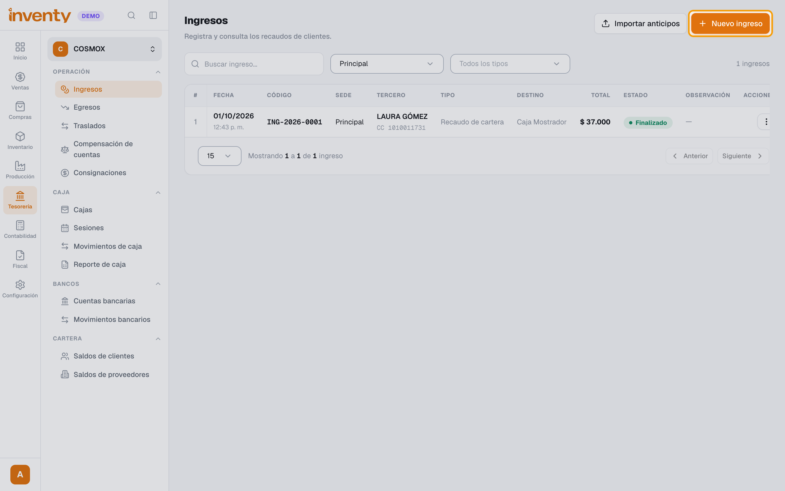
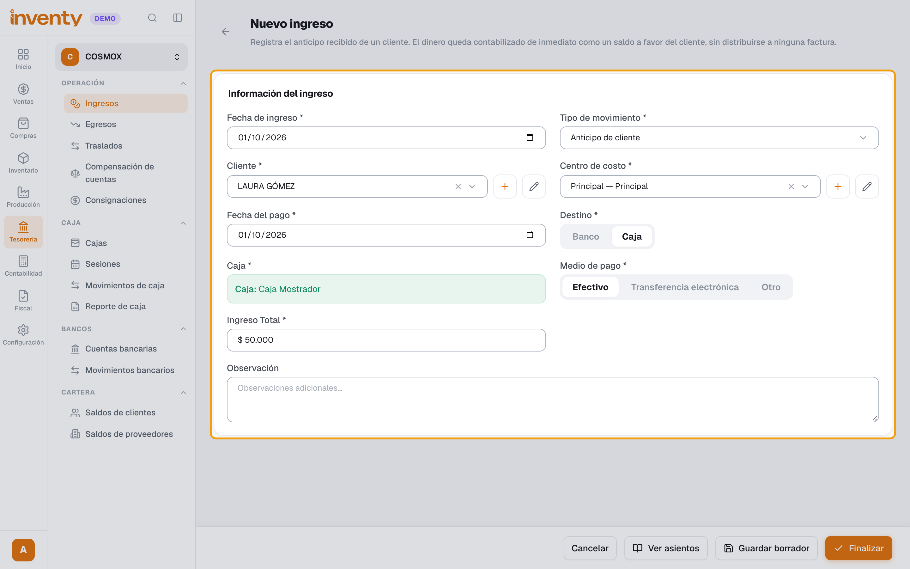
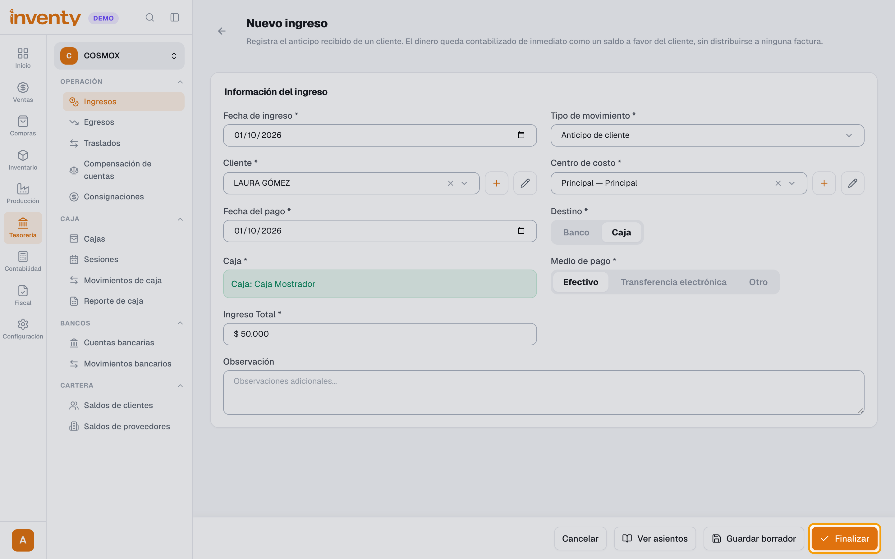
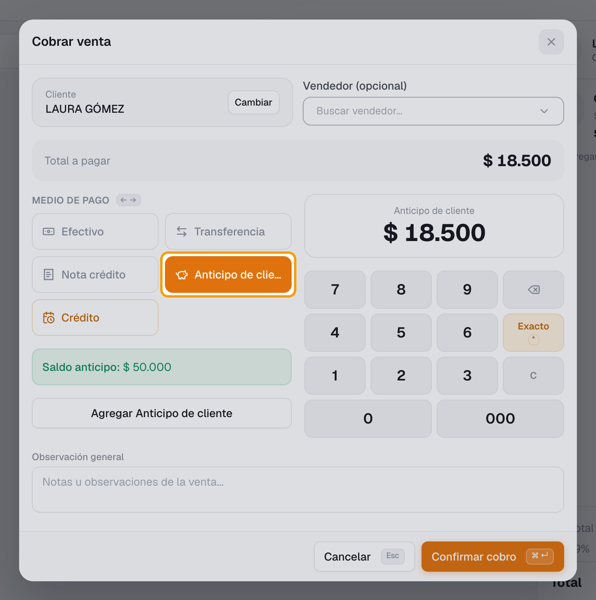
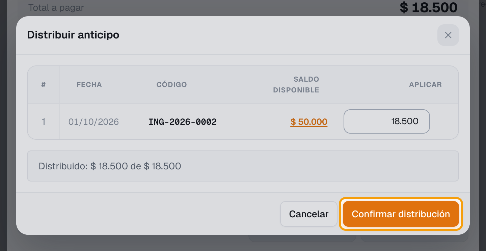
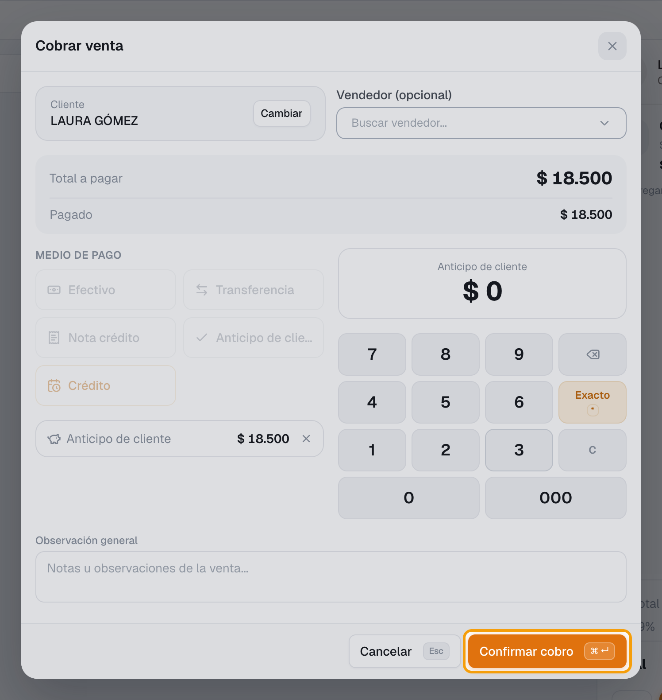
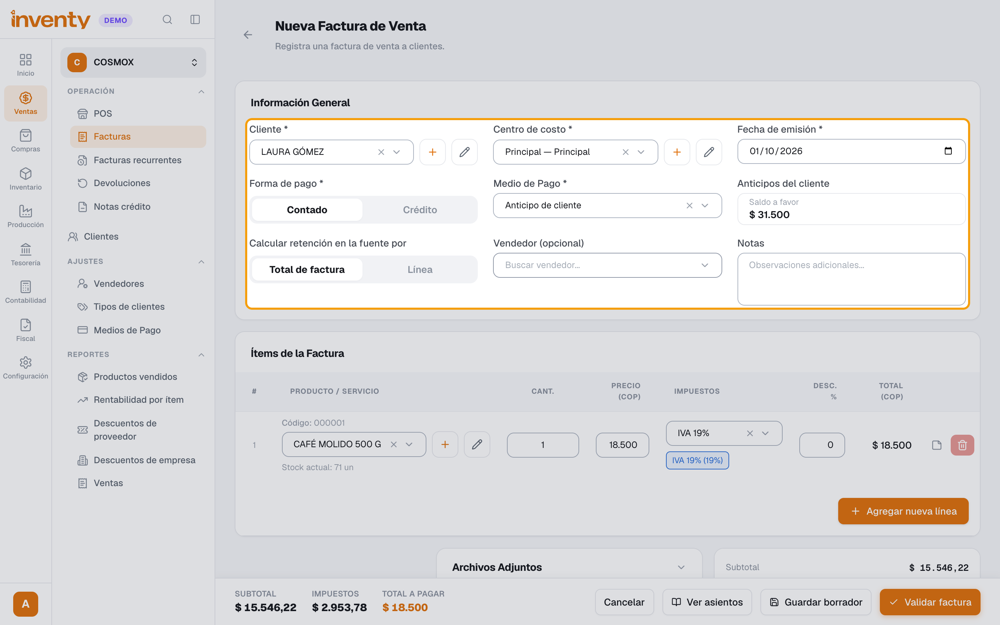

# ¿Qué es un anticipo y cómo se maneja en Inventy?

También se busca como: anticipo, abono previo, saldo a favor, pago por adelantado, depósito del cliente, separado, adelanto a proveedor.

**Qué es:** dinero que el cliente paga **antes** de la factura. Queda como **saldo a favor** y luego se aplica a sus compras.

**Antes de empezar:** debe existir un medio de pago de tipo **Anticipo de cliente** en Ventas › Ajustes › Medios de Pago.

## Pasos

**Paso 1.** Ingresa a Tesorería › Ingresos y haz clic en **Nuevo ingreso**.

**Paso 2.** En **Tipo de movimiento** elige **Anticipo de cliente**. Elige el **Cliente**, el **Destino** (**Banco** o **Caja**), el **Medio de pago** y escribe el **Ingreso Total**.

**Paso 3.** Haz clic en **Finalizar** y confirma con **Finalizar**. El cliente queda con **saldo a favor** (número **ING-**).

**Paso 4.** Para usarlo en el POS: agrega los productos, elige el cliente y haz clic en **Realizar venta**. En **Cobrar venta** elige **Anticipo de cliente** (solo aparece si el cliente tiene saldo). Verás el **Saldo anticipo**.

**Paso 5.** Haz clic en **Agregar Anticipo de cliente**. En **Distribuir anticipo**, haz clic en el **Saldo disponible** (o escribe el valor en **Aplicar**) y haz clic en **Confirmar distribución**.

**Paso 6.** Si falta, cobra el resto con otro medio. Haz clic en **Confirmar cobro**.

**Paso 7.** Para usarlo en una factura de venta: elige el **Cliente**, **Forma de pago: Contado** y en **Medio de Pago** elige **Anticipo de cliente**. Verás el **Saldo a favor**; aquí el anticipo debe cubrir el total.

✅ **Listo:** el saldo a favor del cliente baja en lo que usaste y la venta queda pagada.

!!! info "Anticipo a proveedor"
    Tesorería › Egresos › **Nuevo egreso** › Tipo **Anticipo a proveedor** › **Finalizar**. Para usarlo: nuevo egreso **Pago a proveedor** con **Fuente del pago: Anticipo** y aplícalo en **Anticipos aplicados**.

## Si algo falla

| Problema | Solución |
|---|---|
| No aparece **Anticipo de cliente** en el POS | El cliente no tiene saldo, o no existe el medio de pago de ese tipo. |
| *Selecciona a qué anticipos aplicar el pago.* | Haz clic en **Agregar Anticipo de cliente** y completa **Distribuir anticipo** (paso 5). |
| *Este cliente no tiene anticipos disponibles* | Regístrale primero el anticipo (pasos 1 a 3). |
| *La suma de los anticipos aplicados debe ser igual al valor total* | Ajusta los valores hasta cuadrar con el total. |
| En la factura no me deja pagar solo una parte | En **Facturas** el anticipo cubre el total. Para pago parcial usa el POS. |

## Relacionados

- [¿Cómo registro un pago de un cliente?](registrar-ingreso.md)
- [¿Cómo vendo en el POS?](../pos/vender-en-pos.md)
