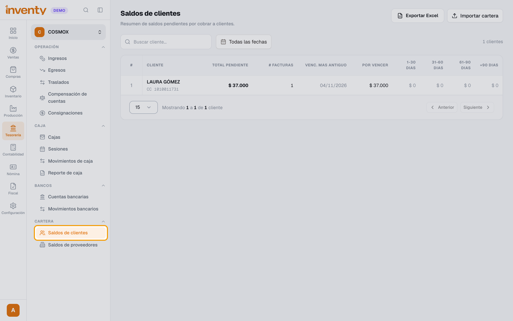
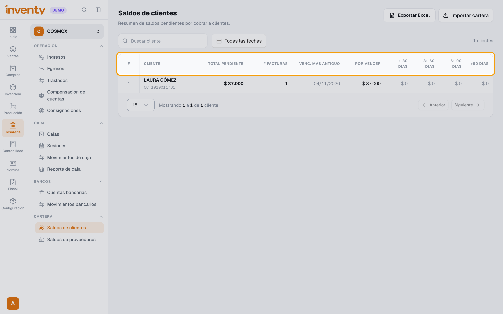
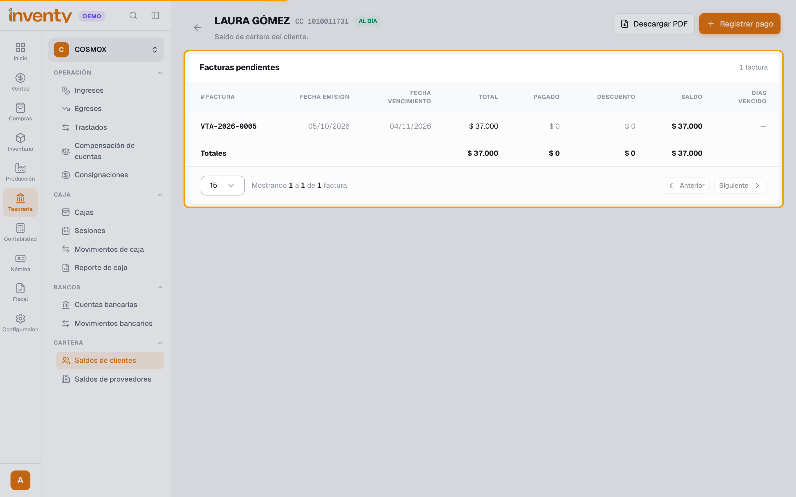
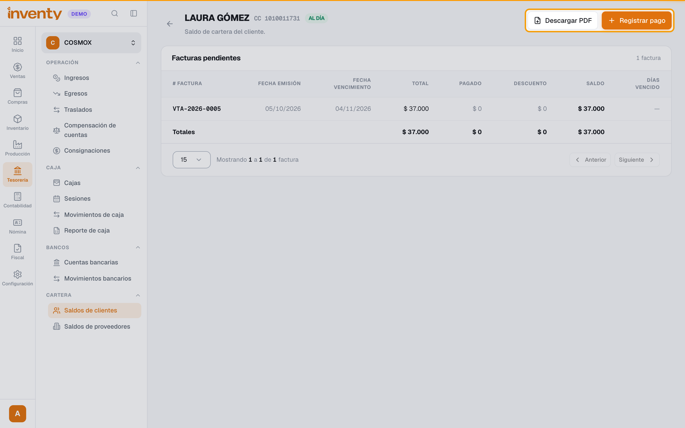

# ¿Cómo veo cuánto me deben mis clientes?

También se busca como: cartera, cuentas por cobrar, saldos de clientes, estado de cuenta, facturas vencidas, quién me debe, edades de cartera.

**Antes de empezar:** en la cartera solo aparecen las facturas de venta **a crédito** que todavía tienen saldo. Ver [¿Cómo hago una factura de venta?](../ventas/crear-factura-venta.md).

## Pasos

**Paso 1.** Ingresa a Tesorería › Cartera › Saldos de clientes.

**Paso 2.** Revisa cuánto debe cada cliente: **Total pendiente**, cuánto está **Por vencer** y cuánto lleva vencido (**1-30 dias**, **31-60 dias**, **61-90 dias**, **+90 dias**). Para encontrar un cliente, usa **Buscar cliente...** o filtra por fecha de la factura.

**Paso 3.** Haz clic en el cliente para ver su estado de cuenta. En **Facturas pendientes** ves cada factura con su **Saldo** y sus **Días vencido**. Arriba, la etiqueta dice **Vencido** o **Al día**.

**Paso 4.** Para enviarle el estado de cuenta al cliente, haz clic en **Descargar PDF**. Si el cliente ya te pagó, haz clic en **Registrar pago**.

✅ **Listo:** sabes cuánto te debe cada cliente, qué facturas están vencidas y desde cuándo.

!!! tip "Toda la cartera en Excel"
    En Tesorería › Cartera › Saldos de clientes, haz clic en **Exportar Excel**. El archivo respeta la búsqueda y las fechas que tengas filtradas.

## Si algo falla

| Problema | Solución |
|---|---|
| No veo **Cartera** en el menú. | Pide el permiso **Ver cartera de clientes**. Si tampoco ves **Tesorería**, revisa [qué módulos tienes activos](../primeros-pasos/activar-modulos.md). |
| Una factura no aparece en la cartera. | Revisa que sea **a crédito** y que esté validada. Las facturas de contado o ya pagadas no aparecen. |
| No me aparece el botón **Registrar pago**. | Pide el permiso **Gestionar ingresos**. |
| Tengo saldos de antes de usar Inventy. | Cárgalos con **Importar cartera** (requiere el permiso **Importar cartera de clientes**). |

## Relacionados

- [¿Cómo registro un pago de un cliente?](registrar-ingreso.md)
- [¿Qué es un anticipo y cómo se maneja en Inventy?](anticipos.md)
- [¿Cómo hago una compensación de cuentas?](compensacion-cuentas.md)
