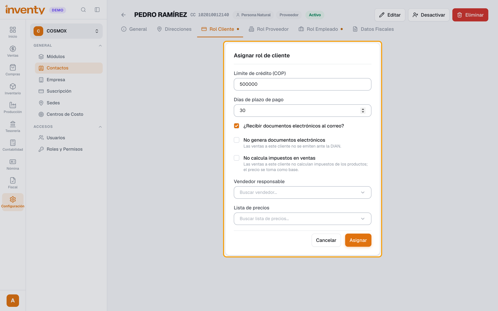
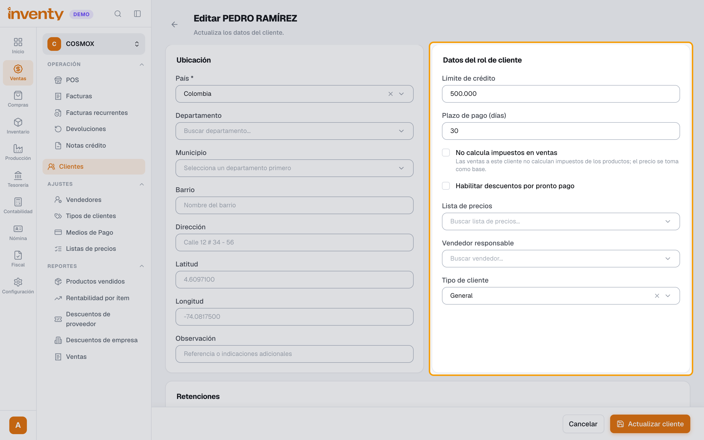
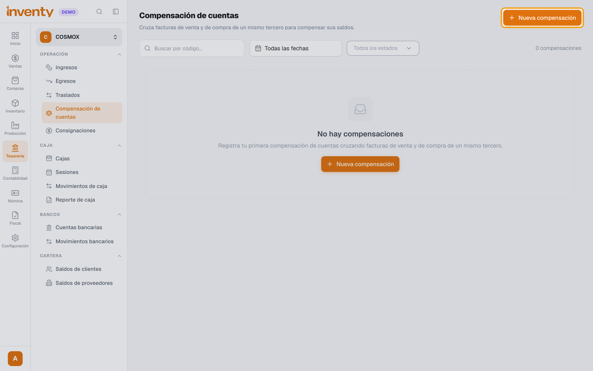
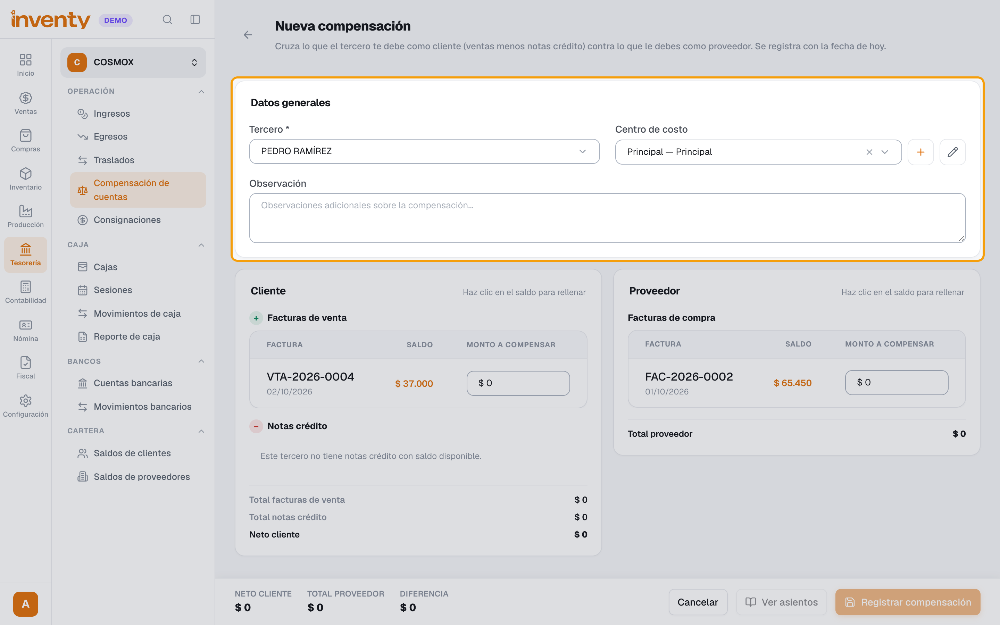
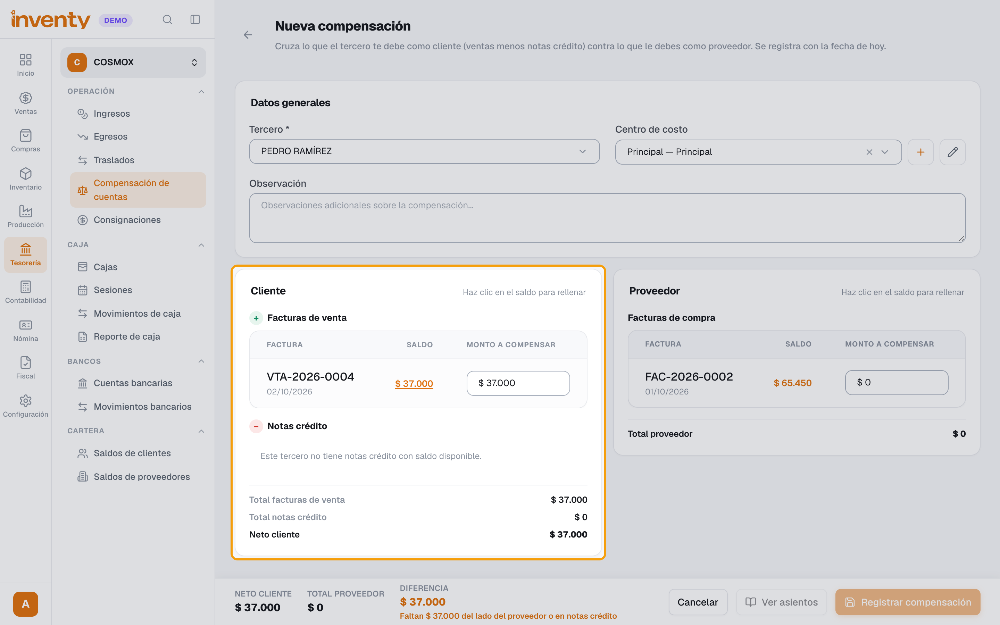
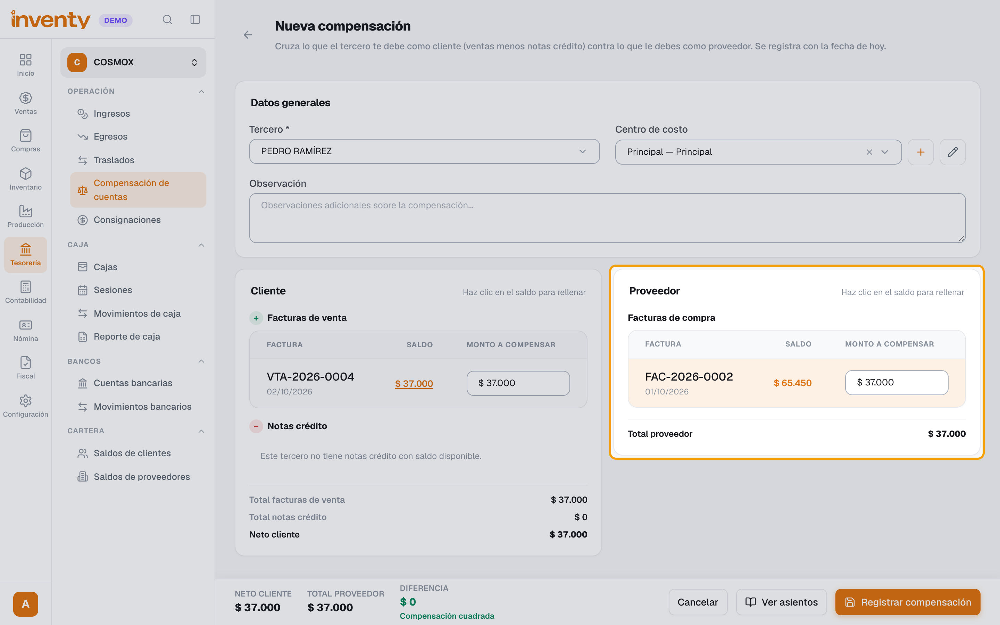
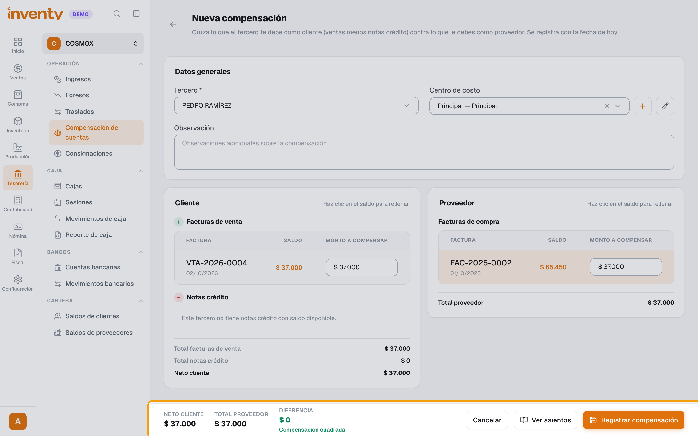
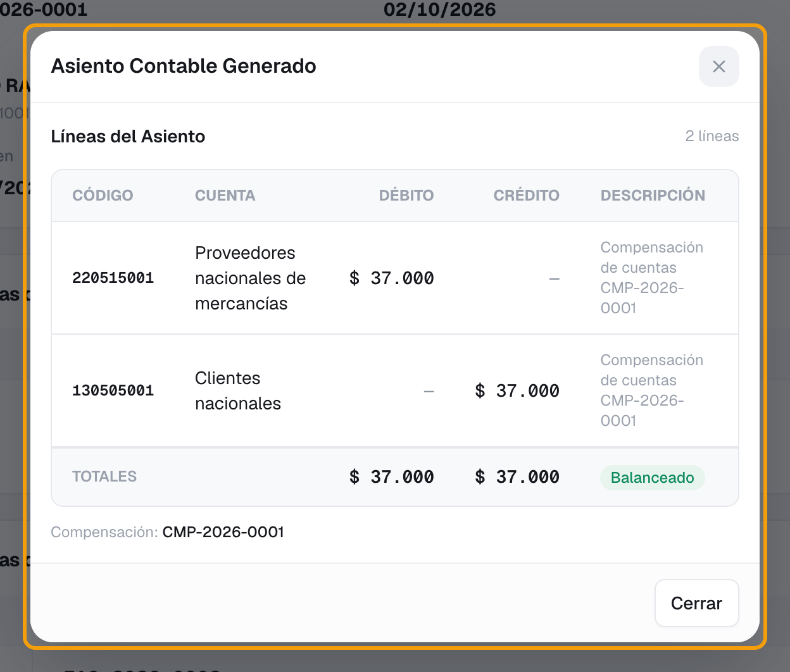

# ¿Cómo hago una compensación de cuentas?

También se busca como: compensación, cruce de cuentas, cruzar facturas, cruzar cartera, cliente que también es proveedor, compensar saldos, neteo, cruce de saldos.

**Qué es:** cuando un mismo tercero es **cliente y proveedor**, cruzas lo que él te debe (facturas de venta a crédito) contra lo que tú le debes (facturas de compra). Los dos saldos bajan y **no se mueve dinero** de caja ni de banco.

*Ejemplo:* Pedro te debe $37.000 de una venta y tú le debes $65.450 de una compra. Compensas $37.000: él queda en $0 y tú le quedas debiendo $28.450.

**Antes de empezar:** el tercero debe tener facturas pendientes de los dos lados: una venta **a crédito** validada y una compra validada. Si hoy solo es proveedor, primero hazlo cliente (pasos 1 y 2).

## Pasos

**Paso 1.** (Si solo es proveedor) En Configuración › Contactos abre el tercero, ve a la pestaña **Rol Cliente** y haz clic en **Asignar como Cliente**. Escribe el **Límite de crédito (COP)** y los **Días de plazo de pago**, y haz clic en **Asignar**.

**Paso 2.** Ponle el tipo de cliente: en Ventas › Clientes ábrelo, haz clic en **Editar**, elige el **Tipo de cliente** (ej. *General*) en **Datos del rol de cliente** y haz clic en **Actualizar cliente**. Sin esto no se le puede vender a crédito. Luego hazle la [factura de venta a crédito](../ventas/crear-factura-venta.md).

**Paso 3.** Ingresa a Tesorería › Compensación de cuentas y haz clic en **Nueva compensación**.

**Paso 4.** En **Tercero** busca la persona o empresa. Revisa el **Centro de costo** y, si quieres, escribe una **Observación**.

**Paso 5.** En **Cliente › Facturas de venta**, escribe el **Monto a compensar** de cada factura, o haz clic en su **Saldo** para usarlo completo. Si tiene **Notas crédito** con saldo, también puedes usarlas aquí.

**Paso 6.** En **Proveedor › Facturas de compra**, escribe el **Monto a compensar** de cada factura.

**Paso 7.** Abajo, **Neto cliente** y **Total proveedor** deben ser iguales: **Diferencia $ 0** y **Compensación cuadrada**. Haz clic en **Registrar compensación** y luego en **Confirmar y registrar**.

**Paso 8.** Queda **Finalizado** con número **CMP-**. Ahí ves cada factura con su **Saldo anterior**, **Monto aplicado** y **Saldo posterior**. Con **Ver asientos** ves el asiento contable y con **PDF** descargas el soporte.

✅ **Listo:** los saldos de las facturas bajaron en lo compensado, igual que si se hubieran pagado. Si usas Contabilidad, el asiento es: **débito** a la cuenta por pagar del proveedor y **crédito** a la cuenta por cobrar del cliente (más un débito a notas crédito de clientes si usaste notas crédito).

!!! info "¿Te equivocaste?"
    Abre la compensación y haz clic en **Anular**. Escribe el **motivo** (es obligatorio). Inventy reversa el asiento y les devuelve el saldo a las facturas.

## Si algo falla

| Problema | Solución |
|---|---|
| El tercero no aparece o no muestra facturas | Debe ser cliente **y** proveedor, con facturas **validadas** y saldo pendiente en los dos lados. |
| *Este tercero no tiene facturas de venta pendientes.* | Hazle primero una venta **a crédito** y valídala. |
| *Solo se pueden compensar facturas de venta a crédito.* | Las ventas de contado no tienen saldo que cruzar. |
| *Solo se pueden compensar facturas de … con estado Validado.* | Valida la factura (los borradores no se cruzan). |
| *Todas las facturas deben pertenecer al mismo tercero.* | Elige facturas de un solo tercero. |
| *La suma de las facturas de venta debe coincidir con la suma de las facturas de compra y las notas crédito…* | Ajusta los montos hasta ver **Diferencia $ 0**. |
| *El monto excede el saldo pendiente de la factura…* | No puedes cruzar más de lo que falta por pagar en esa factura. |
| *No puedes repetir la misma factura…* | Cada factura va una sola vez. |
| *Configura la cuenta contable de notas crédito de clientes en Contabilidad > Configuración antes de compensar con notas crédito.* | El contador debe configurarla en Contabilidad › Configuración. |
| Al vender a crédito: *Configura una cuenta de cuentas por cobrar en el tipo de cliente…* | Falta el paso 2. Ver la [solución](../soluciones-rapidas/ventas.md#al-validar-la-factura-a-credito-me-pide-configurar-la-cuenta-contable). |
| *No se puede anular: …* (devolución confirmada) | Una de las facturas de venta ya tuvo una devolución que reintegró el excedente; no se puede anular. Escala a soporte. |
| No aparece **Compensación de cuentas** o **Anular** | Pide los permisos **Gestionar compensaciones de cuentas** / **Anular compensación de cuentas**. |

## Relacionados

- [¿Cómo hago una factura de venta?](../ventas/crear-factura-venta.md)
- [¿Cómo registro una factura de compra?](../compras/registrar-factura-compra.md)
- [¿Cómo registro un pago de un cliente?](registrar-ingreso.md)
- [¿Cómo registro un pago a un proveedor?](registrar-egreso.md)
