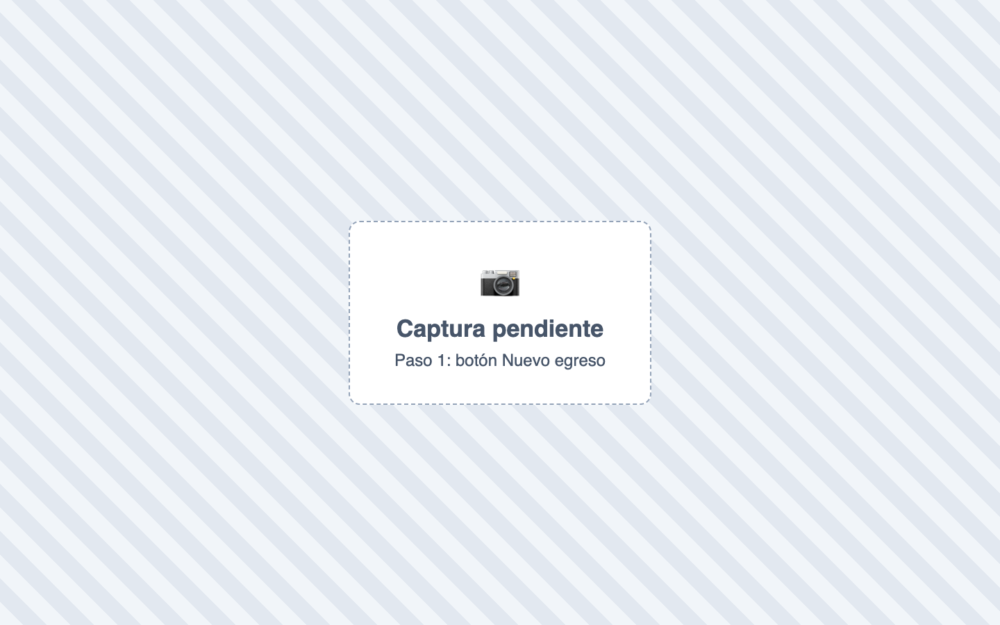
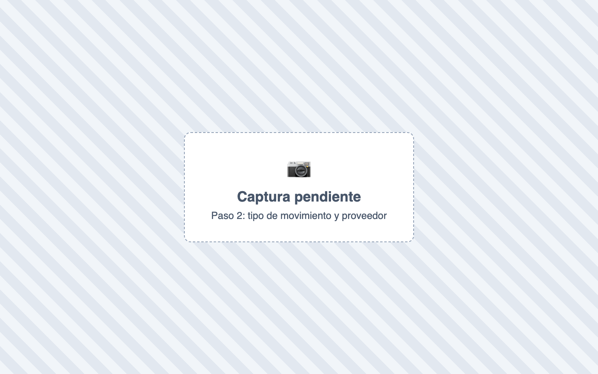
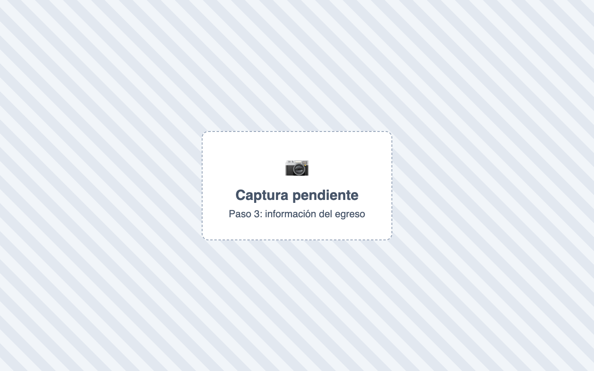
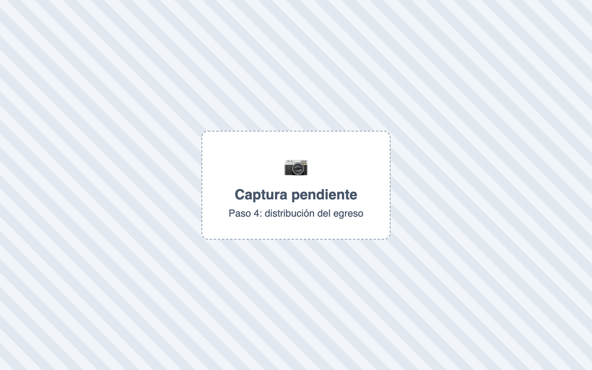
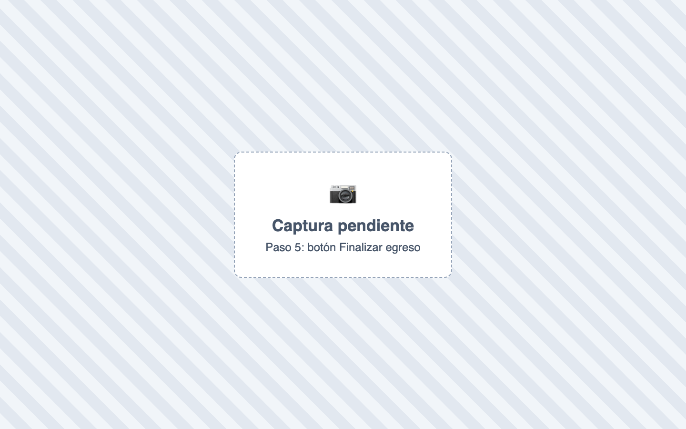

# ¿Cómo registro un pago a un proveedor?

También se busca como: egreso, pagar proveedor, comprobante de egreso, abono a proveedor, pagar factura de compra, registrar gasto.

**Antes de empezar:** la factura del proveedor debe estar registrada ([factura de compra](../compras/registrar-factura-compra.md)).

## Pasos

**Paso 1.** Ingresa a Tesorería › Egresos y haz clic en **Nuevo egreso**.

**Paso 2.** Elige **Tipo de movimiento**: **Pago a proveedor**, y el **Proveedor**.

**Paso 3.** Completa **Centro de costo**, **Fecha del pago**, **Fuente del pago** (caja o banco) y **Egreso Total**.

**Paso 4.** En **Distribución del egreso**, asigna el valor a las facturas que pagas hasta que **Por distribuir** quede en cero.

**Paso 5.** Haz clic en **Finalizar egreso** y confirma.

✅ **Listo:** baja lo que le debes al proveedor y el dinero sale de la caja o banco.

## Si algo falla

| Problema | Solución |
|---|---|
| *No hay destinos disponibles…* | Necesitas una caja abierta o una cuenta bancaria. |
| *La suma de las asignaciones debe ser igual al valor total* | Ajusta hasta que **Por distribuir** quede en cero. |
| Quiero borrar un egreso | Solo se eliminan los que están en **borrador**. |

## Relacionados

- [¿Qué es un anticipo y cómo se maneja?](anticipos.md)
- [¿Cómo registro una factura de compra?](../compras/registrar-factura-compra.md)
