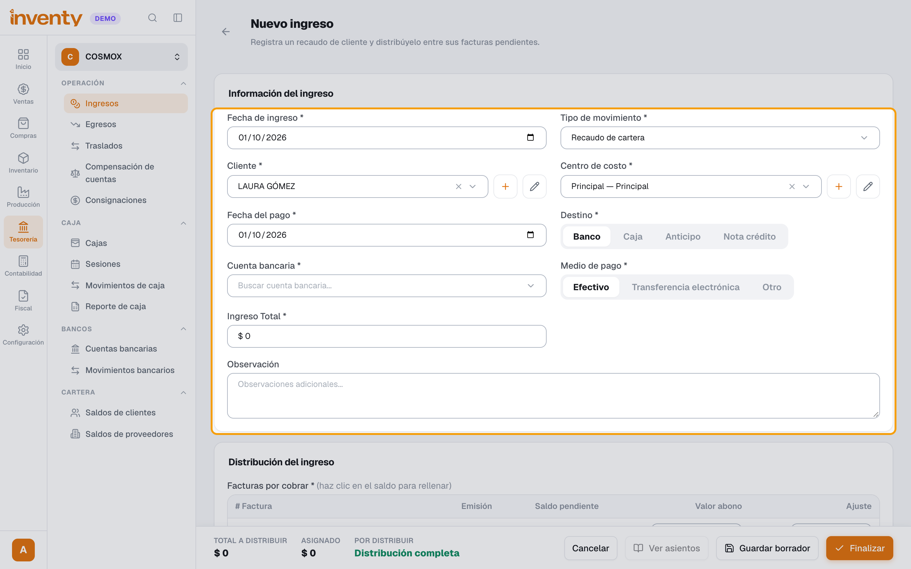
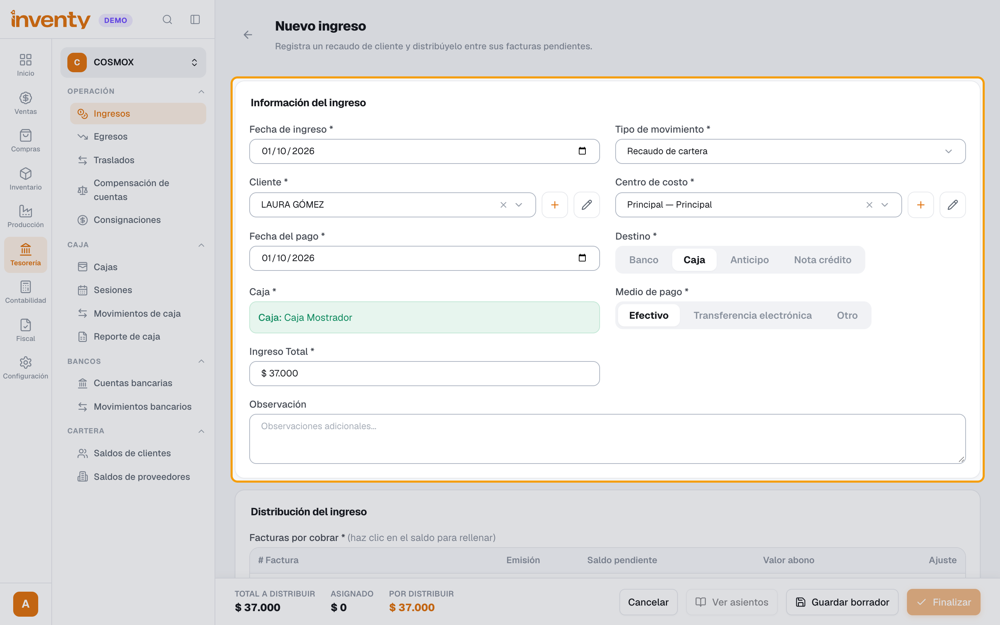
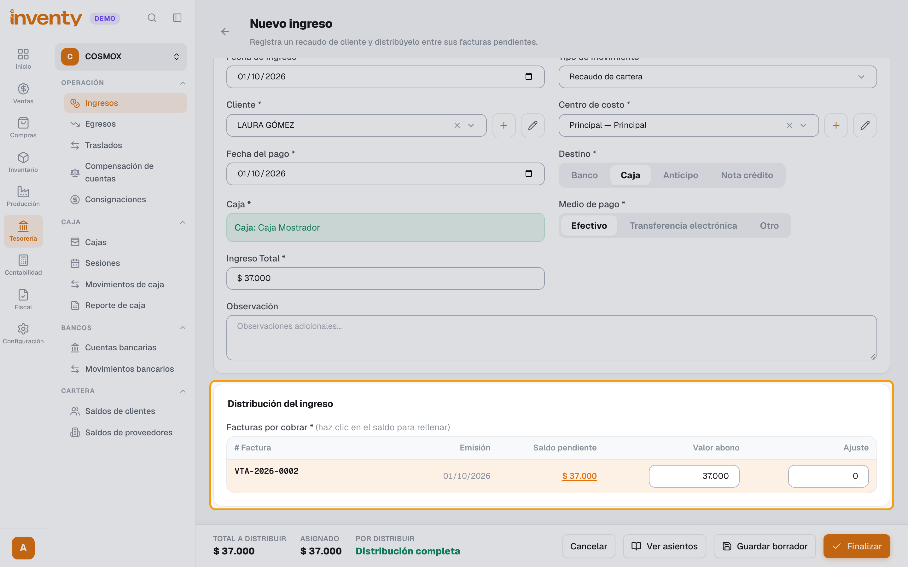
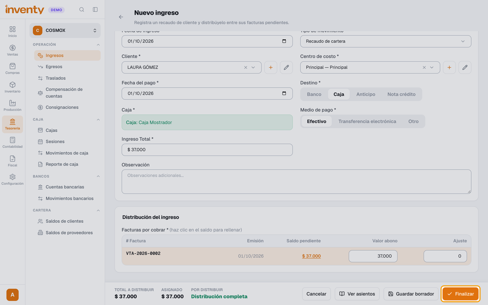

# ¿Cómo registro un pago de un cliente?

También se busca como: recaudo, abono, cliente pagó, recibo de caja, cobrar cartera, pago de factura a crédito.

**Antes de empezar:** necesitas una caja abierta o una cuenta bancaria donde entra el dinero.

## Pasos

**Paso 1.** Ingresa a Tesorería › Ingresos y haz clic en **Nuevo ingreso**.

**Paso 2.** Elige **Tipo de movimiento**: **Recaudo de cartera**, y el **Cliente**.

**Paso 3.** Completa **Centro de costo**, **Fecha del pago**, **Destino** (**Banco**, **Caja**, **Anticipo** o **Nota crédito**; con *Caja* se usa tu caja abierta), **Medio de pago** e **Ingreso Total**.

**Paso 4.** En **Distribución del ingreso**, haz clic en el **Saldo pendiente** de cada factura que paga: se llena su **Valor abono**. Sigue hasta que **Por distribuir** diga **Distribución completa**.

**Paso 5.** Haz clic en **Finalizar ingreso** y confirma.

✅ **Listo:** las facturas bajan su saldo (o quedan **Pagadas**) y el dinero entra a la caja o banco.

## Si algo falla

| Problema | Solución |
|---|---|
| *No hay destinos disponibles: habilita el módulo bancario o abre una caja.* | [Abre una caja](../pos/abrir-caja.md) o crea una cuenta bancaria. |
| *La suma de las asignaciones debe ser igual al valor total* | Ajusta hasta que **Por distribuir** quede en cero. |
| *Ingresa el valor de abono para la factura con retención antes de finalizar* | Escribe cuánto abona a esa factura. |

## Relacionados

- [¿Qué es un anticipo y cómo se maneja?](anticipos.md)
- [¿Cómo hago una factura de venta?](../ventas/crear-factura-venta.md)
