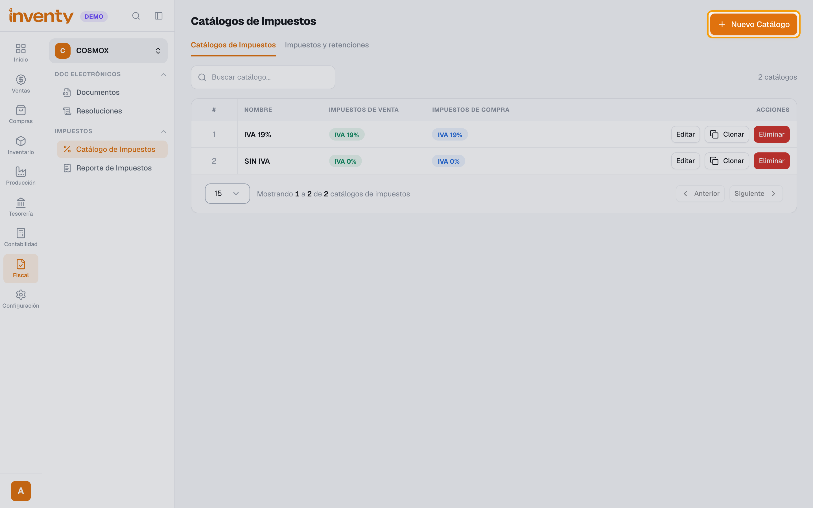
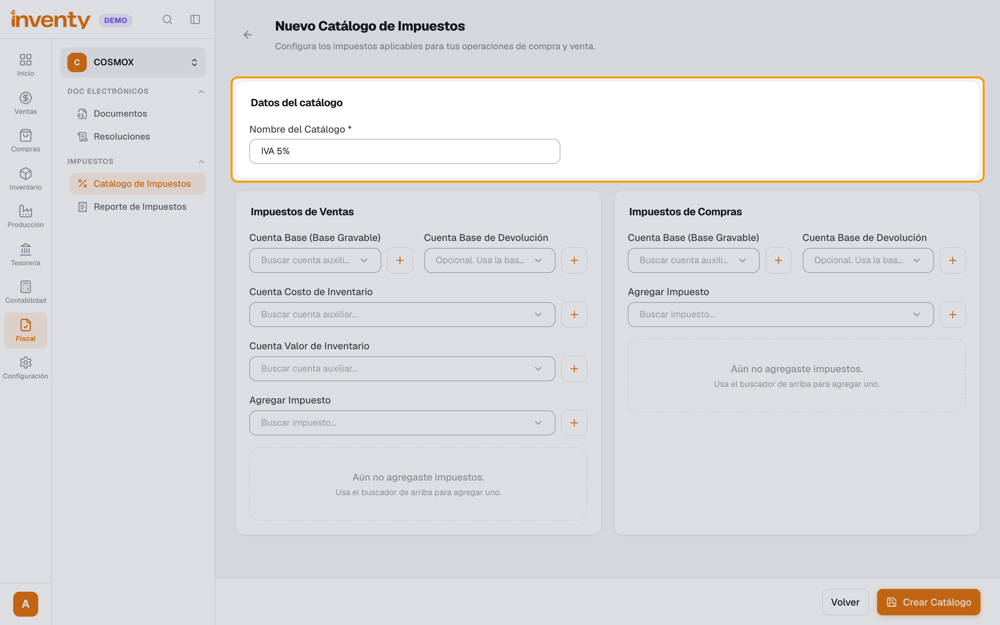
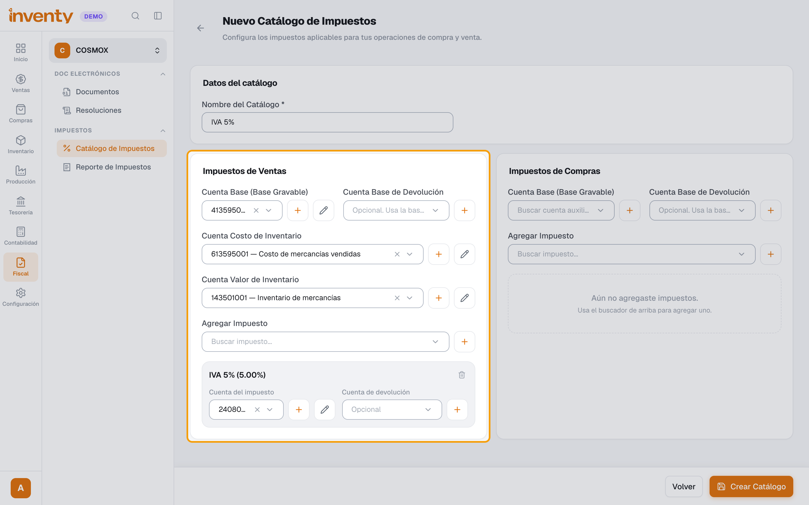
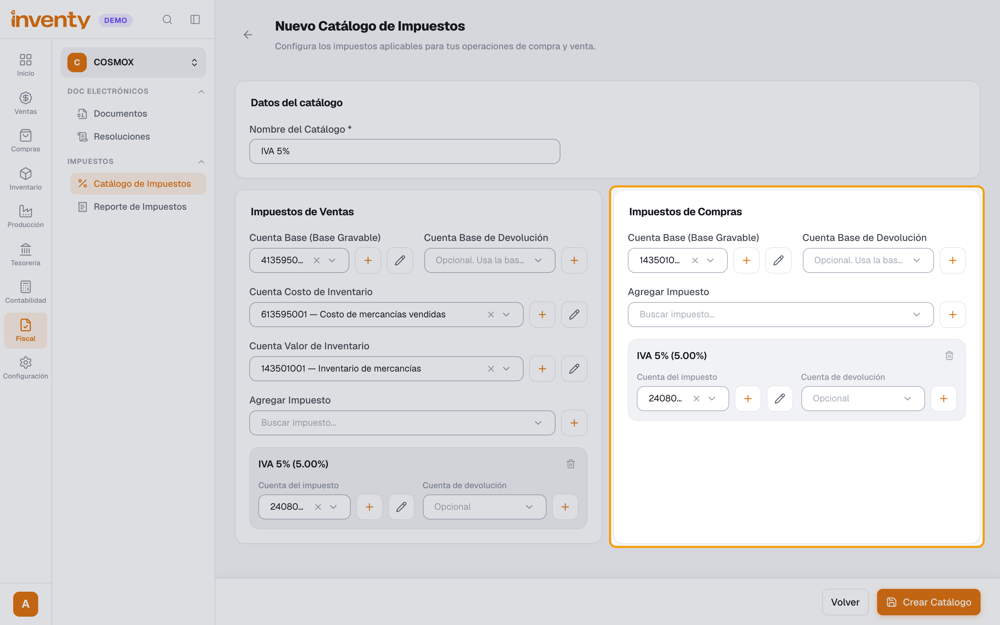
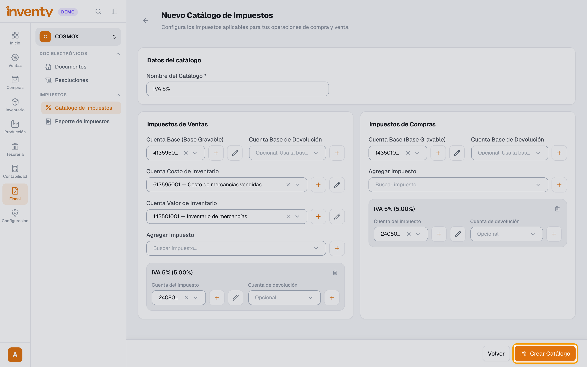
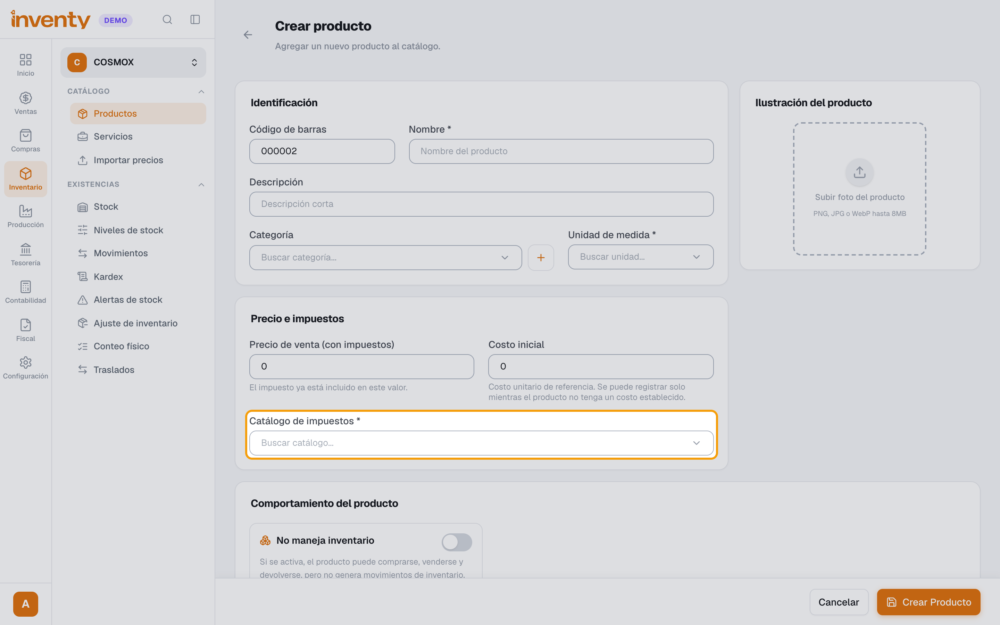

# ¿Qué es y cómo creo un catálogo de impuestos?

También se busca como: catálogo de impuestos, grupo de impuestos, impuestos del producto, configurar IVA del producto, régimen, cuentas de impuestos.

**Qué es:** un **paquete de impuestos** que se asigna a un producto: qué se cobra al venderlo y qué se paga al comprarlo.

**Antes de empezar:** crea antes los impuestos que vas a usar ([guía](crear-impuesto.md)).

## Pasos

**Paso 1.** Ingresa a Fiscal › Catálogo de Impuestos y haz clic en **Nuevo Catálogo**.

**Paso 2.** Escribe el **Nombre del Catálogo** (ej. *IVA 5%*).

**Paso 3.** En **Impuestos de Ventas**, elige la **Cuenta Base**, la **Cuenta Costo de Inventario** y la **Cuenta Valor de Inventario**. En **Agregar Impuesto** elige el impuesto (ej. *IVA 5%*) y su **Cuenta del impuesto**. Si la cuenta no existe, créala con el botón **+** de al lado.

**Paso 4.** En **Impuestos de Compras**, elige la **Cuenta Base**, agrega el mismo impuesto y su **Cuenta del impuesto** (la de IVA descontable).

**Paso 5.** Haz clic en **Crear Catálogo**.

**Paso 6.** Asígnalo a cada producto: Inventario › Productos › producto › **Catálogo de impuestos**.

✅ **Listo:** al vender o comprar ese producto, Inventy calcula sus impuestos solo.

## Si algo falla

| Problema | Solución |
|---|---|
| Aparece **Configuración contable incompleta** / **Cuentas por configurar** | Falta una cuenta contable en el catálogo: complétala con tu contador. |
| *El asiento contable no está balanceado* al facturar | El catálogo del producto tiene cuentas vacías. |
| El producto no cobra IVA | Revisa que el catálogo tenga el IVA en **Impuestos de Ventas**. |
| *La cuenta ya está asignada al impuesto IVA 19% … con un porcentaje diferente…* | Cada tarifa de IVA necesita su propia cuenta. Crea una nueva con el botón **+** (ej. *IVA generado 5%* bajo la cuenta padre *240801*). |
| Quiero uno igual a otro catálogo | En la lista usa **Clonar** y cambia solo el nombre y los impuestos. |
| ¿Cuántos catálogos creo? | Uno por cada combinación de impuestos (gravado 19 %, 5 %, excluido…). |

## Relacionados

- [¿Cómo creo un impuesto o una retención?](crear-impuesto.md)
- [¿Cómo creo un producto?](../productos-inventario/crear-producto.md)
