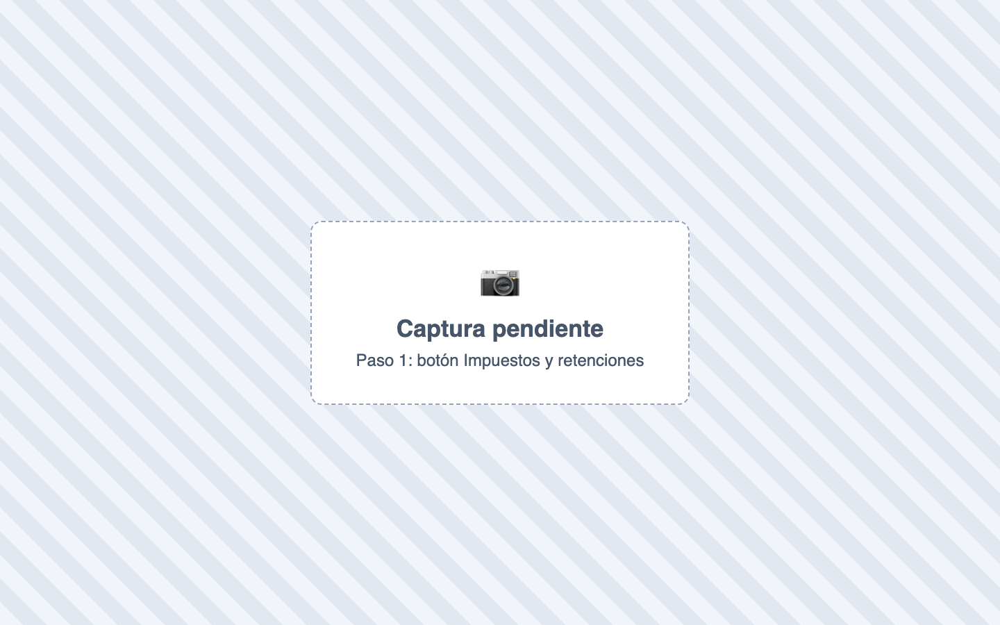
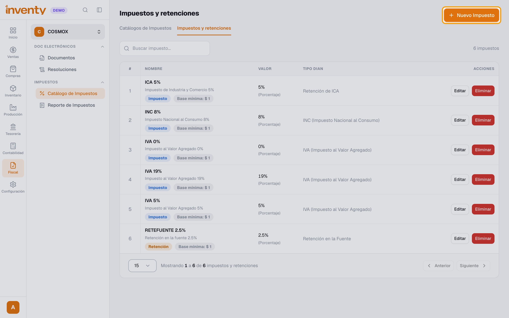
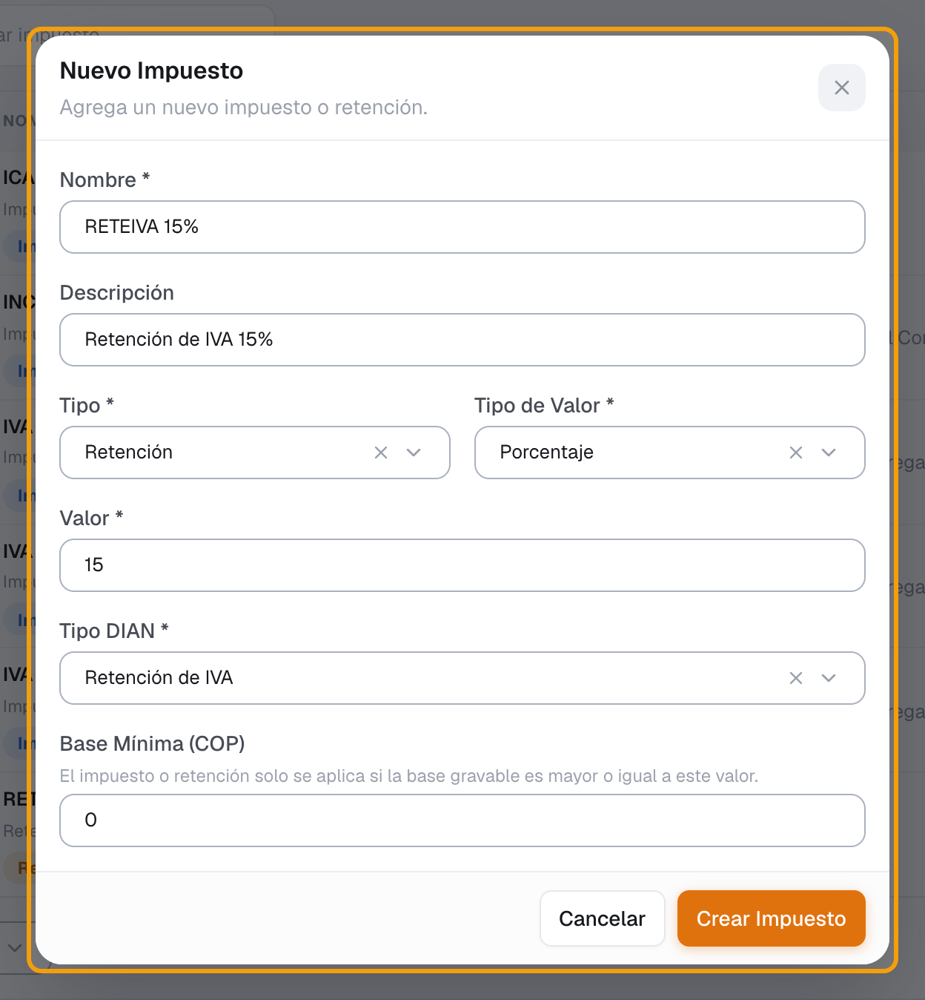
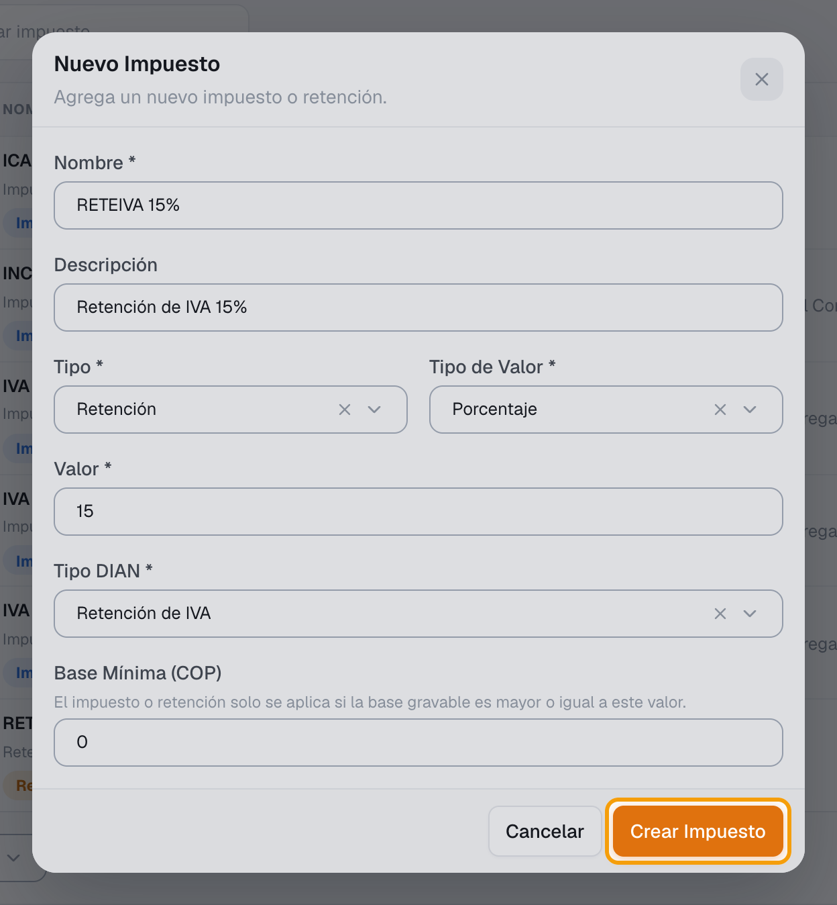

# ¿Cómo creo un impuesto o una retención?

También se busca como: crear IVA, crear retención, retefuente, reteiva, reteica, impuesto al consumo, INC, tarifa de impuesto, nuevo impuesto.

**Qué es:** la tarifa individual, por ejemplo *IVA 19 %* o *Retefuente 2,5 %*.

## Pasos

**Paso 1.** Ingresa a Fiscal › Catálogo de Impuestos y haz clic en **Impuestos y retenciones**.

**Paso 2.** Haz clic en **Nuevo Impuesto**.

**Paso 3.** Escribe el **Nombre** (ej. *RETEIVA 15%*). Elige **Tipo** (**Impuesto** o **Retención**) y **Tipo de Valor** (ej. **Porcentaje**), escribe el **Valor** y elige el **Tipo DIAN** (ej. *Retención de IVA*). Si aplica, escribe la **Base Mínima (COP)**.

**Paso 4.** Haz clic en **Crear Impuesto**.

✅ **Listo:** el impuesto ya se puede agregar a un [catálogo](catalogo-impuestos.md).

## Si algo falla

| Problema | Solución |
|---|---|
| Me equivoqué en el porcentaje | Tipo, valor y tipo DIAN no se editan: crea uno nuevo y cámbialo en el catálogo. |
| La retención no se aplica en facturas pequeñas | Revisa la **Base Mínima**. |

## Relacionados

- [¿Qué es y cómo creo un catálogo de impuestos?](catalogo-impuestos.md)
- [¿Cómo se aplican las retenciones?](retenciones.md)
