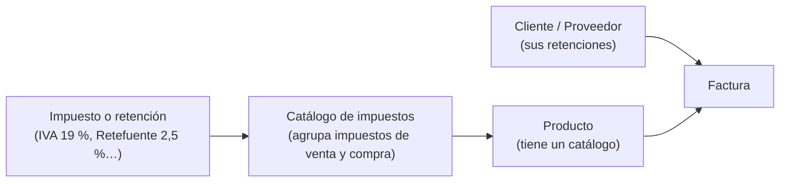

# Impuestos y retenciones

Fiscal › Impuestos › Catálogo de Impuestos

Cómo encajan las piezas, en 3 niveles:

| Quiero… | Guía |
|---|---|
| Crear un impuesto o una retención | [¿Cómo creo un impuesto o una retención?](crear-impuesto.md) |
| Crear un catálogo de impuestos | [¿Cómo creo un catálogo de impuestos?](catalogo-impuestos.md) |
| Entender cómo se aplican las retenciones | [¿Cómo se aplican las retenciones?](retenciones.md) |
| Saber qué es cada término | [Glosario](../glosario.md) |

Orden recomendado para configurar: **1.** impuestos y retenciones → **2.** catálogos → **3.** asignar el catálogo a cada producto → **4.** retenciones en clientes y proveedores.
