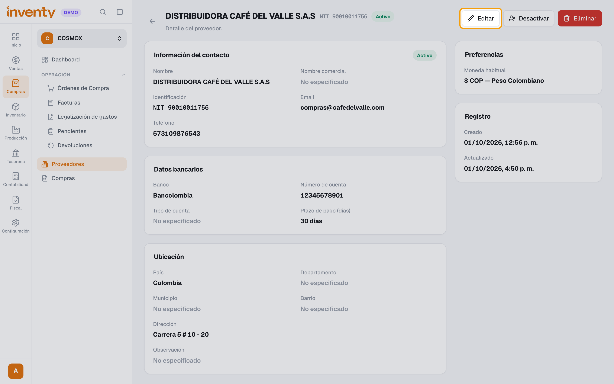
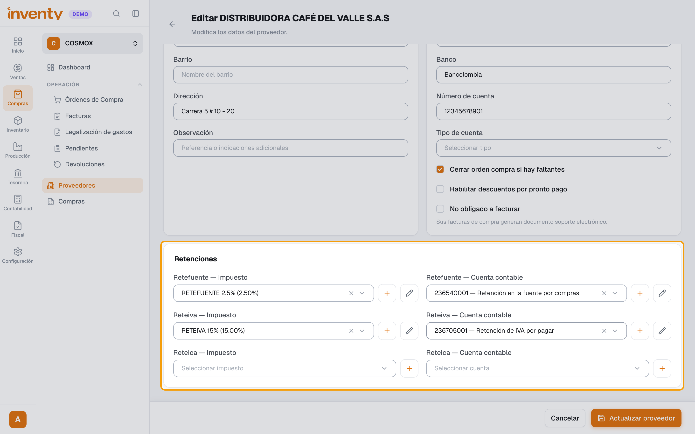
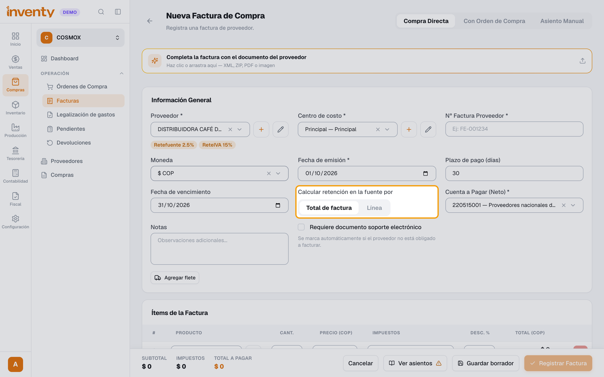
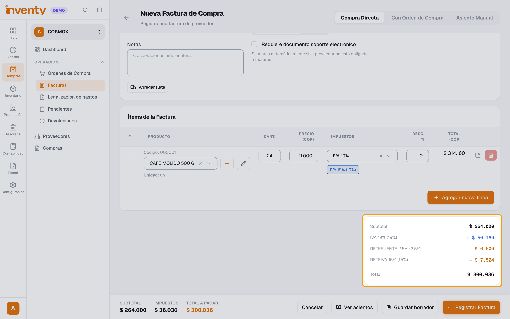

# ¿Cómo se aplican las retenciones?

También se busca como: retención en la fuente, retefuente, reteiva, reteica, me retienen, retener a proveedor, autorretenedor, base mínima retención, retención por línea.

**Qué es:** parte del pago que no se entrega al tercero, sino que se retiene para pagarla a la DIAN o al municipio. En compras tú retienes al proveedor; en ventas el cliente te retiene a ti.

**Antes de empezar:** crea las retenciones como impuestos de tipo **Retención** ([guía](crear-impuesto.md)).

## Pasos

**Paso 1.** Abre el proveedor (Compras › Proveedores) o el cliente (Ventas › Clientes) y haz clic en **Editar**.

**Paso 2.** En **Retenciones**, elige el impuesto de **Retefuente**, **Reteiva** y/o **Reteica**, cada uno con su **Cuenta contable** (ej. *236540001 Retención en la fuente por compras*). Haz clic en **Actualizar proveedor** (o **Actualizar cliente**).

**Paso 3.** Al hacer una factura de ese tercero, las retenciones aparecen debajo de su nombre. En **Calcular retención en la fuente por**, deja **Total de factura** (usa la Retefuente del tercero) o elige **Línea** (usa la del catálogo de cada producto).

**Paso 4.** Agrega los productos. El resumen muestra cada retención restada y el **Total** ya neto.

✅ **Listo:** Inventy calcula las retenciones solo en cada factura de ese tercero.

## Si algo falla

| Problema | Solución |
|---|---|
| No se aplicó la retención | ¿El tercero la tiene configurada? ¿La base supera la **Base Mínima**? ¿Está bien elegido **Línea / Total de factura**? |
| Al cobrar una factura con retención pide un valor | Escribe cuánto abona el cliente a esa factura. |
| No sé qué porcentaje usar | Lo define tu contador según la norma vigente. |

## Relacionados

- [¿Cómo creo un impuesto o una retención?](crear-impuesto.md)
- [¿Qué es y cómo creo un catálogo de impuestos?](catalogo-impuestos.md)
