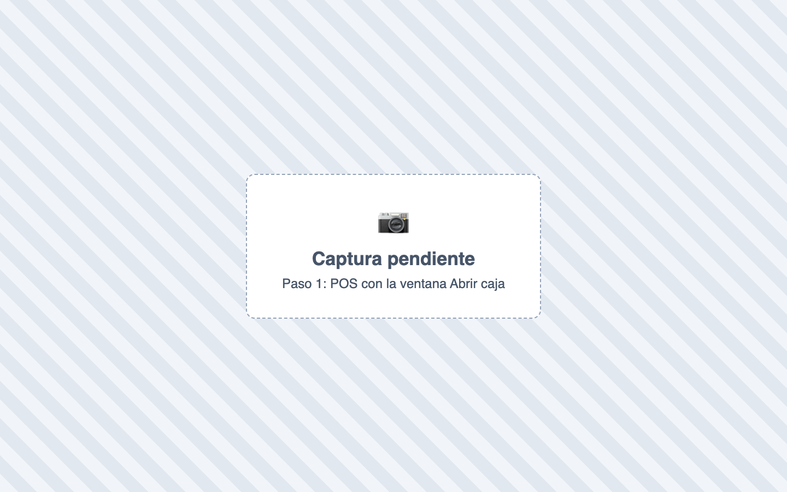
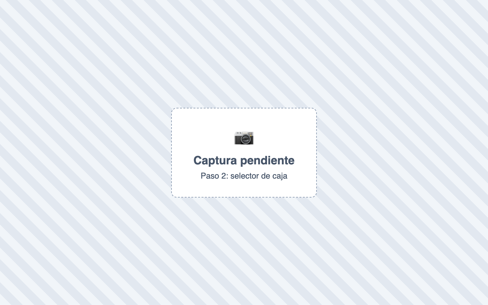
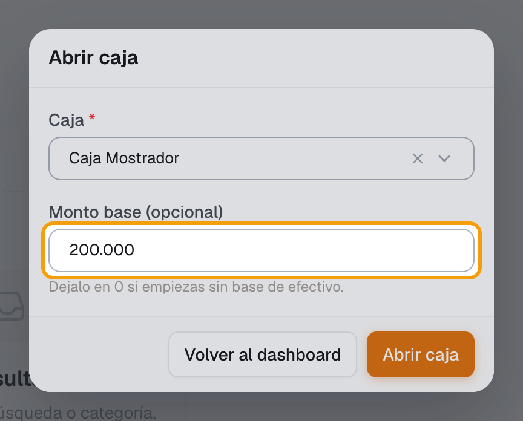
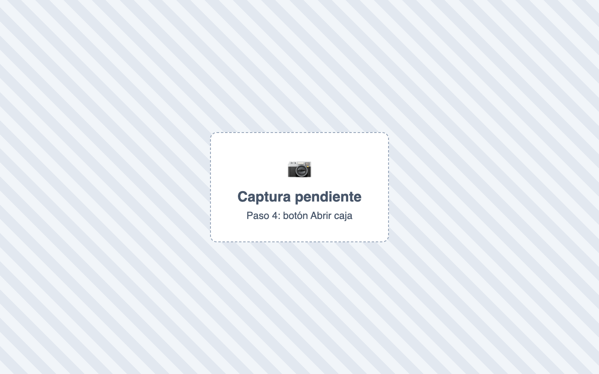

# ¿Cómo abro la caja?

También se busca como: apertura de caja, iniciar turno, abrir turno, base de caja, sencillo, abrir sesión de caja.

**Antes de empezar:** debe existir al menos una caja en Tesorería › Caja › Cajas. Cuenta el efectivo con el que empiezas.

## Pasos

**Paso 1.** Ingresa a Ventas › POS. Si no tienes caja abierta, se abre sola la ventana **Abrir caja** (también está el botón **Abrir caja** en la barra superior).

**Paso 2.** En **Selecciona una caja**, elige tu caja.

**Paso 3.** En **Monto base**, escribe el efectivo con el que empiezas. Si no tienes base, deja **0**.

**Paso 4.** Haz clic en **Abrir caja**.

✅ **Listo:** aparece *“Caja abierta exitosamente.”* y ya puedes [vender](vender-en-pos.md).

## Si algo falla

| Problema | Solución |
|---|---|
| *No hay cajas disponibles para abrir en este momento.* | No hay cajas creadas o todas están abiertas. Usa **Crear caja** o pide que cierren la sesión abierta. |
| *No tienes permiso para abrir una caja.* | Pide el permiso al administrador. |
| El monto base aparece ya escrito | Es lo que dejó el cierre anterior. Verifica que coincida con el efectivo del cajón. |
| *Debes abrir una caja antes de registrar una venta.* | Abre la caja con estos pasos. |
| *Esta caja ya tiene una sesión abierta.* | Otra persona tiene abierta esa caja. Que la cierre quien la abrió, o elige otra caja. |
| *Ya tienes una sesión de caja abierta…* | Solo puedes tener una caja abierta a la vez. Cierra la que tienes. |
| *La caja no pertenece a la sede activa.* | Solo se abren cajas de **tu sede**. Revisa la sede asignada a tu usuario en Configuración › Usuarios. |
| No aparece la caja que quiero (ej. *Caja principal*) | Es de otra sede, está inactiva o ya está abierta por otra persona. |

## Relacionados

- [¿Cómo vendo en el POS?](vender-en-pos.md)
- [¿Cómo cierro la caja?](cierre-de-caja.md)
