# ¿Cómo cierro la caja?

También se busca como: cierre de caja, cuadre de caja, arqueo, cerrar turno, cuadrar caja, entregar caja, faltante, sobrante, descuadre, consignar excedente, consignar al cerrar, llevar plata al banco, caja fuerte.

**Antes de empezar:** cuenta el efectivo del cajón (billetes y monedas). Si vas a **consignar el excedente**, la cuenta bancaria o la caja fuerte donde se guardará el dinero debe estar creada antes (mira [Consignar el excedente al cerrar](#consignar-el-excedente-al-cerrar)).

## Pasos

**Paso 1.** En el POS, haz clic en **Cerrar caja** en la barra superior.

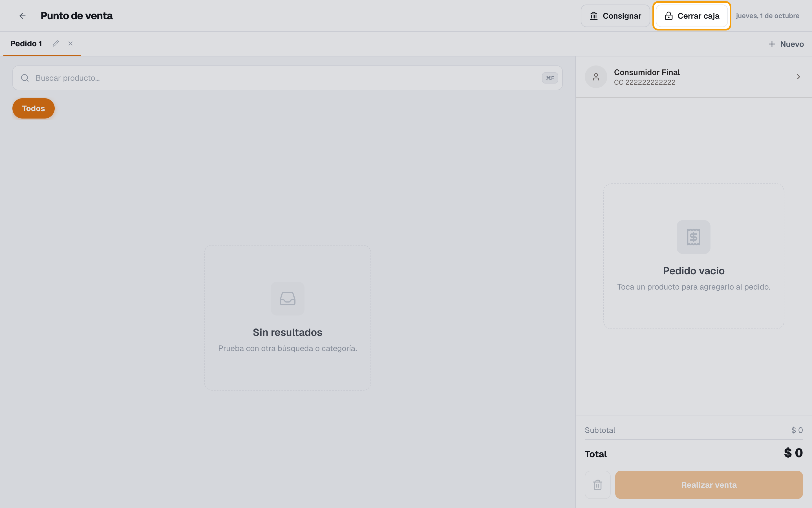

**Paso 2.** Revisa el **Resumen del arqueo** (hora de apertura y monto base).

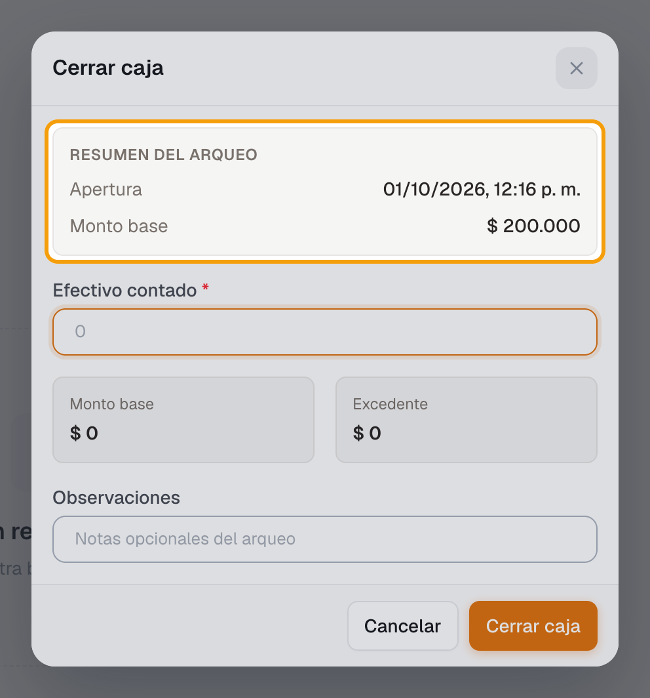

**Paso 3.** En **Efectivo contado**, escribe el total que contaste.

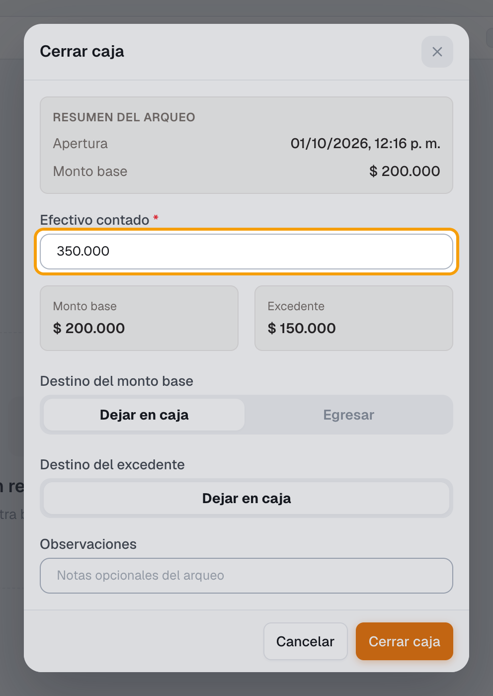

**Paso 4.** Elige el **Destino del monto base** (**Dejar en caja** o **Egresar**) y el **Destino del excedente** (**Dejar en caja** o **Consignar** a una **Cuenta bancaria**).

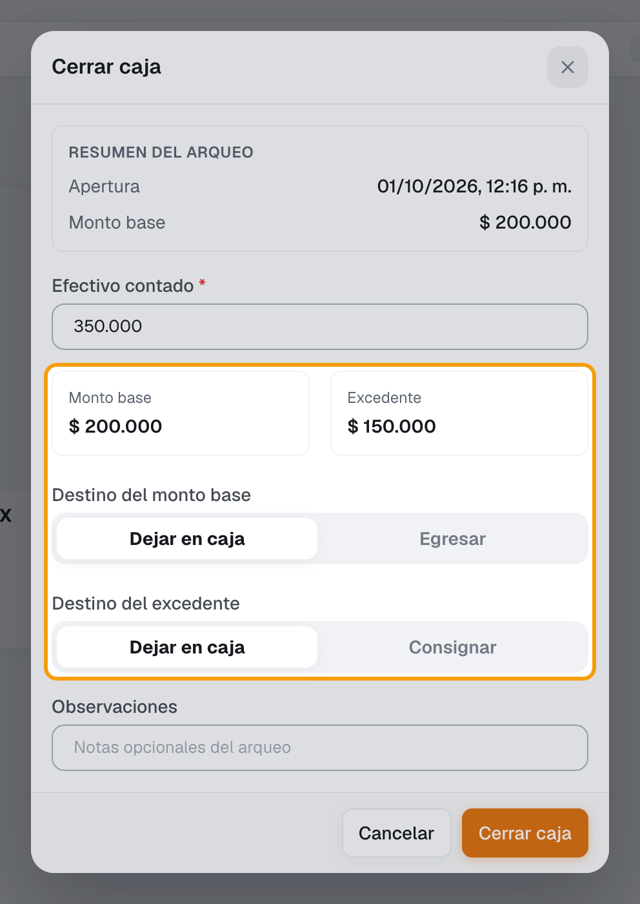

**Paso 5.** Si quieres, escribe **Observaciones** y haz clic en **Cerrar caja**.

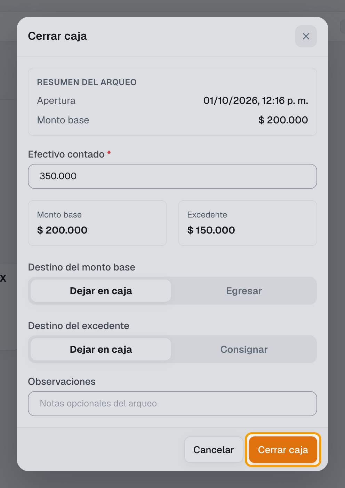

**Paso 6.** En **Confirmar cierre de caja**, lee el mensaje y haz clic en **Confirmar cierre**. Si dice que el monto es muy distinto al esperado, vuelve a escribir el monto y el **Motivo**.

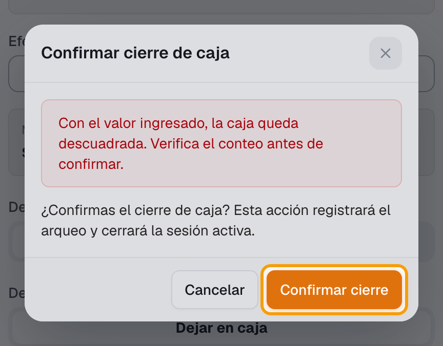

✅ **Listo:** la caja queda **Cerrada**. El comprobante se imprime desde Tesorería › Caja › Sesiones › **Imprimir cierre**.

## Consignar el excedente al cerrar

**Qué es:** el **excedente** es el efectivo que contaste por encima del **monto base**. Al **consignarlo**, ese dinero sale de la caja y entra a una cuenta bancaria o a la caja fuerte. Así el siguiente turno empieza solo con la base.

¿Necesitas sacar efectivo **sin cerrar** la caja (por ejemplo, porque llegaste al monto máximo)? Usa **Registrar consignación** en el POS: mira [Dice que llegué al monto máximo de la caja](../soluciones-rapidas/pos-caja.md#dice-que-llegue-al-monto-maximo-de-la-caja).

*Ejemplo:* abriste la caja con $100.000 y al cerrar contaste $450.000. El **Monto base** es $100.000 y el **Excedente** es $350.000. Si consignas el excedente, en la caja quedan $100.000 (o $0 si también eliges **Egresar** para el monto base).

**Antes de empezar:** el módulo **Tesorería** debe estar activo y debe existir el lugar a donde irá el dinero: una **cuenta bancaria** o una **caja fuerte**. Las dos se crean igual, en **Cuentas bancarias**, y la caja fuerte se distingue por su **Alias**. Créala una sola vez; después aparece en todos los cierres.

**Paso 1.** (Una sola vez) Ingresa a Tesorería › Cuentas bancarias y haz clic en **Nueva cuenta**. Elige el **Banco** y escribe el **Número de cuenta** y el **Saldo inicial**. En **Alias** ponle un nombre fácil de reconocer: por ejemplo, *Caja fuerte* si el dinero se guarda en el negocio o *Cuenta principal Bancolombia* si va al banco. En **Tipo de cuenta** elige **Ahorros** o **Corriente** y deja el **Estado** en **Activa**. Si usas Contabilidad, elige la **Cuenta contable** (ej. *110505001 — Caja general* para la caja fuerte); sin ella la consignación se hace, pero no se registra el asiento contable. Haz clic en **Crear cuenta** y luego en **Confirmar y crear**.

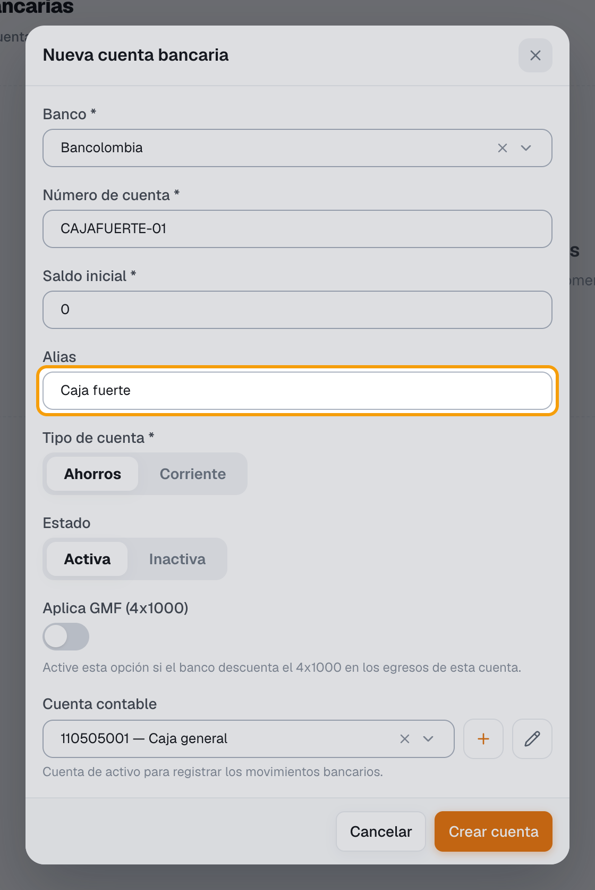

**Paso 2.** En el POS, haz clic en **Cerrar caja** y escribe el **Efectivo contado** (pasos 1 a 3 de arriba). Arriba verás cuánto es el **Monto base** y cuánto es el **Excedente**.

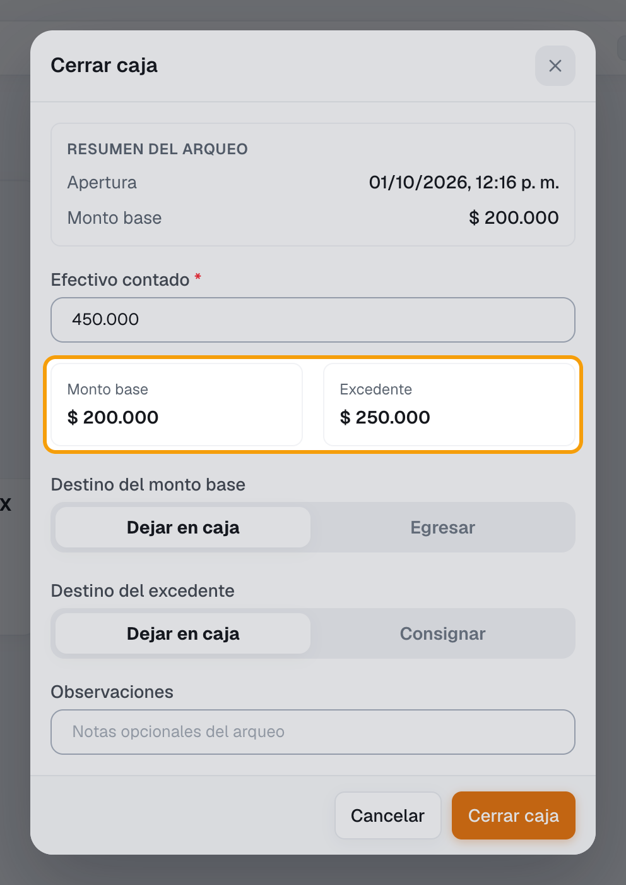

**Paso 3.** En **Destino del excedente**, elige **Consignar**.

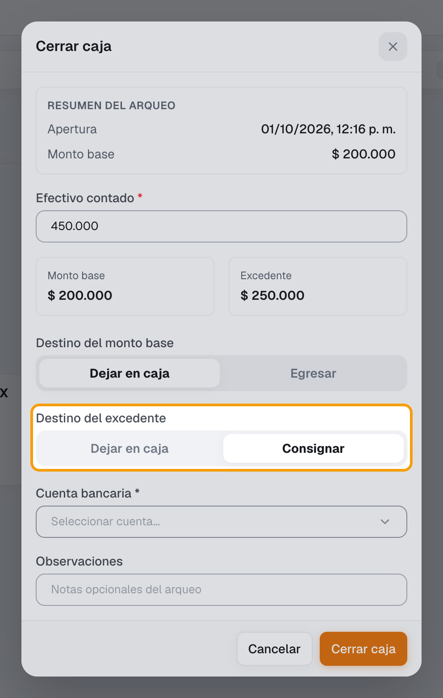

**Paso 4.** En **Cuenta bancaria**, elige a dónde va el dinero. Cada opción muestra primero el alias, por ejemplo *Caja fuerte · Bancolombia · 001-123456-00*.

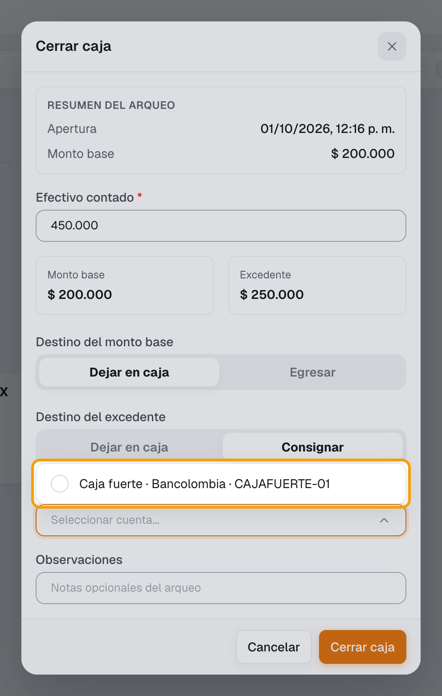

**Paso 5.** Haz clic en **Cerrar caja** y luego en **Confirmar cierre** (pasos 5 y 6 de arriba).

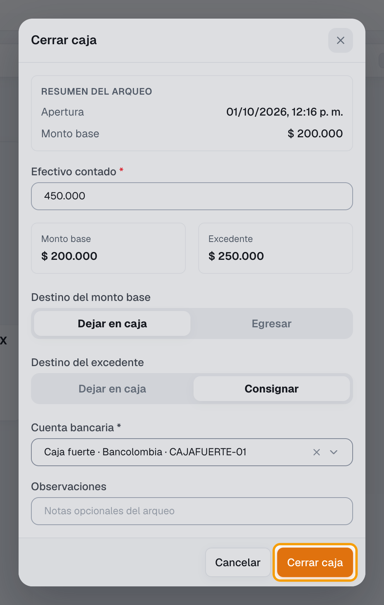

✅ **Listo:** el excedente sale de la caja y suma al saldo de la cuenta o de la caja fuerte que elegiste. La consignación aparece en Tesorería › Consignaciones como **Vigente**, con la descripción *Cierre de caja (nombre de la caja) - (sede)*.

## Si algo falla

| Problema | Solución |
|---|---|
| *La caja queda descuadrada* | Vuelve a contar. Revisa pagos con tarjeta registrados como efectivo. Si es real, cierra y explícalo en **Observaciones**. |
| *El monto contado es muy distinto al esperado…* | Revisa que no sobre o falte un cero. Si es correcto, reescribe el monto y el motivo. |
| *El monto no coincide con el valor contado.* | El monto reescrito debe ser idéntico al primero. |
| No aparece **Consignar** | El módulo **Tesorería** no está activo o no hay ninguna cuenta bancaria **Activa**. Créala en Tesorería › Cuentas bancarias (paso 1 de [Consignar el excedente al cerrar](#consignar-el-excedente-al-cerrar)). |
| No aparece **Destino del excedente** | No hay excedente: contaste lo mismo o menos que el monto base. |
| *Debes seleccionar una cuenta bancaria para consignar el efectivo del cierre.* | Elige la cuenta en **Cuenta bancaria** antes de cerrar. |
| Cerré con un valor equivocado | Un supervisor usa **Corregir arqueo** o **Reabrir cierre** en Tesorería › Caja › Sesiones. |
| *No tienes permiso para imprimir este cierre.* | Pide el permiso al administrador. |

## Relacionados

- [¿Cómo abro la caja?](abrir-caja.md)
- [¿Cómo vendo en el POS?](vender-en-pos.md)
