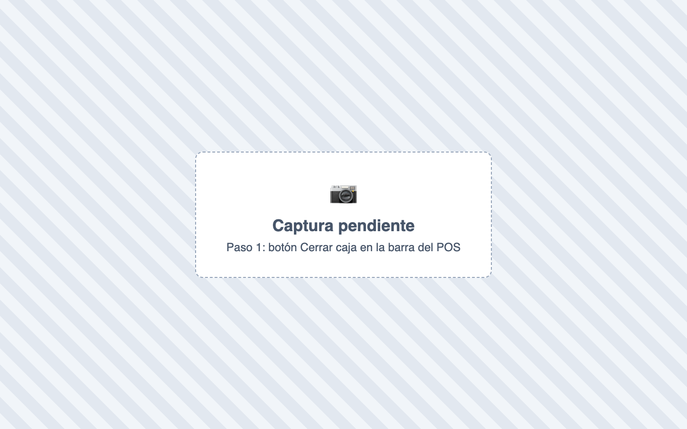
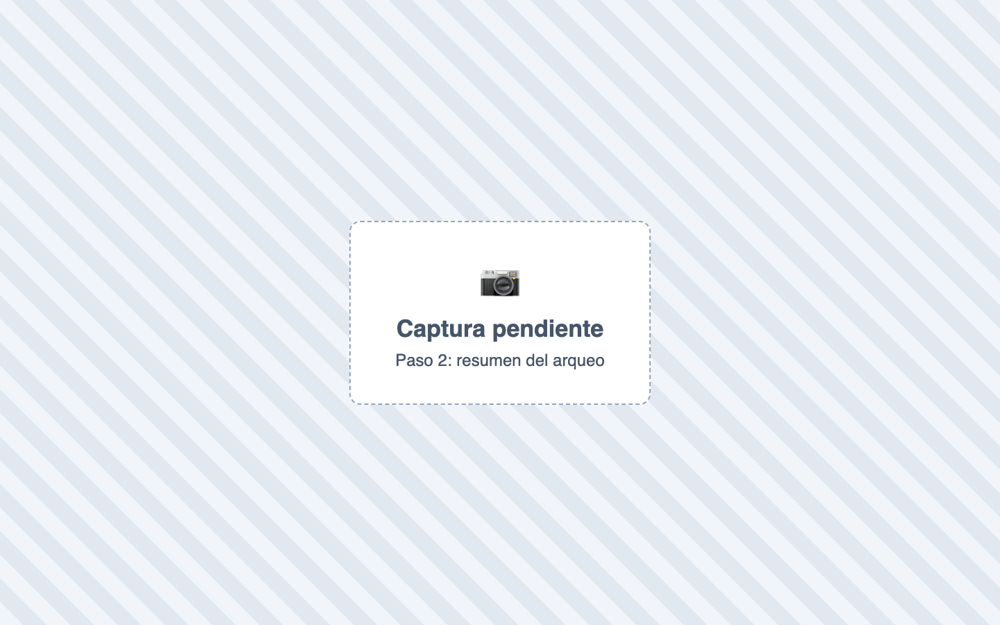
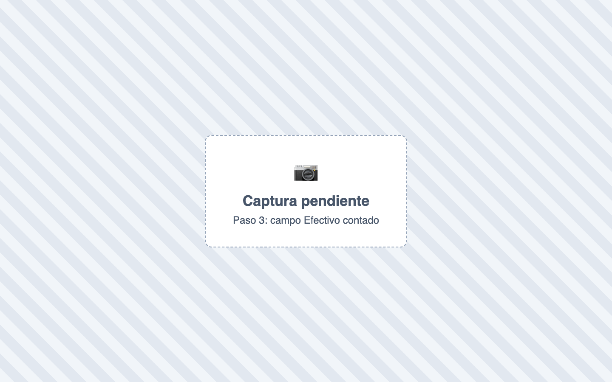
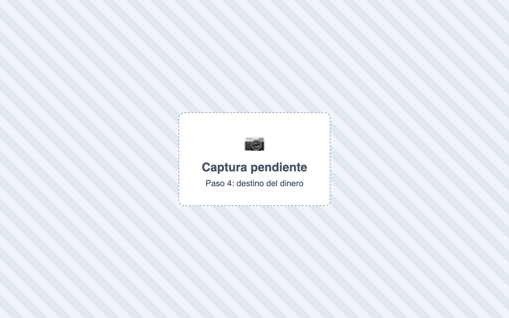
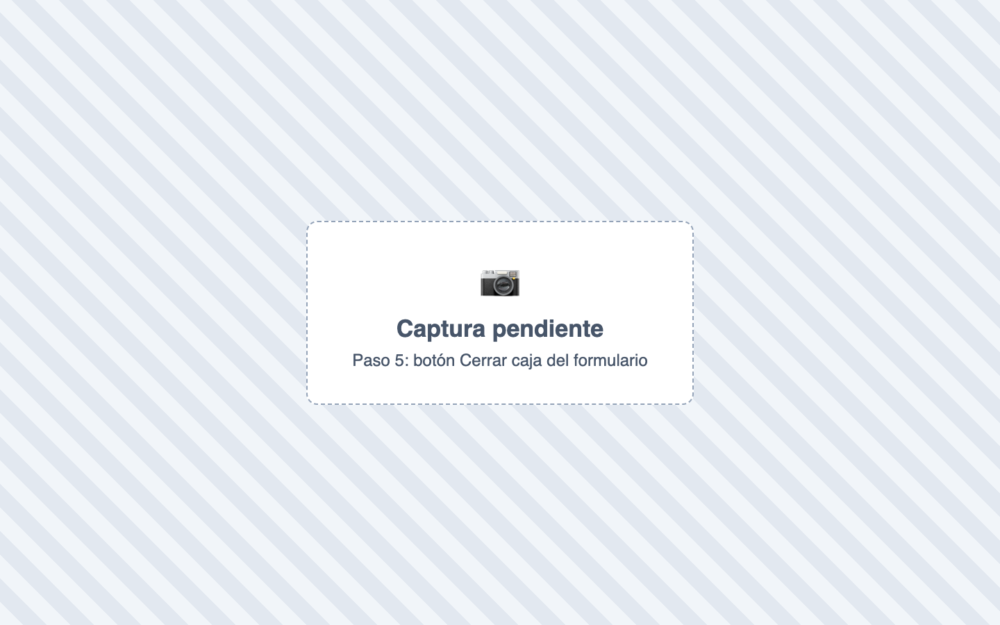
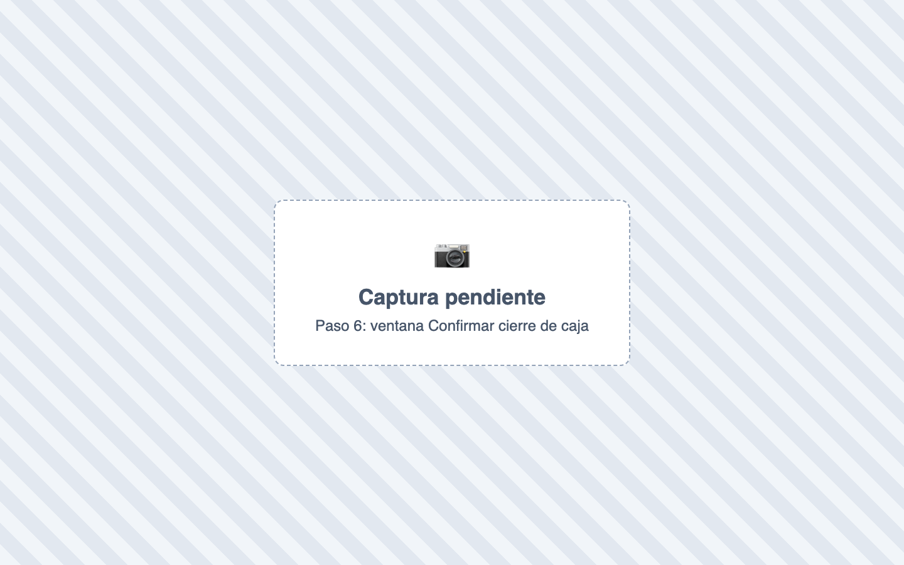

# ¿Cómo cierro la caja?

También se busca como: cierre de caja, cuadre de caja, arqueo, cerrar turno, cuadrar caja, entregar caja, faltante, sobrante, descuadre.

**Antes de empezar:** cuenta el efectivo del cajón (billetes y monedas).

## Pasos

**Paso 1.** En el POS, haz clic en **Cerrar caja** en la barra superior.

**Paso 2.** Revisa el **Resumen del arqueo** (hora de apertura y monto base).

**Paso 3.** En **Efectivo contado**, escribe el total que contaste.

**Paso 4.** Elige el **Destino del monto base** (**Dejar en caja** o **Egresar**) y el **Destino del excedente** (**Dejar en caja** o **Consignar** a una **Cuenta bancaria**).

**Paso 5.** Si quieres, escribe **Observaciones** y haz clic en **Cerrar caja**.

**Paso 6.** En **Confirmar cierre de caja**, lee el mensaje y haz clic en **Confirmar cierre**. Si dice que el monto es muy distinto al esperado, vuelve a escribir el monto y el **Motivo**.

✅ **Listo:** la caja queda **Cerrada**. El comprobante se imprime desde Tesorería › Caja › Sesiones › **Imprimir cierre**.

## Si algo falla

| Problema | Solución |
|---|---|
| *La caja queda descuadrada* | Vuelve a contar. Revisa pagos con tarjeta registrados como efectivo. Si es real, cierra y explícalo en **Observaciones**. |
| *El monto contado es muy distinto al esperado…* | Revisa que no sobre o falte un cero. Si es correcto, reescribe el monto y el motivo. |
| *El monto no coincide con el valor contado.* | El monto reescrito debe ser idéntico al primero. |
| No aparece **Consignar** | Tu empresa no tiene bancos activos o no hay cuentas bancarias activas. |
| Cerré con un valor equivocado | Un supervisor usa **Corregir arqueo** o **Reabrir cierre** en Tesorería › Caja › Sesiones. |
| *No tienes permiso para imprimir este cierre.* | Pide el permiso al administrador. |

## Relacionados

- [¿Cómo abro la caja?](abrir-caja.md)
- [¿Cómo vendo en el POS?](vender-en-pos.md)
