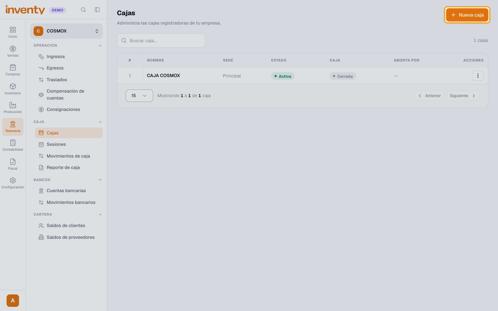
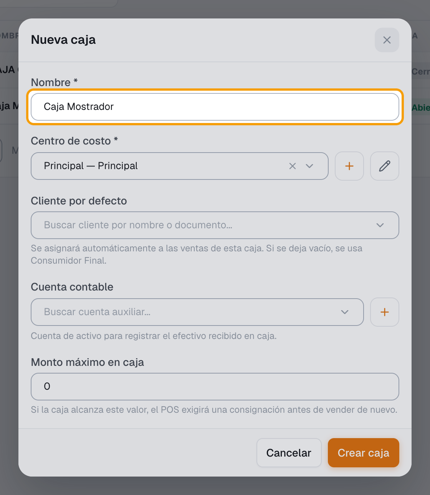
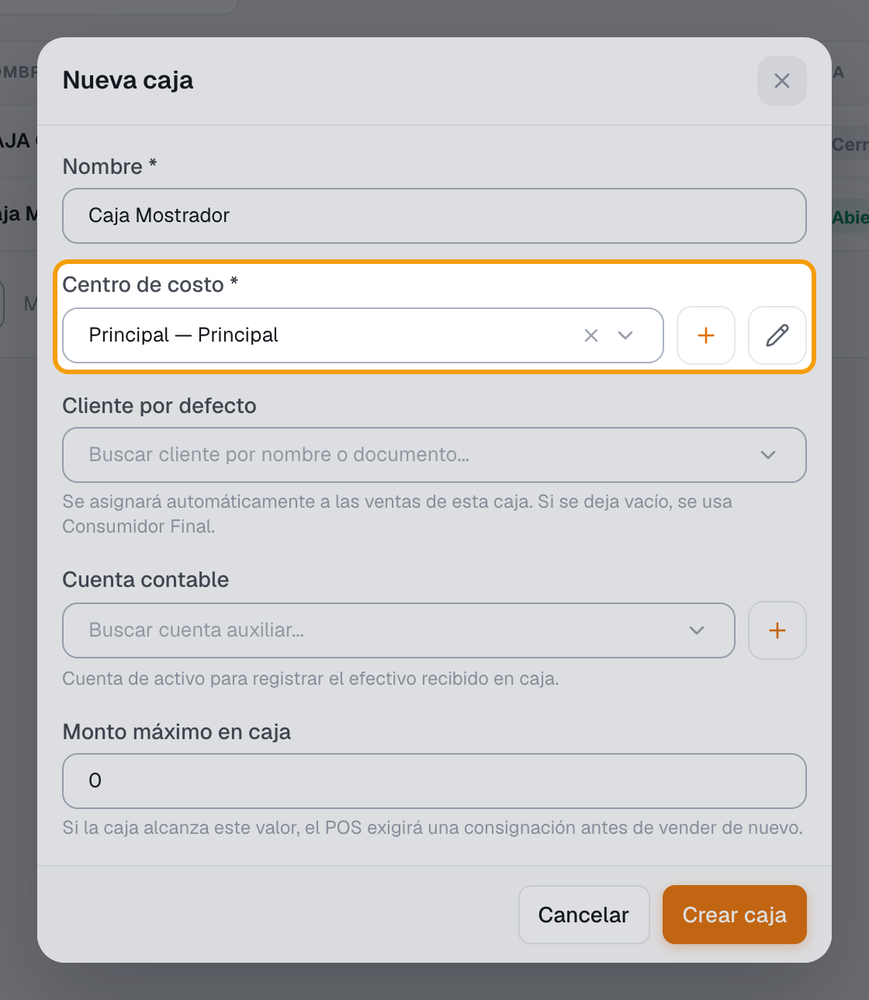
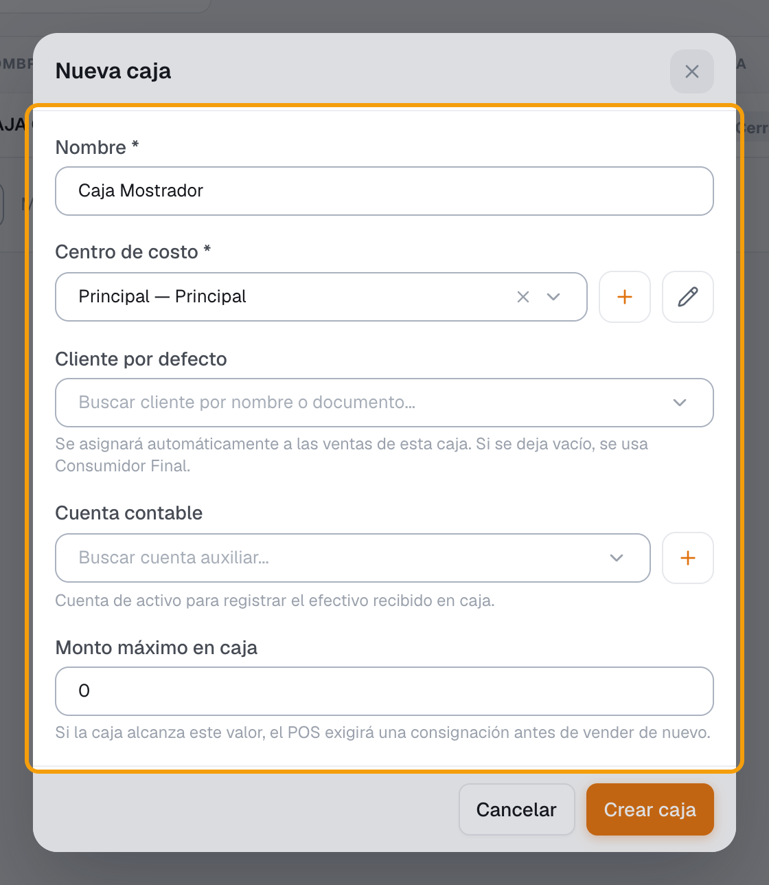
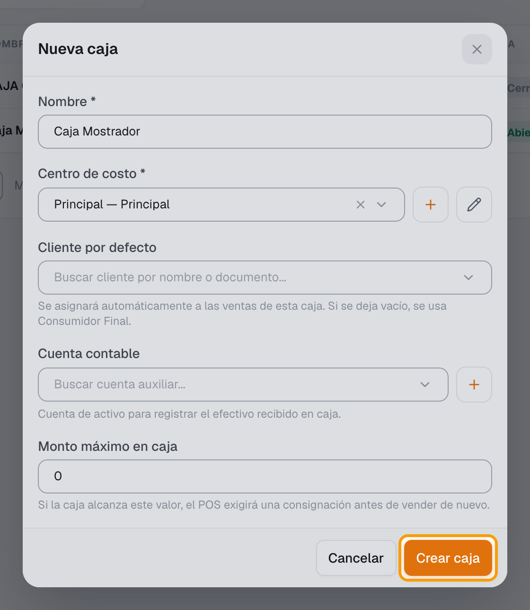
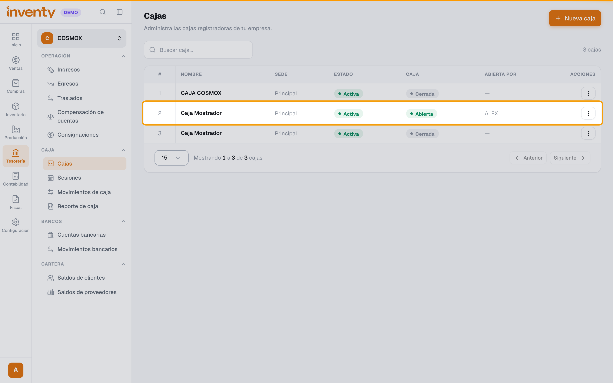

# ¿Cómo creo una caja?

También se busca como: crear caja, nueva caja, caja registradora, agregar caja, caja menor, caja principal, configurar caja.

**Antes de empezar:** debe existir un **centro de costo** (Inventy trae *Principal* por defecto).

## Pasos

**Paso 1.** Ingresa a Tesorería › Caja › Cajas y haz clic en **Nueva caja**.

**Paso 2.** Escribe el **Nombre** de la caja (ej. *Caja Mostrador*).

**Paso 3.** Elige el **Centro de costo**.

**Paso 4.** Elige la **Cuenta contable** del efectivo (ej. *Caja general*). **Es obligatoria si tu empresa usa Contabilidad**: sin ella, el POS no deja cobrar. Si quieres, elige también el **Cliente por defecto** (vacío = Consumidor Final) y el **Monto máximo en caja**.

**Paso 5.** Haz clic en **Crear caja**.

**Paso 6.** La caja aparece en la lista como **Cerrada**, lista para [abrirla en el POS](abrir-caja.md).

✅ **Listo:** ya puedes [abrir la caja](abrir-caja.md) y empezar a vender.

## Si algo falla

| Problema | Solución |
|---|---|
| *No tienes permiso para crear una caja.* | Pide el permiso **Crear caja** al administrador. |
| No hay centros de costo | Créalo en Configuración › Centros de Costo. |
| El POS me pide consignar a cada rato | El **Monto máximo en caja** es muy bajo. Súbelo o déjalo en 0 (sin límite). |
| *La caja de la sesión abierta no tiene una cuenta contable configurada…* | Edita la caja (**Acciones › Editar**) y elige su **Cuenta contable**. Se puede hacer con la caja abierta. |

## Relacionados

- [¿Cómo abro la caja?](abrir-caja.md)
- [¿Cómo vendo en el POS?](vender-en-pos.md)
- [¿Cómo manejo las listas de precios?](../ventas/listas-de-precios.md)
