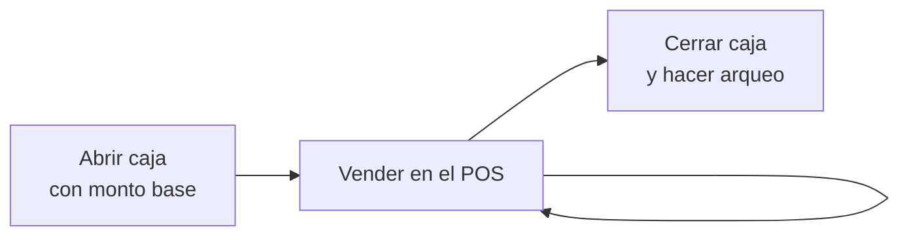

# Punto de venta (POS)

El POS es la pantalla para **vender rápido en mostrador**: buscas o escaneas productos, cobras y entregas la tirilla o factura.

## El día a día del cajero

| Momento | Guía |
|---|---|
| Al empezar el turno | [¿Cómo abro la caja?](abrir-caja.md) |
| Durante el turno | [¿Cómo vendo en el POS?](vender-en-pos.md) |
| Al terminar el turno | [¿Cómo cierro la caja?](cierre-de-caja.md) |
| Si algo falla | [Soluciones rápidas: POS y caja](../soluciones-rapidas/pos-caja.md) |

## Próximamente

- Consignar efectivo desde el POS.
- Remisiones desde el POS.
- Pedidos a la mesa y a domicilio (ver [Restaurante](../restaurante/index.md)).
- Imprimir o reimprimir comprobantes.
