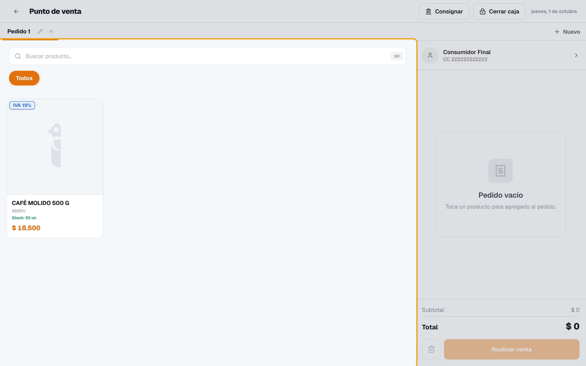
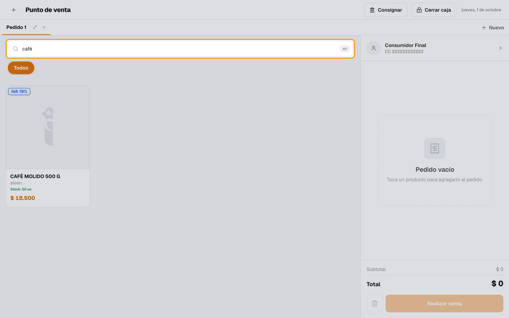
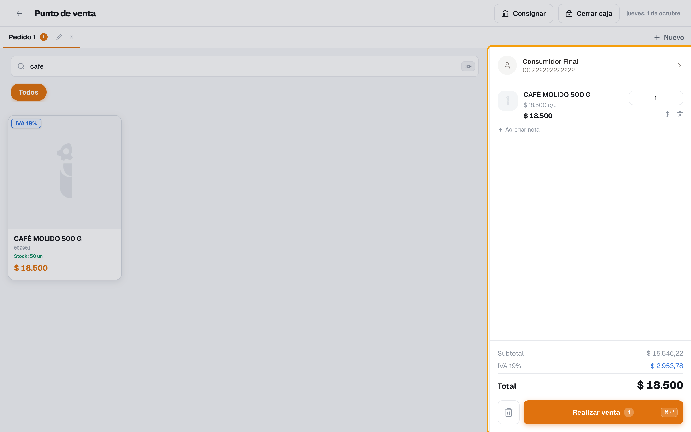
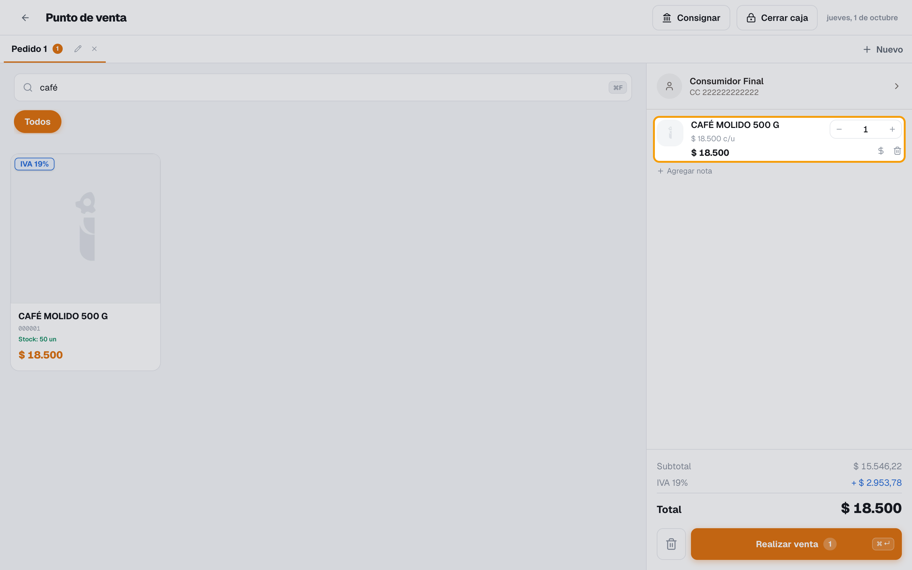
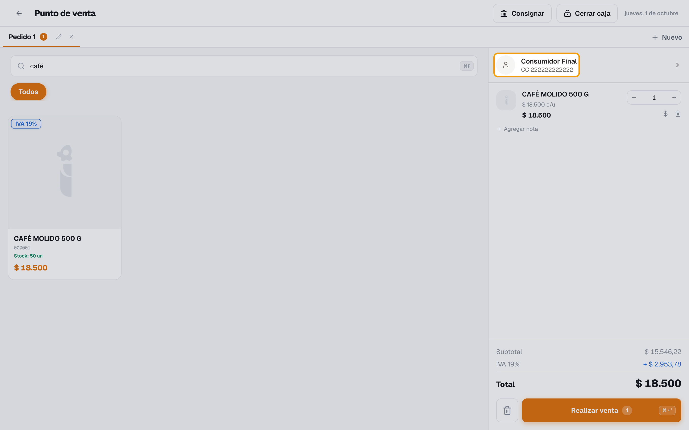
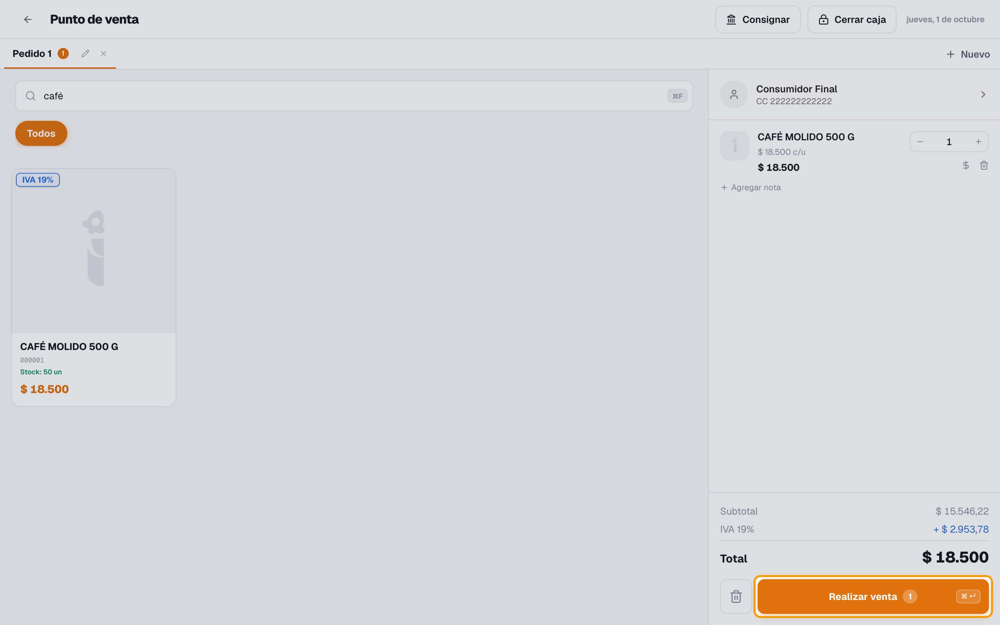
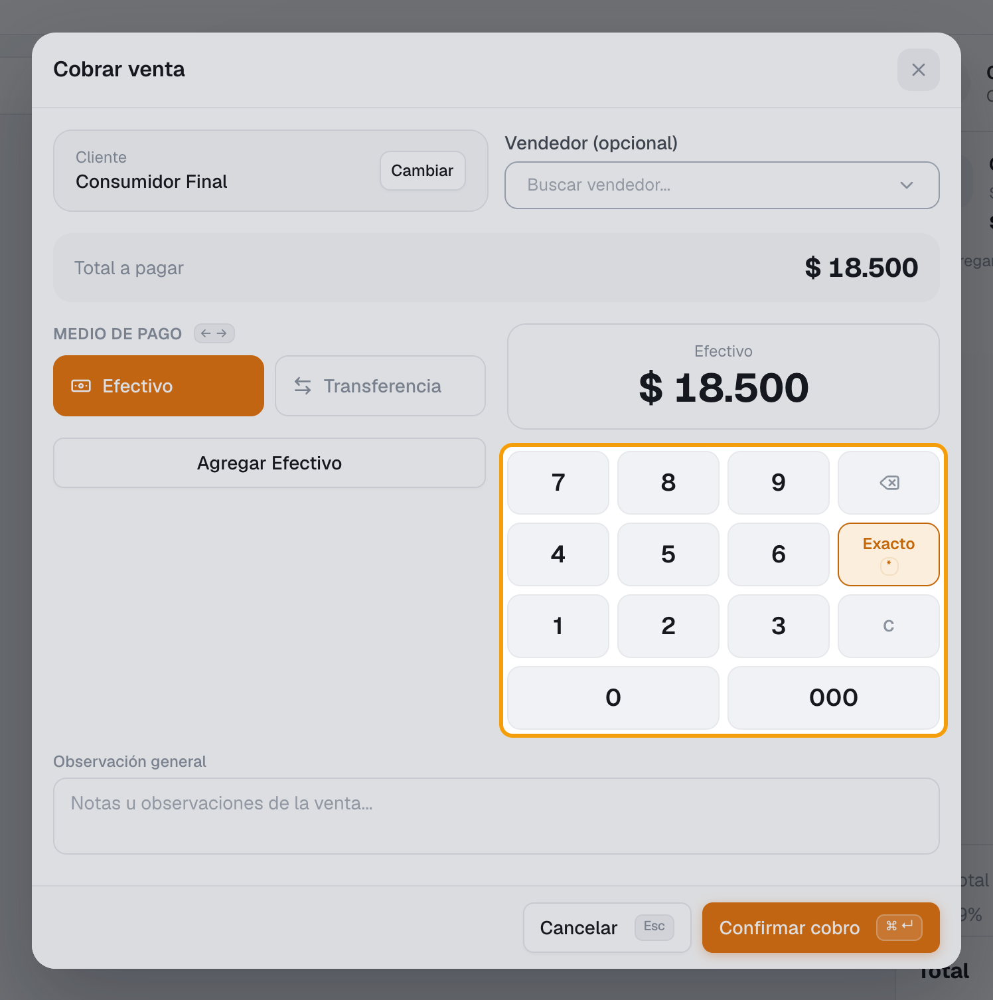
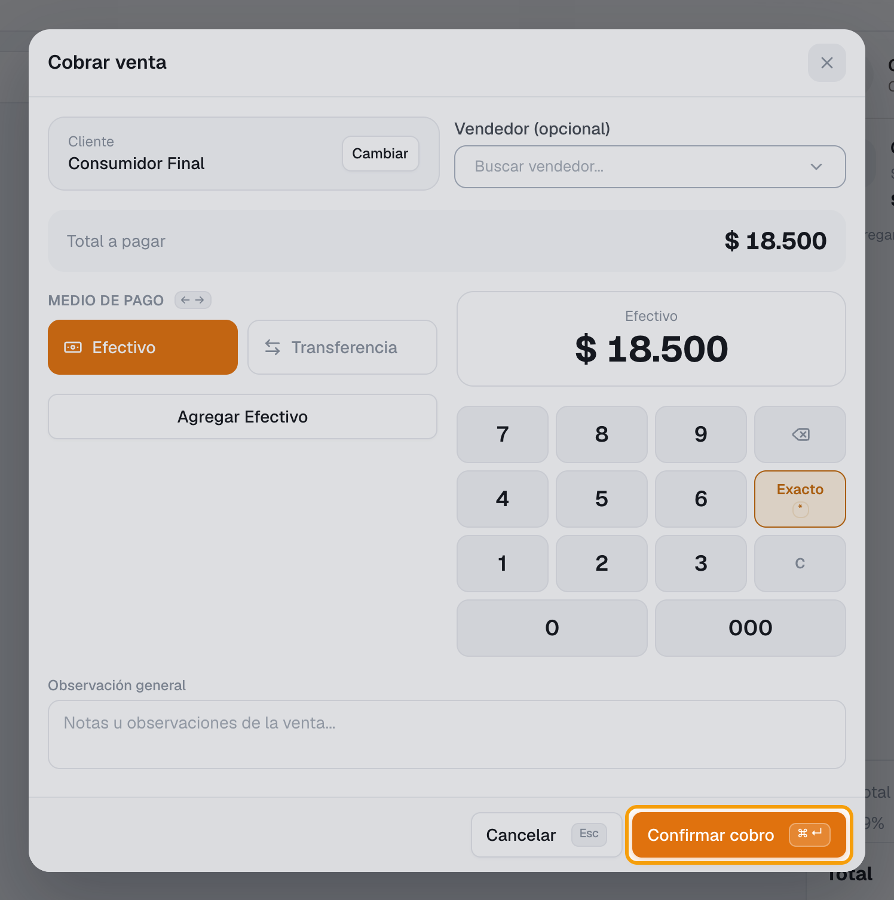

# ¿Cómo vendo en el POS?

También se busca como: hacer una venta, facturar en caja, cobrar, vender en mostrador, registrar venta, venta rápida, tirilla.

**Antes de empezar:** la [caja debe estar abierta](abrir-caja.md).

## Pasos

**Paso 1.** Ingresa a Ventas › POS.

**Paso 2.** Busca el producto en **Buscar producto…** (nombre o código) o escanea el código de barras.

**Paso 3.** Haz clic en el producto para agregarlo al carrito. Repite con cada producto.

**Paso 4.** Para cambiar la cantidad, haz clic en la cantidad de la línea del carrito.

**Paso 5.** Por defecto se vende a **Consumidor Final**. Para otro cliente, abre **Seleccionar cliente**, búscalo o usa **Crear cliente**.

**Paso 6.** Haz clic en **Realizar venta** (o <kbd>Ctrl</kbd> + <kbd>Enter</kbd>).

**Paso 7.** En **Cobrar venta**, elige el medio de pago y escribe el valor recibido. Si paga con varios medios, agrega cada uno. En tarjeta o transferencia, escribe la **Referencia**.

**Paso 8.** Deja marcada **Generar factura electrónica** si corresponde y haz clic en **Confirmar cobro**. El botón muestra el **Cambio** a devolver.

✅ **Listo:** aparece *“Venta registrada con éxito.”*, se imprime la tirilla (o se abre el PDF) y el carrito queda vacío.

## Si algo falla

| Problema | Solución |
|---|---|
| *Debes abrir una caja antes de registrar una venta.* | [Abre la caja](abrir-caja.md). |
| *La caja de la sesión abierta no tiene una cuenta contable configurada…* | En Tesorería › Caja › Cajas, **Acciones › Editar** la caja y elige su **Cuenta contable**. |
| *Ya llegaste al monto máximo de la caja…* | Usa **Registrar consignación** en el POS. |
| *Necesitas asignar un cliente antes de facturar.* | Usa **Asignar cliente** (ventas a crédito requieren cliente). |
| *Selecciona un vendedor antes de facturar.* | Tu empresa exige vendedor: selecciónalo al cobrar. |
| *Stock insuficiente para …* | No hay existencias en tu sede. Revisa el [stock](../productos-inventario/consultar-existencias.md). |
| *El saldo a crédito supera el cupo disponible del cliente…* | Cobra una parte con otro medio, o un supervisor autoriza con su **PIN**. |
| *No hay medios de pago configurados…* | El administrador los crea en Ventas › Ajustes › Medios de Pago. |
| *No se pudo abrir el PDF de la factura…* | Permite las ventanas emergentes para Inventy en el navegador. |
| No aparece **Editar descuento** | Se activa en Configuración › Módulos › Ventas › Descuento manual por producto en el POS. |

## Relacionados

- [¿Cómo abro la caja?](abrir-caja.md)
- [¿Cómo cierro la caja?](cierre-de-caja.md)
- [¿Cómo emito una factura electrónica?](../facturacion-electronica/emitir-factura-electronica.md)
- [¿Qué es un anticipo y cómo se maneja?](../finanzas/anticipos.md)
