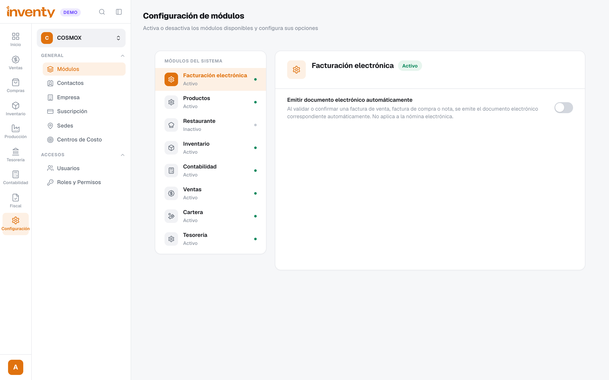
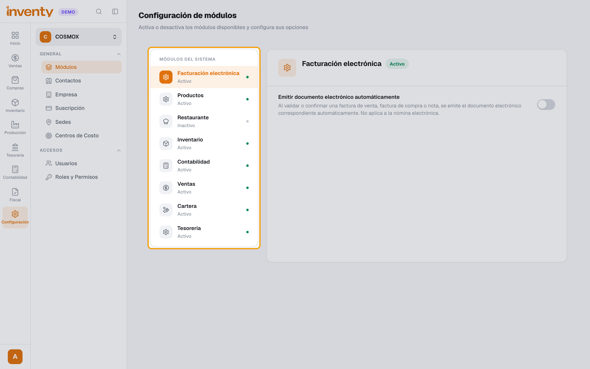
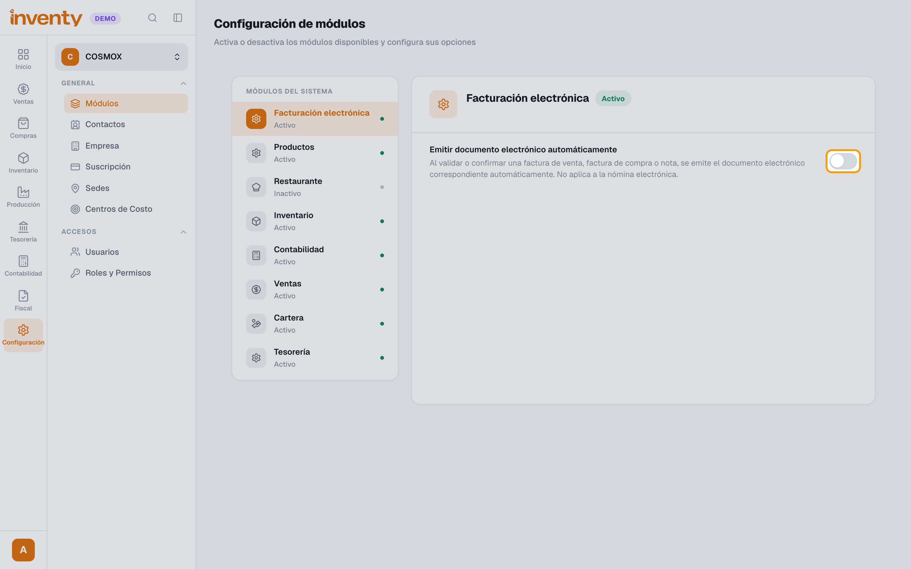
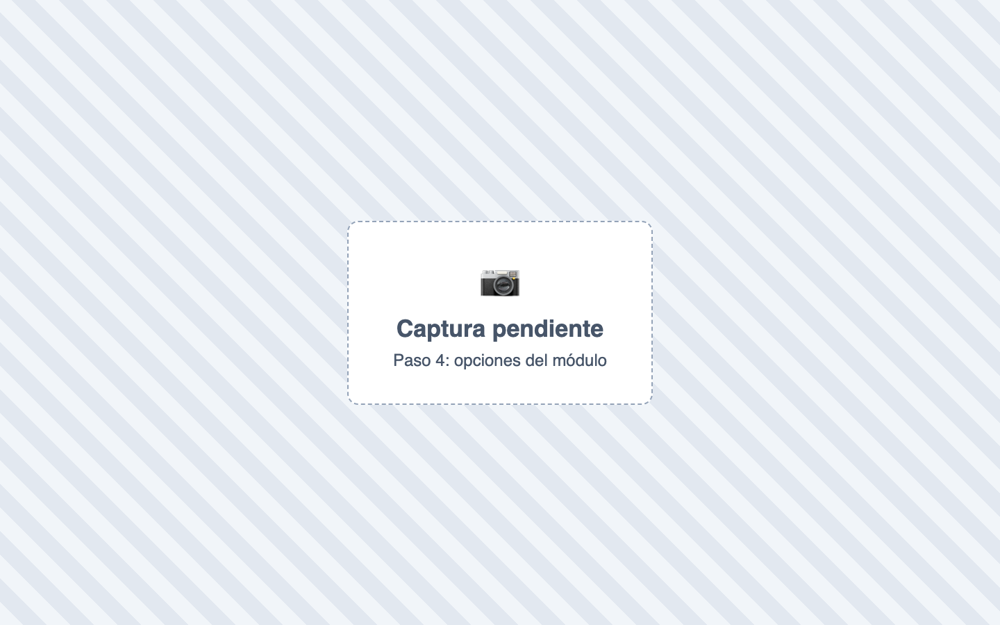

# ¿Cómo activo o desactivo módulos?

También se busca como: habilitar módulo, activar opción, configuración de módulos, encender restaurante, activar lotes, activar promociones, stock negativo.

**Antes de empezar:** solo se activan los módulos incluidos en tu plan.

## Pasos

**Paso 1.** Ingresa a Configuración › Módulos.

**Paso 2.** Selecciona el módulo en la lista de la izquierda.

**Paso 3.** Usa el interruptor **Habilitar módulo** / **Deshabilitar módulo**. Solo **Contabilidad** e **Inventario** lo tienen; los demás módulos (por ejemplo, **Restaurante**) los activa el equipo de Inventy: escríbele a [soporte](../soporte.md).

**Paso 4.** Activa las opciones que necesites del módulo.

✅ **Listo:** los menús del módulo aparecen para los usuarios con permiso (pueden necesitar recargar la página).

## Si algo falla

| Problema | Solución |
|---|---|
| *Este módulo está bloqueado por tu suscripción* | No está en tu plan. Usa **Mejorar plan** o revisa Configuración › Suscripción. |
| No aparece el interruptor **Habilitar módulo** | Ese módulo no lo puedes activar tú: solo Contabilidad e Inventario. Pide a [soporte](../soporte.md) que lo active. |
| No me aparece una opción | Algunas aparecen solo tras activar otra. Ver [Todas las opciones de Módulos](opciones-modulos.md). |
| Otro usuario no ve el módulo | Su rol necesita los permisos del módulo. Ver [roles y permisos](roles-y-permisos.md). |

## Relacionados

- [Todas las opciones de Módulos](opciones-modulos.md)
- [¿Cómo funcionan los roles y permisos?](roles-y-permisos.md)
