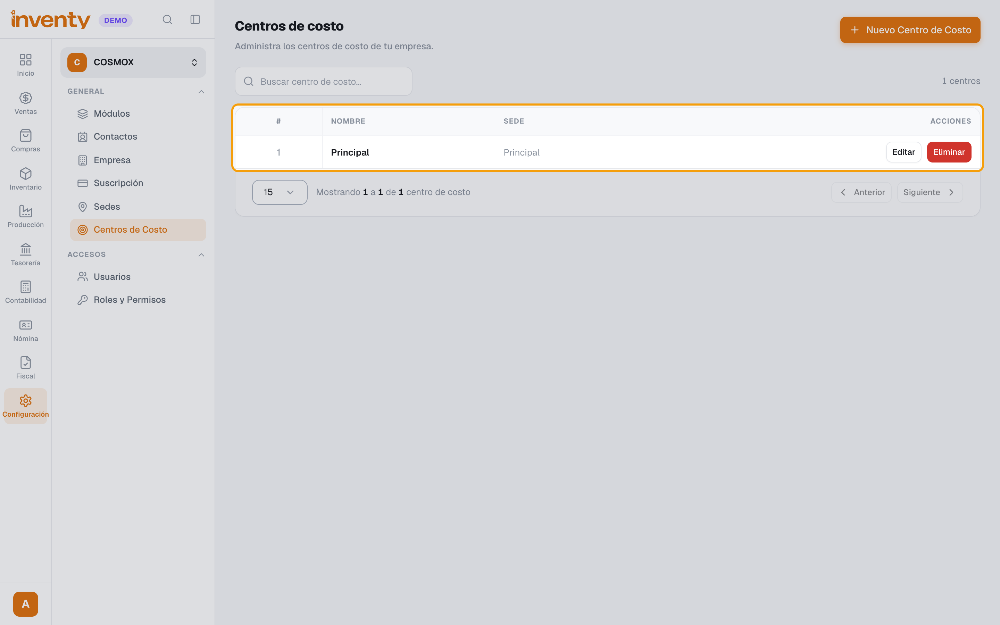
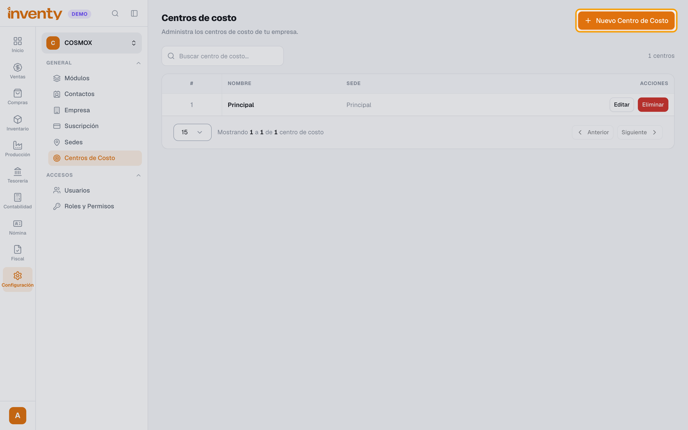
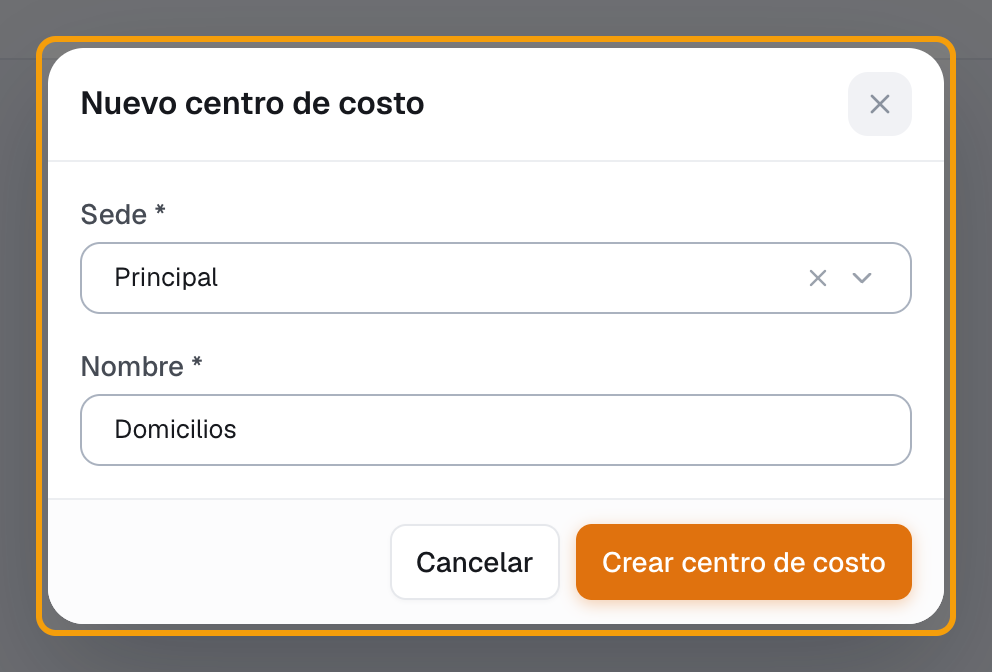
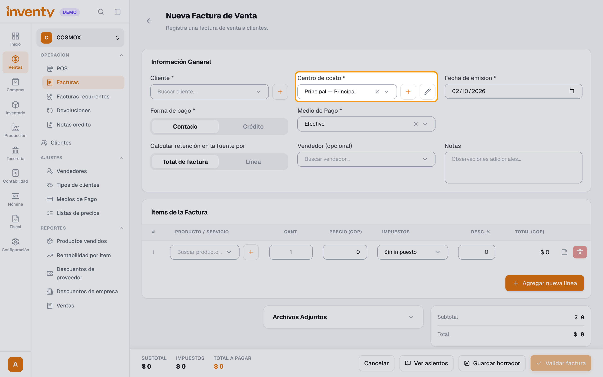
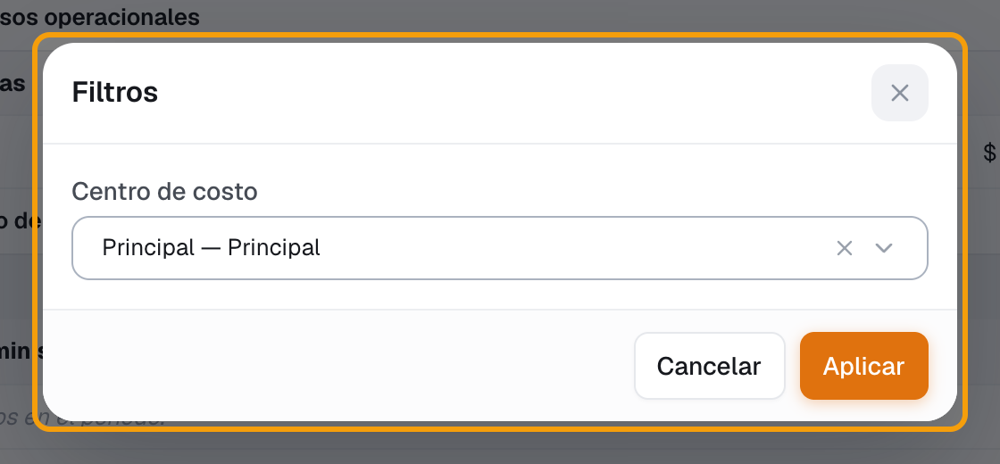
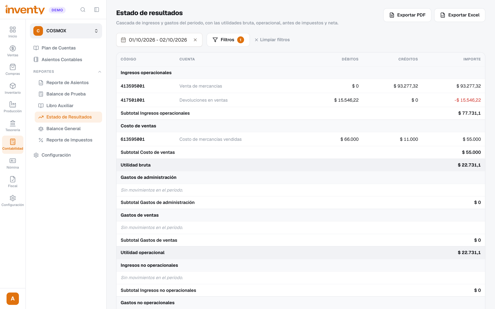

# ¿Qué es un centro de costo y cómo lo uso?

También se busca como: centro de costo, centro de costos, área del negocio, separar ingresos por área, utilidad por área, Principal — Principal.

**Qué es:** una **etiqueta para separar en qué parte del negocio entra o sale cada peso** (ej. *Mostrador*, *Domicilios*, *Administración*). Así puedes ver la utilidad de cada área sin crear otra empresa.

**Cómo funciona en Inventy:**

- Cada centro de costo pertenece a **una sede**. Cada sede trae uno creado llamado **Principal**; por eso ves *“Principal — Principal”* (sede — centro de costo).
- Facturas de venta y compra, ingresos, egresos, traslados de dinero, cajas, asientos manuales y empleados **llevan centro de costo**, y cada línea del **asiento contable** queda marcada con él.
- Si la sede tiene **un solo** centro de costo, los formularios lo traen **ya elegido**. Con **dos o más**, el campo queda vacío y hay que elegirlo en cada documento.
- En el POS se usa el centro de costo de la **caja**. Las devoluciones usan el de la factura original.

## Pasos

**Paso 1.** Ingresa a Configuración › Centros de Costo. Verás los que existen y la sede de cada uno.

**Paso 2.** Para crear uno, haz clic en **Nuevo Centro de Costo**.

**Paso 3.** Elige la **Sede**, escribe el **Nombre** (ej. *Domicilios*) y haz clic en **Crear centro de costo**.

**Paso 4.** Al hacer un documento, elige el **Centro de costo** en su encabezado (ej. en la factura de venta, al lado del cliente). En las cajas se elige al crearlas o editarlas (Tesorería › Caja › Cajas › **Editar**).

**Paso 5.** Para ver la utilidad de un centro de costo: en Contabilidad › Estado de Resultados haz clic en **Filtros**, elige el **Centro de costo** y haz clic en **Aplicar**.

**Paso 6.** El reporte muestra solo los ingresos, costos y gastos de ese centro de costo. El mismo filtro está en **Libro Auxiliar**, **Reporte de Asientos** y **Reporte de Impuestos**.

✅ **Listo:** cada documento queda en su centro de costo y puedes comparar la utilidad de cada área.

!!! tip "¿Necesito crear más de uno?"
    Si tu negocio es una sola área, **no**: con **Principal** basta y no tienes que tocar nada. Crea más solo si quieres ver la utilidad por área. Ten en cuenta que, desde que una sede tenga dos o más, **hay que elegirlo en cada documento**.

## Si algo falla

| Problema | Solución |
|---|---|
| El campo **Centro de costo** sale vacío y no me deja guardar | Tu sede tiene varios centros de costo: elige uno. |
| Elegí un centro de costo y me cambió la sede del documento | Es normal: el centro de costo pertenece a una sede y el documento queda en esa sede. Elige uno de tu sede. |
| No aparece mi centro de costo en la lista | Está creado en otra sede, o falta crearlo (pasos 2 y 3). |
| Las ventas del POS salen en otro centro de costo | El POS usa el de la **caja**: cámbialo en Tesorería › Caja › Cajas › **Editar**. |
| El estado de resultados de un centro de costo sale vacío | Revisa el rango de fechas y que los documentos se hayan hecho con ese centro de costo. |

## Relacionados

- [¿Cómo funciona la contabilidad en Inventy?](../contabilidad/como-funciona.md)
- [¿Cómo creo una caja?](../pos/crear-caja.md)
- [¿Cómo hago una factura de venta?](../ventas/crear-factura-venta.md)
