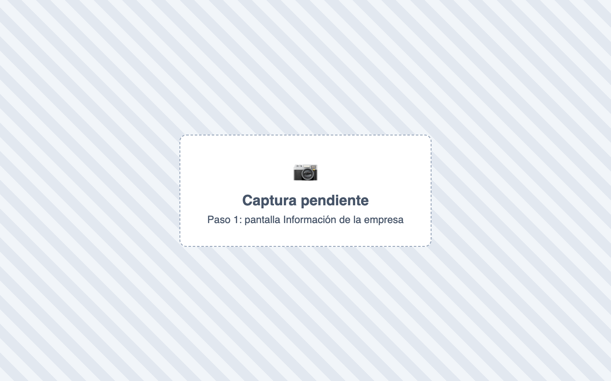
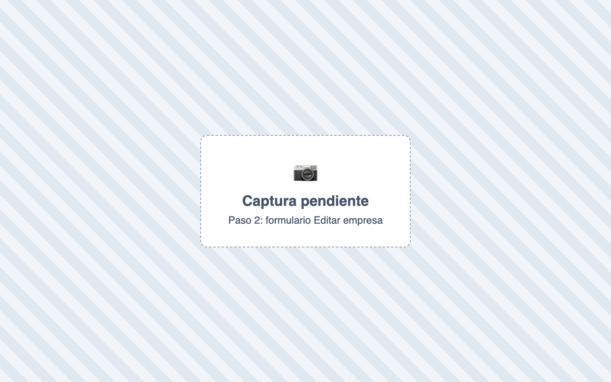
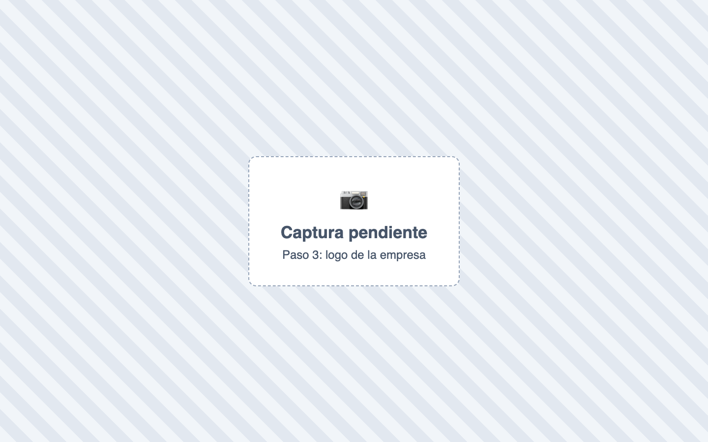
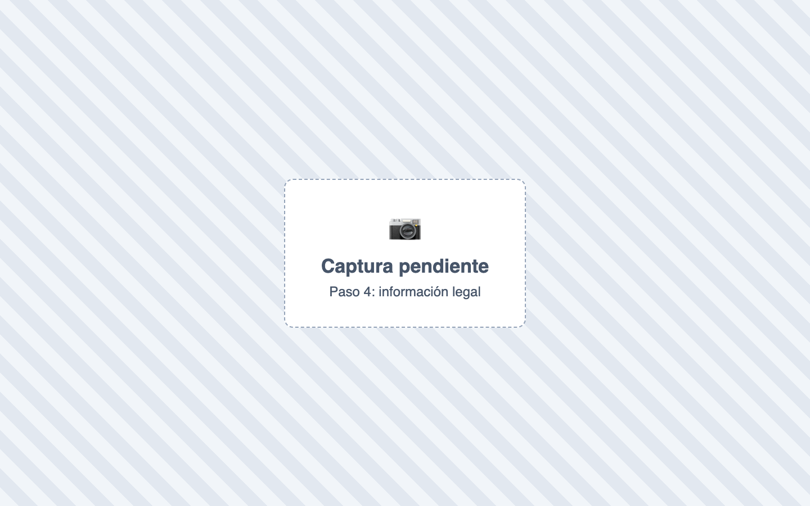
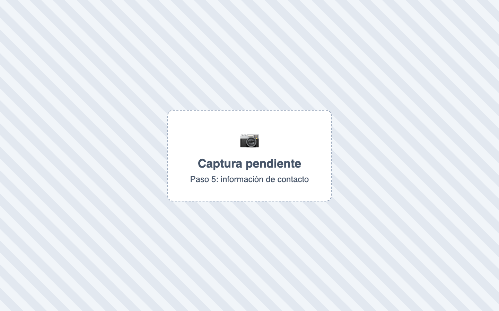
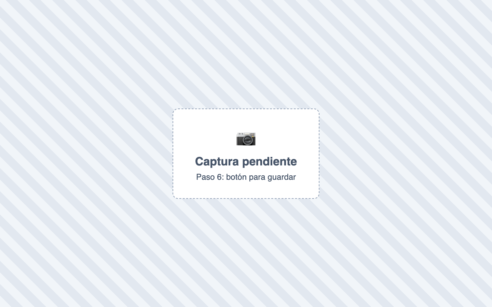

# ¿Cómo configuro los datos de mi empresa?

También se busca como: NIT, razón social, logo, datos de la empresa, dirección, cambiar logo de la factura.

**Antes de empezar:** ten a mano el RUT y el logo (PNG o JPG, máximo 2 MB).

## Pasos

**Paso 1.** Ingresa a Configuración › Empresa.

**Paso 2.** Haz clic en el botón para editar. Se abre **Editar empresa**.

**Paso 3.** En **Identidad de la empresa**, sube el **Logo de la empresa**.

**Paso 4.** En **Información legal**, completa tipo y número de identificación, **Razón social** y nombre comercial.

**Paso 5.** Completa **Representante legal** e **Información de contacto** (correo, teléfonos, país, departamento, municipio y dirección).

**Paso 6.** Guarda los cambios.

✅ **Listo:** los documentos que generes usarán los datos nuevos.

## Si algo falla

| Problema | Solución |
|---|---|
| No puedo elegir el municipio | Elige primero el país y luego el departamento. |
| No sube el logo | Debe ser PNG o JPG de máximo 2 MB. |
| Ya facturo electrónicamente y quiero cambiar el NIT o la razón social | Habla antes con [soporte](../soporte.md): deben coincidir con la DIAN. |

## Relacionados

- [¿Cómo activo o desactivo módulos?](activar-modulos.md)
- [¿Cómo registro una resolución de la DIAN?](../facturacion-electronica/resoluciones.md)
