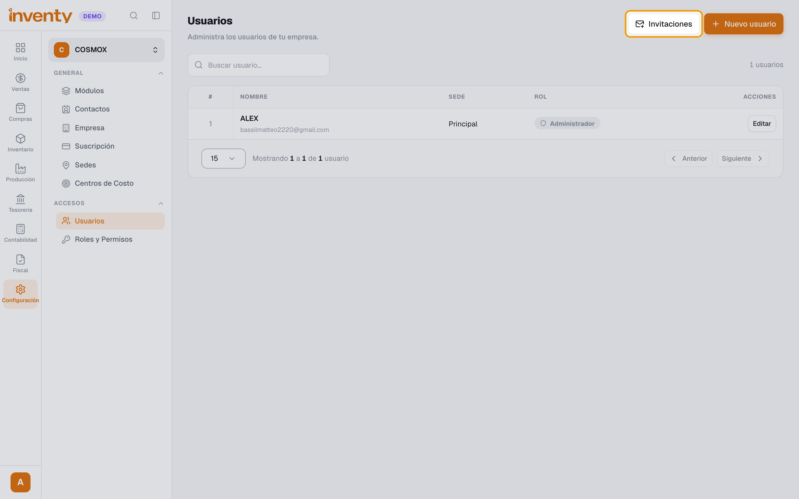
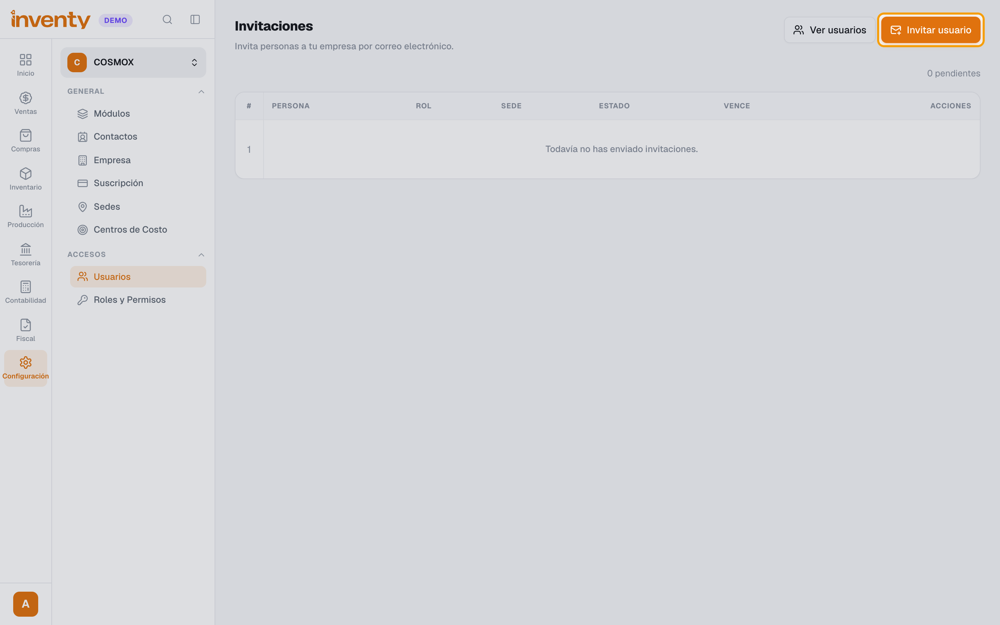
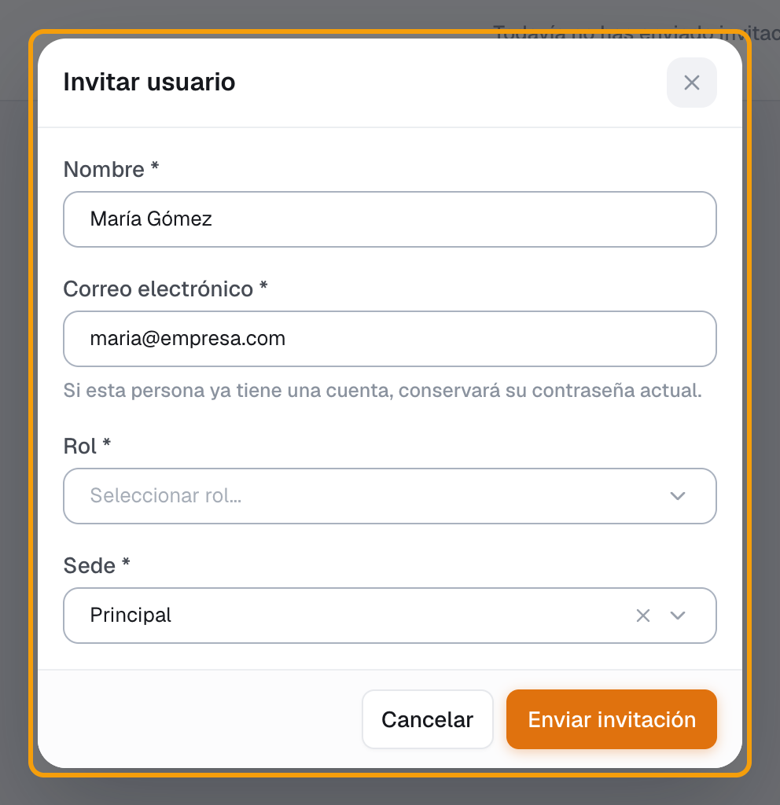
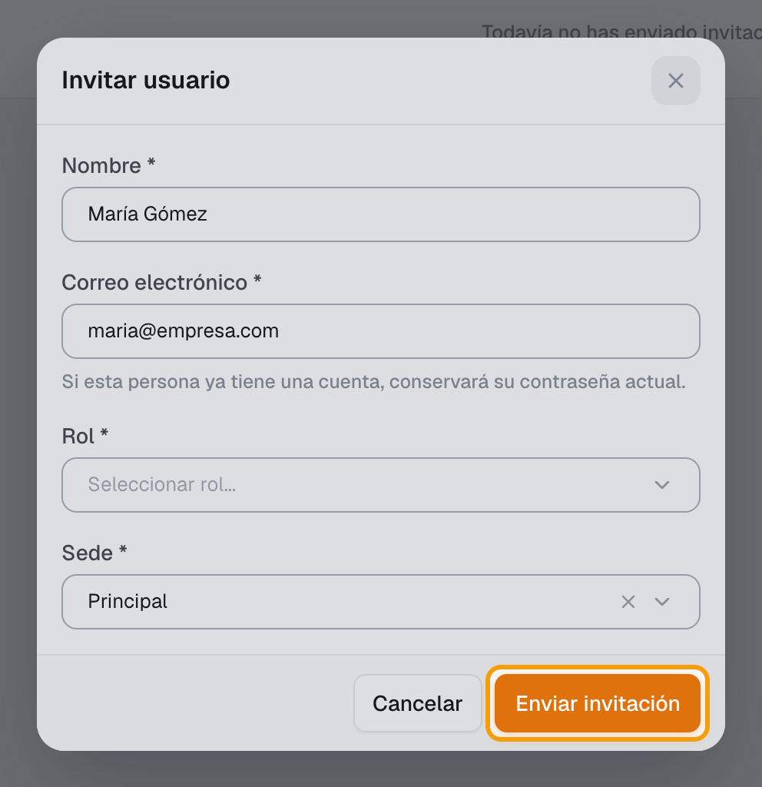
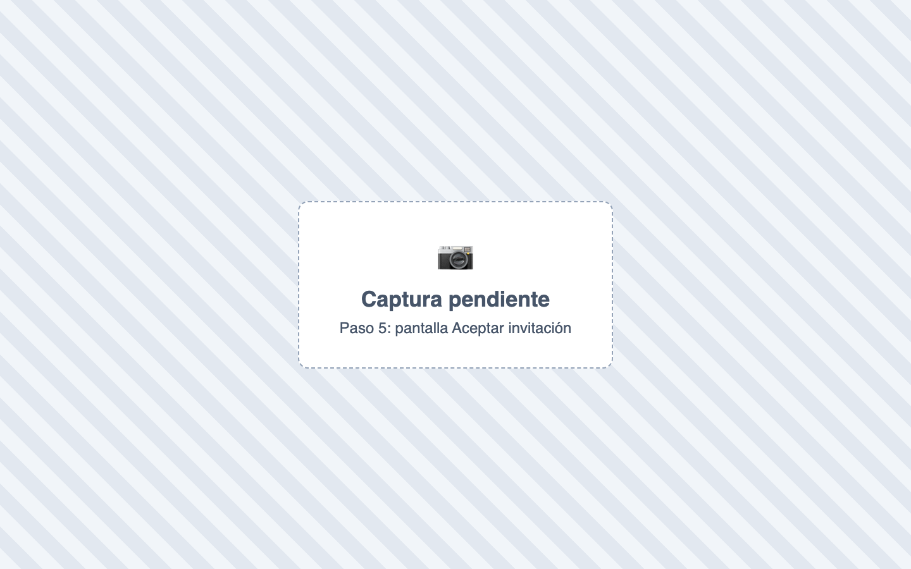

# ¿Cómo agrego usuarios a mi empresa?

También se busca como: crear usuario, nuevo empleado en el sistema, dar acceso, invitar, agregar cajero, agregar vendedor.

**Antes de empezar:** deben existir el **rol** y la **sede** que le vas a asignar.

## Pasos

**Paso 1.** Ingresa a Configuración › Usuarios y haz clic en **Invitaciones**.

**Paso 2.** Haz clic en **Invitar usuario**.

**Paso 3.** Completa **Nombre**, **Correo electrónico**, **Rol** y **Sede**.

**Paso 4.** Haz clic en **Enviar invitación**.

**Paso 5.** La persona abre el correo, completa sus datos y su contraseña, y hace clic en **Unirme a la empresa**.

✅ **Listo:** el usuario aparece en **Usuarios** con su sede y rol.

!!! tip "Otra forma: crear el usuario con contraseña"
    Configuración › Usuarios › **Nuevo usuario** › completa nombre, correo, rol, sede y contraseña (mínimo 8 caracteres) › guarda. Entrega la contraseña de forma privada.

## Si algo falla

| Problema | Solución |
|---|---|
| *Ya existe una invitación pendiente o un usuario con este correo.* | Esa persona ya fue invitada o ya es usuario. |
| *Esta invitación venció* / *fue revocada* | Envía una invitación nueva. |
| *Límite del plan alcanzado* | Tu plan no permite más usuarios: revisa **Suscripción › Límites y consumo**. |

## Relacionados

- [¿Cómo funcionan los roles y permisos?](roles-y-permisos.md)
