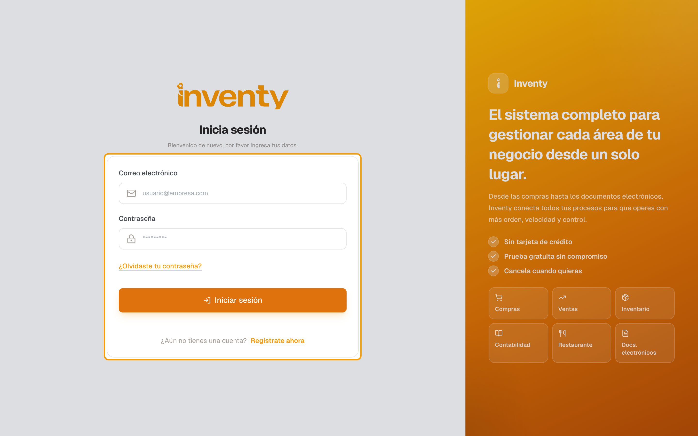
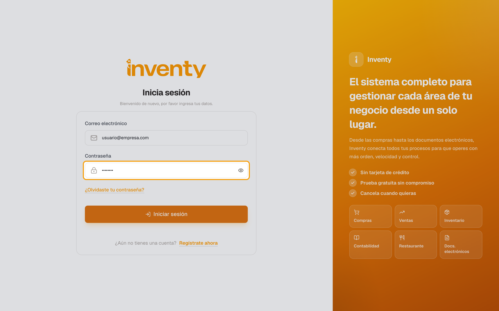
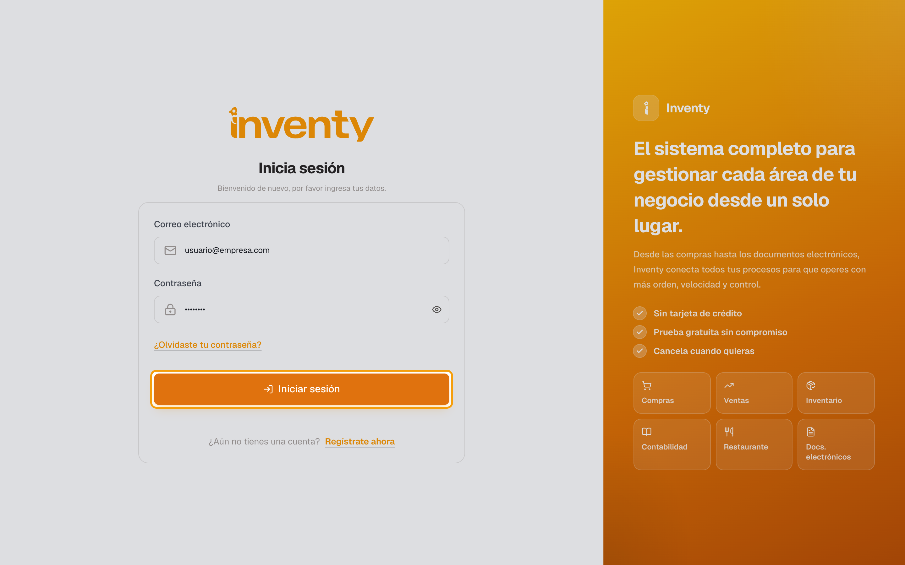

# ¿Cómo ingreso a Inventy?

También se busca como: iniciar sesión, entrar, login, acceder, loguearme, ingresar al sistema.

**Antes de empezar:** tener un usuario creado por el administrador o haber aceptado una invitación.

## Pasos

**Paso 1.** Abre la dirección de Inventy en tu navegador. Verás **Inicia sesión**.

**Paso 2.** En **Correo electrónico** escribe tu correo y en **Contraseña** tu contraseña.

**Paso 3.** Haz clic en **Iniciar sesión**.

✅ **Listo:** entras al **Inicio** de tu empresa.

## Si algo falla

| Problema | Solución |
|---|---|
| *Estas credenciales no coinciden con nuestros registros.* | Revisa correo y contraseña (y **Bloq Mayús**). Si no la recuerdas, [recupérala](recuperar-contrasena.md). |
| *Demasiados intentos de acceso…* | Espera los segundos que indica y vuelve a intentar. |
| Me pide un código de autenticación | Tu cuenta tiene verificación en dos pasos: escribe el código de tu app de autenticación. |
| Entré y veo *Tu espacio de trabajo está listo* | Tu rol no tiene permiso de estadísticas; usa el menú lateral. |

## Relacionados

- [¿Cómo recupero mi contraseña?](recuperar-contrasena.md)
- [Conociendo la pantalla principal](pantalla-principal.md)
