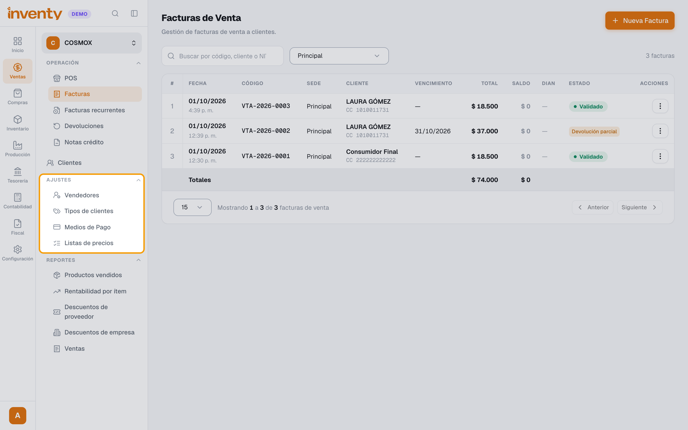
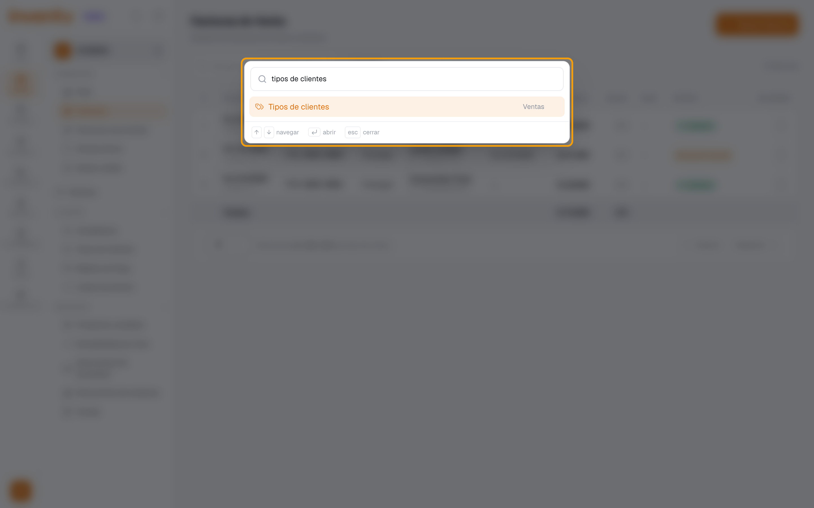

# Conociendo la pantalla principal

También se busca como: dashboard, tablero, inicio, menú, navegar, dónde está, buscar una opción, dónde está ajustes, no encuentro el menú, secciones del menú.

## El menú lateral

A la izquierda está el **menú lateral**. Cada ícono abre un grupo de opciones:

| Menú | Qué encuentras |
|---|---|
| **Inicio** | Resumen de tu negocio. |
| **Ventas** | POS, Facturas, Facturas recurrentes, Devoluciones, Notas crédito, Clientes; en **Ajustes**: Vendedores, Tipos de clientes, Medios de Pago y Listas de precios; y los reportes de ventas. |
| **Restaurante** | Pedidos, Tablero de pedidos, Estaciones de preparación, Mesas, Domicilios y Propinas. |
| **Tienda web** | Catálogo web, Pedidos web y su configuración. |
| **Compras** | Órdenes de Compra, Facturas, Legalización de gastos, Devoluciones y Proveedores. |
| **Inventario** | Productos, Servicios, Stock, Movimientos, Kardex, Ajustes, Conteo físico, Traslados y Etiquetas. |
| **Producción** | Producciones y Recetas. |
| **Distribución** | Preventas, Despachos, Rutas de venta y Vehículos. |
| **Tesorería** | Ingresos, Egresos, Cajas, Bancos y Cartera. |
| **Contabilidad** | Plan de Cuentas, Asientos Contables e informes contables. |
| **Nómina** | Empleados, Cargos, Novedades, Períodos, Pagos y Nómina Electrónica. |
| **Fiscal** | Documentos electrónicos, Resoluciones e Impuestos. |
| **Configuración** | Módulos, Contactos, Empresa, Suscripción, Sedes, Centros de Costo, Usuarios y Roles y Permisos. |

!!! info "¿No ves alguno de estos menús?"
    Es normal. Solo aparecen los módulos que tiene tu plan, que el administrador activó y para los que tu rol tiene permiso. Ver [¿Por qué no veo un menú?](../soluciones-rapidas/usuarios.md#no-veo-un-menu-o-una-opcion).

## ¿Cómo leer las rutas del manual?

En el manual verás rutas como Ventas › Ajustes › Tipos de clientes. Se leen así:

1. **Ventas**: el ícono de la barra de la izquierda (el de **$**). Haz clic y se abre su menú.
2. **Ajustes**: el **título de una sección** dentro de ese menú (en mayúsculas: *OPERACIÓN*, *AJUSTES*, *REPORTES*). No es un botón: es un grupo.
3. **Tipos de clientes**: la opción debajo de ese título. Haz clic en ella.

!!! tip "¿No ves la sección?"
    - Si el título tiene la flechita hacia abajo, está **cerrado**: haz clic en él para desplegarlo.
    - Si no ves el menú, haz clic en el botón de **mostrar menú** (arriba, junto al logo).
    - Si aun así no aparece, tu rol no tiene permiso para esa opción o el módulo no está activo.

## Búsqueda rápida en el menú

¿No sabes dónde está una opción? Presiona <kbd>Ctrl</kbd> + <kbd>K</kbd> (en Mac, <kbd>⌘</kbd> + <kbd>K</kbd>). Se abre el campo **Buscar en el menú…**: escribe parte del nombre (por ejemplo, *tipos de clientes*, *cierre* o *kardex*) y presiona <kbd>Enter</kbd>.

## El panel de Inicio

Si tu rol tiene permiso para ver estadísticas, el Inicio muestra:

- **Ventas del mes**, **Compras del mes**, **Gastos del mes**, **Costo de ventas del mes**, **Utilidad del mes** y **Rentabilidad del mes**.
- **Por cobrar vencido** (facturas vencidas sin pagar) y **Por pagar (próx. 7 días)**.
- **Clientes activos** y **Proveedores activos**.
- Una gráfica de ventas de los **últimos 6 meses**, **Top clientes del mes** y **Top productos del mes**.

Si no tienes ese permiso, verás el mensaje *“Tu espacio de trabajo está listo”*: puedes trabajar normalmente con los menús a los que tienes acceso.

## Tu perfil

Desde el menú de tu usuario puedes:

- Cambiar tu **nombre** y **correo** (Configuración del perfil).
- Definir tu **PIN de autorización**, que se usa para aprobar operaciones especiales, como ventas a crédito por encima del cupo del cliente.
- Cambiar tu **contraseña**.
- Cambiar la **apariencia** (modo claro u oscuro).
- **Cerrar sesión**.

## Artículos relacionados

- [¿Cómo activo o desactivo módulos?](activar-modulos.md)
- [¿Cómo funcionan los roles y permisos?](roles-y-permisos.md)
