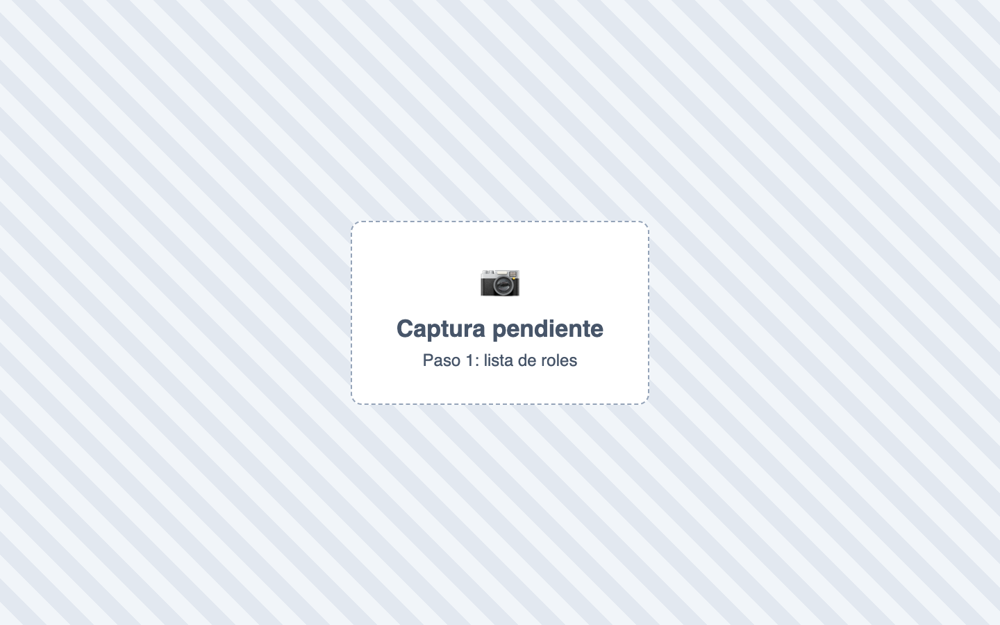
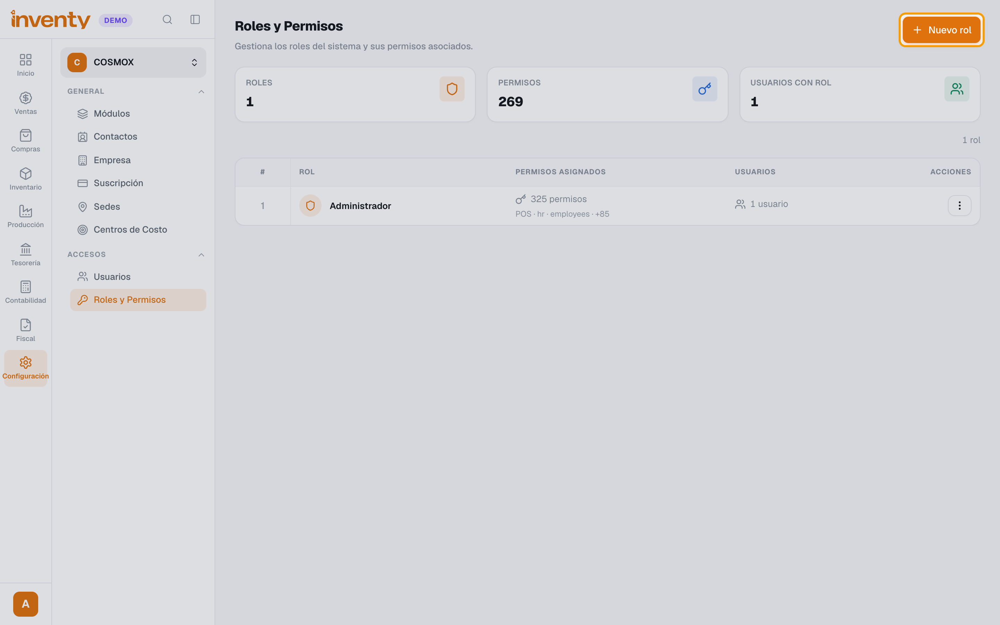
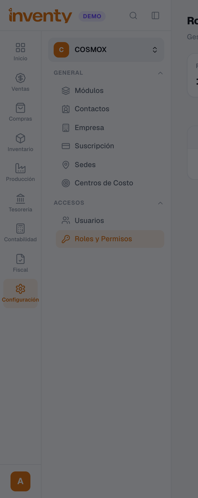
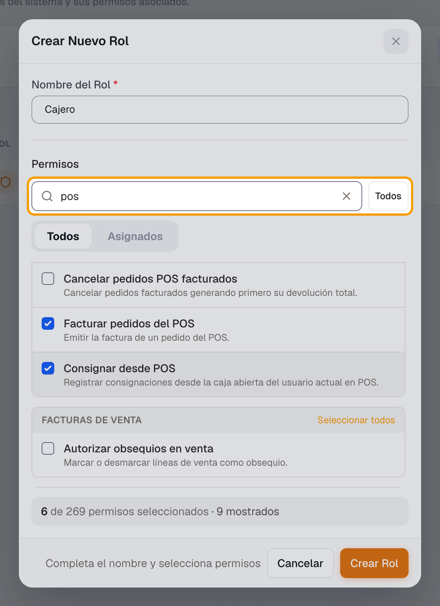
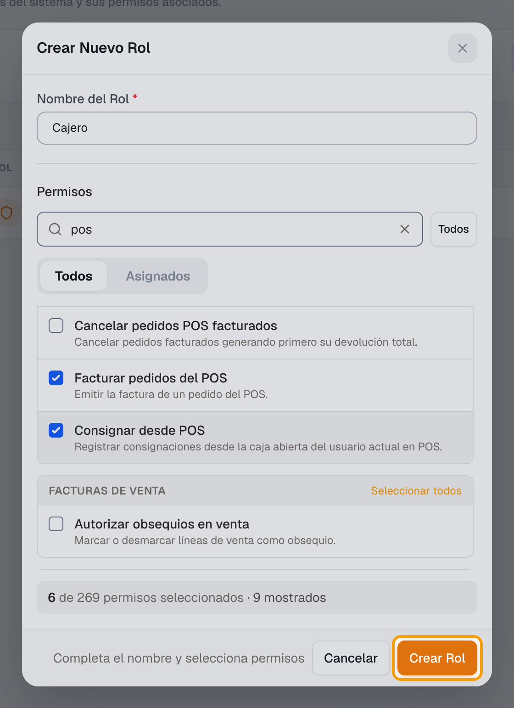

# ¿Cómo creo un rol y le doy permisos?

También se busca como: perfiles, accesos, restringir, bloquear opción, dar permiso, rol de cajero, rol de vendedor.

## Pasos

**Paso 1.** Ingresa a Configuración › Roles y Permisos.

**Paso 2.** Haz clic en **Nuevo rol**.

**Paso 3.** Escribe el nombre del rol (ej. *Cajero*).

**Paso 4.** Escribe en **Buscar permisos...** (ej. *caja*, *pos*) y marca los permisos que necesita. Abajo ves cuántos llevas seleccionados.

**Paso 5.** Haz clic en **Crear Rol**. El rol aparece en la lista con su número de permisos.

✅ **Listo:** asigna el rol a los usuarios en Configuración › Usuarios. Para cambiar permisos después: acciones del rol › **Gestionar permisos**.

!!! tip "Permisos de un cajero"
    **Acceder al POS**, **Ver pedidos del POS**, **Gestionar pedidos del POS**, **Facturar pedidos del POS**, **Ver cajas** y **Consignar desde POS**.

## Si algo falla

| Problema | Solución |
|---|---|
| *El nombre del rol es obligatorio.* / *Todavía no seleccionaste permisos.* | Escribe un nombre y marca al menos un permiso. |
| Di el permiso y el usuario no ve el menú | Revisa que el módulo esté activo y que el usuario recargue la página. |

## Relacionados

- [¿Cómo agrego usuarios a mi empresa?](crear-usuarios.md)
