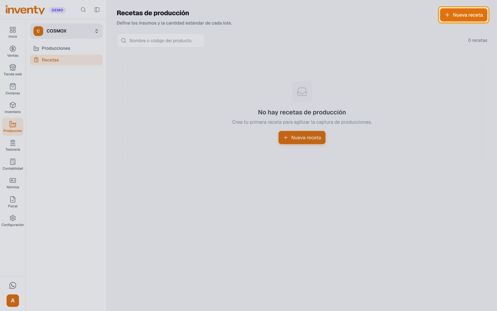
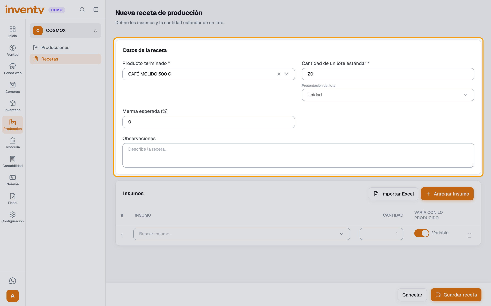
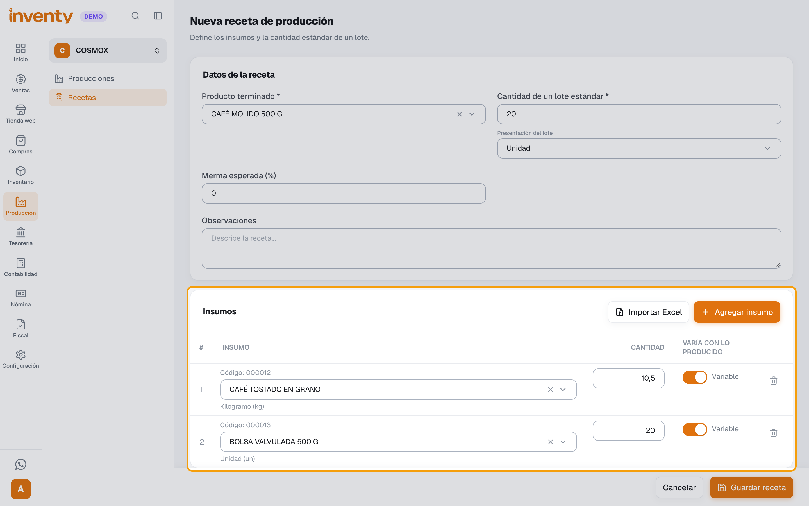
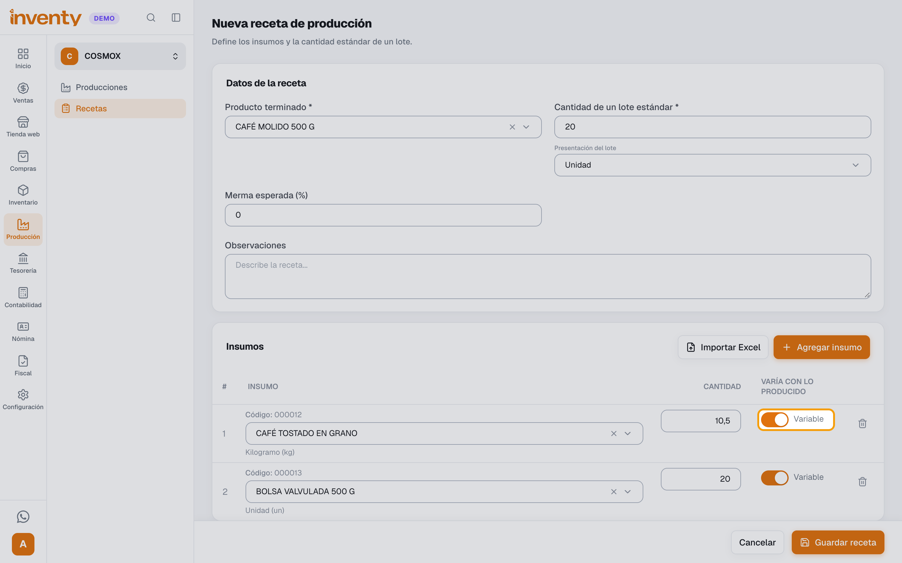
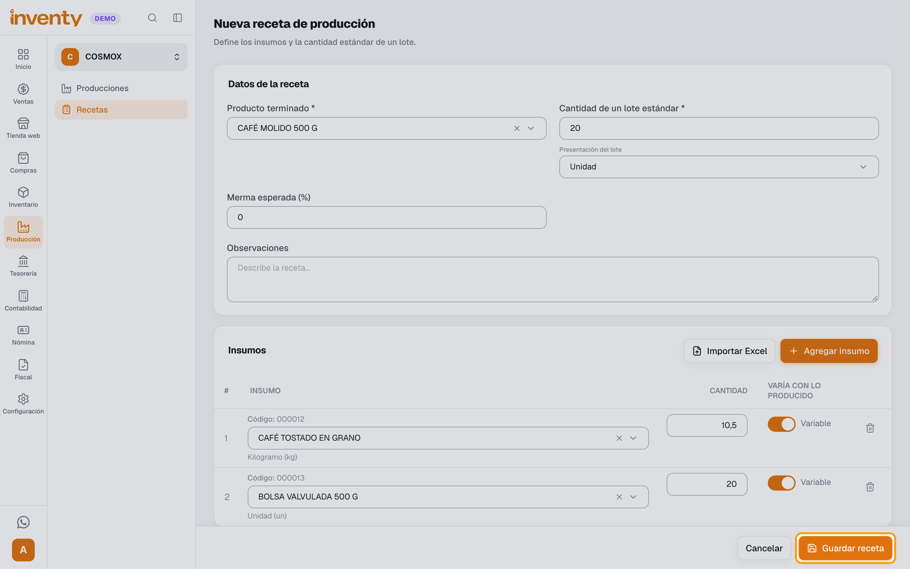

# ¿Cómo creo una receta de producción?

También se busca como: receta, fórmula, lista de materiales, insumos por producto, materia prima, lote estándar, merma, BOM.

**Antes de empezar:** el producto terminado y sus insumos deben existir como productos. Ver [¿Cómo creo un producto?](../productos-inventario/crear-producto.md).

## Pasos

**Paso 1.** Ingresa a Producción › Recetas y haz clic en **Nueva receta**.

**Paso 2.** Elige el **Producto terminado** y escribe la **Cantidad de un lote estándar** (ej. *20* bolsas de café molido). Si sueles perder parte de la producción, escribe la **Merma esperada (%)**.

**Paso 3.** En **Insumos**, busca cada insumo y escribe la cantidad que gasta un lote estándar. Usa **Agregar insumo** para sumar filas. Los decimales van con coma (ej. *10,5* kg).

**Paso 4.** En **Varía con lo producido**, deja **Variable** si el insumo crece con la cantidad producida (ej. café, bolsas). Cámbialo a **Base** si se gasta igual sin importar cuánto produzcas.

**Paso 5.** Haz clic en **Guardar receta**.

✅ **Listo:** la receta aparece en **Recetas de producción**. Desde allí puedes usar **Producir** para registrar una producción con sus insumos ya cargados.

## Si algo falla

| Problema | Solución |
|---|---|
| *Este producto ya tiene una receta de producción.* | Cada producto tiene una sola receta. Edita la existente o usa **Clonar** para crear otra parecida. |
| *El producto terminado no puede ser también un insumo de la receta.* | Quita el producto terminado de la lista de insumos. |
| *El producto terminado no puede ser un servicio.* o *El insumo no puede ser un servicio.* | Producción solo admite productos que manejan inventario. |
| *Los kits solo se pueden vender y no pueden producirse.* | Los kits no se producen ni sirven como insumo. Usa un producto normal. |
| *El insumo tiene variantes; usa el código de una variante específica.* | Elige la variante exacta (ej. talla o color), no el producto padre. |
| La cantidad quedó multiplicada (ej. *105* en vez de *10,5*) | Escribe los decimales con **coma**, no con punto. |

## Relacionados

- [¿Cómo registro una producción?](registrar-produccion.md)
- [Producción](index.md)
