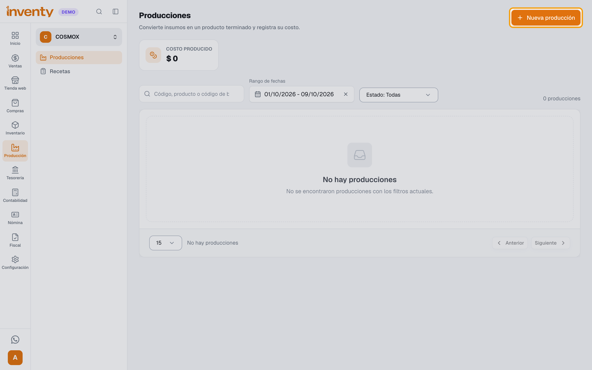
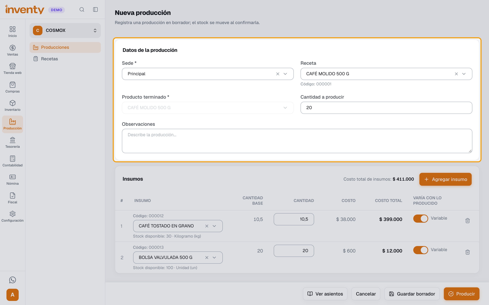
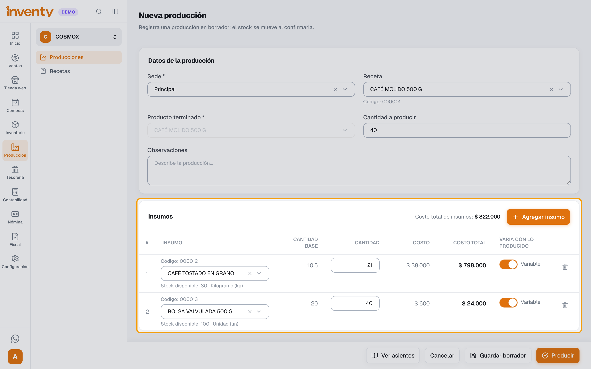
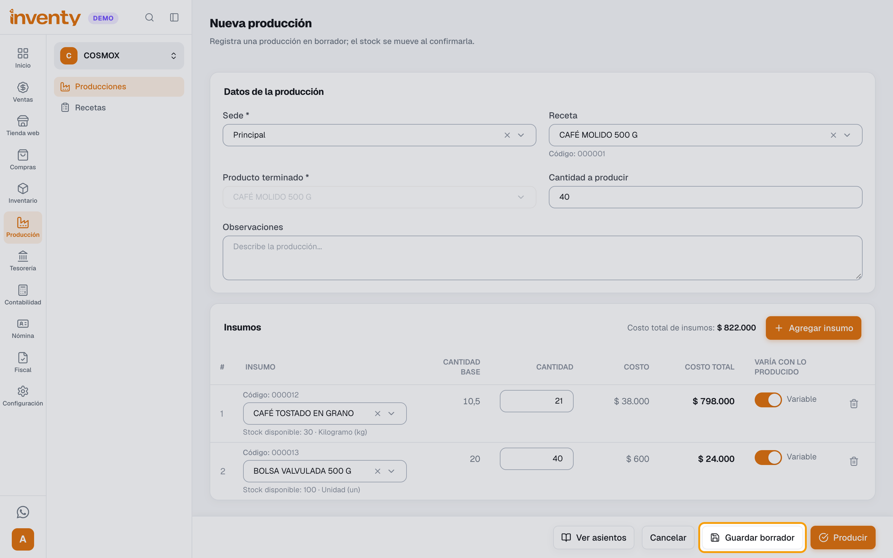
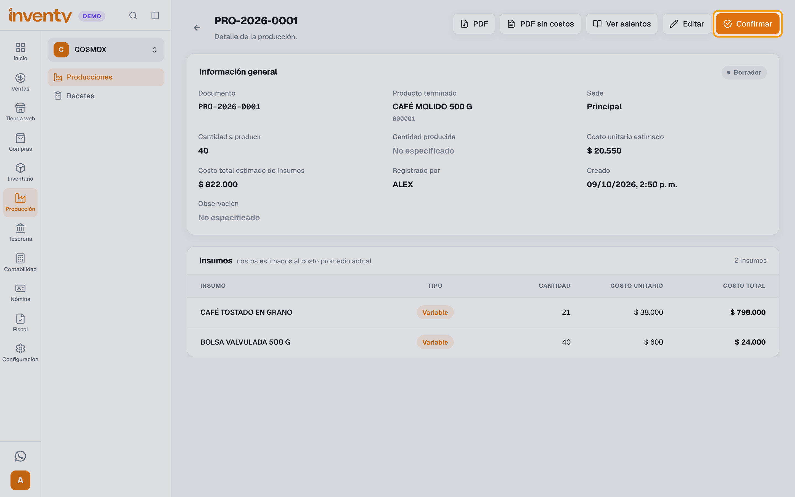
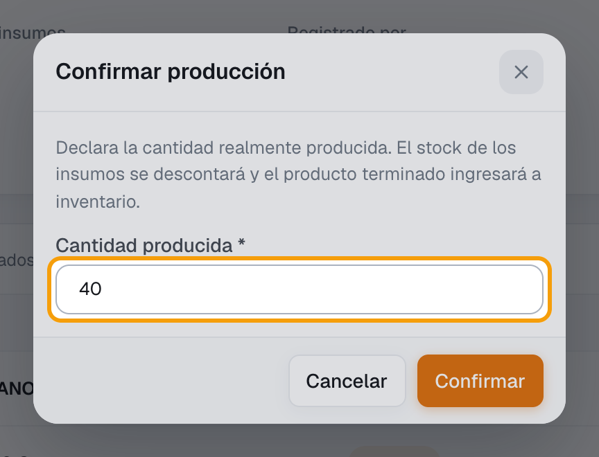
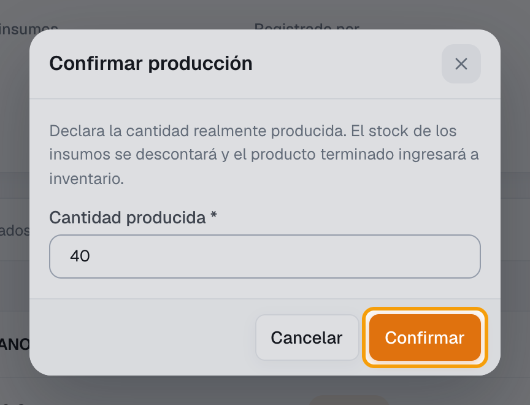
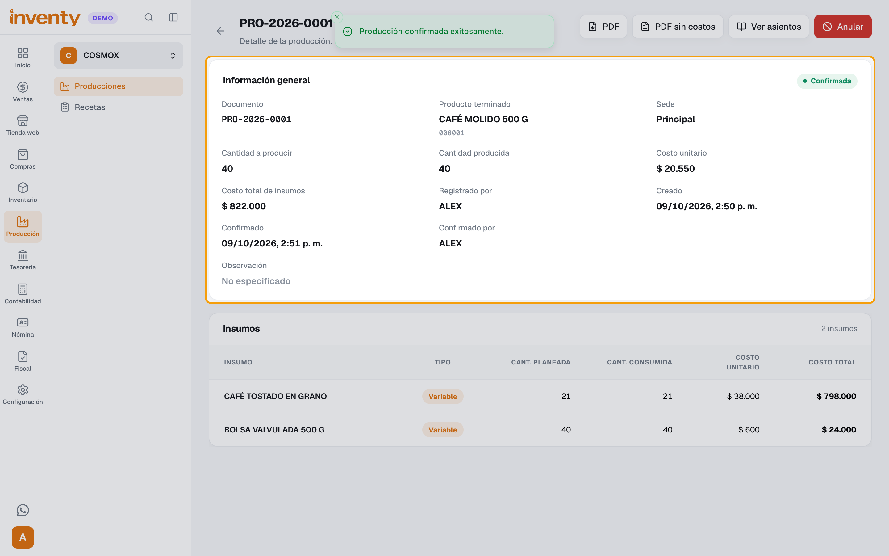

# ¿Cómo registro una producción?

También se busca como: producir, fabricar, orden de producción, transformar insumos, sacar materia prima, entrada de producto terminado, costo de producción, confirmar producción.

**Antes de empezar:** crea la [receta del producto](crear-receta.md) y verifica que haya existencias de los insumos en la sede.

## Pasos

**Paso 1.** Ingresa a Producción › Producciones y haz clic en **Nueva producción**.

**Paso 2.** Revisa la **Sede** y elige la **Receta**. Inventy llena el **Producto terminado**, la **Cantidad a producir** y los insumos.

**Paso 3.** Cambia la **Cantidad a producir** si vas a producir más o menos de un lote (ej. *40*). Las cantidades de los insumos se ajustan solas; revisa el **Stock disponible** de cada uno.

**Paso 4.** Haz clic en **Guardar borrador**. El inventario todavía no se mueve.

**Paso 5.** Cuando termines de producir, abre la producción en **Borrador** y haz clic en **Confirmar**.

**Paso 6.** Escribe la **Cantidad producida** (lo que realmente salió).

**Paso 7.** Haz clic en **Confirmar**.

**Paso 8.** Revisa el **Costo unitario** y el **Costo total de insumos** en **Información general**.

✅ **Listo:** la producción queda **Confirmada**: salen los insumos del inventario y entra el producto terminado con su costo.

!!! tip "¿Ya produjiste?"
    En el paso 4 puedes usar **Producir** en lugar de **Guardar borrador**: Inventy pide la **Cantidad producida** y confirma de una vez.

## Si algo falla

| Problema | Solución |
|---|---|
| *La cantidad supera el stock disponible en la sede.* | Revisa la **Sede** o ingresa los insumos que faltan (compra o [ajuste de inventario](../productos-inventario/ajuste-inventario.md)). |
| *Stock insuficiente de "…": se requieren … pero solo hay … disponibles.* | Produce menos o deja pendiente el resto al confirmar (**Dejar pendientes las … restantes**). |
| *El lote y la fecha de vencimiento son requeridos para este producto.* | Escribe el lote y la **Fecha de vencimiento** del producto terminado en la ventana de confirmación. |
| No aparece **Confirmar** | Solo se confirman producciones en **Borrador**, y tu rol necesita el permiso **Crear producciones**. |
| Me equivoqué en una producción confirmada | Usa **Anular** (permiso **Anular producciones**) y regístrala de nuevo. |

## Relacionados

- [¿Cómo creo una receta de producción?](crear-receta.md)
- [¿Cuánto inventario tengo?](../productos-inventario/consultar-existencias.md)
- [Producción](index.md)
