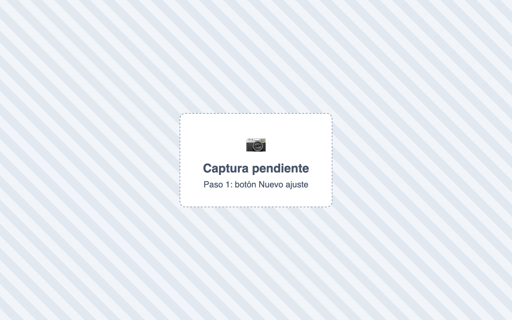
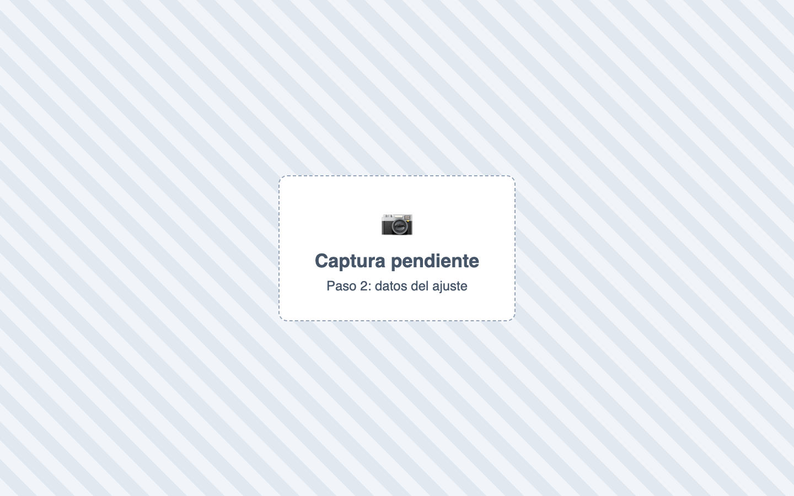
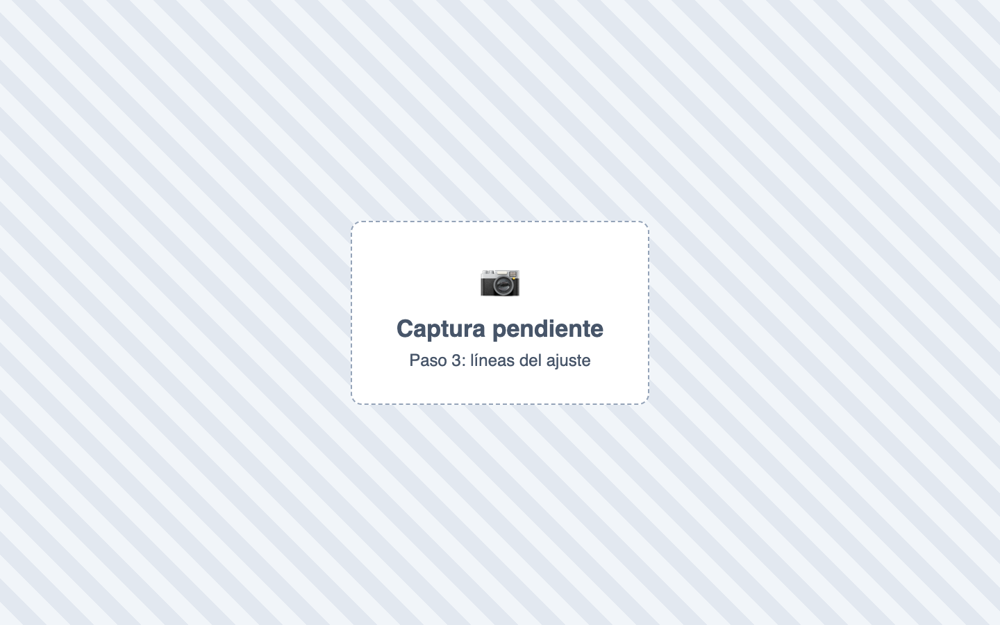
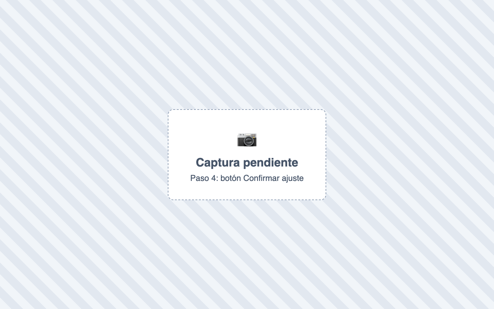

# ¿Cómo hago un ajuste de inventario?

También se busca como: corregir inventario, entrada de inventario, salida de inventario, dar de baja, producto dañado, pérdida, sobrante, inventario inicial, cargar existencias.

## Pasos

**Paso 1.** Ingresa a Inventario › Ajuste de inventario y haz clic en **Nuevo ajuste**.

**Paso 2.** Elige la **Sede** y escribe el motivo (ej. *Inventario inicial*).

**Paso 3.** Haz clic en **Agregar linea**, elige el **Tipo de ajuste** (entrada o salida), el producto y la cantidad. Repite por cada producto.

**Paso 4.** Haz clic en **Confirmar ajuste** y confirma.

✅ **Listo:** el ajuste queda **Completado** y el stock cambia. Ya no se puede editar.

## Si algo falla

| Problema | Solución |
|---|---|
| *Stock insuficiente…* | Estás sacando más de lo que hay en esa sede. Revisa cantidad y sede. |
| *El ajuste deja stock por debajo del reservado.* | Parte del stock está reservado (pedido o traslado). Saca menos. |
| Me equivoqué en un ajuste confirmado | Haz otro ajuste en sentido contrario, o pide que lo anulen (permiso **Anular ajustes de inventario**). |
| ¿Muchos productos? | Usa **Importar ajuste**. |

## Relacionados

- [¿Cuánto inventario tengo?](consultar-existencias.md)
