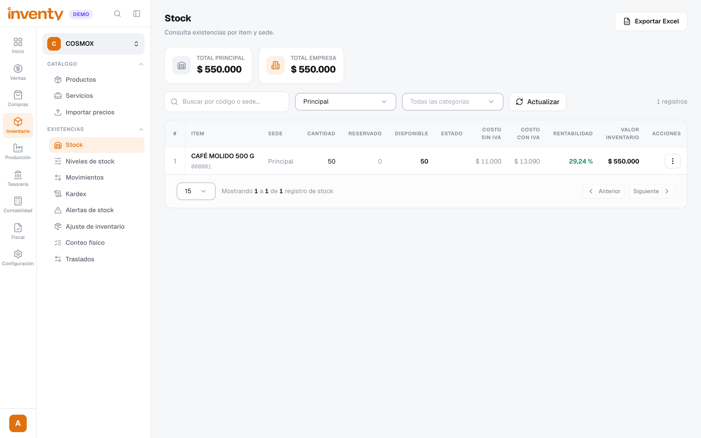
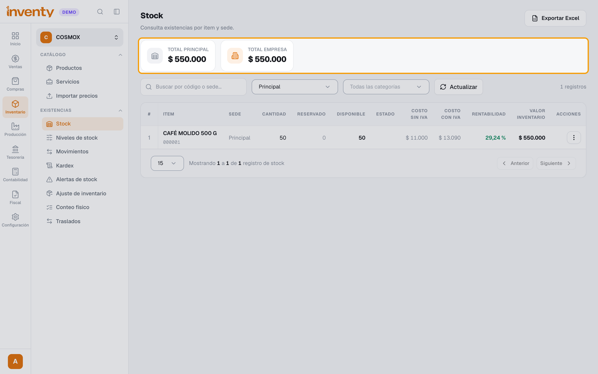
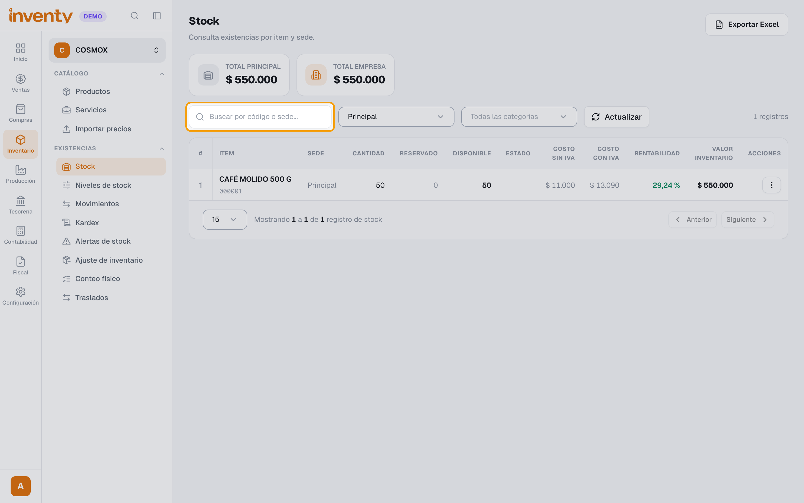
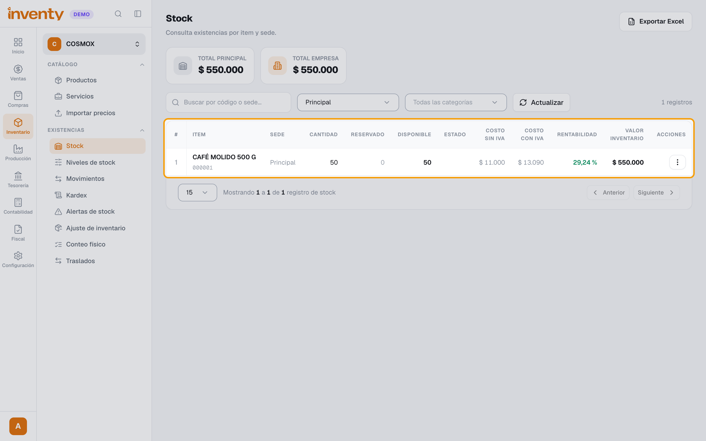
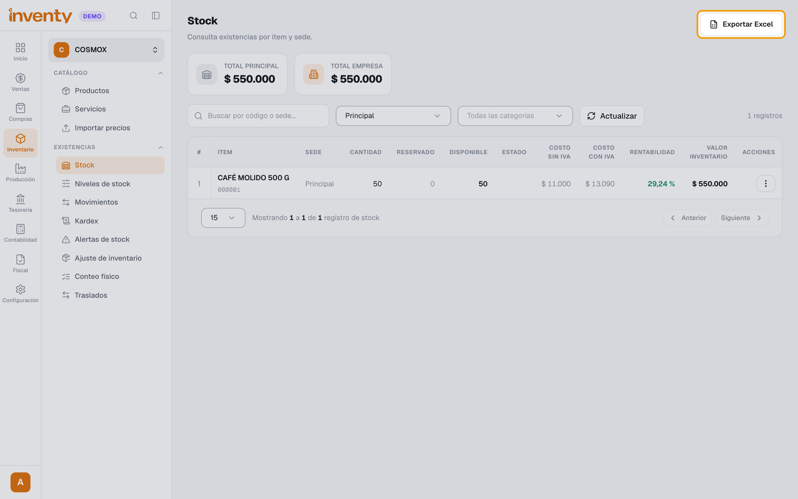

# ¿Cuánto inventario tengo?

También se busca como: existencias, stock, saldo de inventario, cuánto me queda, unidades disponibles, valor del inventario, inventario por bodega.

## Pasos

**Paso 1.** Ingresa a Inventario › Stock.

**Paso 2.** Mira arriba el valor del inventario: el total de la sede elegida y el **Total empresa** (todas las sedes).

**Paso 3.** Busca el producto en **Buscar por código o sede...**, o filtra por sede y categoría. Usa **Actualizar** para recargar.

**Paso 4.** Revisa la fila: **Cantidad**, **Reservado** (apartado para pedidos o traslados), **Disponible** (lo que puedes vender), **Costo sin IVA**, **Costo con IVA**, **Rentabilidad** y **Valor Inventario**. En **Acciones** verás más detalle.

**Paso 5.** (Opcional) Haz clic en **Exportar Excel**.

✅ **Listo:** conoces las unidades y el valor de cada producto por sede.

## Si algo falla

| Problema | Solución |
|---|---|
| *No hay stock registrado* | Aún no hay movimientos: registra una compra o un ajuste de entrada. |
| Un producto no aparece | Puede estar marcado **No maneja inventario** o no tener movimientos. |
| No cuadra con la bodega | Revisa el **Kardex** del producto y haz un **Conteo físico** o un [ajuste](ajuste-inventario.md). |
| Productos por agotarse | Inventario › Alertas de stock. |

## Relacionados

- [¿Cómo hago un ajuste de inventario?](ajuste-inventario.md)
- [¿Cómo hago un traslado entre sedes?](traslados.md)
