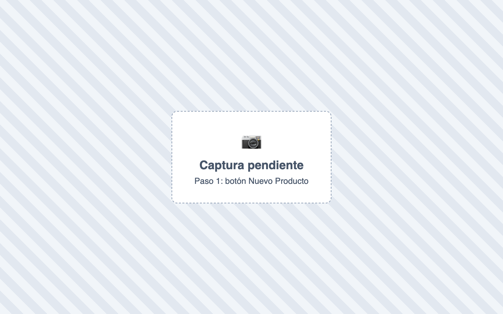
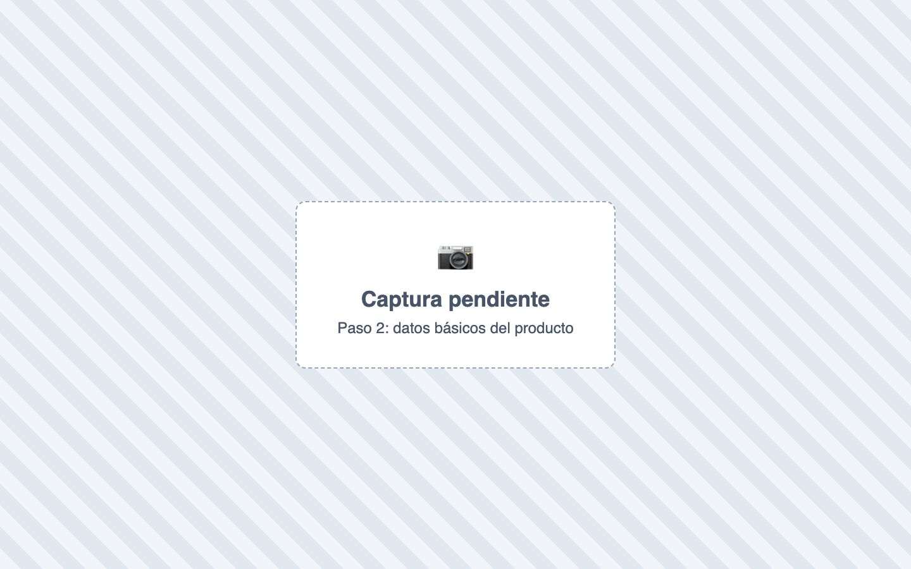
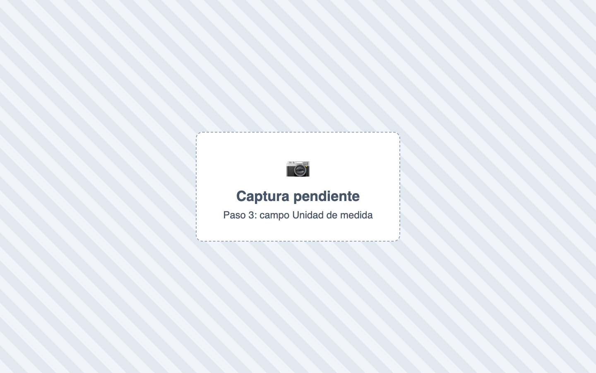
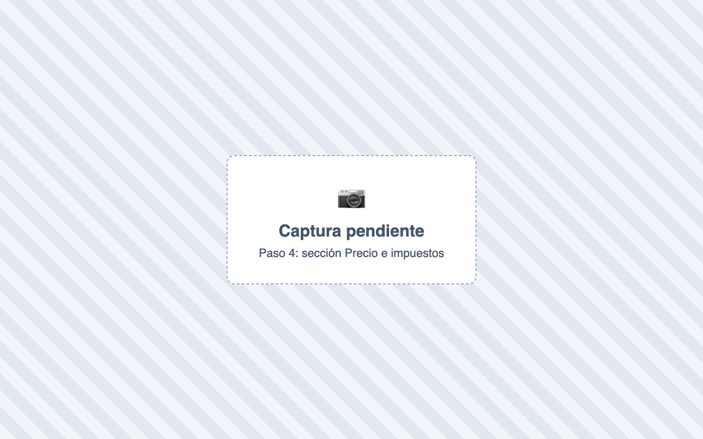
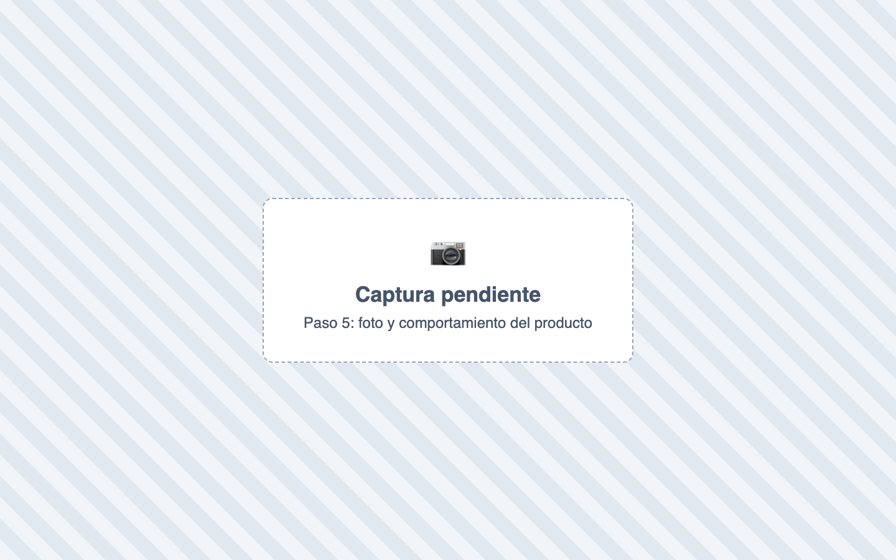
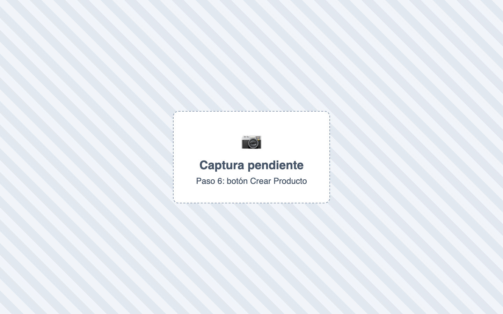

# ¿Cómo creo un producto?

También se busca como: nuevo producto, agregar artículo, crear ítem, registrar mercancía, código de barras, precio de venta, referencia.

**Antes de empezar:** debe existir la unidad de medida y, si usas contabilidad, el [catálogo de impuestos](../impuestos/catalogo-impuestos.md).

## Pasos

**Paso 1.** Ingresa a Inventario › Productos y haz clic en **Nuevo Producto**.

**Paso 2.** Escribe el **Código de barras** (o escanéalo), el **Nombre** y, si quieres, la **Descripción** y la **Categoría**.

**Paso 3.** Elige la **Unidad de medida**.

**Paso 4.** En **Precio e impuestos**, escribe el **Precio de venta** y el **Costo inicial**, y elige el **Catálogo de impuestos**.

**Paso 5.** (Opcional) Sube la foto en **Ilustración del producto** y activa lo que aplique en **Comportamiento del producto** (kit, obsequio, seriales, lotes, no maneja inventario).

**Paso 6.** Haz clic en **Crear Producto**.

✅ **Listo:** el producto aparece en la lista. Para darle existencias, registra una [compra](../compras/registrar-factura-compra.md) o un [ajuste de entrada](ajuste-inventario.md).

## Si algo falla

| Problema | Solución |
|---|---|
| *El nombre es requerido.* / *La unidad de medida es requerida.* | Completa esos campos. |
| *El código de barras ya existe en el sistema.* | Otro producto usa ese código: búscalo en la lista. |
| No me deja guardar sin catálogo de impuestos | Si usas contabilidad es obligatorio. [Créalo](../impuestos/catalogo-impuestos.md). |
| *El tipo de producto es requerido.* | Tu empresa usa Restaurante: elige el **Tipo de producto**. |
| *La imagen no debe superar los 8MB.* | Usa una imagen más liviana (PNG, JPG o WebP). |
| *La funcionalidad de lotes… está deshabilitada.* | Actívala en Configuración › Módulos › Inventario. |
| ¿Muchos productos? | Usa **Importar productos** en la lista de productos. |

## Relacionados

- [¿Cuánto inventario tengo?](consultar-existencias.md)
- [¿Qué es y cómo creo un catálogo de impuestos?](../impuestos/catalogo-impuestos.md)
