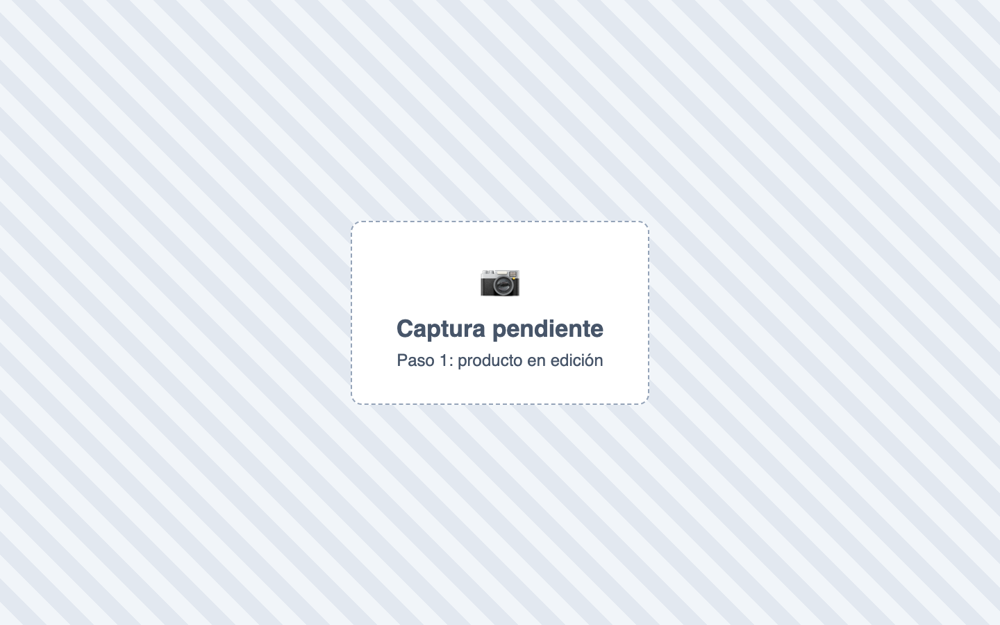
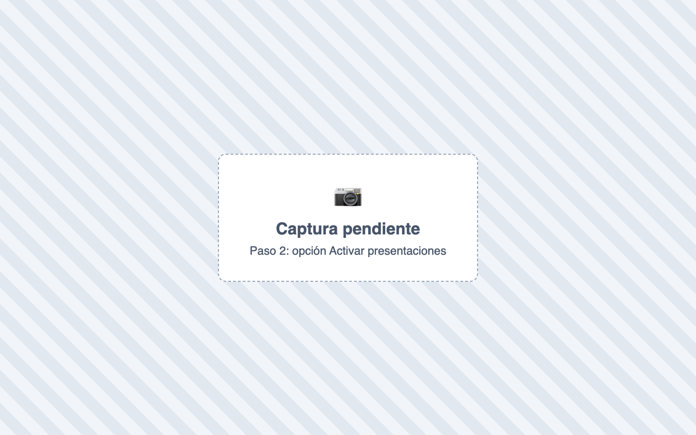
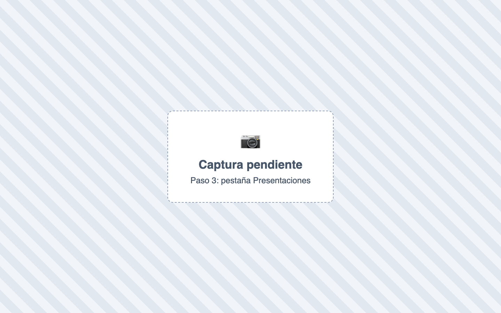
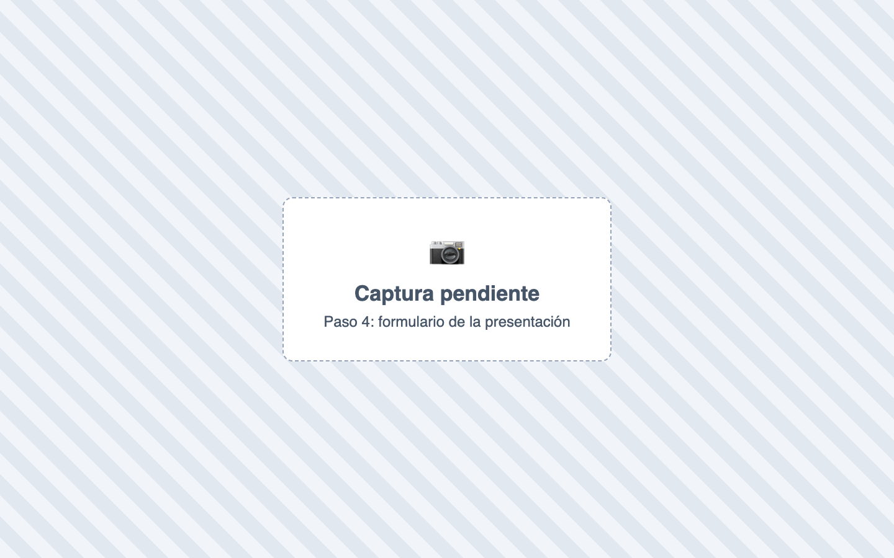
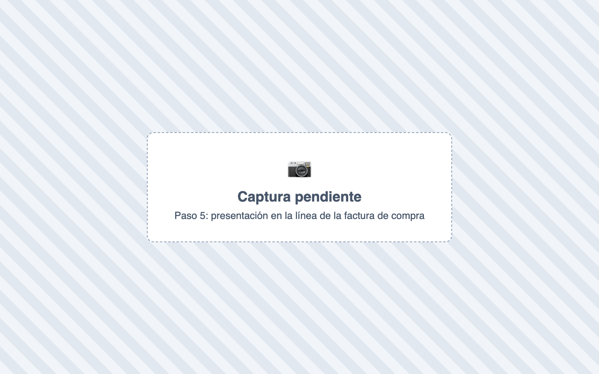
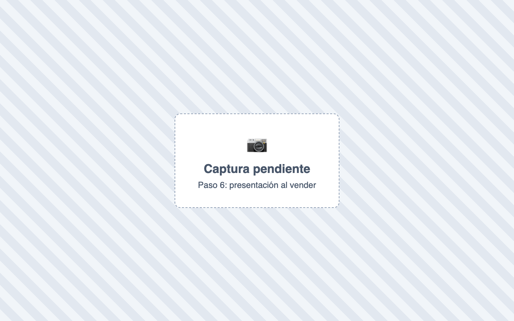
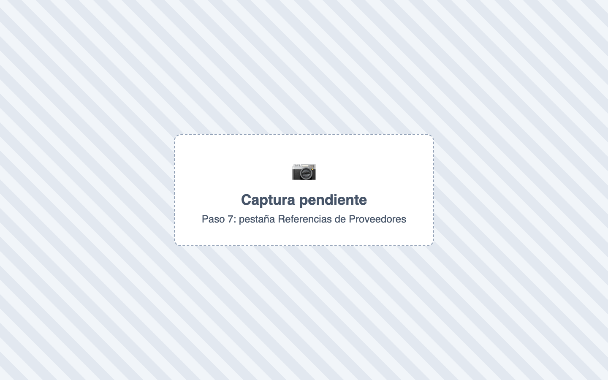
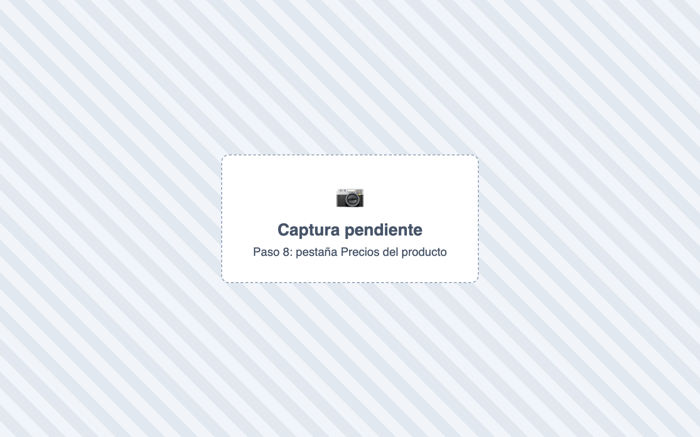

# ¿Cómo manejo las presentaciones de compra y de venta?

También se busca como: presentación, empaque, caja, paquete, blíster, unidad de compra, unidad de venta, factor de conversión, vender por caja, comprar por caja, código del proveedor, referencia del proveedor, precio por caja.

**Qué es:** un empaque del producto (caja, paquete, blíster) con su propio código de barras y precio. **No hay presentaciones separadas de compra y de venta**: las mismas sirven para las dos.

**Antes de empezar:** activa **Presentaciones** en Configuración › Módulos › Inventario.

## Pasos

**Paso 1.** Ingresa a Inventario › Productos, abre el producto y edítalo.

**Paso 2.** En **Comportamiento del producto**, haz clic en **Activar presentaciones** y guarda.

**Paso 3.** Abre la pestaña **Presentaciones** y haz clic en **Agregar presentación**.

**Paso 4.** Completa **Unidad** (ej. *Caja*), **Factor** (cuántas unidades trae, ej. *12*), **Código de barras** del empaque y, si quieres, su **Precio de venta**. Guarda.

**Paso 5.** **Para comprar:** en la factura de compra, en la línea del producto elige la presentación y escribe cuántos empaques compras.

**Paso 6.** **Para vender:** en el POS escanea el código del empaque o elige la presentación. También se elige en la factura de venta y en las preventas.

**Paso 7.** **Proveedores:** en la pestaña **Referencias de Proveedores**, haz clic en **Agregar Referencia**, elige el **Proveedor** y escribe su **Código de referencia** (el código con que él llama a tu producto).

**Paso 8.** **Clientes:** en la pestaña **Precios**, haz clic en **Añadir precio**, elige la **lista de precios**, la **presentación** y la **sede**, y escribe el precio. Asigna esa lista al cliente en su ficha.

✅ **Listo:** el producto se compra y se vende por empaque, y el inventario siempre se lleva en unidades.

!!! info "Cómo se relaciona todo"
    | | Qué se usa | Ejemplo |
    |---|---|---|
    | **Presentación** | Es del **producto** y sirve igual para comprar y vender. | *Caja x 12*, factor 12 |
    | **Inventario** | Siempre en la unidad base. | Comprar 5 cajas = entran **60 unidades** |
    | **Costo** | El precio del empaque se divide por el factor. | Caja a $24.000 → **$2.000** por unidad |
    | **Proveedor** | **Referencia** (su código para tu producto). Sirve para reconocer el producto al subir su XML. | Código *1023* |
    | **Cliente** | **Lista de precios** con precio por presentación y sede. | Caja más barata para mayoristas |

    **Precio que se cobra:** 1) la lista del cliente → 2) en el POS, la lista de la caja → 3) el precio de la presentación (o precio unitario × factor si no tiene).

## Si algo falla

| Problema | Solución |
|---|---|
| No aparece la pestaña **Presentaciones** | Actívala en Configuración › Módulos › Inventario y en el producto (**Activar presentaciones**). |
| *Selecciona una unidad diferente a la unidad base del producto.* | La presentación debe tener otra unidad (Caja, Paquete…). |
| No aparece **Referencias de Proveedores** | Solo existe si el módulo **Compras** está activo. |
| No aparece la pestaña **Precios** | Activa **Habilitar listas de precios** en Configuración › Módulos › Ventas. |
| *Ya existe un precio para esta lista/presentación/sede.* | Ese precio ya está creado: edítalo en vez de agregar otro. |
| Al subir el XML del proveedor no elige la caja | La referencia del proveedor identifica el **producto**, no el empaque. Elige tú la presentación en esa línea. |
| El costo promedio quedó muy alto | Revisa que en la compra elegiste la presentación: el costo se divide por el **Factor** solo si la línea tiene la presentación. |
| Muchos productos con empaques | Usa Inventario › Importar presentaciones. |

## Relacionados

- [¿Cómo creo un producto?](crear-producto.md)
- [¿Cómo registro una factura de compra?](../compras/registrar-factura-compra.md)
- [¿Cómo vendo en el POS?](../pos/vender-en-pos.md)
