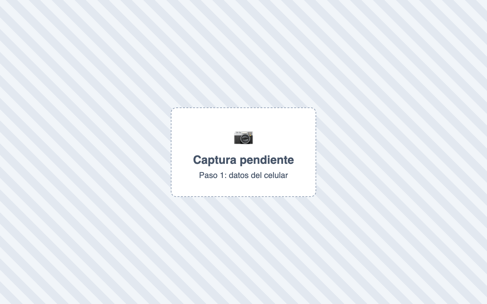
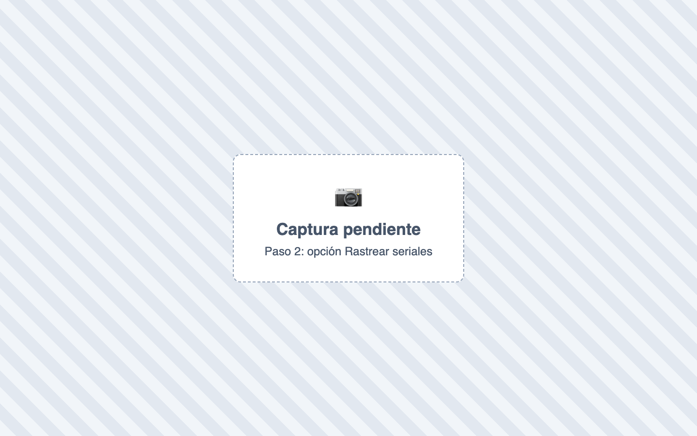
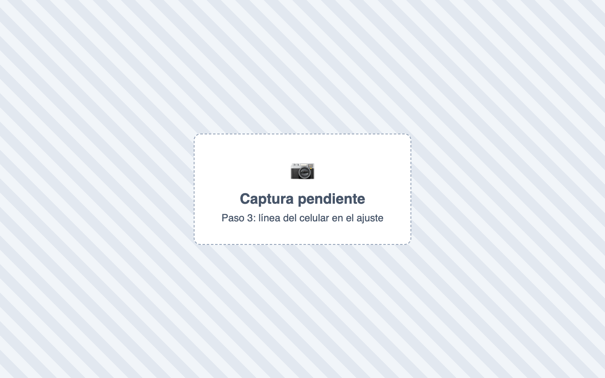
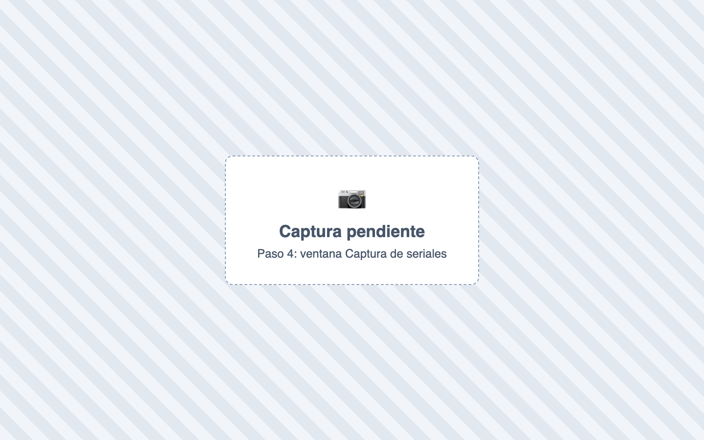
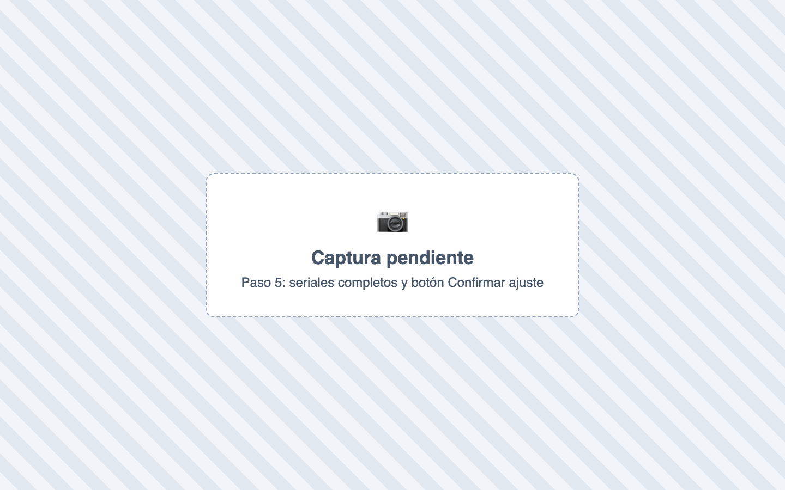
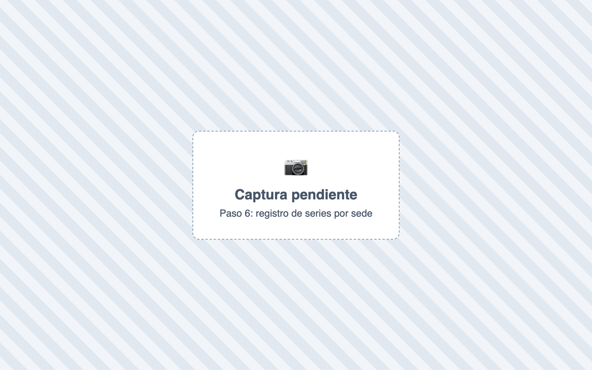
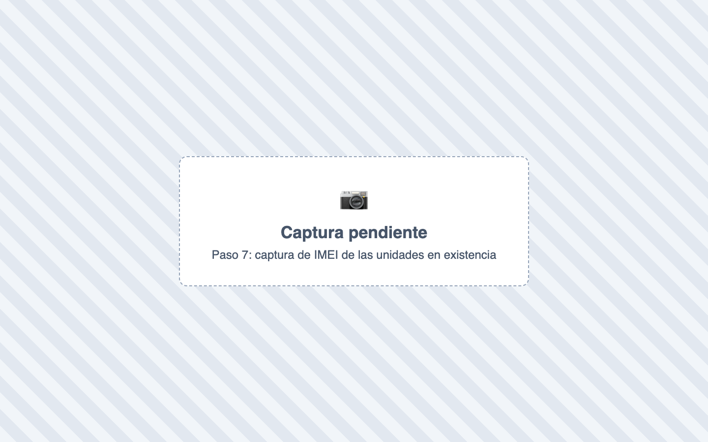

# ¿Cómo registro un celular con su IMEI?

También se busca como: IMEI, serial, número de serie, celulares, equipos, IMEI1, IMEI2, controlar celulares por IMEI.

**Antes de empezar:** activa **Seriales** en Configuración › Módulos › Inventario.

## Pasos

**Crear el celular**

**Paso 1.** Ingresa a Inventario › Productos, haz clic en **Nuevo Producto** y completa sus datos ([¿Cómo creo un producto?](crear-producto.md)).

**Paso 2.** En **Comportamiento del producto**, activa **Rastrear seriales** y haz clic en **Crear Producto**.

**Opción A: registrar los IMEI con un ajuste de inventario**

**Paso 3.** Ingresa a Inventario › Ajuste de inventario, haz clic en **Nuevo ajuste**, busca el celular y escribe la **cantidad** y el **costo**. En la línea aparece **0 / 2 seriales**.

**Paso 4.** Haz clic en **0 / 2 seriales**. En **Captura de seriales**, escribe el **Tipo** (**IMEI1**, **IMEI2** o **SERIAL**) y el **Valor**, y presiona Enter. Agrega todos los identificadores del equipo y haz clic en **Guardar equipo y continuar con el siguiente**. Repite con cada celular.

**Paso 5.** Cuando la línea diga **2 / 2 seriales**, haz clic en **Confirmar ajuste**.

**Opción B: el celular ya tiene existencias (desde el formulario del producto)**

**Paso 6.** En Inventario › Productos, edita el celular y activa **Rastrear seriales**. Aparece **Registro de series por sede**.

**Paso 7.** Haz clic en **Registrar** en cada sede, captura el IMEI de cada unidad como en el paso 4 y haz clic en **Actualizar Producto**.

✅ **Listo:** cada celular queda identificado por su IMEI. Al vender o devolver, Inventy te pide elegir el equipo exacto.

!!! tip "También al comprar"
    En la factura de compra, las líneas de celulares con **Rastrear seriales** también piden capturar el IMEI de cada unidad que entra.

## Si algo falla

| Problema | Solución |
|---|---|
| No aparece **Rastrear seriales**. | Activa **Seriales** en Configuración › Módulos › Inventario. |
| No me deja activar **Rastrear seriales** al crear el producto. | Solo se activa con stock en cero. Si ya tiene existencias, usa la Opción B. |
| *Escribe el tipo y el valor del identificador.* | Completa **Tipo** y **Valor** antes de presionar Enter. |
| *Agrega al menos un identificador para este equipo.* | Cada celular necesita al menos un IMEI o serial. |
| No me deja confirmar el ajuste. | La cantidad de seriales debe ser igual a la cantidad de la línea. |

## Relacionados

- [¿Cómo creo un producto?](crear-producto.md)
- [¿Cómo hago un ajuste de inventario?](ajuste-inventario.md)
