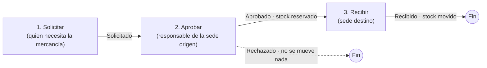

# ¿Cómo hago un traslado entre sedes?

También se busca como: traslado de inventario, trasladar mercancía, mover productos de bodega, transferencia entre sedes, pasar inventario a otra tienda, enviar mercancía, recibir traslado.

## ¿Para qué sirve?

Para **mover mercancía de una sede a otra** (por ejemplo, de la bodega principal a un punto de venta) sin registrar una compra ni una venta. Inventy descuenta las unidades en la sede de origen y las suma en la de destino, conservando su costo.

## ¿Cómo funciona? (de principio a fin)

Un traslado pasa por **tres personas o momentos** y cambia de estado en cada uno:

| Estado | Qué significa | ¿Se movió el stock? |
|---|---|---|
| **Borrador** | Creado pero no enviado. Se puede editar o eliminar. | No |
| **Solicitado** | Enviado. Espera la aprobación de la sede de origen. Ya no se puede editar. | No |
| **Aprobado** | La sede de origen lo aprobó y despachó. Las unidades quedan **reservadas** en el origen. | Reservado en el origen |
| **Recibido** | La sede de destino confirmó que llegó. | **Sí**: sale del origen y entra al destino |
| **Rechazado** | La sede de origen no lo aprobó. | No |

## Antes de comenzar

- [ ] Tu empresa debe tener activo el módulo **Inventario** y al menos **dos sedes**.
- [ ] La sede de origen debe tener **existencias** de los productos. Ver [¿Cuánto inventario tengo?](consultar-existencias.md).
- [ ] Cada persona necesita su permiso **y estar asignada a la sede correcta** (en Configuración › Usuarios):

| Paso | Quién lo hace | Permiso | Condición de sede |
|---|---|---|---|
| Solicitar | Cualquier usuario autorizado | **Crear traslados de inventario** | — |
| Aprobar | Responsable de la sede **origen** | **Aprobar traslados de inventario** | Su sede debe ser la de **origen**. **No puede ser quien lo solicitó.** |
| Rechazar | Responsable de la sede **origen** | **Rechazar traslados de inventario** | Su sede debe ser la de **origen**. |
| Recibir | Responsable de la sede **destino**, o quien lo solicitó | **Confirmar recepción de traslados** | Su sede debe ser la de **destino** (quien lo solicitó siempre puede recibirlo). |

## Paso a paso

### Etapa 1. Solicitar el traslado

**Paso 1.** Ingresa a Inventario › Traslados y haz clic en **Nuevo traslado**.

**Paso 2. Datos del traslado.** Selecciona la **Sede de origen** (de dónde sale la mercancía) y la **Sede de destino** (a dónde llega). Si quieres, describe el motivo.

!!! captura "CAPTURA PENDIENTE"
    Formulario de traslado con Sede de origen, Sede de destino y dos productos agregados.

**Paso 3. Productos a trasladar.** Haz clic en **Agregar producto**, busca el producto y escribe la cantidad. Puedes agregar una nota a cada línea. Repite para cada producto.

**Paso 4.** Elige:

- **Guardar borrador**: queda guardado para terminarlo después.
- **Solicitar traslado**: lo envías a la sede de origen. Aparece el aviso *“El traslado quedara pendiente de aprobacion por la sede de origen y ya no podras editarlo.”* Confirma.

!!! tip "Si lo guardaste como borrador"
    Desde la lista, usa **Solicitar** en las acciones del traslado, o ábrelo y usa **Enviar**.

### Etapa 2. Aprobar (o rechazar) en la sede de origen

La persona responsable de la **sede de origen** ve los traslados pendientes. El menú **Traslados** muestra un **contador** con los que esperan acción.

**Paso 5.** Ingresa a Inventario › Traslados, filtra por estado **Solicitado** y abre el traslado.

**Paso 6.** Revisa los **Productos del traslado**. Para cada producto puedes ajustar la **cantidad aprobada**, es decir, lo que **realmente vas a enviar**:

- Si envías menos de lo solicitado, escribe la cantidad real y, si quieres, una nota del aprobador.
- Si **no envías** un producto, déjalo en **0** y explica el motivo (*“Motivo por el que no se envía...”*).

**Paso 7.** Haz clic en **Aprobar**. Lee el aviso: *“Se reservará el stock de la sede origen según la cantidad aprobada de cada producto. Esta acción no se puede deshacer.”* Confirma con **Aprobar**.

!!! captura "CAPTURA PENDIENTE"
    Detalle del traslado en estado Solicitado, con la columna de cantidad aprobada editable y el botón **Aprobar**.

**Si no se puede enviar**, usa **Rechazar**, escribe el **Motivo del rechazo** (opcional) y confirma. *“El traslado sera rechazado y no se movera stock.”*

### Etapa 3. Recibir en la sede de destino

Cuando la mercancía **llega físicamente** a la sede de destino:

**Paso 8.** La persona de la sede de destino (o quien solicitó el traslado) abre el traslado en estado **Aprobado**.

**Paso 9.** **Cuenta la mercancía recibida** y compárala con la **Cantidad aprobada**.

**Paso 10.** Haz clic en **Recibir** y confirma en **Confirmar recepcion**: *“Se liberara la reserva del origen y el stock pasara a la sede destino. Esta accion no se puede deshacer.”*

## Resultado esperado

- El traslado queda **Recibido**. En su detalle verás quién lo **solicitó**, **aprobó** y **recibió**, y los **Movimientos generados**.
- En Inventario › Stock, las unidades **bajan en la sede de origen** y **suben en la de destino**.
- En **Movimientos** y **Kardex** verás una **salida** en el origen y una **entrada** en el destino.
- Si el producto maneja **lotes**, Inventy traslada automáticamente los lotes que vencen primero, con su misma fecha de vencimiento.
- Puedes descargar el traslado en **PDF** desde su detalle (por ejemplo, para que viaje con la mercancía).

!!! info "Entre la aprobación y la recepción"
    Las unidades aprobadas quedan **reservadas** en la sede de origen: siguen ahí físicamente en el sistema, pero **no se pueden vender ni usar** en otro movimiento. Por eso es importante **recibir el traslado apenas llegue la mercancía**.

## Problemas frecuentes

??? question "No me aparece el botón Aprobar"
    Revisa las tres condiciones:

    1. Tienes el permiso **Aprobar traslados de inventario**.
    2. Tu usuario está asignado a la **sede de origen** del traslado.
    3. **No fuiste tú quien lo solicitó.** Quien solicita no puede aprobar su propio traslado: debe hacerlo otra persona de la sede de origen.

    Además, el traslado debe estar en estado **Solicitado**.

??? question "No me aparece el botón Recibir"
    El traslado debe estar **Aprobado**, y tú debes ser quien lo solicitó o tener el permiso **Confirmar recepción de traslados** y estar asignado a la **sede de destino**.

??? question "“Stock insuficiente en la sede de origen para «Producto».”"
    Al aprobar, la sede de origen no tiene suficientes unidades **disponibles** (sin contar las reservadas). Aprueba una cantidad menor, deja el producto en 0 o revisa el [stock](consultar-existencias.md).

??? question "“La sede de origen y destino no pueden ser la misma.”"
    Elige sedes diferentes.

??? question "“El traslado debe tener al menos un ítem.”"
    Agrega al menos un producto antes de solicitarlo.

??? question "Me equivoqué en un traslado ya solicitado"
    Ya no se puede editar. Pide a la sede de origen que lo **rechace** y crea uno nuevo. Para no volver a digitar los productos, usa **Clonar**: crea un borrador nuevo con los mismos productos.

??? question "Llegó menos mercancía de la aprobada"
    La recepción confirma **la cantidad aprobada completa**; no se puede recibir parcialmente. Antes de recibir, habla con la sede de origen. Si la diferencia es real, recibe el traslado y registra la diferencia con un [ajuste de inventario](ajuste-inventario.md) de salida en la sede de destino, explicando el motivo. [PENDIENTE DE VALIDACIÓN FUNCIONAL: confirmar con el equipo de producto el procedimiento recomendado.]

??? question "Hay unidades reservadas y no sé por qué"
    Puede haber traslados **Aprobados** sin recibir. En Inventario › Stock, usa **Ver detalle** del producto para ver el origen de la reserva, y pide a la sede de destino que reciba el traslado.

## ¿Necesitas ayuda?

[Contacta a soporte](../soporte.md) si un traslado quedó bloqueado en un estado y nadie puede continuarlo. Envía el **código del traslado**, las **sedes de origen y destino**, y el **usuario** que intenta aprobar o recibir.

## Artículos relacionados

- [¿Cuánto inventario tengo?](consultar-existencias.md)
- [¿Cómo hago un ajuste de inventario?](ajuste-inventario.md)
- [¿Cómo agrego usuarios a mi empresa?](../primeros-pasos/crear-usuarios.md) (asignar la sede a cada usuario)
- [¿Cómo funcionan los roles y permisos?](../primeros-pasos/roles-y-permisos.md)
