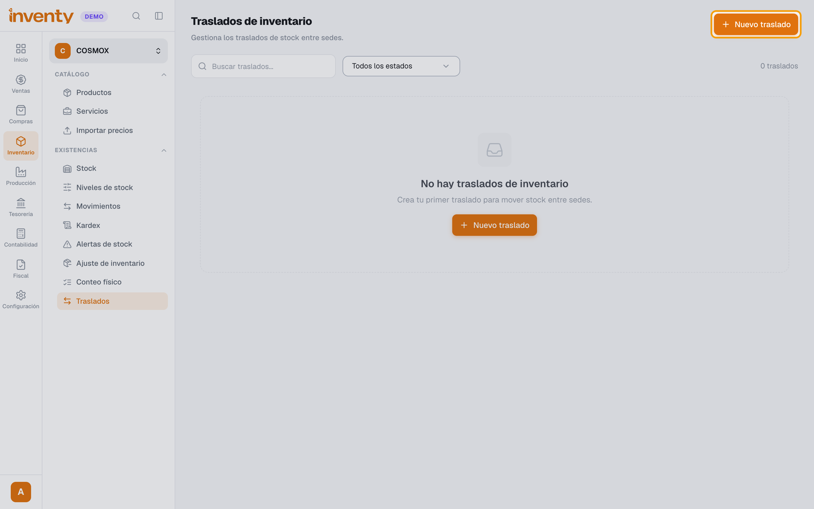
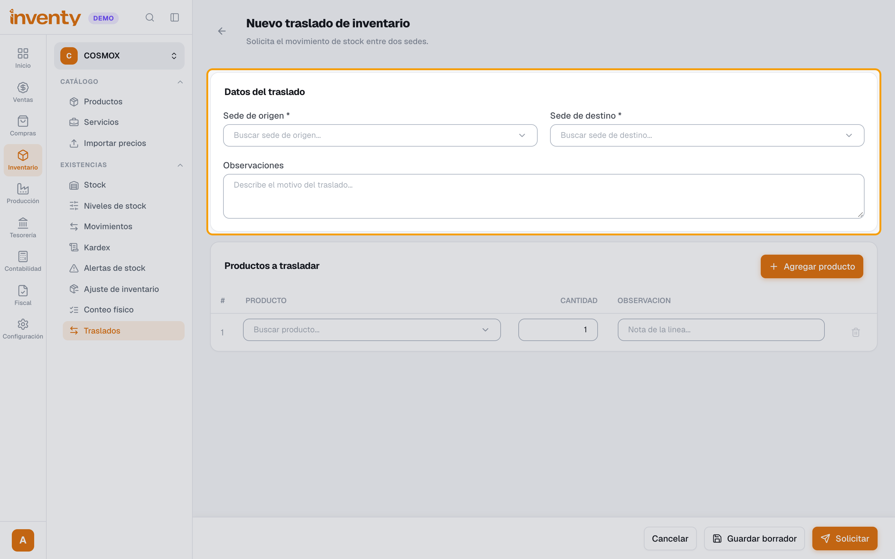
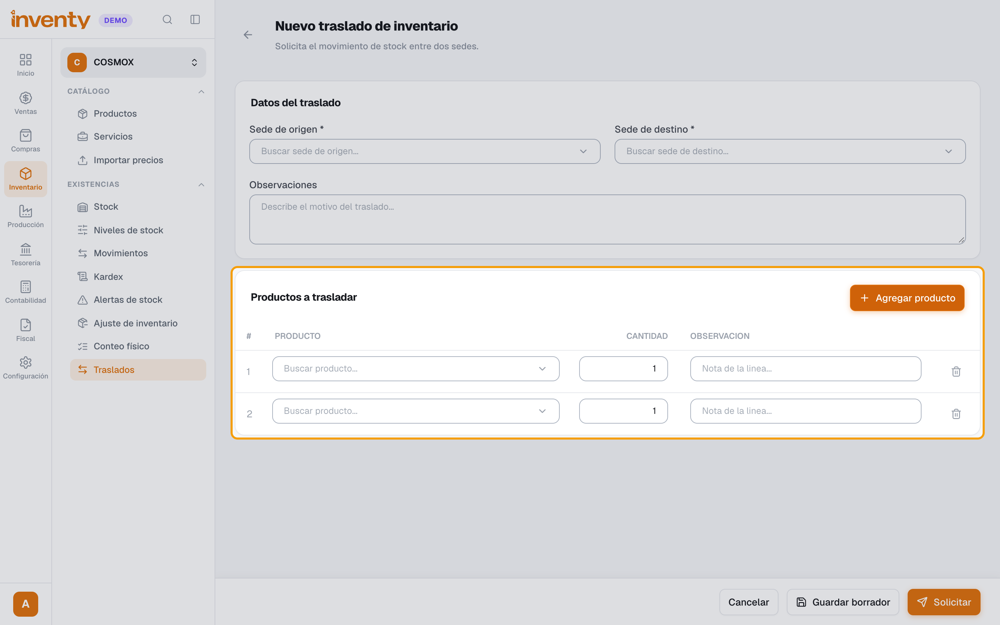
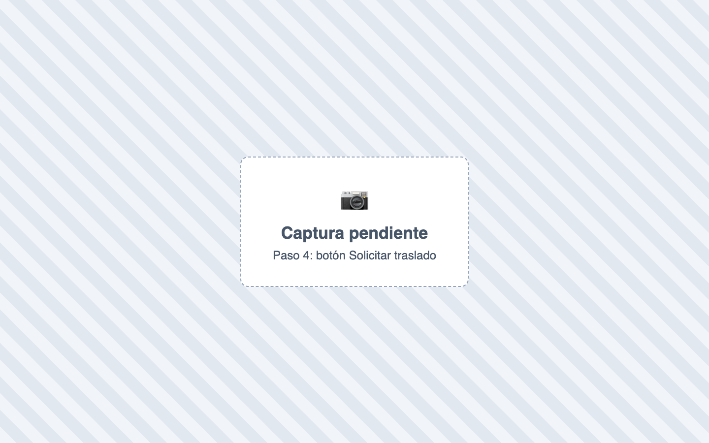
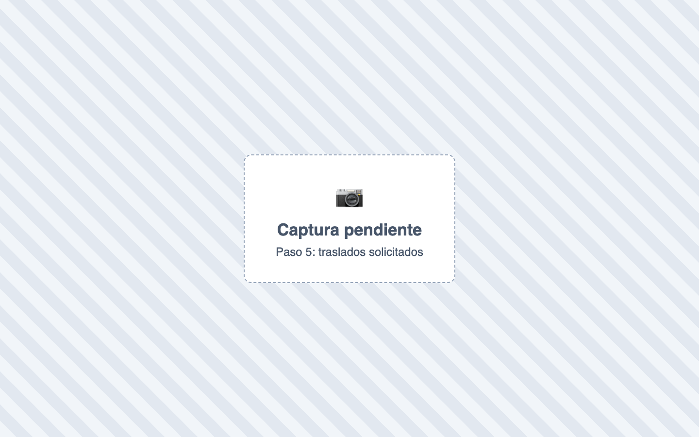
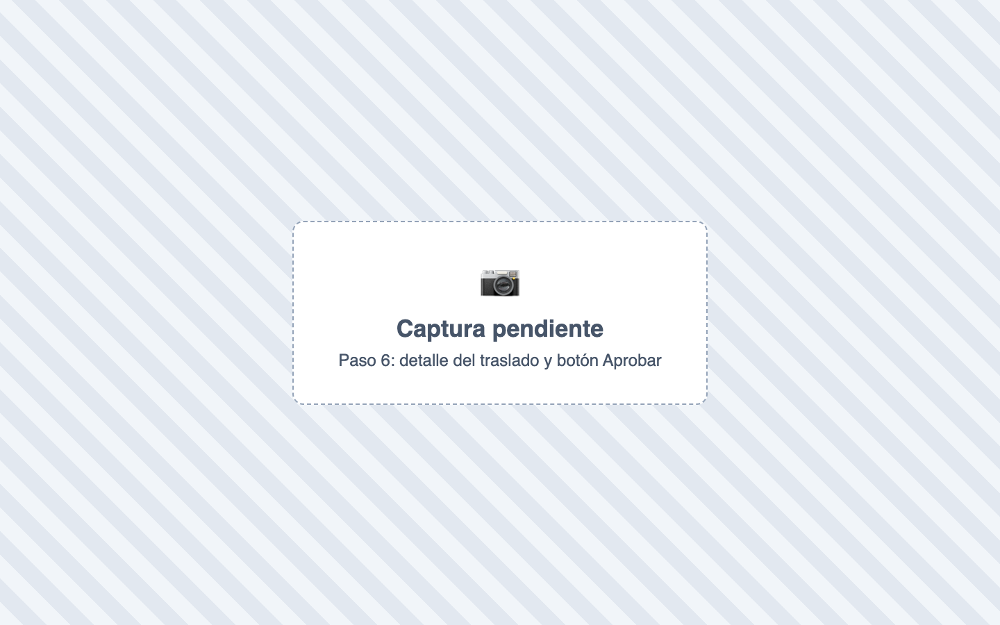
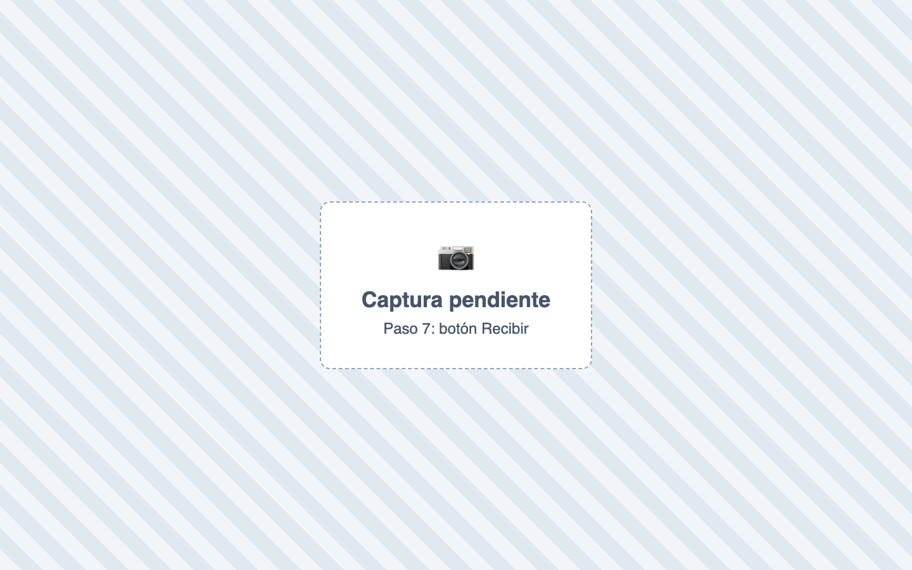

# ¿Cómo hago un traslado entre sedes?

También se busca como: traslado de inventario, mover mercancía, transferencia entre sedes, pasar inventario a otra tienda, recibir traslado.

**Antes de empezar:** lo solicita una persona, lo **aprueba otra** de la sede de origen y lo **recibe** la sede de destino.

## Pasos

**Paso 1.** Ingresa a Inventario › Traslados y haz clic en **Nuevo traslado**.

**Paso 2.** Elige la **Sede de origen** y la **Sede de destino**.

**Paso 3.** Haz clic en **Agregar producto**, busca el producto y escribe la cantidad. Repite por cada producto.

**Paso 4.** Haz clic en **Solicitar traslado** y confirma.

**Paso 5.** *(Otro usuario, de la sede de origen)* En Inventario › Traslados, filtra por **Solicitado** y abre el traslado.

**Paso 6.** Revisa las cantidades (si envías menos, cámbiala; 0 = no se envía) y haz clic en **Aprobar**.

**Paso 7.** *(Sede de destino, cuando llega la mercancía)* Abre el traslado **Aprobado**, haz clic en **Recibir** y luego en **Confirmar recepcion**.

✅ **Listo:** la mercancía sale del origen y entra al destino. El traslado queda **Recibido**.

## Si algo falla

| Problema | Solución |
|---|---|
| No aparece **Aprobar** | Debe aprobarlo **otro usuario** (no quien lo solicitó), asignado a la **sede de origen** y con el permiso **Aprobar traslados de inventario**. Excepción: con el permiso **Aprobar traslados propios** (además del anterior), el usuario puede aprobar cualquier traslado, incluso los suyos y de otra sede. |
| No aparece **Recibir** | Debe hacerlo un usuario de la **sede de destino** con el permiso **Confirmar recepción de traslados**, o quien lo solicitó. |
| *Stock insuficiente en la sede de origen…* | Aprueba menos cantidad o deja ese producto en 0. |
| *La sede de origen y destino no pueden ser la misma* | Cambia una de las dos sedes. |
| Me equivoqué y ya lo solicité | Que la sede de origen lo **Rechace** › **Clonar** › corrige › solicita de nuevo. |
| El stock aparece reservado | Hay un traslado **Aprobado** sin recibir. Que el destino lo reciba. |

## Relacionados

- [¿Cuánto inventario tengo?](consultar-existencias.md)
- [¿Cómo hago un ajuste de inventario?](ajuste-inventario.md)
