# ¿Cómo creo productos con variantes (talla, color, medida)?

También se busca como: variantes, atributos, talla, color, medida, referencia por talla, producto con tallas, casco por talla, llanta por medida, producto padre, combinaciones, SKU por talla, matriz de variantes.

**Qué es:** un **producto padre** (ej. *CASCO SHAFT 526*) con una **variante por cada combinación** de atributos (ej. *CASCO SHAFT 526 / Negro / M*). Cada variante es un producto real con **su propio código de barras, precio, costo y existencias**. El padre solo las agrupa: no se vende ni tiene stock.

**Antes de empezar:** debe estar activa la opción **Atributos y variantes** en Configuración › Módulos › Inventario. Antes de crear, lee [¿Cuándo usar variantes?](#cuando-usar-variantes-ejemplo-almacen-de-repuestos-de-moto).

## Pasos

**Paso 1.** Ingresa a Inventario › Atributos y haz clic en **Nuevo atributo**.

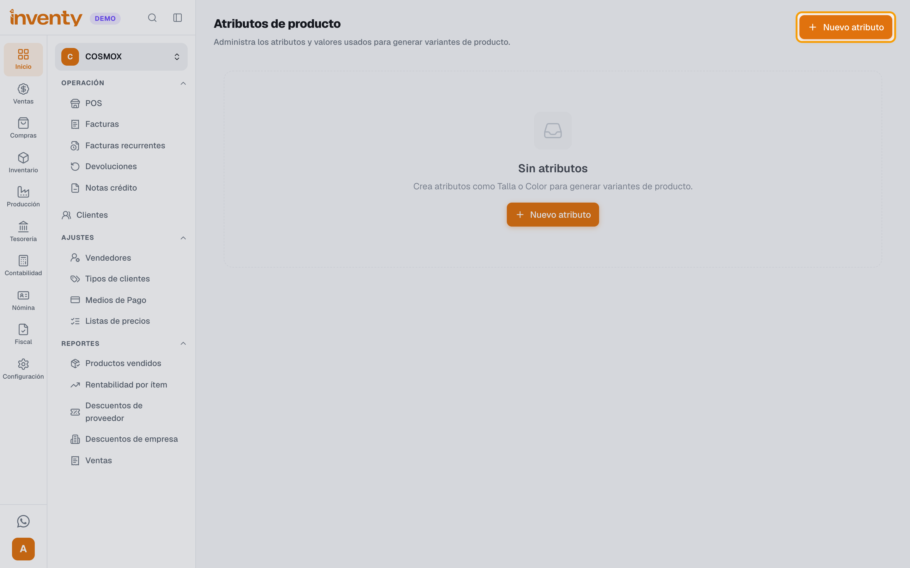

**Paso 2.** Escribe el **Nombre** del atributo (ej. *Talla*) y haz clic en **Crear**.

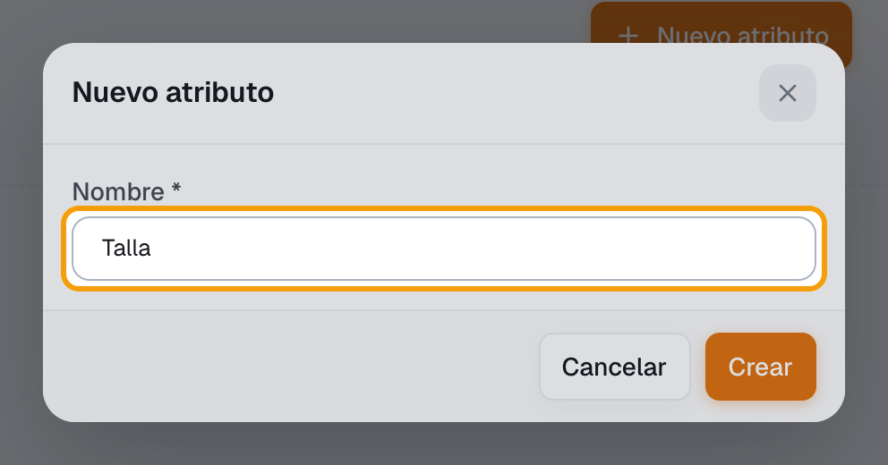

**Paso 3.** En la fila del atributo, haz clic en **Agregar valor**, escribe el **Valor** (ej. *S*) y haz clic en **Crear**. Repite con cada valor (*M*, *L*…).

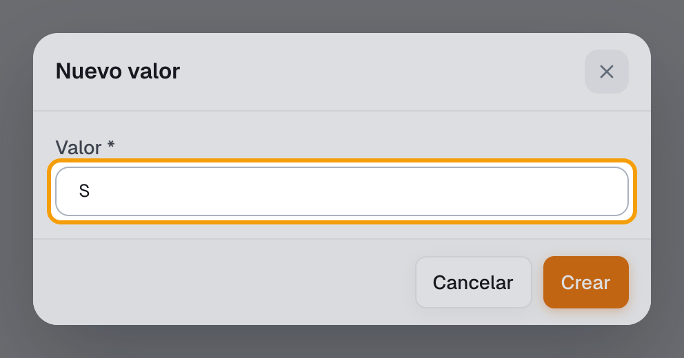

**Paso 4.** Crea los demás atributos igual (ej. *Color*: *Negro*, *Rojo*). Quedan listados con sus valores.

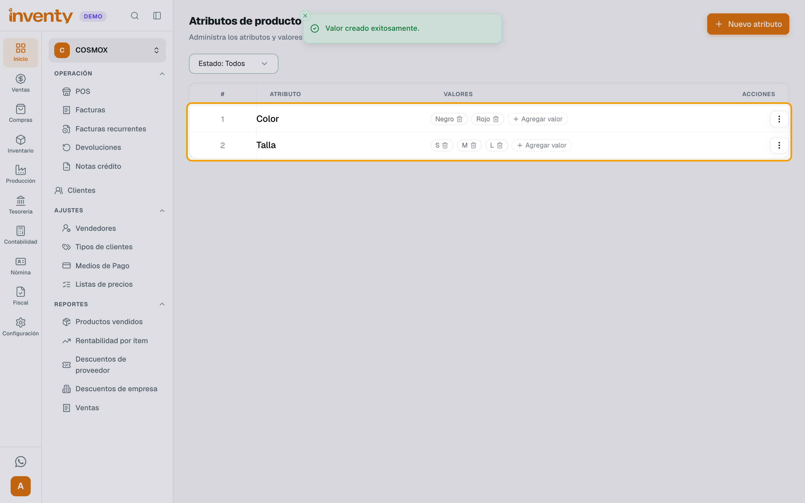

**Paso 5.** Ingresa a Inventario › Productos, haz clic en **Nuevo Producto** y luego en **Crear con variantes**.

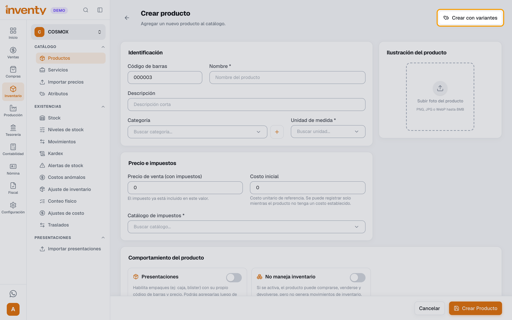

**Paso 6.** En **Producto padre**, escribe el **Nombre** (ej. *CASCO SHAFT 526*) y elige **Unidad de medida**, **Catálogo de impuestos** y, si quieres, **Categoría**. Marca **Controlar por lote y vencimiento** o **Rastrear seriales** solo si lo necesitas: lo heredan todas las variantes.

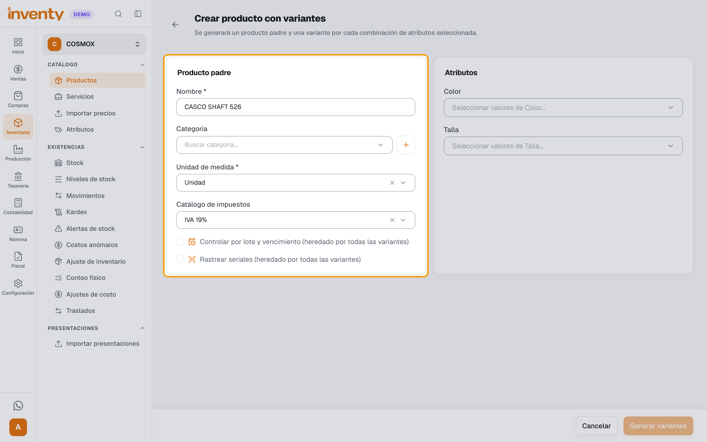

**Paso 7.** En **Atributos**, elige los valores que existen de este producto (ej. *Color*: Negro y Rojo; *Talla*: S, M y L).

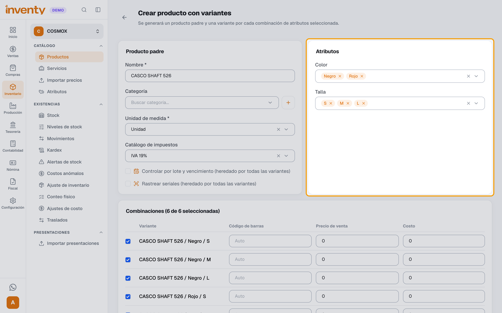

**Paso 8.** En **Combinaciones**, desmarca las que no manejas y escribe el **Precio de venta** y el **Costo** de cada una. El **Código de barras** es opcional: si lo dejas vacío, Inventy lo genera (*Auto*).

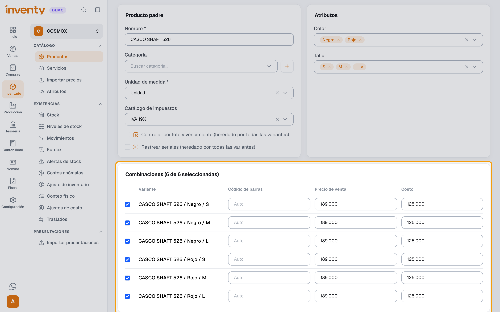

**Paso 9.** Haz clic en **Generar variantes**.

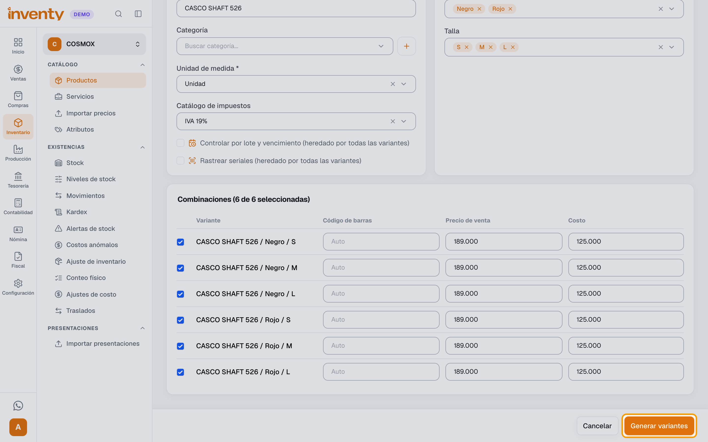

**Paso 10.** Se abre el producto padre con el aviso *Este producto es una familia de variantes* y la lista de **Variantes**, cada una con su código, precio y stock.

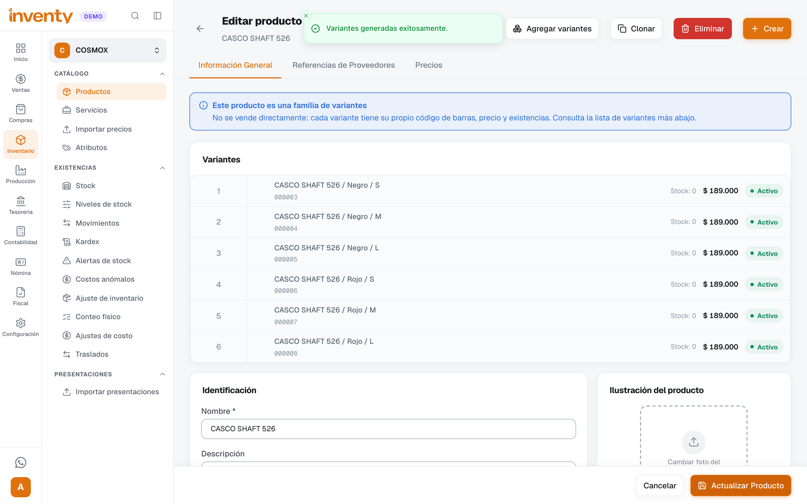

**Paso 11.** Carga las existencias de cada variante con una [compra](../compras/registrar-factura-compra.md) o un [ajuste de inventario](ajuste-inventario.md). En el POS, el producto aparece como **una sola tarjeta** con el número de variantes (ej. *6 variantes*).

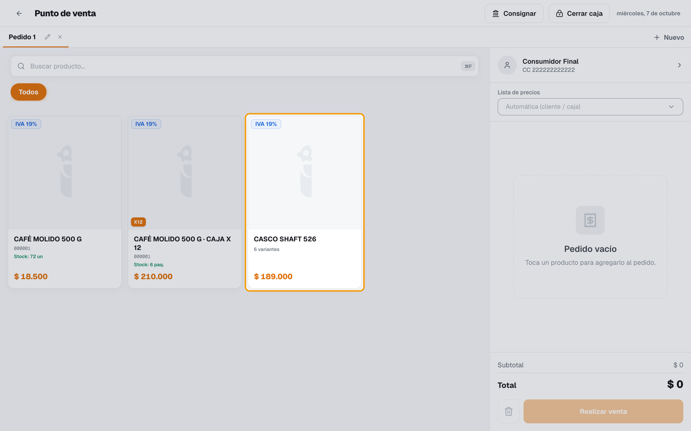

**Paso 12.** Al tocar la tarjeta se abre **Elige una variante**: el vendedor elige talla y color y hace clic en **Agregar al pedido**. Las opciones sin existencias salen en gris.

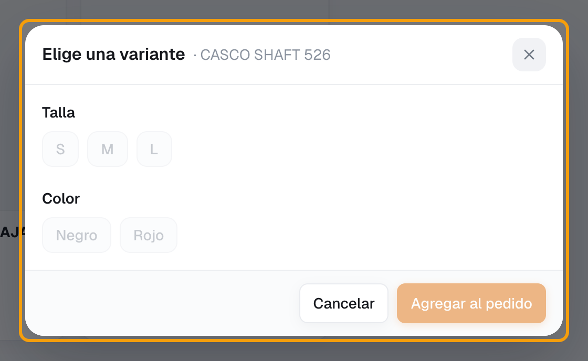

✅ **Listo:** cada variante lleva su propio inventario y precio, y en el POS se venden desde una sola tarjeta. Si en el POS buscas por nombre (ej. *casco*), salen las variantes una por una.

## Después de crearlo

- **Agregar una talla o un color nuevo:** créalo en Inventario › Atributos, abre el producto padre y usa **Agregar variantes**. Las variantes que ya existen no se tocan.
- **No se puede agregar un atributo nuevo** (ej. *Material*) a un padre que ya existe: solo valores de los atributos que eligió al crearlo. Planea bien los atributos desde el principio.
- **Convertir un producto que ya vendías:** en su edición usa **Convertir a variantes**. El producto queda como la primera variante, con todo su historial. **No tiene vuelta atrás.**
- **En Inventario › Productos ves las variantes**, no el padre: busca por el nombre (ej. *CASCO*).
- **Desactivar el padre** desactiva todas sus variantes; reactivarlo no reactiva las que apagaste una por una.

## ¿Cuándo usar variantes? Ejemplo: almacén de repuestos de moto

Usa variantes solo cuando es **el mismo producto en varias versiones** y quieres verlo agrupado:

| Producto padre | Atributos | Variantes |
|---|---|---|
| Casco Shaft 526 | Talla × Color | *Casco Shaft 526 / Negro / M*… |
| Llanta Michelin Pilot Street | Medida (80/100-17, 90/90-18…) | Una por medida |
| Guantes, chaquetas, impermeables | Talla × Color | Una por combinación |
| Retrovisor universal | Lado (Izq., Der.) × Color | 4 variantes |
| Bombillo | Tipo (H4, H6, BA20D) | Una por tipo |

**No uses variantes para:**

- **Repuestos por modelo de moto** (pastillas, bujías, filtros, kits de arrastre). Cada referencia del fabricante es un **producto normal**. No crees un atributo *Modelo de moto*: un mismo repuesto sirve para varias motos y partirías un solo stock físico en varios. Pon las motos compatibles en el nombre (ej. *Bujía NGK CR7HSA – Pulsar 135/180*) y agrúpalos por **Categoría** (*Frenos*, *Encendido*…).
- **Unidad o caja** (bujía suelta o caja x10): usa [presentaciones](presentaciones.md).
- **Baterías con garantía o aceites con vencimiento:** usa **Rastrear seriales** o **Controlar por lote y vencimiento** (en variantes, márcalo al crear el padre: después no se puede cambiar si ya hubo movimientos).

## Si algo falla

| Problema | Solución |
|---|---|
| No aparece **Atributos** en el menú ni **Crear con variantes** | Activa **Atributos y variantes** en Configuración › Módulos › Inventario. |
| *No hay atributos activos. Crea atributos y valores en el catálogo de atributos antes de generar variantes.* | Haz los pasos 1 a 4 primero. |
| En el POS las opciones de **Elige una variante** salen grises | Esa variante no tiene existencias o está inactiva. Cárgale inventario. |
| *Este producto es un producto padre de variantes: no se vende directamente…* | Vende una de sus variantes. |
| *Este valor está en uso por al menos una variante. Desactívalo en lugar de eliminarlo.* | Desactiva el valor; no se puede borrar. |
| *Las combinaciones solo pueden usar valores de atributos ya asociados a este producto padre.* | No se pueden agregar atributos nuevos a un padre existente. |
| *No puedes cambiar el seguimiento de este producto: al menos una de sus variantes ya tiene movimientos de inventario.* | Lotes y seriales se definen al crear el padre. |
| *Un combo o plato terminado no puede convertirse en un producto con variantes.* | Los combos y platos no admiten variantes. |

## Relacionados

- [¿Cómo creo un producto?](crear-producto.md)
- [¿Cómo manejo las presentaciones de compra y de venta?](presentaciones.md)
- [¿Cómo hago un ajuste de inventario?](ajuste-inventario.md)
- [¿Cómo vendo en el POS?](../pos/vender-en-pos.md)
