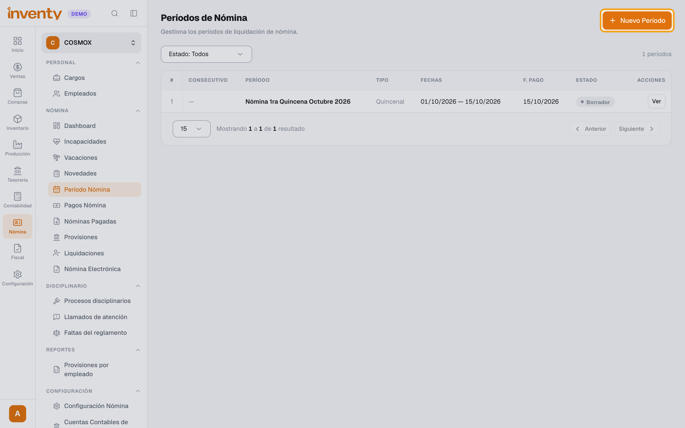
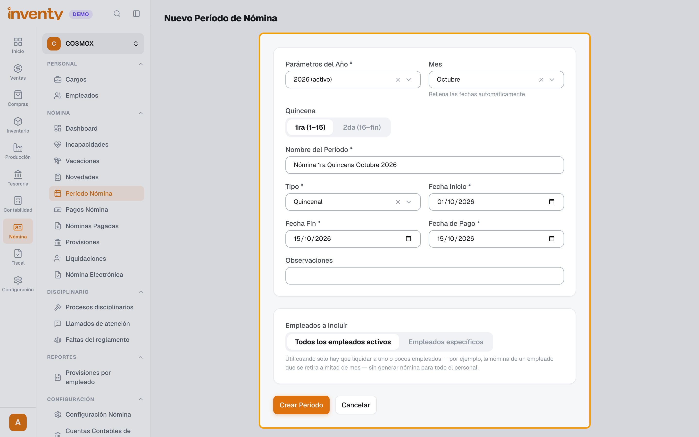
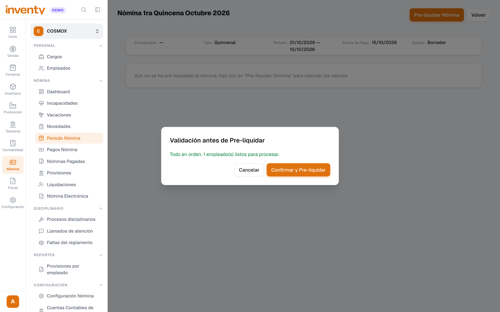
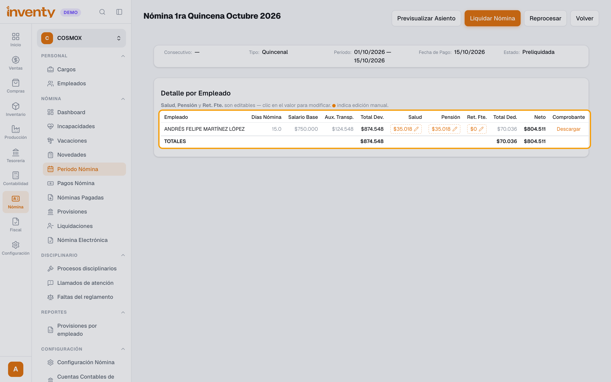
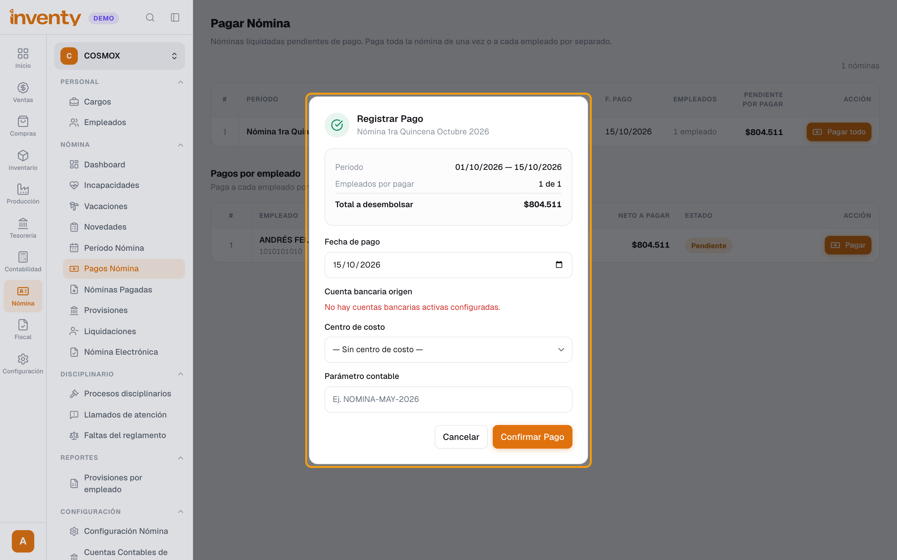

# ¿Cómo liquido y pago la nómina?

También se busca como: liquidar nómina, pagar nómina, quincena, período de nómina, preliquidar, desprendible de pago, pagar a los empleados.

**Antes de empezar:** registra a tus empleados ([¿Cómo registro un empleado?](registrar-empleado.md)) y las novedades del período (horas extra, incapacidades, vacaciones).

## Pasos

**Paso 1.** Ingresa a Nómina › Nómina › Período Nómina y haz clic en **Nuevo Período**.

**Paso 2.** Elige **Parámetros del Año**, **Tipo** (**Quincenal** o **Mensual**), el **Mes** y, si es quincenal, la **Quincena**: Inventy llena el nombre y las fechas. Revisa la **Fecha de Pago**, deja **Todos los empleados activos** y haz clic en **Crear Período**.

**Paso 3.** En el período, haz clic en **Pre-liquidar Nómina**. Revisa la validación y haz clic en **Confirmar y Pre-liquidar**.

**Paso 4.** Revisa el **Detalle por Empleado** (devengos, deducciones y **Neto**). Si todo está bien, haz clic en **Liquidar Nómina**.

**Paso 5.** Ingresa a Nómina › Nómina › Pagos Nómina, haz clic en **Pagar todo**, revisa la **Fecha de pago** y la **Cuenta bancaria origen**, y haz clic en **Confirmar Pago**.

✅ **Listo:** el período queda **Pagada** y aparece en Nómina › Nómina › Nóminas Pagadas, donde puedes **Generar archivo plano de pagos** para el banco.

!!! tip "¿Pagas a cada empleado por separado?"
    En **Pagos Nómina**, usa **Pagar** en la fila del empleado. Ahí puedes pagar desde **Banco** o desde **Caja**.

## Si algo falla

| Problema | Solución |
|---|---|
| La validación muestra advertencias. | Corrige los datos del empleado que indica y vuelve a **Pre-liquidar Nómina**. |
| Un valor de salud, pensión o retención no es correcto. | Antes de liquidar, haz clic en el valor en el **Detalle por Empleado** para modificarlo, o usa **Reprocesar**. |
| *El pago excede el saldo disponible en la cuenta bancaria.* | Elige otra cuenta o paga a cada empleado por separado. |
| La caja no alcanza para pagar a un empleado. | Paga desde **Banco** o registra el pago desde otra caja. |

## Relacionados

- [¿Cómo envío la nómina electrónica a la DIAN?](nomina-electronica.md)
- [¿Cómo registro un empleado?](registrar-empleado.md)
