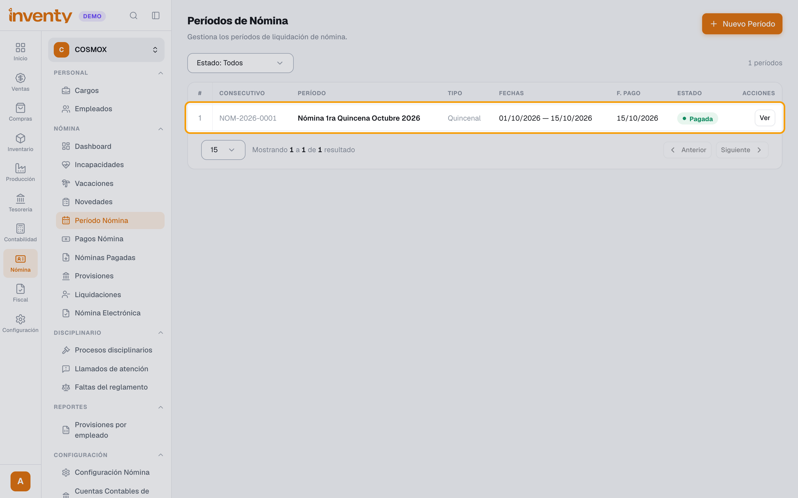
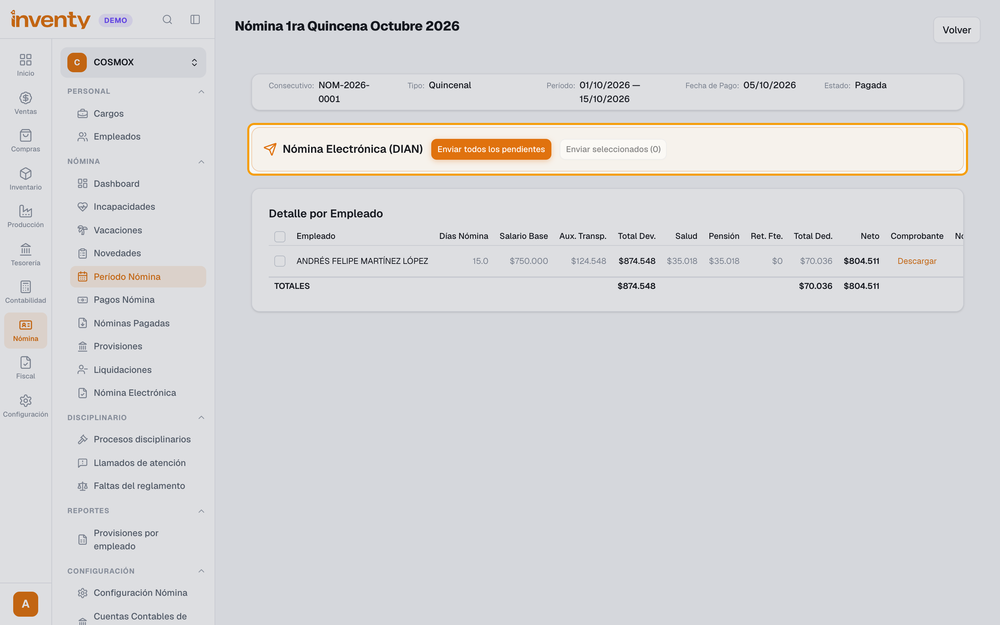
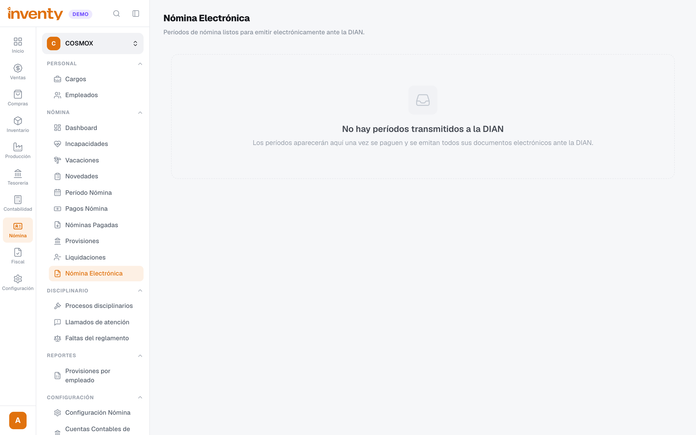

# ¿Cómo envío la nómina electrónica a la DIAN?

También se busca como: nómina electrónica, documento soporte de pago de nómina, transmitir nómina, enviar nómina a la DIAN, CUNE.

**Antes de empezar:** el período debe estar **Pagada** ([¿Cómo liquido y pago la nómina?](liquidar-nomina.md)) y tu empresa debe estar habilitada para nómina electrónica ante la DIAN. La habilitación la hace el equipo de Inventy: [contacta a soporte](../soporte.md).

## Pasos

**Paso 1.** Ingresa a Nómina › Nómina › Período Nómina y haz clic en **Ver** en el período pagado.

**Paso 2.** En **Nómina Electrónica (DIAN)**, haz clic en **Enviar todos los pendientes**. Para enviar solo algunos empleados, márcalos en el **Detalle por Empleado** y haz clic en **Enviar seleccionados**.

**Paso 3.** Revisa el estado de cada empleado en el período. Cuando se emiten todos los documentos, el período pasa a **Transmitida DIAN** y aparece en Nómina › Nómina › Nómina Electrónica.

✅ **Listo:** la nómina del período queda reportada ante la DIAN.

## Si algo falla

| Problema | Solución |
|---|---|
| Un empleado queda **Rechazado por DIAN**. | Revisa el error, corrige los datos del empleado y haz clic en **Reprocesar** en su fila. |
| No aparece **Nómina Electrónica (DIAN)** en el período. | El período debe estar **Pagada**. |
| No sé qué significa un estado. | Mira [¿Qué significa cada estado de un documento electrónico?](../facturacion-electronica/estados-documento.md) |

## Relacionados

- [¿Cómo liquido y pago la nómina?](liquidar-nomina.md)
- [¿Qué hago si un documento electrónico es rechazado?](../facturacion-electronica/documento-rechazado.md)
