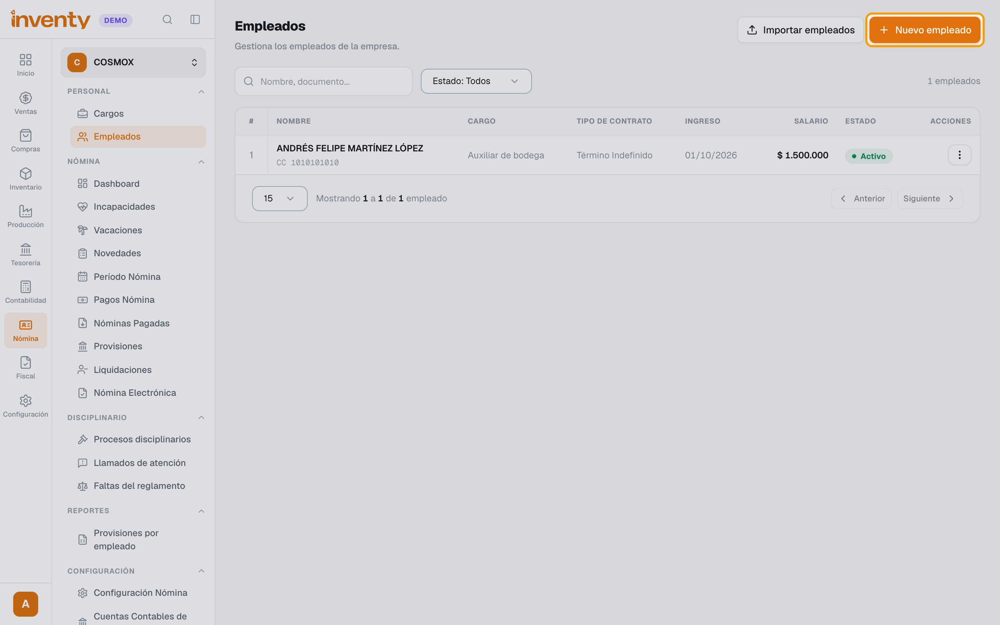
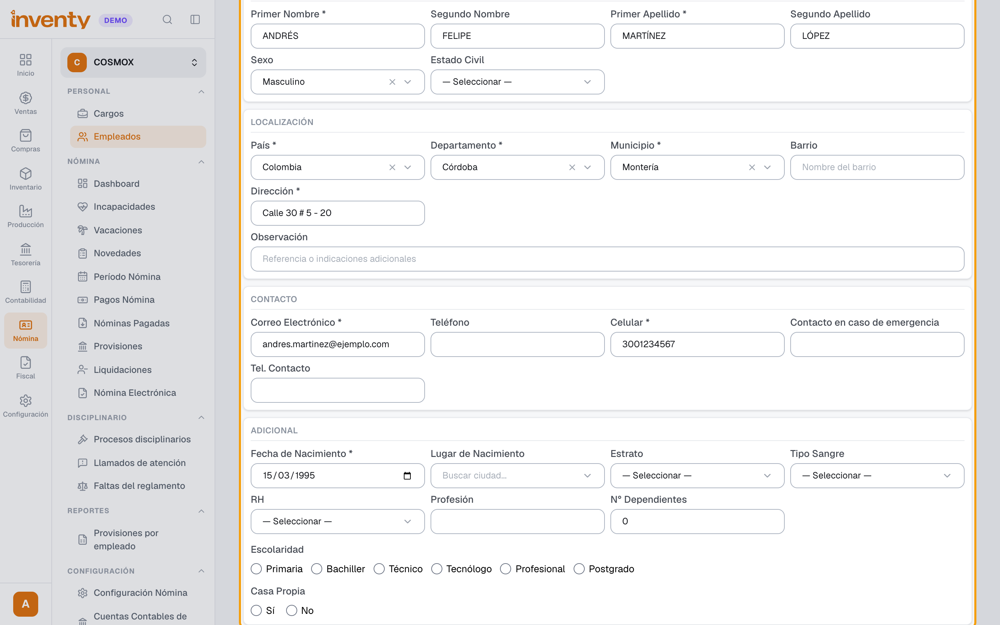
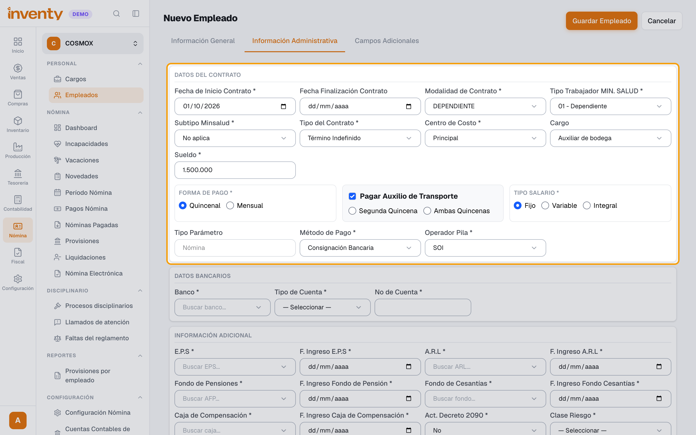
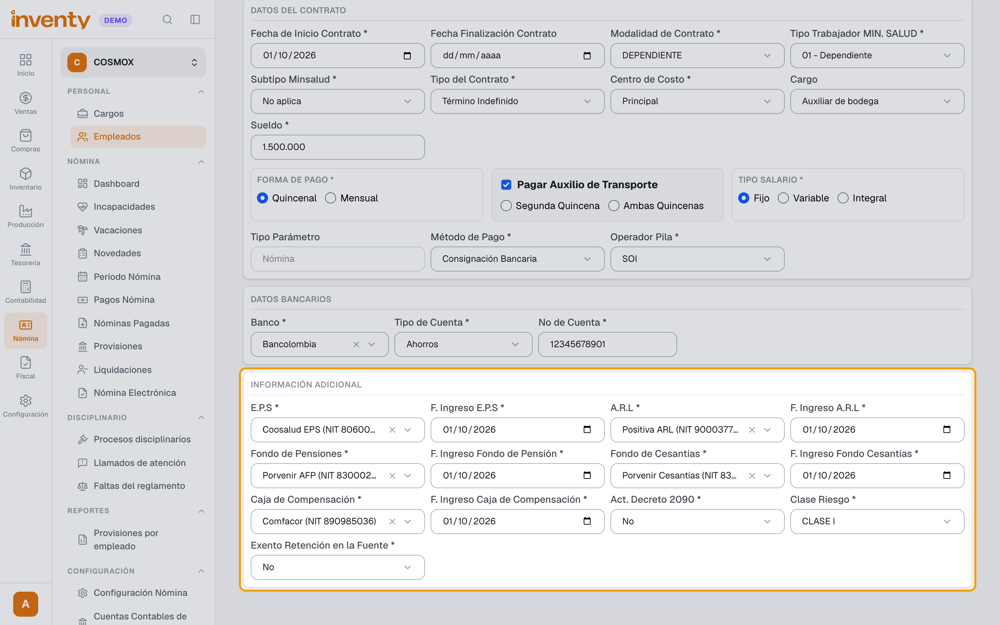
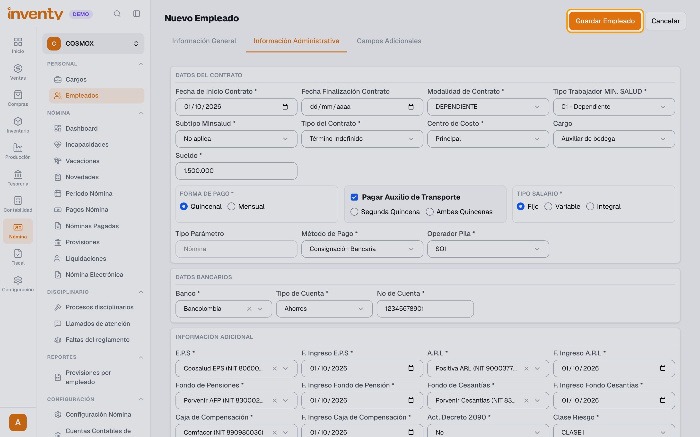

# ¿Cómo registro un empleado?

También se busca como: crear empleado, nuevo empleado, contratar, vincular trabajador, hoja de vida, afiliar empleado, seguridad social.

**Antes de empezar:** si quieres asignarle un cargo, créalo primero en Nómina › Personal › Cargos › **Nuevo cargo**. Ten a mano su EPS, ARL, fondo de pensiones, fondo de cesantías y caja de compensación.

## Pasos

**Paso 1.** Ingresa a Nómina › Personal › Empleados y haz clic en **Nuevo empleado**.

**Paso 2.** En **Información General**, completa **Tipo de Identificación**, **Identificación**, nombres y apellidos, **Departamento**, **Municipio**, **Dirección**, **Correo Electrónico**, **Celular** y **Fecha de Nacimiento**.

**Paso 3.** Abre **Información Administrativa**. En **Datos del Contrato**, completa **Fecha de Inicio Contrato**, **Modalidad de Contrato**, **Tipo Trabajador MIN. SALUD**, **Tipo del Contrato**, **Centro de Costo**, **Cargo**, **Sueldo**, **Forma de Pago** (**Quincenal** o **Mensual**), **Tipo Salario**, **Método de Pago** y **Operador Pila**. Marca **Pagar Auxilio de Transporte** si le corresponde.

**Paso 4.** Completa **Datos Bancarios** (**Banco**, **Tipo de Cuenta**, **No de Cuenta**) y, en **Información Adicional**, la **E.P.S**, **A.R.L**, **Fondo de Pensiones**, **Fondo de Cesantías** y **Caja de Compensación**, cada una con su fecha de ingreso. Elige también **Clase Riesgo**.

**Paso 5.** Haz clic en **Guardar Empleado**.

✅ **Listo:** el empleado queda **Activo** en la lista y entra en los próximos períodos de nómina.

!!! tip "¿Tienes muchos empleados?"
    En Nómina › Personal › Empleados, usa **Importar empleados** para cargarlos desde un archivo.

## Si algo falla

| Problema | Solución |
|---|---|
| No guarda y marca campos en rojo. | Revisa las tres pestañas: los campos con **\*** son obligatorios, incluida la seguridad social. |
| No aparece el cargo en la lista. | Créalo en Nómina › Personal › Cargos. |
| No veo el menú **Nómina**. | Tu plan debe incluir el módulo de nómina y tu rol el permiso **Crear empleados**. |

## Relacionados

- [¿Cómo liquido y pago la nómina?](liquidar-nomina.md)
- [Nómina y recursos humanos](index.md)
