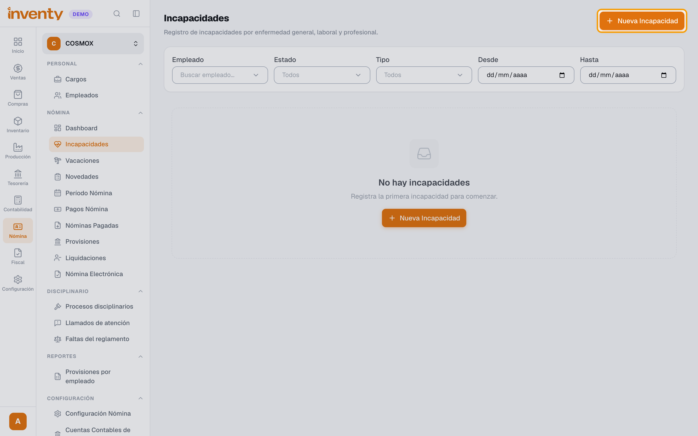
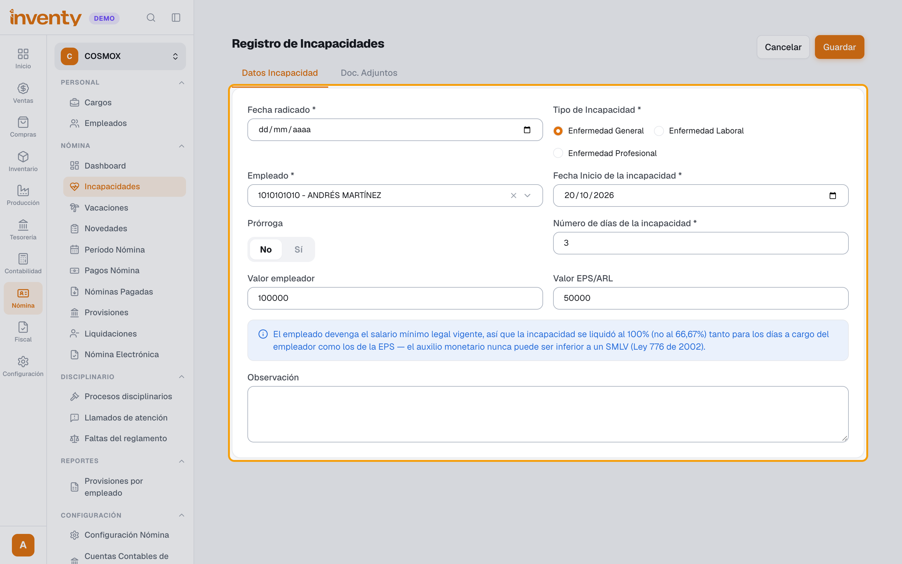
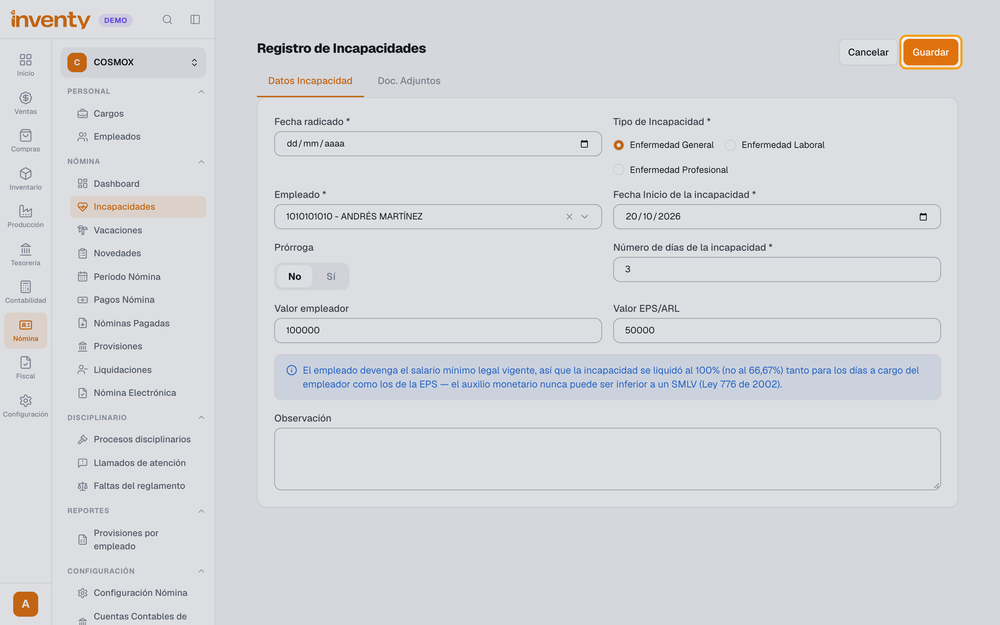

# ¿Cómo registro una incapacidad?

También se busca como: incapacidad médica, enfermedad general, accidente de trabajo, prórroga de incapacidad, EPS, ARL.

## Pasos

**Paso 1.** Ingresa a Nómina › Nómina › Incapacidades y haz clic en **Nueva Incapacidad**.

**Paso 2.** Completa **Fecha radicado**, **Tipo de Incapacidad**, **Empleado**, **Fecha Inicio de la incapacidad** y **Número de días de la incapacidad**. Marca **Prórroga** si continúa una incapacidad anterior. Inventy calcula el **Valor empleador** y el **Valor EPS/ARL**. Si tienes el soporte médico, adjúntalo en **Doc. Adjuntos**.

**Paso 3.** Haz clic en **Guardar**.

✅ **Listo:** la incapacidad se descuenta de los días trabajados y se paga en el período de nómina correspondiente.

## Si algo falla

| Problema | Solución |
|---|---|
| Los valores no coinciden con lo que pagará la EPS. | Puedes ajustar **Valor empleador** y **Valor EPS/ARL** antes de guardar. |
| No se refleja en la nómina. | Si el período ya estaba pre-liquidado, usa **Reprocesar** en el período. |

## Relacionados

- [¿Cómo registro una novedad de nómina?](registrar-novedad.md)
- [¿Cómo liquido y pago la nómina?](liquidar-nomina.md)
