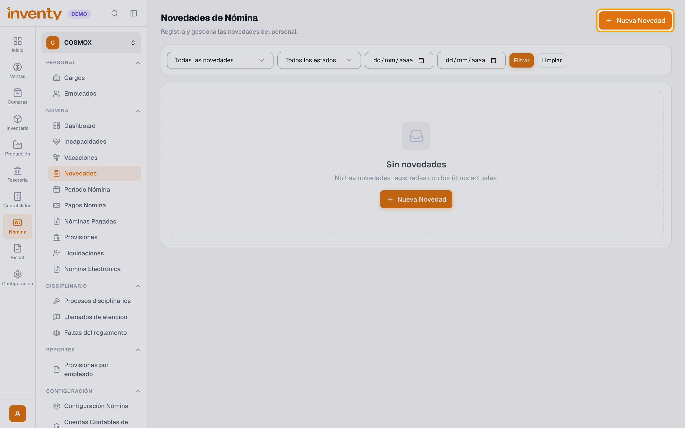
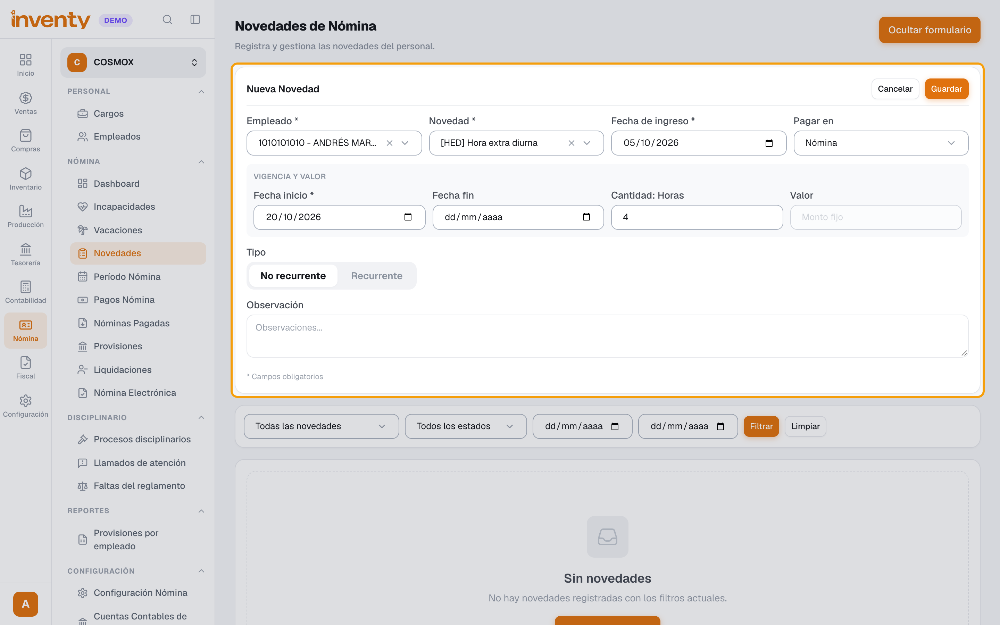
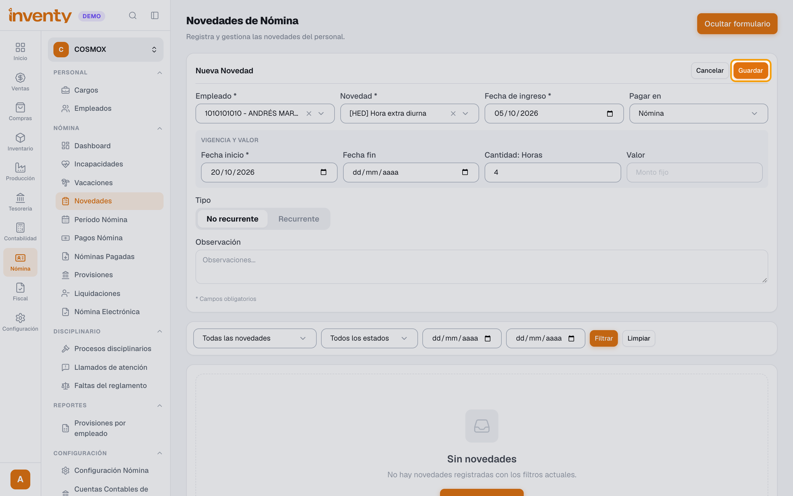

# ¿Cómo registro una novedad de nómina?

También se busca como: horas extra, recargos, bonificación, comisión, libranza, préstamo, embargo, descuento de nómina, deducción.

**Antes de empezar:** registra la novedad **antes** de pre-liquidar el período en el que se debe pagar o descontar.

## Pasos

**Paso 1.** Ingresa a Nómina › Nómina › Novedades y haz clic en **Nueva Novedad**.

**Paso 2.** Elige el **Empleado** y la **Novedad** (por ejemplo, *Hora extra diurna*, *Bonificación* o *Libranza / préstamo*). Completa la **Fecha inicio** y la **Cantidad** (horas o días) o el **Valor**. Si se repite cada período, marca **Recurrente** e indica las recurrencias y la frecuencia.

**Paso 3.** Haz clic en **Guardar**.

✅ **Listo:** la novedad se aplica en el período de nómina que incluye su fecha.

## Si algo falla

| Problema | Solución |
|---|---|
| La novedad no aparece en la nómina. | Revisa que su fecha esté dentro del período y usa **Reprocesar** en el período si ya estaba pre-liquidado. |
| No encuentro el empleado. | Debe estar **Activo** en Nómina › Personal › Empleados. |

## Relacionados

- [¿Cómo liquido y pago la nómina?](liquidar-nomina.md)
- [¿Cómo registro una incapacidad?](registrar-incapacidad.md)
- [¿Cómo registro las vacaciones de un empleado?](registrar-vacaciones.md)
