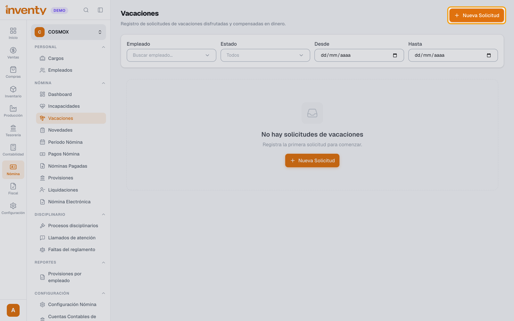
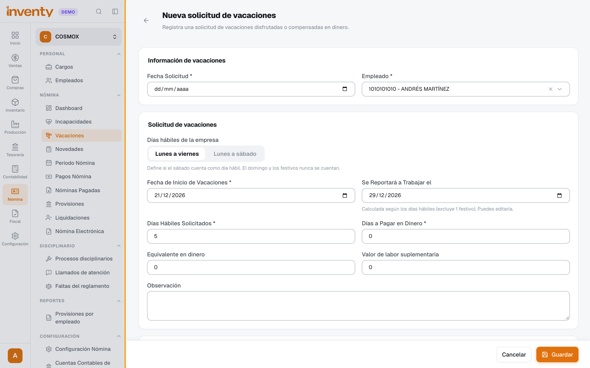
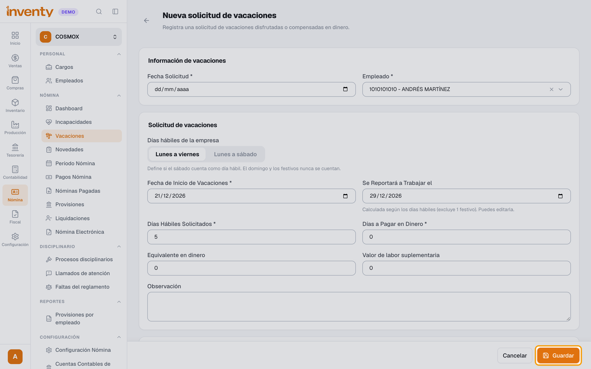

# ¿Cómo registro las vacaciones de un empleado?

También se busca como: solicitud de vacaciones, días de descanso, vacaciones en dinero, compensar vacaciones, cuándo vuelve a trabajar.

## Pasos

**Paso 1.** Ingresa a Nómina › Nómina › Vacaciones y haz clic en **Nueva solicitud**.

**Paso 2.** Completa **Fecha Solicitud** y **Empleado**. Elige los **Días hábiles de la empresa** (**Lunes a viernes** o **Lunes a sábado**), la **Fecha de Inicio de Vacaciones**, los **Días Hábiles Solicitados** y los **Días a Pagar en Dinero** (0 si las disfruta todas). Inventy calcula **Se Reportará a Trabajar el**, sin contar domingos ni festivos.

**Paso 3.** Haz clic en **Guardar**.

✅ **Listo:** las vacaciones se pagan en el período de nómina que corresponde.

## Si algo falla

| Problema | Solución |
|---|---|
| La fecha de regreso no es la esperada. | Revisa **Días hábiles de la empresa**. Puedes editar **Se Reportará a Trabajar el**. |
| No se reflejan en la nómina. | Si el período ya estaba pre-liquidado, usa **Reprocesar** en el período. |

## Relacionados

- [¿Cómo registro una novedad de nómina?](registrar-novedad.md)
- [¿Cómo liquido y pago la nómina?](liquidar-nomina.md)
