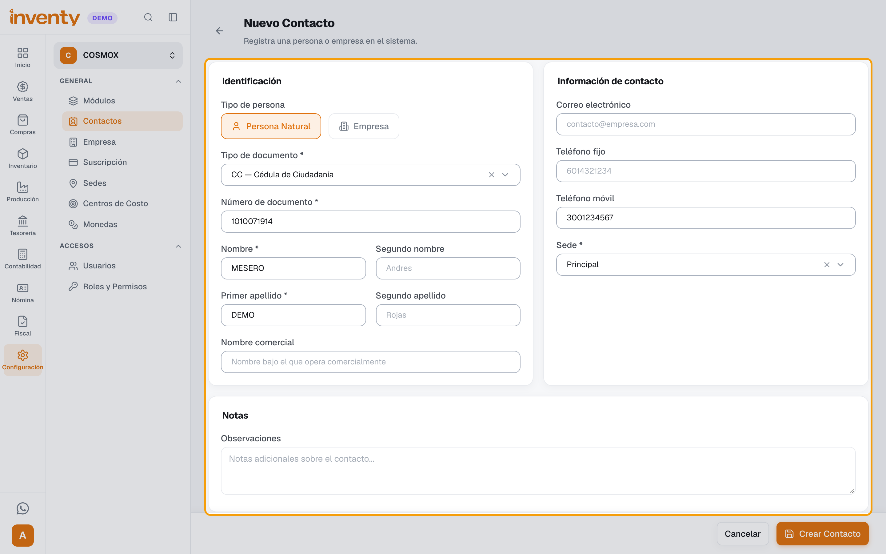
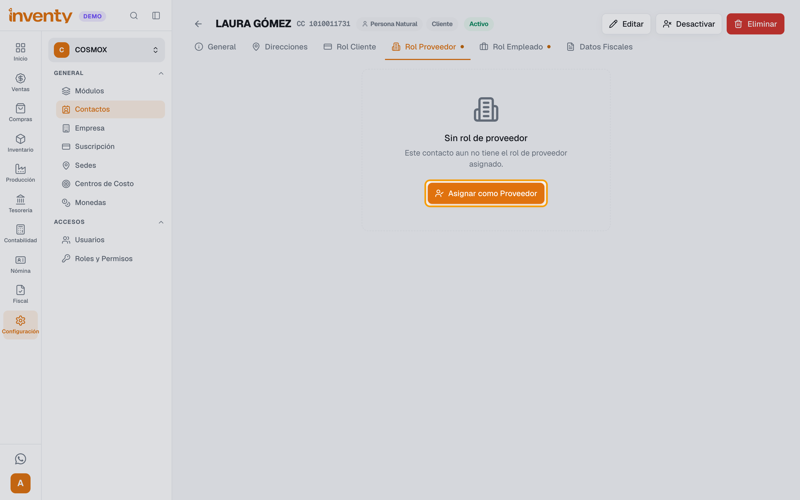
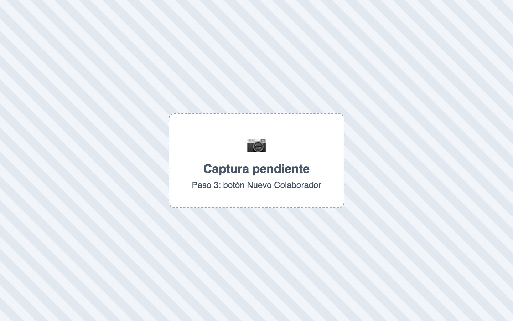
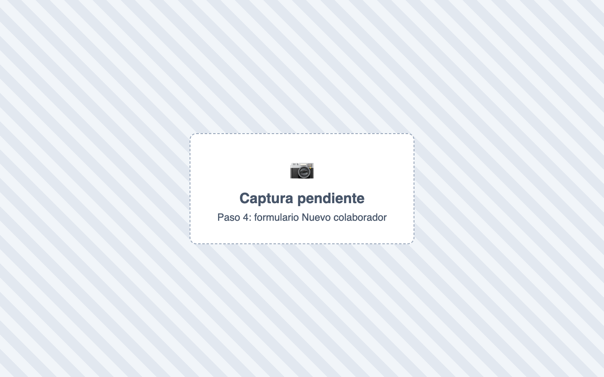
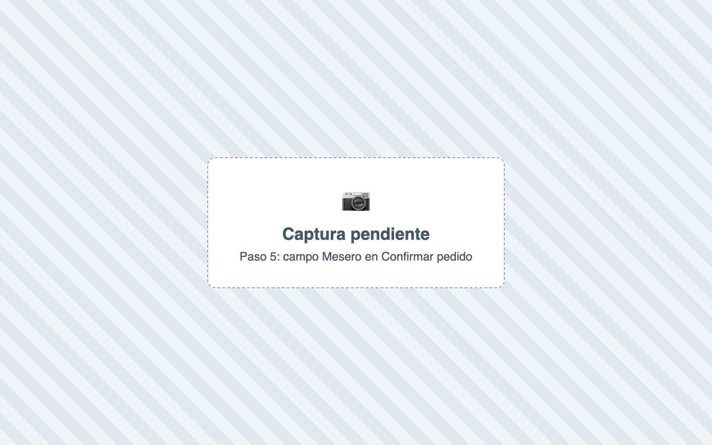

# ¿Cómo creo los meseros?

También se busca como: crear mesero, agregar mesero, registrar mesero, asignar mesero, cambiar mesero, colaborador, colaboradores de propinas, personal de sala, quién atendió la mesa.

**Qué es:** en Inventy un mesero es un **contacto** con **Rol Proveedor** que registras como **Colaborador**. No necesita usuario ni contraseña: solo se elige en los pedidos a la mesa y así recibe su parte de las propinas.

**Antes de empezar:** el módulo **Restaurante** debe estar activo (lo activa el equipo de Inventy: pídelo a [soporte](../soporte.md)) y debe estar encendido **Habilitar pedidos a la mesa** (ver [¿Cómo activo varias cuentas en una misma mesa?](varias-cuentas-mesa.md), pasos 1 y 2).

## Pasos

**Paso 1.** Ingresa a Configuración › Contactos y abre el contacto del mesero. Si no existe, haz clic en **Nuevo Contacto** y escribe su nombre, documento y teléfono.

**Paso 2.** Abre la pestaña **Rol Proveedor**, haz clic en **Asignar como Proveedor** y luego en **Asignar**. Los demás datos (plazo de pago, banco…) son opcionales.

**Paso 3.** En el menú **Restaurante**, sección **Propinas**, haz clic en **Colaboradores** y luego en **Nuevo Colaborador**.

**Paso 4.** En **Proveedor (tercero)** busca al mesero. Si quieres, escribe el **Teléfono** y **Notas (opcional)**. Deja marcado **Colaborador activo** y haz clic en **Crear colaborador**.

**Paso 5.** En el POS, al enviar un pedido **A la mesa**, en la ventana **Confirmar pedido** elige el **Mesero** y haz clic en **Enviar pedido**.

✅ **Listo:** el pedido queda a nombre del mesero. Si te equivocaste, abre el pedido y usa **Cambiar mesero** (o **Asignar mesero** si no tenía) y **Guardar**. Sus propinas se ven en Restaurante › Propinas › Reporte y se pagan en **Liquidación**.

## Si algo falla

| Problema | Solución |
|---|---|
| El mesero no aparece en **Proveedor (tercero)** | Al contacto le falta el **Rol Proveedor** (paso 2), o ya está registrado como colaborador. |
| *Este proveedor ya está registrado como colaborador.* | Ya existe: búscalo en **Colaboradores** y edítalo. |
| El mesero no sale en el POS | Revisa que el colaborador tenga marcado **Colaborador activo**. |
| *El mesero seleccionado no existe o está inactivo.* | Lo desactivaron: actívalo en **Colaboradores** o elige otro. |
| *Solo los pedidos en mesa pueden tener un mesero asignado.* | Los pedidos a domicilio o para llevar no llevan mesero. Elige **A la mesa**. |
| No aparece **Colaboradores** en el menú | El módulo Restaurante no está activo (pídelo a [soporte](../soporte.md)) o tu rol no tiene el permiso **Ver colaboradores de propinas**. |
| No aparece el campo **Mesero** en el POS | Tu rol necesita el permiso **Gestionar pedidos del POS**. |

## Relacionados

- [¿Para qué sirve el rol de cliente y cuál elijo?](../ventas/rol-de-cliente.md) (pestañas de rol del contacto)
- [¿Cómo activo varias cuentas en una misma mesa?](varias-cuentas-mesa.md)
- [¿Cómo manejo los domicilios y le pago a los domiciliarios?](domicilios.md)
