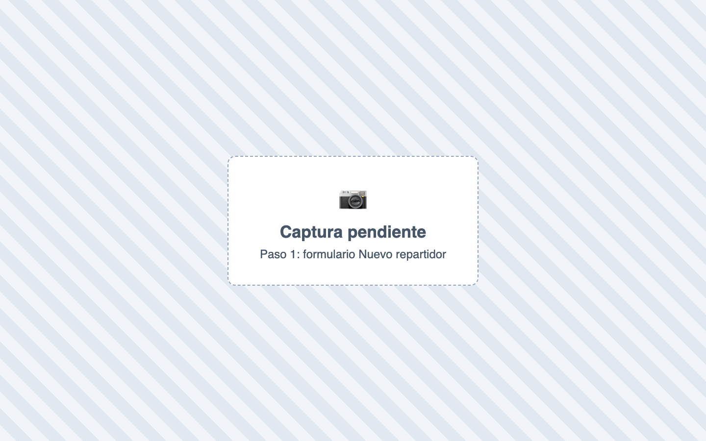
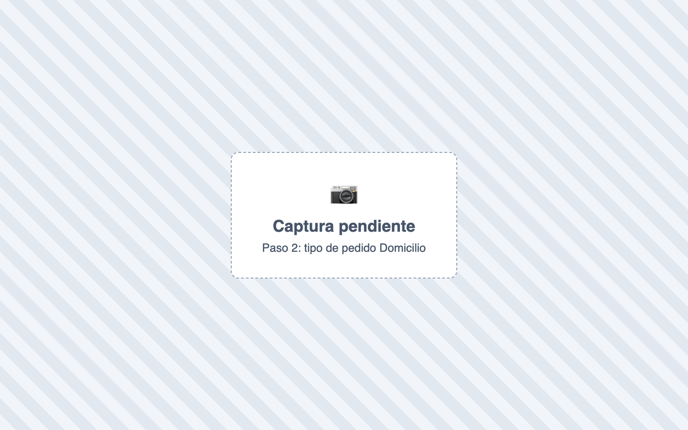
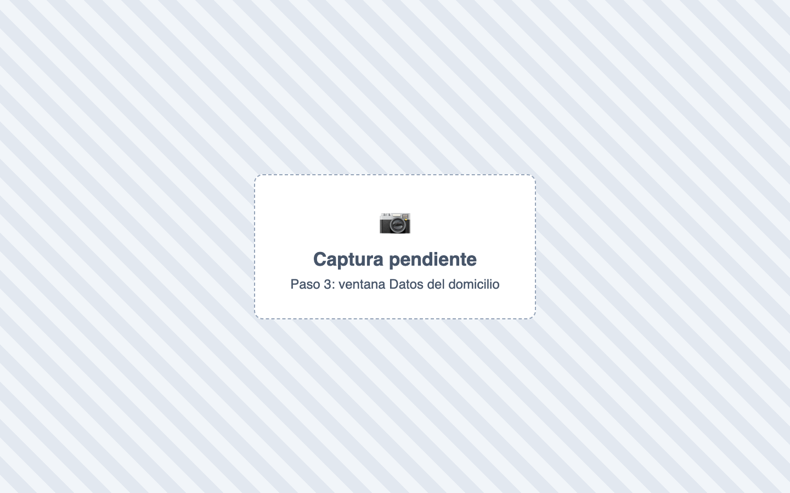
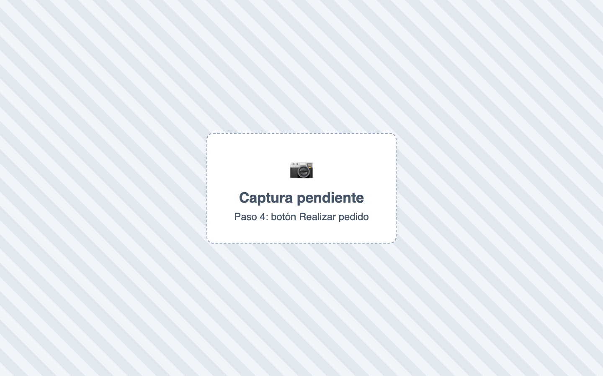
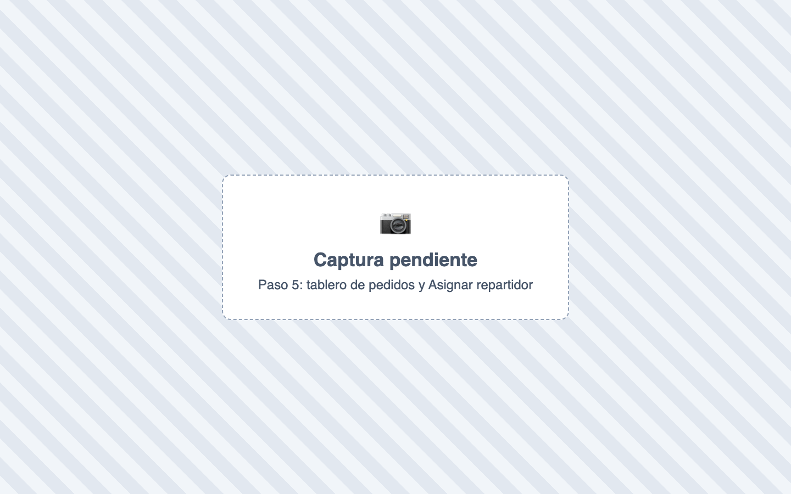
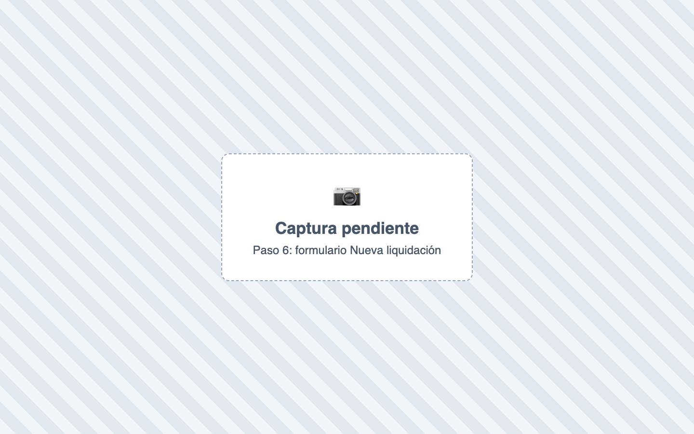
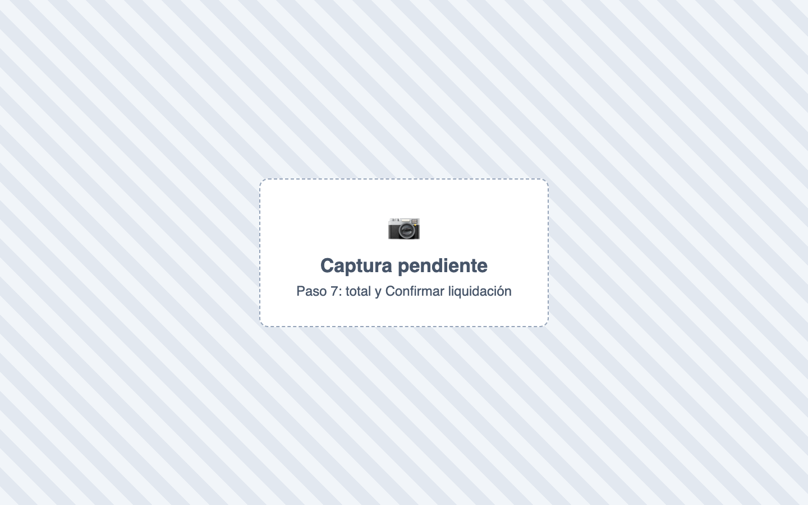

# ¿Cómo manejo los domicilios y le pago a los domiciliarios?

También se busca como: domicilio, delivery, domiciliario, repartidor, mensajero, pagar domicilios, liquidar domiciliario, costo del domicilio, pedido a domicilio.

**Antes de empezar:** activa **Habilitar pedidos a domicilio** y el **Ítem de servicio de domicilio** en Configuración › Módulos › Restaurante, y crea al domiciliario como **proveedor**.

## Pasos

**Paso 1.** Ingresa a Restaurante › Repartidores › **Nuevo Repartidor**, elige el **Proveedor (tercero)**, marca **Repartidor activo** y haz clic en **Crear repartidor**.

**Paso 2.** En Ventas › POS, elige el tipo de pedido **Domicilio**.

**Paso 3.** En **Datos del domicilio**, busca o crea el cliente, la **Dirección de entrega**, el **Punto de referencia** y el costo del domicilio.

**Paso 4.** Agrega los productos y haz clic en **Realizar pedido**.

**Paso 5.** En Restaurante › Tablero de pedidos, abre el pedido y haz clic en **Asignar repartidor**. Luego márcalo **En camino** y **Entregado**, y factúralo.

**Paso 6.** Para pagarle: Restaurante › Domicilios › Liquidación › **Nueva liquidación**. Elige **Sede - centro de costo**, **Repartidor**, **Fecha inicio** y **Fecha fin**.

**Paso 7.** Revisa los **Domicilios pendientes por liquidar** y el **Total a liquidar**, elige la **Fuente del pago** y haz clic en **Confirmar liquidación**.

✅ **Listo:** al domiciliario se le paga la suma de los costos de domicilio de sus pedidos. Puedes **Imprimir tirilla** para que firme.

## Si algo falla

| Problema | Solución |
|---|---|
| Quiero pagarle en cada pedido, sin liquidar | Activa **Pagar el domicilio al repartidor al instante** en Módulos › Restaurante: la salida de caja se registra sola. |
| *Primero tienes que asignarle un repartidor antes de entregarlo.* | Asigna el repartidor antes de marcar En camino o Entregado. |
| *El costo del domicilio es obligatorio y debe ser mayor que 0.* | Escribe el costo del domicilio. |
| *No hay domicilios pendientes por liquidar…* | Solo entran pedidos **facturados**, de esa sede y fechas, no pagados antes. |
| *El total supera el saldo disponible de la cuenta.* | Elige otra fuente del pago. |
| *No se generará asiento contable…* | Configura la **Cuenta contable de gasto de domicilios**. |
| Liquidé mal | En el detalle: **Más acciones › Anular** y créala de nuevo. |

## Relacionados

- [¿Cómo activo varias cuentas en una misma mesa?](varias-cuentas-mesa.md)
- [Todas las opciones de Módulos](../primeros-pasos/opciones-modulos.md)
